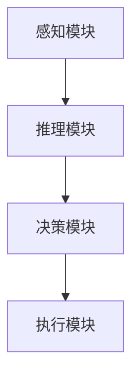
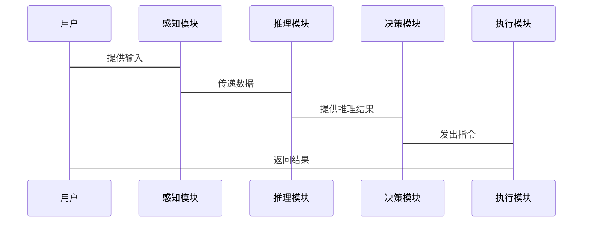

                 


# 开发具有抽象思维与推理能力的AI Agent

> **关键词**：AI Agent, 抽象思维, 推理能力, 算法, 系统架构, 项目实战

> **摘要**：本文将详细介绍如何开发具备抽象思维与推理能力的AI Agent。从AI Agent的基本概念到其数学建模、算法原理、系统架构设计，再到项目实战和案例分析，我们将逐步深入探讨这一复杂而引人入胜的主题。通过理论与实践相结合的方式，本文旨在帮助读者理解并掌握开发具有抽象思维与推理能力的AI Agent的关键技术。

---

## 第1章：AI Agent的基本概念

### 1.1 AI Agent的定义与分类

AI Agent，即人工智能代理，是指在计算机系统中能够感知环境并采取行动以实现目标的实体。AI Agent可以根据智能水平分为弱AI Agent和强AI Agent。弱AI Agent专注于特定任务（如语音助手），而强AI Agent则具备更广泛的通用智能。

**AI Agent的核心属性**包括自主性、反应性、目标导向性和社交能力。这些属性使得AI Agent能够独立决策、与环境互动并与其他系统或人类协作。

### 1.2 抽象思维与推理能力的定义

抽象思维是人类将具体事物转化为一般概念的能力，而推理能力是基于现有信息进行逻辑推导的能力。在AI Agent中，抽象思维与推理能力使其能够理解上下文、处理复杂问题并做出合理决策。

**抽象思维与推理能力的关系**：抽象思维为推理提供基础，推理能力则帮助AI Agent在复杂环境中做出决策。

### 1.3 问题背景与应用前景

当前，AI Agent在多个领域展现出巨大潜力，但也面临挑战。如何赋予AI Agent抽象思维与推理能力，使其能够应对复杂、动态的环境，是当前研究的热点。

**AI Agent的应用前景**包括智能助手、自动驾驶、智能客服等，这些应用将显著提升人类的生活效率和质量。

---

## 第2章：抽象思维的数学建模

### 2.1 抽象思维的逻辑结构

抽象思维的逻辑结构可以用层次模型表示。从具体实例到一般概念，再从一般概念到具体应用，形成一个完整的抽象过程。

**抽象思维的层次模型**：
1. **具体实例**：如“猫”是一种具体的动物。
2. **一般概念**：如“宠物”是一个更广泛的概念。
3. **抽象概念**：如“生物”是一个最高层次的概念。

### 2.2 抽象思维的数学表达

抽象思维可以通过符号逻辑和数学模型进行表示。例如，将“猫”和“狗”抽象为“宠物”，可以用集合论表示。

**符号逻辑表示**：
- 设C代表“猫”，D代表“狗”，P代表“宠物”。
- 那么，C和D都是P的子集。

### 2.3 抽象思维与推理能力的关系

抽象思维为推理提供基础，推理能力则帮助AI Agent在抽象层面上进行逻辑运算。例如，AI Agent可以通过抽象思维将具体问题转化为一般问题，再通过推理能力找到解决方案。

---

## 第3章：基于逻辑推理的算法

### 3.1 逻辑推理的基本原理

逻辑推理是AI Agent推理能力的核心。它通过逻辑规则从已知事实中推导出新结论。

**逻辑推理的类型**：
1. **命题逻辑**：基于命题的真值进行推理。
2. **一阶逻辑**：允许量化和函数，表达更复杂的命题。

### 3.2 基于符号逻辑的推理算法

#### 命题逻辑推理算法

**步骤**：
1. 将问题转化为命题逻辑表达式。
2. 使用真值表或自然推理系统进行推导。

**示例**：给定命题A和B，推理A ∧ B → A。

#### 一阶逻辑推理算法

**步骤**：
1. 将问题转化为一阶逻辑表达式。
2. 使用归结法或模型检查进行推导。

**示例**：给定所有人类都是动物，Socrates是人类，推理Socrates是动物。

### 3.3 基于概率推理的算法

概率推理考虑不确定性，常用于解决现实世界中的复杂问题。

**贝叶斯网络**：通过概率分布和条件概率进行推理。

**示例**：给定症状，推理疾病的可能性。

---

## 第4章：AI Agent的系统架构设计

### 4.1 系统功能设计

AI Agent的系统功能包括感知、推理、决策和执行。

**功能模块**：
1. **感知模块**：获取环境信息。
2. **推理模块**：处理信息并进行推理。
3. **决策模块**：基于推理结果做出决策。
4. **执行模块**：执行决策动作。

### 4.2 系统架构设计

**系统架构图**：



### 4.3 接口设计与交互流程

**接口设计**：
- 感知模块接收输入数据。
- 推理模块处理数据并传递给决策模块。
- 决策模块生成指令传递给执行模块。

**交互流程图**：



---

## 第5章：项目实战：开发一个具备抽象思维的AI Agent

### 5.1 开发环境搭建

**工具选择**：
- Python编程语言
- TensorFlow或PyTorch框架
- Numpy用于数值计算

### 5.2 核心代码实现

**推理模块实现**：

```python
def logical_inference(knowledge_base, query):
    # 简单的基于知识库的推理
    if query in knowledge_base:
        return True
    else:
        return False
```

**抽象思维实现**：

```python
def abstract_thinking(concrete_instance, general_concept):
    # 检查实例是否属于概念
    if isinstance(concrete_instance, general_concept):
        return True
    else:
        return False
```

### 5.3 功能解读与实际案例分析

**案例分析**：
- 开发一个智能助手，能够理解用户的抽象指令，如“帮我安排明天的会议”。

---

## 第6章：案例分析与总结

### 6.1 成功案例分析

**案例：智能助手的开发**

- **功能**：理解用户的抽象指令，执行具体任务。
- **实现**：通过自然语言处理和逻辑推理完成。

### 6.2 经验总结与技术展望

- **经验总结**：抽象思维与推理能力的结合是开发智能AI Agent的关键。
- **技术展望**：未来将更加注重AI Agent的通用性和智能性。

### 6.3 最佳实践与注意事项

- **最佳实践**：
  - 逐步构建，从小功能开始。
  - 结合实际需求，选择合适的技术。
- **注意事项**：
  - 确保数据质量和多样性。
  - 定期更新和优化模型。

---

## 总结

通过本文的详细讲解，我们逐步探讨了开发具有抽象思维与推理能力的AI Agent的关键技术。从理论到实践，从算法到系统架构，我们为读者提供了一个全面的视角。未来，随着技术的进步，AI Agent将具备更强的抽象思维与推理能力，为人类社会带来更多的便利和创新。

---

**参考文献**：
1. Russell, S., & Norvig, P. (2010). *Artificial Intelligence: A Modern Approach*.
2. 李航. (2008). *统计学习方法*.
3. Goodfellow, I., Bengio, Y., & Courville, A. (2016). *Deep Learning*.

