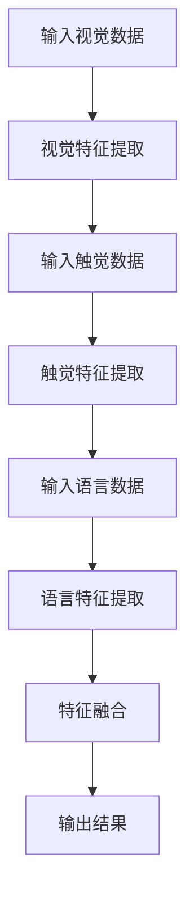
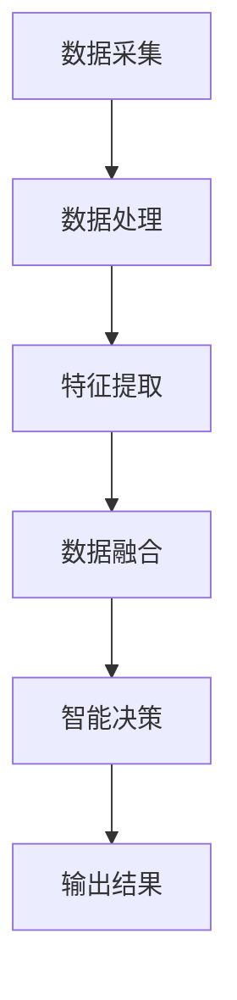
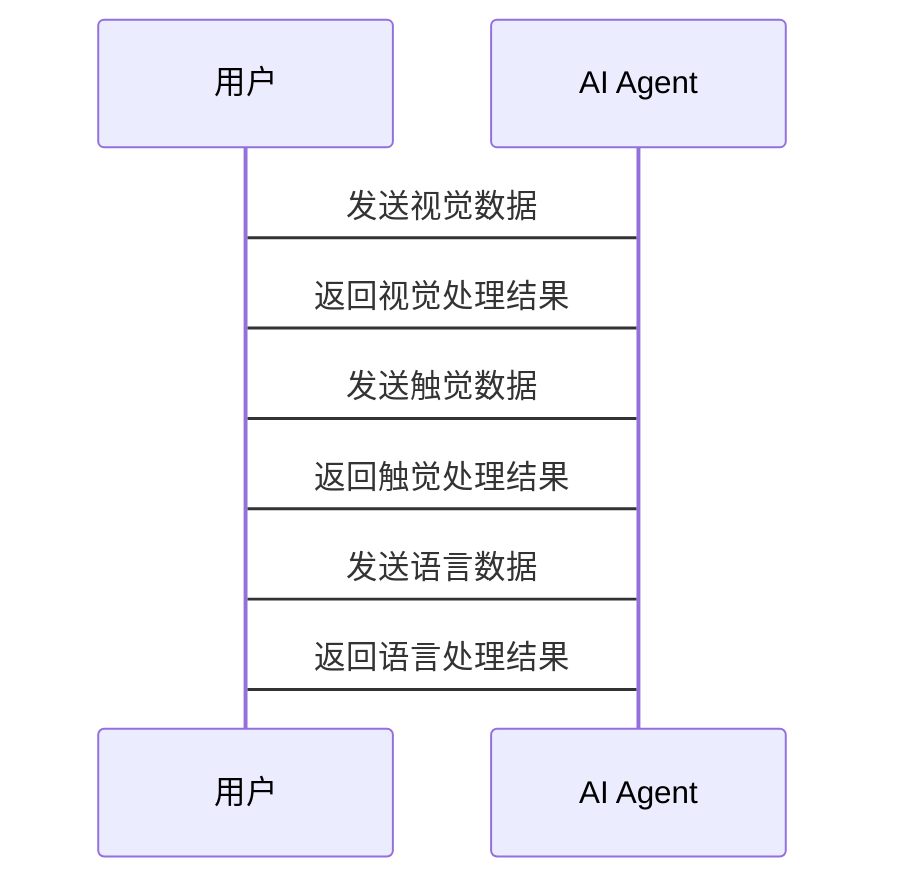

                 


# 开发具有视觉-触觉-语言多模态学习能力的AI Agent

> 关键词：多模态学习，AI Agent，视觉-触觉-语言，数据融合，智能交互

> 摘要：本文详细探讨了开发具有视觉-触觉-语言多模态学习能力的AI Agent的关键技术与实现方法。从多模态数据的特征分析到融合算法的设计，再到系统架构的搭建，本文为读者提供了一套完整的开发思路和实践指南。

---

## 第一部分: 多模态AI Agent的背景与概述

### 第1章: 多模态AI Agent的背景与问题描述

#### 1.1 多模态AI Agent的定义与核心概念
多模态AI Agent是指能够同时处理视觉、触觉和语言等多种模态数据，并通过这些数据的融合来实现智能决策和交互的AI系统。与传统单一模态的AI系统相比，多模态AI Agent能够更全面地感知环境，从而提高其在复杂场景中的适应能力和智能水平。

#### 1.2 多模态AI Agent的应用场景
- **智能机器人**：结合视觉、触觉和语言信息，实现更自然的人机交互。
- **智能助手**：通过多模态数据的融合，提供更精准的服务。
- **医疗健康**：在医疗场景中，结合视觉（如医学影像）和触觉（如触诊）信息，辅助医生进行诊断。

#### 1.3 多模态学习的挑战与机遇
- **挑战**：不同模态数据的异构性、数据采集的复杂性、多模态数据的融合难度。
- **机遇**：提升AI系统的泛化能力和智能水平，拓展应用场景。

### 第2章: 多模态学习的核心概念与联系

#### 2.1 多模态数据的特征对比
以下是视觉、触觉和语言数据的特征对比：

| 特征维度 | 视觉数据 | 触觉数据 | 语言数据 |
|----------|----------|----------|----------|
| 数据类型 | 图像、视频 | 压力、温度 | 文本、语音 |
| 数据量   | 大 | 中 | 大 |
| 时空特性 | 二维空间 | 三维空间 | 一维时间 |
| 语义信息 | 高 | 高 | 中 |

#### 2.2 多模态数据的融合方法
多模态数据的融合可以分为晚期融合和早期融合两种方式：

- **晚期融合**：将不同模态的数据分别处理后，再进行融合。例如，分别提取视觉特征、触觉特征和语言特征，再将这些特征进行融合。
- **早期融合**：在数据处理的早期阶段就进行多模态数据的融合，例如在数据预处理阶段就将视觉、触觉和语言数据进行对齐。

#### 2.3 多模态数据的ER实体关系图
以下是多模态数据的ER实体关系图：

```mermaid
er
    实体1: 视觉数据
    实体2: 触觉数据
    实体3: 语言数据
    实体1与实体2: 关联关系
    实体2与实体3: 关联关系
    实体1与实体3: 关联关系
```

---

## 第二部分: 多模态AI Agent的算法原理

### 第3章: 多模态数据融合的算法原理

#### 3.1 多模态数据融合的数学模型
多模态数据融合的数学模型可以表示为：

$$ y = f(x_v, x_t, x_l) $$

其中：
- \( x_v \) 表示视觉数据
- \( x_t \) 表示触觉数据
- \( x_l \) 表示语言数据
- \( y \) 表示融合后的输出结果
- \( f \) 表示融合函数

#### 3.2 多模态数据融合的流程图
以下是多模态数据融合的流程图：



### 第4章: 多模态AI Agent的训练与优化

#### 4.1 多模态模型的训练方法
多模态模型的训练方法包括对齐训练、联合训练和对抗训练。

- **对齐训练**：通过最大化不同模态数据之间的相似性来训练模型。
- **联合训练**：将多个模态的数据同时输入模型进行联合优化。
- **对抗训练**：通过引入对抗网络，提升模型的泛化能力。

#### 4.2 多模态模型的优化策略
多模态模型的优化策略包括参数优化和模型压缩。

- **参数优化**：通过梯度下降等方法优化模型参数。
- **模型压缩**：通过剪枝、量化等方法减小模型体积，提升推理效率。

---

## 第三部分: 多模态AI Agent的系统架构与实现

### 第5章: 多模态AI Agent的系统架构设计

#### 5.1 系统功能设计
多模态AI Agent的系统功能包括：
- 数据采集模块：负责采集视觉、触觉和语言数据。
- 数据处理模块：对采集到的数据进行预处理和特征提取。
- 数据融合模块：将不同模态的特征进行融合。
- 智能决策模块：根据融合后的特征进行智能决策。

#### 5.2 系统架构设计
以下是多模态AI Agent的系统架构设计：



### 第6章: 多模态AI Agent的接口设计与交互流程

#### 6.1 系统接口设计
多模态AI Agent的系统接口包括：
- 视觉数据接口：用于接收和处理视觉数据。
- 触觉数据接口：用于接收和处理触觉数据。
- 语言数据接口：用于接收和处理语言数据。

#### 6.2 系统交互流程
以下是多模态AI Agent的系统交互流程：



---

## 第四部分: 多模态AI Agent的项目实战

### 第7章: 多模态AI Agent的项目实现

#### 7.1 环境安装
以下是开发环境的安装步骤：
1. 安装Python
2. 安装必要的Python库（如OpenCV、TensorFlow等）
3. 安装多模态数据处理库（如 librosa、cv2等）

#### 7.2 系统核心实现
以下是多模态AI Agent的核心实现代码：

```python
import cv2
import numpy as np
from tensorflow.keras.models import Model
from tensorflow.keras.layers import Input, Dense

# 视觉特征提取
def extract_visual_features(image):
    # 对图像进行预处理
    preprocessed_image = cv2.resize(image, (224, 224))
    # 提取视觉特征
    visual_features = model_visual(preprocessed_image)
    return visual_features

# 触觉特征提取
def extract_tactile_features(sensor_data):
    # 对传感器数据进行预处理
    preprocessed_sensor_data = sensor_data.reshape(-1, 1)
    # 提取触觉特征
    tactile_features = model_tactile(preprocessed_sensor_data)
    return tactile_features

# 语言特征提取
def extract_language_features(text):
    # 对文本进行预处理
    preprocessed_text = preprocess_text(text)
    # 提取语言特征
    language_features = model_language(preprocessed_text)
    return language_features

# 特征融合
def fuse_features(visual, tactile, language):
    # 将不同模态的特征进行融合
    fused_features = np.concatenate([visual, tactile, language], axis=-1)
    return fused_features

# 智能决策
def make_decision(features):
    # 对融合后的特征进行预测
    prediction = model_decision(features)
    return prediction
```

#### 7.3 项目小结
通过以上代码实现，我们可以看到多模态AI Agent的核心实现过程。从数据采集到特征提取，再到特征融合和智能决策，每一步都需要精心设计和优化。

---

## 第五部分: 最佳实践与注意事项

### 第8章: 最佳实践

#### 8.1 数据预处理
- 数据预处理是关键，需要对不同模态的数据进行标准化和归一化处理。
- 使用数据增强技术提高模型的泛化能力。

#### 8.2 模型优化
- 使用合适的优化算法（如Adam、SGD）进行参数优化。
- 通过模型剪枝和量化技术进行模型压缩。

### 第9章: 小结与展望

#### 9.1 小结
本文详细介绍了开发具有视觉-触觉-语言多模态学习能力的AI Agent的关键技术与实现方法。通过系统的架构设计和详细的代码实现，为读者提供了一套完整的开发思路。

#### 9.2 展望
未来，随着多模态数据处理技术的不断进步，多模态AI Agent将在更多领域得到广泛应用。同时，如何进一步优化多模态数据的融合算法，提高模型的智能水平，是未来研究的重要方向。

---

通过以上内容，我们可以看到，开发具有视觉-触觉-语言多模态学习能力的AI Agent是一项复杂但充满潜力的技术。希望本文能为读者提供有价值的参考和启发。

