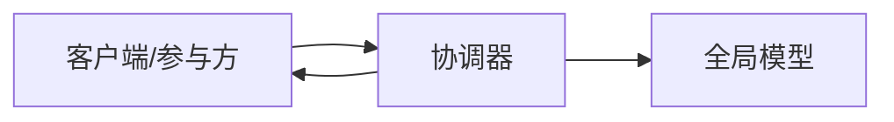
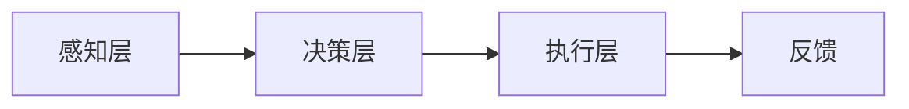
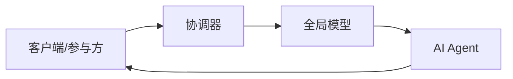

                 


# 《开发具有隐私保护联邦学习能力的AI Agent》

> **关键词**：联邦学习，AI Agent，隐私保护，数据安全，协作学习，系统架构，人工智能  
>
> **摘要**：  
> 本文探讨了如何开发具有隐私保护能力的联邦学习AI Agent，详细介绍了联邦学习的核心原理、隐私保护机制、AI Agent的体系结构以及它们之间的协同工作模式。通过实际案例分析和系统架构设计，展示了如何在保护数据隐私的前提下，实现高效协作学习，并赋予AI Agent自主决策能力。本文还深入分析了算法原理、系统实现和最佳实践，为读者提供全面的技术指导。

---

## 引言：联邦学习与AI Agent的背景与问题背景

### 1.1 联邦学习的背景与问题背景

在当今数据驱动的时代，数据隐私保护已成为全球关注的焦点。企业、机构和个人在享受数据带来的便利时，也面临着数据泄露和滥用的巨大风险。传统的集中式机器学习方法依赖于数据的集中存储和处理，这不仅增加了数据泄露的风险，还面临高昂的存储和计算成本。

**联邦学习（Federated Learning）**作为一种分布式机器学习技术，允许多个参与方在不共享原始数据的前提下，协作训练出一个全局模型。它通过在数据源端进行局部模型训练，并在通信过程中仅交换模型参数，而非数据本身，从而有效保护了数据隐私。

### 1.2 AI Agent的背景与应用场景

AI Agent（人工智能代理）是一种能够感知环境、自主决策并执行任务的智能体。它可以是一个软件程序、机器人或任何具备智能决策能力的实体。AI Agent的核心能力在于其自主性、反应性和目标导向性，使其能够在复杂环境中完成特定任务。

AI Agent的应用场景广泛，包括智能助手、自动驾驶、智能客服、医疗辅助诊断等。然而，AI Agent的决策和学习过程通常依赖于集中式数据训练，这不仅增加了数据泄露的风险，还限制了其在隐私敏感场景中的应用。

### 1.3 联邦学习与AI Agent的结合

联邦学习和AI Agent的结合为数据隐私保护和智能决策提供了新的可能性。通过联邦学习，AI Agent可以在不共享原始数据的情况下，与多个参与方协作训练模型，提升其决策能力。同时，AI Agent的自主性和智能性也为联邦学习的分布式协作提供了新的应用场景。

---

## 第2章：联邦学习的核心原理与数学模型

### 2.1 联邦学习的核心原理

联邦学习的核心思想是通过分布式计算，将数据源端的局部模型参数进行聚合，形成一个全局模型，而无需传输原始数据。其主要流程包括：

1. **初始化**：所有参与方初始化本地模型参数。
2. **局部训练**：每个参与方在本地数据上训练模型，更新局部模型参数。
3. **参数聚合**：通过通信协议将局部模型参数上传到协调器，协调器将所有参数聚合，形成全局模型。
4. **模型分发**：全局模型分发给所有参与方，更新本地模型。

**图 1：联邦学习的基本流程**



### 2.2 联邦学习的数学模型

联邦学习的数学模型通常基于优化理论，目标是最小化全局损失函数。假设全局损失函数为：

$$ L_{\text{total}} = \sum_{i=1}^n L_i(\theta) $$

其中，$L_i$ 是第 $i$ 个参与方的局部损失函数，$\theta$ 是模型参数。联邦学习通过优化以下目标函数实现全局模型的更新：

$$ \theta_{\text{new}} = \arg\min_{\theta} \sum_{i=1}^n L_i(\theta) $$

在实际实现中，常用随机梯度下降（SGD）或变种算法（如FedSGD）进行参数聚合。例如，联邦学习中的参数更新公式为：

$$ \theta_{\text{new}} = \theta_{\text{old}} - \eta \sum_{i=1}^n \nabla L_i(\theta_{\text{old}}) $$

其中，$\eta$ 是学习率，$\nabla L_i$ 是第 $i$ 个参与方的梯度。

---

## 第3章：AI Agent的体系结构与决策机制

### 3.1 AI Agent的体系结构

AI Agent的体系结构通常包括感知层、决策层和执行层。感知层负责数据的采集和处理，决策层负责模型的训练和决策，执行层负责任务的执行和反馈。

**图 2：AI Agent的体系结构**



### 3.2 AI Agent的决策机制

AI Agent的决策机制基于联邦学习的协作能力，通过以下步骤实现：

1. **数据采集**：AI Agent从环境中采集数据。
2. **局部训练**：AI Agent在本地数据上训练模型，更新局部参数。
3. **模型聚合**：AI Agent将局部参数上传到协调器，参与全局模型的聚合。
4. **全局模型更新**：协调器聚合所有参与方的局部参数，更新全局模型。
5. **模型分发**：AI Agent下载全局模型，更新本地模型。

---

## 第4章：隐私保护机制与安全挑战

### 4.1 数据加密与安全多方计算

在联邦学习中，数据加密和安全多方计算是保护数据隐私的关键技术。通过加密技术（如同态加密和差分隐私）可以确保数据在传输和计算过程中的安全性。

### 4.2 差分隐私与隐私保护

差分隐私通过在模型参数中添加噪声，确保单个样本对全局模型的影响可以忽略不计。例如，在联邦学习中，每个参与方的局部模型参数在上传前会添加噪声，以保护数据隐私。

---

## 第5章：系统架构设计与实现

### 5.1 系统架构设计

**图 3：支持隐私保护的联邦学习系统架构**



### 5.2 系统实现

系统实现包括以下几个步骤：

1. **环境配置**：安装必要的依赖库（如TensorFlow、Flask）。
2. **数据预处理**：对数据进行清洗和格式化处理。
3. **模型训练**：在本地数据上训练模型，并将局部参数上传到协调器。
4. **模型聚合**：协调器聚合所有参与方的局部参数，更新全局模型。
5. **模型分发**：全局模型分发给所有参与方，更新本地模型。

---

## 第6章：项目实战：医疗数据分析的AI Agent开发

### 6.1 项目介绍

本项目旨在开发一个支持隐私保护的医疗数据分析AI Agent，用于辅助医生进行疾病诊断。

### 6.2 核心代码实现

```python
import numpy as np
from tensorflow import keras

# 定义局部模型
class LocalModel:
    def __init__(self):
        self.model = keras.Sequential([
            keras.layers.Dense(64, activation='relu'),
            keras.layers.Dense(1, activation='sigmoid')
        ])
        self.model.compile(optimizer='adam', loss='binary_crossentropy')

    def train(self, x, y, epochs=1):
        self.model.fit(x, y, epochs=epochs, verbose=0)
        return self.model.get_weights()

# 初始化协调器
class Coordinator:
    def __init__(self):
        self.agents = []
        self.global_weights = None

    def add_agent(self, agent):
        self.agents.append(agent)

    def aggregate_weights(self):
        # 简单的平均聚合
        total_weights = self.agents[0].model.get_weights()
        for i in range(1, len(self.agents)):
            for j in range(len(total_weights)):
                total_weights[j] += self.agents[i].model.get_weights()[j]
        return total_weights / len(self.agents)

# 初始化AI Agent
class AIAssistant:
    def __init__(self):
        self.local_model = LocalModel()
        self.coordinator = Coordinator()

    def train(self, x, y, epochs=1):
        weights = self.local_model.train(x, y, epochs)
        self.coordinator.aggregate_weights()
```

### 6.3 项目总结

通过本项目，我们可以看到联邦学习和AI Agent的结合在医疗数据隐私保护中的巨大潜力。AI Agent不仅能够实现高效的协作学习，还能够通过本地模型训练和全局模型聚合，保护患者数据的隐私。

---

## 第7章：总结与展望

### 7.1 总结

本文详细介绍了开发具有隐私保护联邦学习能力的AI Agent的核心原理、系统架构和实现方法。通过联邦学习，AI Agent可以在不共享原始数据的前提下，实现高效的协作学习和自主决策。

### 7.2 未来展望

未来，随着AI技术的不断发展，联邦学习和AI Agent的结合将在更多领域得到应用。例如，通过强化学习和多智能体协作，进一步提升AI Agent的决策能力和协作效率。

---

## 附录：最佳实践与注意事项

1. **数据隐私保护**：在实际应用中，应严格遵守相关法律法规，确保数据的合法使用和隐私保护。
2. **模型鲁棒性**：联邦学习模型可能面临恶意攻击和数据中毒问题，需通过差分隐私和加密技术进行防护。
3. **性能优化**：在实际部署中，需关注通信效率和计算资源的分配，优化联邦学习的性能。

---

通过本文的系统讲解，读者可以全面掌握开发具有隐私保护联邦学习能力的AI Agent所需的技术和方法。

