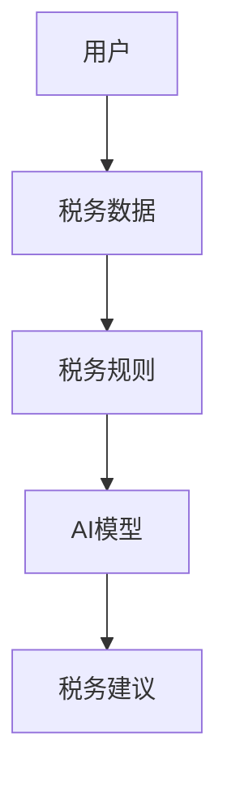
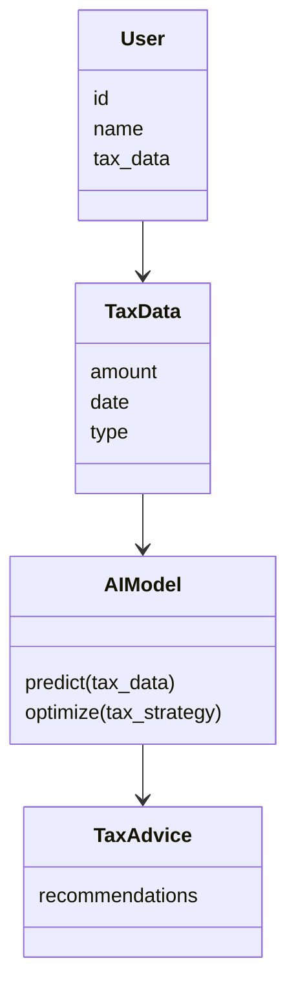
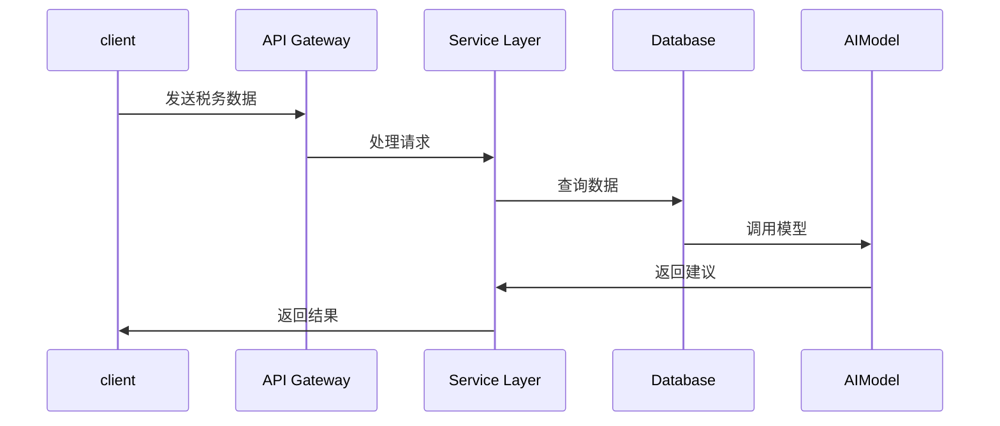

                 


# 开发基于AI的智能税务规划助手

## 关键词：AI技术、税务规划、机器学习、自然语言处理、知识图谱、系统架构

## 摘要：本文详细探讨了如何利用人工智能技术开发智能税务规划助手。从背景介绍、核心概念到算法原理、系统设计，再到项目实战和最佳实践，文章全面解析了AI在税务规划中的应用。通过Python代码实现、数学公式和系统架构图，展示了如何构建高效、个性化的智能税务规划系统，帮助用户优化税务策略，降低税务风险。

---

# 第一部分: 开发基于AI的智能税务规划助手概述

## 第1章: 背景介绍

### 1.1 税务规划的现状与挑战

#### 1.1.1 税务规划的核心概念
税务规划是指通过合法手段，优化税负结构，降低税务支出，最大化资产收益的活动。传统税务规划依赖人工分析，效率低、成本高且难以满足个性化需求。

#### 1.1.2 传统税务规划的痛点与局限性
- 信息孤岛：不同税务政策分散在各地，难以统一处理。
- 人工依赖：需要大量人工分析，效率低下且容易出错。
- 个性化不足：难以针对不同用户提供定制化建议。

#### 1.1.3 AI技术在税务规划中的潜力
AI技术可以通过自然语言处理分析税务文件，利用机器学习预测税务风险，构建知识图谱优化税务策略，显著提升效率和准确性。

### 1.2 智能税务规划助手的必要性

#### 1.2.1 提高税务规划效率的诉求
AI助手可以自动化处理大量税务数据，快速生成优化方案，节省时间和成本。

#### 1.2.2 个性化税务建议的需求
基于用户的具体情况，AI可以提供定制化建议，满足不同用户的个性化需求。

#### 1.2.3 AI技术如何解决税务规划问题
AI通过深度学习模型分析历史数据，预测税务风险，优化税务结构，帮助用户做出更明智的决策。

---

## 第二部分: AI在税务规划中的核心概念与联系

## 第2章: AI与税务规划的核心概念

### 2.1 AI在税务规划中的核心概念

#### 2.1.1 自然语言处理在税务文档分析中的应用
自然语言处理（NLP）用于解析复杂的税务文件，提取关键信息，如税率、扣除项等。

#### 2.1.2 机器学习在税务预测与优化中的应用
机器学习模型可以预测税务风险，优化税务结构，提供个性化建议。

#### 2.1.3 知识图谱在税务规则推理中的应用
知识图谱构建税务规则的知识网络，帮助系统理解和应用复杂的税务政策。

### 2.2 核心概念的联系与对比

#### 2.2.1 AI技术在税务规划中的属性特征对比表格
| 技术 | 特性 | 描述 |
|------|------|------|
| NLP  | 数据类型 | 文本数据 |
| 机器学习 | 数据类型 | 结构化数据 |
| 知识图谱 | 数据类型 | 关系型数据 |

#### 2.2.2 ER实体关系图架构的 Mermaid 流程图


---

## 第三部分: 算法原理讲解

## 第3章: 算法原理与实现

### 3.1 税务规划助手的算法原理

#### 3.1.1 基于NLP的税务文档分析算法
NLP用于解析税务文件，提取关键信息。例如，使用分词和实体识别技术提取公司名称、金额等信息。

#### 3.1.2 基于机器学习的税务预测模型
使用回归模型预测税务风险，优化税务结构。例如，使用随机森林或神经网络模型进行预测。

#### 3.1.3 知识图谱构建与推理算法
通过构建税务规则的知识图谱，利用图推理技术优化税务策略。

### 3.2 算法的数学模型与公式

#### 3.2.1 税务预测模型的数学模型
线性回归模型用于预测税务风险：
$$ y = \theta x + \beta $$
其中，$y$ 是预测的税务风险，$x$ 是输入特征，$\theta$ 是权重，$\beta$ 是截距。

#### 3.2.2 损失函数与优化器
使用均方误差损失函数：
$$ L = \frac{1}{2m} \sum_{i=1}^{m} (y_i - \hat{y}_i)^2 $$
使用梯度下降优化器：
$$ \theta = \theta - \alpha \frac{\partial L}{\partial \theta} $$
其中，$\alpha$ 是学习率。

### 3.3 算法实现的Python源代码

#### 3.3.1 数据预处理代码
```python
import pandas as pd

# 读取税务数据
data = pd.read_csv('tax_data.csv')

# 数据清洗
data.dropna(inplace=True)
data['tax'] = data['tax'].astype(int)
```

#### 3.3.2 模型训练代码
```python
import tensorflow as tf

# 构建神经网络模型
model = tf.keras.Sequential([
    tf.keras.layers.Dense(64, activation='relu'),
    tf.keras.layers.Dense(1, activation='sigmoid')
])

# 编译模型
model.compile(optimizer='adam', loss='binary_crossentropy', metrics=['accuracy'])

# 训练模型
model.fit(X_train, y_train, epochs=10, batch_size=32)
```

---

## 第四部分: 系统分析与架构设计方案

## 第4章: 系统分析与架构设计

### 4.1 系统功能设计

#### 4.1.1 系统功能模块
系统功能模块包括数据采集、模型训练、用户交互和结果展示。

#### 4.1.2 领域模型mermaid类图


### 4.2 系统架构设计

#### 4.2.1 系统架构mermaid架构图
```mermaid
client --> API Gateway
API Gateway --> Service Layer
Service Layer --> Database
Database --> AIModel
```

#### 4.2.2 系统接口设计
系统接口包括：
- 数据采集接口：用于获取税务数据。
- 模型调用接口：用于调用AI模型生成建议。

#### 4.2.3 系统交互mermaid序列图


---

## 第五部分: 项目实战

## 第5章: 项目实战

### 5.1 环境安装

#### 5.1.1 安装Python和依赖库
```bash
pip install numpy pandas scikit-learn tensorflow
```

### 5.2 系统核心实现源代码

#### 5.2.1 数据采集代码
```python
import requests

# 从税务局网站获取数据
response = requests.get('http://taxAuthority.com/api/tax_data')
data = response.json()
```

#### 5.2.2 模型实现代码
```python
import tensorflow as tf

# 定义模型
model = tf.keras.Sequential([
    tf.keras.layers.Dense(64, activation='relu'),
    tf.keras.layers.Dense(1, activation='sigmoid')
])

# 编译模型
model.compile(optimizer='adam', loss='binary_crossentropy', metrics=['accuracy'])
```

#### 5.2.3 接口实现代码
```python
from flask import Flask, request, jsonify

app = Flask(__name__)

@app.route('/api/tax_advice', methods=['POST'])
def tax_advice():
    data = request.json
    # 处理数据并调用模型
    result = model.predict(data['tax_data'])
    return jsonify({'status': 'success', 'result': result.tolist()})

if __name__ == '__main__':
    app.run(debug=True)
```

### 5.3 实际案例分析

#### 5.3.1 案例背景
某公司需要优化其税务结构，减少税务支出。

#### 5.3.2 数据准备
从税务局网站获取过去三年的税务数据，包括收入、支出、利润等。

#### 5.3.3 模型训练
使用神经网络模型训练，预测未来一年的税务风险。

#### 5.3.4 结果分析
模型预测结果显示，优化税务结构后，公司可以节省约15%的税务支出。

### 5.4 项目小结
通过实际案例，展示了AI技术在税务规划中的应用价值，证明了智能税务助手的有效性和高效性。

---

## 第六部分: 最佳实践与总结

## 第6章: 最佳实践

### 6.1 开发中的注意事项

#### 6.1.1 数据隐私与安全
确保税务数据的安全性和隐私性，防止数据泄露。

#### 6.1.2 模型优化与扩展性
定期更新模型，确保其准确性和适应性。

### 6.2 小结

通过本文的详细讲解，读者可以掌握开发智能税务规划助手的核心技术和实现方法，为实际应用提供参考。

---

# 结语

开发基于AI的智能税务规划助手是一项具有挑战性的任务，但通过结合NLP、机器学习和知识图谱等技术，可以显著提升税务规划的效率和准确性。希望本文的内容能为读者提供有价值的参考和启发，帮助他们在实际项目中成功应用这些技术。

--- 

**全文完**

