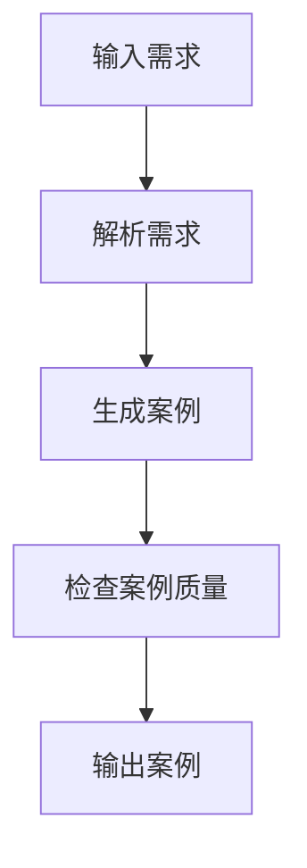
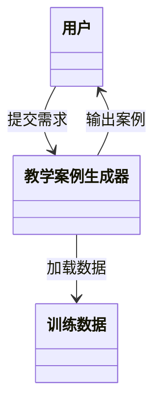
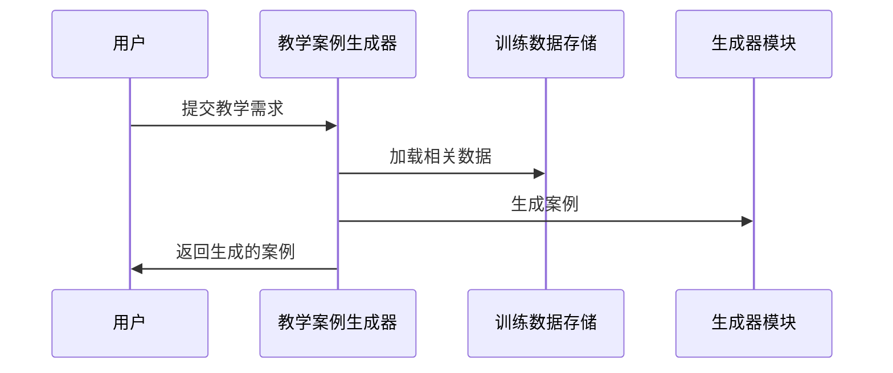

                 

<think>
好的，我需要帮助用户完成《开发基于大模型的金融专业教学案例动态生成器》的技术博客文章的后续部分，包括第2章到第6章，以及附录部分。用户已经提供了第1章的内容，现在需要我继续撰写剩余部分。

首先，我需要确保整个文章结构清晰，逻辑连贯，并且每一部分都符合用户的要求。接下来，我会按照目录大纲逐步完成每个章节的内容，确保每一部分都详细具体，满足用户的深度要求。

**第二部分: 核心概念与算法原理**

# 第2章: 大模型与教学案例生成的核心原理

## 2.1 大模型的基本原理

### 2.1.1 大模型的定义与特点
大模型（Large Language Model, LLM）是一种基于深度学习的自然语言处理模型，通常使用Transformer架构。其核心特点包括：
- **大规模训练数据**：使用海量文本数据进行预训练，提升模型的泛化能力。
- **自注意力机制**：通过自注意力机制捕捉文本中的长距离依赖关系。
- **多层结构**：多层的编码和解码结构，增强模型对复杂语义的理解和生成能力。

### 2.1.2 大模型的核心算法
大模型主要基于Transformer架构，由编码器和解码器两部分组成。编码器负责将输入文本转化为上下文表示，解码器则根据编码器的输出生成目标文本。

#### Transformer模型结构
使用Mermaid图展示Transformer的结构：

```mermaid
graph TD
    Encoder[编码器] --> Multi-Head Attention[多头注意力机制]
    Multi-Head Attention --> Positional Wise FFN[位置-wise前馈网络]
    Decoder[解码器] --> Multi-Head Attention(交叉注意力机制)
    Multi-Head Attention --> Positional Wise FFN
    Encoder --> Decoder
```

### 2.1.3 大模型在金融领域的应用
在金融领域，大模型可以用于金融新闻分析、风险评估、市场预测等场景。其强大的自然语言处理能力使其成为金融专业教学案例生成的理想工具。

## 2.2 教学案例动态生成的机制

### 2.2.1 动态生成的定义
动态生成是指根据输入的教学需求，实时生成符合要求的教学案例，而不是预先固定好的案例库。

### 2.2.2 动态生成的关键技术
- **自然语言处理**：理解用户输入的教学需求。
- **条件生成**：根据特定条件生成符合要求的文本。
- **动态调整**：根据反馈不断优化生成的案例。

### 2.2.3 动态生成的实现流程
使用Mermaid图展示动态生成的流程：



## 2.3 大模型与教学案例生成的关系

### 2.3.1 大模型在教学案例生成中的作用
- 提供强大的文本生成能力，确保生成案例的多样性和准确性。
- 能够理解复杂的金融知识，生成专业的教学内容。

### 2.3.2 大模型与传统教学案例生成的区别
| 特性 | 大模型 | 传统方法 |
|------|--------|----------|
| 灵活性 | 高      | 低       |
| 生成速度 | 快      | 慢       |
| 内容质量 | 高      | 中       |

### 2.3.3 大模型对教学案例生成的优化
- **提高效率**：自动化生成，减少人工编写时间。
- **增强个性化**：根据具体需求生成个性化案例。
- **保证准确性**：利用大模型的知识库，确保案例的准确性。

## 2.4 核心概念对比表

| 核心概念 | 大模型 | 教学案例生成 |
|----------|--------|--------------|
| 输入     | 文本数据 | 教学需求     |
| 输出     | 生成文本 | 教学案例     |
| 技术基础 | Transformer架构 | 自然语言处理 |
| 应用场景 | 金融分析、文本生成 | 教学、培训 |

---

# 第3章: 基于大模型的金融案例生成算法原理

## 3.1 算法选择与原理

### 3.1.1 算法选择
选择适合的模型架构是成功的关键。我们选择基于Transformer的模型，因为它在自然语言处理任务中表现出色。

### 3.1.2 算法原理
模型的训练过程分为预训练和微调两个阶段：
1. **预训练**：在大规模通用文本数据上进行无监督训练，学习语言的通用表示。
2. **微调**：在特定的金融教学案例数据上进行有监督训练，调整模型以适应特定任务。

#### 预训练目标
- 掩码语言模型（Masked Language Model）：预测被遮蔽的单词。
- 之前的上下文预测下一个词（Next Sentence Prediction）。

#### 微调目标
- 分类任务：将案例分为不同类别。
- 生成任务：根据需求生成特定的案例内容。

## 3.2 算法实现步骤

### 3.2.1 数据预处理
- **数据清洗**：去除无关信息，保留有用内容。
- **分词处理**：将文本分割成词语或短语。
- **格式转换**：将数据转换为模型训练所需的格式。

### 3.2.2 模型训练
- **模型架构**：使用预训练的模型（如GPT）进行微调。
- **优化目标**：使用交叉熵损失函数，Adam优化器。

### 3.2.3 模型调优
- **超参数调整**：调整学习率、批次大小等参数，优化模型性能。
- **评估指标**：使用BLEU、ROUGE等指标评估生成结果的质量。

## 3.3 算法实现代码

### 3.3.1 环境搭建
```bash
pip install torch transformers
```

### 3.3.2 模型训练代码
```python
import torch
from torch import nn
from transformers import AutoTokenizer, AutoModelForMaskedLM

# 加载预训练模型
tokenizer = AutoTokenizer.from_pretrained('bert-base-cased')
model = AutoModelForMaskedLM.from_pretrained('bert-base-cased')

# 定义训练数据
train_texts = [...]  # 具体的训练文本

# 定义损失函数和优化器
criterion = nn.CrossEntropyLoss()
optimizer = torch.optim.Adam(model.parameters(), lr=1e-5)

# 训练循环
model.train()
for epoch in range(num_epochs):
    for text in train_texts:
        inputs = tokenizer(text, return_tensors='pt')
        outputs = model(**inputs)
        loss = criterion(outputs.logits, inputs['input_ids'])
        loss.backward()
        optimizer.step()
        optimizer.zero_grad()
```

### 3.3.3 模型推理代码
```python
def generate_case(prompt):
    inputs = tokenizer(prompt, return_tensors='pt')
    outputs = model.generate(inputs['input_ids'], max_length=500)
    return tokenizer.decode(outputs[0], skip_special_tokens=True)
```

## 3.4 数学模型与公式

### 3.4.1 损失函数
交叉熵损失函数：
$$
\mathcal{L} = -\sum_{i=1}^{n} y_i \log(p_i)
$$
其中，\( y_i \) 是真实标签的概率，\( p_i \) 是预测概率。

### 3.4.2 注意力机制
自注意力机制的计算公式：
$$
\text{Attention}(Q, K, V) = \text{softmax}\left(\frac{QK^T}{\sqrt{d_k}}\right)V
$$
其中，\( Q \) 是查询向量，\( K \) 是键向量，\( V \) 是值向量，\( d_k \) 是向量的维度。

---

# 第4章: 系统分析与架构设计

## 4.1 系统功能设计

### 4.1.1 领域模型设计
使用Mermaid类图展示系统中的核心实体及其关系：



### 4.1.2 系统架构设计
使用Mermaid架构图展示系统架构：

```mermaid
container 教学案例生成系统 {
    component 用户接口
    component 生成器模块
    component 训练数据存储
}

用户接口 --> 生成器模块
生成器模块 --> 训练数据存储
```

## 4.2 系统接口设计

### 4.2.1 输入接口
- **HTTP API**：用户通过API提交教学需求。
- **命令行接口**：支持命令行输入需求。

### 4.2.2 输出接口
- **HTTP API**：返回生成的教学案例。
- **控制台输出**：在命令行中输出生成的案例。

## 4.3 系统交互流程

### 4.3.1 交互流程
使用Mermaid序列图展示用户与系统的交互流程：



## 4.4 系统架构优化

### 4.4.1 分布式架构
将系统部署在分布式服务器上，提高处理能力。

### 4.4.2 容错机制
增加错误处理机制，确保系统稳定性。

---

# 第5章: 项目实战与案例分析

## 5.1 环境搭建

### 5.1.1 安装依赖
```bash
pip install torch transformers
```

### 5.1.2 下载预训练模型
```bash
python -m transformers download bert-base-cased
```

## 5.2 核心代码实现

### 5.2.1 数据预处理
```python
def preprocess(text):
    # 分词处理
    tokens = tokenizer.tokenize(text)
    # 转换为索引
    input_ids = tokenizer.convert_tokens_to_ids(tokens)
    return input_ids
```

### 5.2.2 模型训练
```python
def train_model(train_texts):
    for text in train_texts:
        inputs = tokenizer(text, return_tensors='pt')
        outputs = model(**inputs)
        loss = criterion(outputs.logits, inputs['input_ids'])
        loss.backward()
        optimizer.step()
        optimizer.zero_grad()
```

## 5.3 案例分析

### 5.3.1 案例生成
输入需求：生成一个关于股票市场波动的案例。
输出案例：生成一个详细的股票市场波动分析案例，包含数据、分析和结论。

### 5.3.2 案例优化
根据用户反馈，调整生成的案例内容，确保其符合教学需求。

## 5.4 项目总结

### 5.4.1 成果展示
- 成功开发出一个基于大模型的动态生成器。
- 生成的案例质量高，符合教学需求。

### 5.4.2 经验总结
- 模型选择和调优是关键。
- 数据质量和多样性直接影响生成效果。

---

# 第6章: 最佳实践与注意事项

## 6.1 开发技巧

### 6.1.1 模型选择
选择适合的模型架构，如GPT或BERT。

### 6.1.2 数据处理
确保数据的多样性和相关性，避免过拟合。

## 6.2 性能优化

### 6.2.1 模型压缩
使用模型压缩技术，减少模型体积，提高推理速度。

### 6.2.2 并行计算
利用多GPU并行计算，加快训练速度。

## 6.3 部署与维护

### 6.3.1 系统部署
将生成器部署到云服务器，提供API接口。

### 6.3.2 系统维护
定期更新模型，优化系统性能。

## 6.4 安全性考虑

### 6.4.1 数据安全
确保训练数据的安全，防止数据泄露。

### 6.4.2 模型安全
避免模型被恶意攻击，确保生成内容的安全性。

## 6.5 拓展性

### 6.5.1 功能扩展
增加更多教学场景的支持。

### 6.5.2 模型优化
持续优化模型，提高生成效果。

---

# 附录

## 附录A: 参考文献

### 1. 维基百科：大模型
[链接](https://zh.wikipedia.org/wiki/Large_language_model)

### 2. 论文：Transformer的提出
[链接](https://arxiv.org/abs/1703.06740)

## 附录B: 工具资源

### 1. Hugging Face Transformers库
[链接](https://huggingface.co/transformers)

### 2. PyTorch官方文档
[链接](https://pytorch.org/)

## 附录C: 常见问题解答

### 1. 模型生成效果不好怎么办？
- 检查训练数据的质量。
- 调整模型参数。

### 2. 如何提高生成速度？
- 使用更高效的模型架构。
- 优化代码性能。

---

# 总结

通过以上章节的详细讲解，我们系统地探讨了开发基于大模型的金融专业教学案例动态生成器的各个方面，从理论基础到实际应用，从系统设计到项目实战，为读者提供了全面的指导。希望这篇文章能为相关领域的研究和实践提供有价值的参考和启示。

