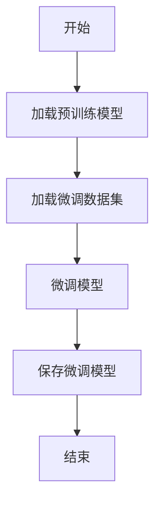
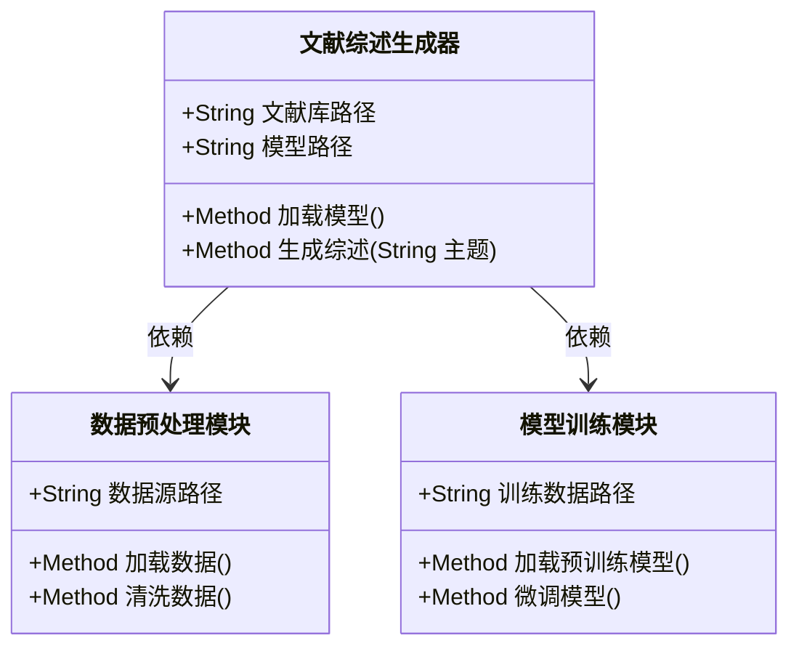
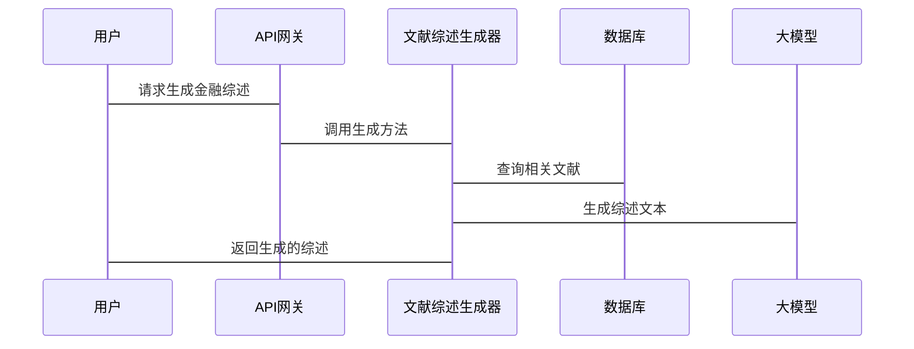

                 


# 开发基于大模型的金融专业文献综述生成器

## 关键词：大模型、金融文献、文献综述、NLP、机器学习

## 摘要：本文探讨了如何利用大模型技术开发金融专业文献综述生成器。通过分析大模型的核心原理，结合金融文献的特点，构建生成器的系统架构，并通过实际案例展示其应用，旨在为金融领域的研究提供高效工具。

---

# 第一部分：背景介绍

## 第1章：大模型的背景与发展

### 1.1 大模型的定义与核心概念

#### 1.1.1 大模型的基本概念
大模型（Large Language Model，LLM）是一种基于深度学习的自然语言处理模型，通过大量数据训练，具备理解和生成人类语言的能力。其核心包括预训练、微调和模型优化。

#### 1.1.2 大模型的核心技术特点
- **参数规模大**：通常超过 billions 参数。
- **预训练**：利用大规模通用数据进行无监督学习。
- **微调**：针对特定任务进行有监督训练。

#### 1.1.3 大模型与传统NLP模型的对比
| 特性          | 大模型                | 传统NLP模型          |
|---------------|-----------------------|----------------------|
| 参数规模      | 大（Billions+）        | 小（百万级别）        |
| 训练数据      | 大规模通用数据        | 任务特定数据          |
| 任务适应性    | 强                   | 较弱                 |

### 1.2 金融专业文献综述的重要性

#### 1.2.1 金融文献综述的目的与作用
- **总结研究进展**：梳理领域内的重要研究成果。
- **发现研究空白**：识别尚未深入研究的领域。
- **指导研究方向**：为后续研究提供方向。

#### 1.2.2 传统文献综述方法的局限性
- **效率低**：人工整理耗时耗力。
- **主观性强**：依赖研究人员的经验和视角。
- **信息不全**：可能遗漏重要文献。

#### 1.2.3 基于大模型的文献综述的优势
- **高效性**：自动化处理大量文献。
- **客观性**：减少主观偏差。
- **全面性**：覆盖更多文献来源。

### 1.3 大模型与金融文献综述的结合

#### 1.3.1 大模型在金融领域的应用现状
- **文本生成**：生成金融报告、市场分析。
- **信息抽取**：提取金融数据和关键信息。
- **问答系统**：解答金融相关问题。

#### 1.3.2 金融文献综述生成的痛点与需求
- **文献数量庞大**：金融领域文献繁多，人工处理困难。
- **专业性强**：需要理解复杂的金融概念和术语。
- **时效性要求高**：及时更新综述以反映最新研究。

#### 1.3.3 基于大模型的解决方案
- **自动化处理**：利用大模型快速生成综述。
- **深度分析**：通过模型理解文献内容，发现隐藏关系。

---

# 第二部分：核心概念与联系

## 第2章：大模型的核心原理

### 2.1 大模型的训练与优化

#### 2.1.1 预训练目标函数
预训练阶段的目标函数通常包括：
$$
\mathcal{L}_{pre} = \mathcal{L}_{ MLM} + \mathcal{L}_{SOP}
$$
其中，MLM（Masked Language Model）用于预测被遮蔽的词，SOP（Sentence Order Prediction）用于判断句子顺序。

#### 2.1.2 微调策略
在特定任务上进行微调，调整模型参数以适应任务需求：
$$
\mathcal{L}_{finetune} = \mathcal{L}_{task} + \lambda \mathcal{L}_{regularization}
$$
其中，$\lambda$ 是正则化系数。

#### 2.1.3 模型压缩与优化
通过知识蒸馏等技术优化模型，减少参数量：
$$
\text{Student} \rightarrow \text{Teacher}
$$

### 2.2 金融文献综述生成器的构建

#### 2.2.1 文献抽取与分析
- **文本清洗**：去除无关内容，提取关键信息。
- **主题建模**：使用LDA等方法识别文献主题。
- **情感分析**：分析文献中观点的倾向。

#### 2.2.2 文本生成机制
基于大模型的生成策略，生成连贯的综述文本，通常采用贪心算法或采样方法。

#### 2.2.3 综述质量评估
- **指标体系**：包括完整性、准确性和逻辑性。
- **评估工具**：结合人工评估和自动评价指标（如ROUGE、BLEU）。

## 第3章：核心概念对比与ER图分析

### 3.1 大模型与传统NLP模型的对比

| 特性          | 大模型                | 传统NLP模型          |
|---------------|-----------------------|----------------------|
| 参数规模      | 大（Billions+）        | 小（百万级别）        |
| 训练数据      | 大规模通用数据        | 任务特定数据          |
| 任务适应性    | 强                   | 较弱                 |

### 3.2 金融文献综述生成器的ER图架构

```mermaid
erDiagram
    publisher {
        key id
        string name
        string address
    }
    paper {
        key id
        string title
        string abstract
        date publish_date
    }
    author {
        key id
        string name
        string email
    }
    publisher_note {
        key id
        string note_text
        date note_date
    }
    paper_AUTHOR { many }
    publisher_paper { many }
    publisher_note { many }
    author_paper {
        key id
        foreign key paper_id
        foreign key author_id
    }
    paper_paper {
        key id
        foreign key paper_id
        string reference_text
    }
```

---

# 第三部分：算法原理

## 第4章：算法原理详解

### 4.1 大模型的预训练与微调流程



### 4.2 数学模型与公式

#### 4.2.1 损失函数
$$
\mathcal{L} = -\sum_{i=1}^{n} y_i \log p(y_i|x_i)
$$

#### 4.2.2 优化器
使用Adam优化器：
$$
\theta_{t+1} = \theta_t - \eta \frac{\partial \mathcal{L}}{\partial \theta_t}
$$

---

# 第四部分：系统分析与架构设计

## 第5章：系统架构设计

### 5.1 项目介绍

#### 5.1.1 项目目标
开发一个基于大模型的金融文献综述生成器，实现自动化文献综述生成。

### 5.2 系统功能设计



### 5.3 系统架构设计


### 5.4 系统交互流程



---

# 第五部分：项目实战

## 第6章：项目实战

### 6.1 环境安装

```bash
pip install transformers torch
```

### 6.2 核心代码实现

#### 6.2.1 数据预处理

```python
import pandas as pd

def preprocess_data(file_path):
    df = pd.read_csv(file_path)
    df['content'] = df['content'].apply(lambda x: x.strip())
    return df
```

#### 6.2.2 模型微调

```python
from transformers import AutoModelForMaskedLM, AutoTokenizer

def fine_tune_model(model_name, output_dir):
    model = AutoModelForMaskedLM.from_pretrained(model_name)
    tokenizer = AutoTokenizer.from_pretrained(model_name)
    # 微调步骤
    # ...
    model.save_pretrained(output_dir)
    tokenizer.save_pretrained(output_dir)
```

#### 6.2.3 综述生成

```python
from transformers import AutoModelForCausalLM, AutoTokenizer

def generate_review(topic, model_name):
    model = AutoModelForCausalLM.from_pretrained(model_name)
    tokenizer = AutoTokenizer.from_pretrained(model_name)
    inputs = tokenizer.encode(f"Review on {topic}", return_tensors="pt")
    outputs = model.generate(inputs, max_length=500)
    return tokenizer.decode(outputs[0], skip_special_tokens=True)
```

### 6.3 案例分析

#### 6.3.1 实际案例分析
假设我们有一个金融领域的文献集，主题是“人工智能在金融风险管理中的应用”。我们使用上面的代码生成综述：

```python
review = generate_review("人工智能在金融风险管理中的应用", "model_name")
print(review)
```

### 6.4 项目小结

通过实际案例，我们验证了生成器的有效性。生成的综述涵盖了主要的研究方向和应用，但仍需进一步优化模型以提高准确性和全面性。

---

# 第六部分：总结与展望

## 第7章：总结与展望

### 7.1 最佳实践 Tips

- **数据质量**：确保文献数据的多样性和相关性。
- **模型选择**：根据具体任务选择合适的模型和参数。
- **性能优化**：通过模型压缩和并行计算提升效率。

### 7.2 小结

本文详细介绍了如何基于大模型开发金融文献综述生成器，从背景分析到系统实现，为金融领域的研究提供了高效工具。

### 7.3 注意事项

- **模型泛化能力**：在不同金融领域中可能需要调整模型参数。
- **数据隐私**：处理金融数据时需注意隐私保护。

### 7.4 拓展阅读

- **相关文献**：深入阅读金融领域的最新研究论文。
- **工具与框架**：探索其他NLP框架和工具。

---

通过以上步骤，我们详细阐述了基于大模型的金融文献综述生成器的开发过程，从理论到实践，为读者提供了全面的指导。

