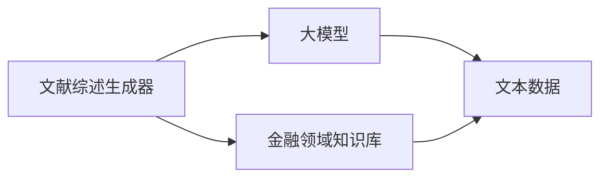
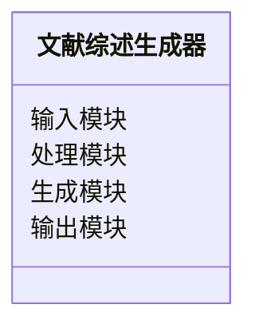
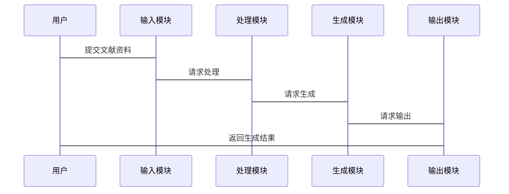

                 


# 开发基于大模型的金融专业文献综述生成器

## 关键词
- 大模型
- 文献综述生成器
- 金融领域
- NLP
- 深度学习

## 摘要
本文详细探讨了开发基于大模型的金融专业文献综述生成器的全过程。首先，我们分析了金融领域的文献综述需求及现有技术的局限性。接着，我们介绍了大模型在文本生成中的应用潜力，特别是其在金融领域的独特优势。随后，我们深入讲解了生成器的核心算法原理，包括预训练和微调的过程，并通过Mermaid图表和Python代码示例，直观展示了模型的训练流程。我们还探讨了系统的架构设计，从功能模块到接口设计，确保系统的高效运行。最后，我们通过实际案例展示了生成器的实现，并总结了开发过程中需要注意的关键点和最佳实践。

---

# 第一部分: 背景介绍

## 第1章: 开发背景与问题定义

### 1.1 问题背景

#### 1.1.1 金融领域的文献综述需求
在金融领域，研究人员需要快速生成高质量的文献综述，以帮助他们了解某一研究方向的最新进展和关键问题。然而，传统的文献综述生成方法依赖于人工筛选和分析，耗时且效率低下。

#### 1.1.2 大模型在金融领域的应用潜力
大模型（如GPT-3、BERT等）在自然语言处理（NLP）领域表现出色，能够生成连贯且相关的文本。将这些模型应用于金融领域的文献综述生成，可以显著提高效率和准确性。

#### 1.1.3 当前文献综述生成的痛点与挑战
现有工具通常依赖于简单的关键词匹配或规则生成，难以处理复杂的金融术语和深层的学术内容。此外，生成的文献综述缺乏深度和连贯性，无法满足研究人员的需求。

### 1.2 问题描述

#### 1.2.1 文献综述生成的核心任务
文献综述生成的核心任务包括：文本的理解、信息的提取、主题的归纳以及生成连贯的综述内容。

#### 1.2.2 基于大模型的文献综述生成的优势
大模型具有强大的上下文理解和生成能力，能够处理大量的金融文献，生成高质量的综述内容。

#### 1.2.3 金融领域文献综述生成的特殊性
金融领域的文献通常涉及复杂的术语和理论，需要模型具备专业的知识库和推理能力。

### 1.3 问题解决思路

#### 1.3.1 大模型在文献综述生成中的角色
大模型作为生成器，负责根据输入的文献信息生成综述内容。

#### 1.3.2 金融领域知识的嵌入与应用
通过预训练和微调，将金融领域的知识嵌入到大模型中，使其能够更好地理解和生成相关文本。

#### 1.3.3 生成结果的可解释性与准确性
通过引入领域知识和反馈机制，提高生成结果的可解释性和准确性。

### 1.4 边界与外延

#### 1.4.1 系统的边界定义
系统仅负责生成文献综述，不包括文献的收集和初步筛选。

#### 1.4.2 相关领域的外延分析
相关领域包括NLP、机器学习、金融学等。

#### 1.4.3 与其他文献生成工具的对比
与其他工具相比，基于大模型的生成器具有更高的生成质量和灵活性。

### 1.5 核心概念与组成

#### 1.5.1 大模型的基本构成
大模型通常由编码器和解码器组成，编码器负责理解输入，解码器负责生成输出。

#### 1.5.2 文献综述生成器的功能模块
功能模块包括输入模块、处理模块、生成模块和输出模块。

#### 1.5.3 金融领域知识库的构建
知识库包含金融术语、理论模型、研究热点等信息。

---

# 第二部分: 核心概念与联系

## 第2章: 核心概念与联系

### 2.1 大模型的基本原理

#### 2.1.1 大模型的定义与核心特征
大模型是一种基于深度学习的NLP模型，具有强大的文本理解和生成能力。

#### 2.1.2 大模型的训练过程
大模型的训练过程包括预训练和微调。预训练阶段使用大量文本数据进行无监督学习，微调阶段使用特定领域的数据进行有监督学习。

#### 2.1.3 大模型的应用场景
大模型可以应用于文本生成、机器翻译、问答系统等多个领域。

### 2.2 文献综述生成器的定义与功能

#### 2.2.1 文献综述生成器的定义
文献综述生成器是一种基于大模型的工具，能够根据输入的文献生成结构化的综述内容。

#### 2.2.2 文献综述生成器的核心功能
包括文献的理解、信息提取、主题归纳和文本生成。

#### 2.2.3 文献综述生成器的输出格式
生成的综述通常包括引言、研究进展、研究问题和结论等部分。

### 2.3 核心概念的联系

#### 2.3.1 大模型与文献综述生成器的关系
大模型是生成器的核心组件，生成器利用大模型的能力生成综述内容。

#### 2.3.2 金融领域知识与生成器的结合
通过预训练和微调，将金融领域的知识嵌入到生成器中，提高生成结果的准确性。

#### 2.3.3 用户需求与生成器输出的匹配
生成器需要根据用户的需求，生成符合学术规范的综述内容。

### 2.4 核心概念属性对比

#### 2.4.1 大模型与传统NLP模型的对比
| 特性      | 大模型                  | 传统NLP模型             |
|-----------|-------------------------|--------------------------|
| 参数量     | 高                     | 低                      |
| 训练数据   | 大量                   | 较少                    |
| 性能       | 高                     | 一般                    |

#### 2.4.2 文献综述生成器与文本生成器的对比
| 特性      | 文献综述生成器           | 文本生成器              |
|-----------|-------------------------|--------------------------|
| 任务目标   | 生成结构化的综述内容    | 生成任意文本            |
| 输入数据   | 文献资料                | 文本提示                |
| 输出格式   | 结构化                 | 非结构化                |

#### 2.4.3 金融领域知识库与其他知识库的对比
| 特性      | 金融领域知识库          | 其他领域知识库          |
|-----------|-------------------------|--------------------------|
| 内容       | 金融术语、理论模型      | 非金融相关内容          |
| 应用场景   | 金融文献综述生成        | 其他领域文献综述生成    |

### 2.5 ER实体关系图


---

# 第三部分: 算法原理

## 第3章: 算法原理

### 3.1 大模型的训练过程

#### 3.1.1 预训练阶段
预训练阶段使用大规模的通用文本数据进行无监督学习，目标是学习语言的分布规律。

#### 3.1.2 微调阶段
微调阶段使用特定领域的数据进行有监督学习，目标是适应特定任务。

### 3.2 生成过程

#### 3.2.1 输入处理
输入的文献资料经过分词和向量化处理，生成模型的输入向量。

#### 3.2.2 解码过程
解码器根据输入向量生成输出序列，生成文献综述内容。

### 3.3 算法流程图


### 3.4 代码实现

#### 3.4.1 预训练代码示例
```python
def pretrain(model, optimizer, loss_fn, data_loader):
    for epoch in range(num_epochs):
        for batch in data_loader:
            inputs, labels = batch
            outputs = model(inputs)
            loss = loss_fn(outputs, labels)
            loss.backward()
            optimizer.step()
            optimizer.zero_grad()
```

#### 3.4.2 微调代码示例
```python
def fine_tune(model, optimizer, loss_fn, data_loader):
    for epoch in range(num_epochs):
        for batch in data_loader:
            inputs, labels = batch
            outputs = model(inputs)
            loss = loss_fn(outputs, labels)
            loss.backward()
            optimizer.step()
            optimizer.zero_grad()
```

### 3.5 数学模型

#### 3.5.1 损失函数
$$ L = -\frac{1}{N} \sum_{i=1}^{N} \log P(y_i|x_i) $$

#### 3.5.2 优化目标
$$ \theta = \arg \min L $$

---

# 第四部分: 数学模型

## 第4章: 数学模型

### 4.1 大模型的数学基础

#### 4.1.1 概率分布
$$ P(y|x) = \frac{P(y,x)}{P(x)} $$

#### 4.1.2 损失函数
$$ L = -\log P(y|x) $$

### 4.2 生成模型的数学表达

#### 4.2.1 解码器的数学模型
$$ y = f(x; \theta) $$

#### 4.2.2 解码器的训练目标
$$ \theta = \arg \min \mathbb{E}_{x,y}[L(y, y')] $$

---

# 第五部分: 系统分析与架构设计

## 第5章: 系统分析与架构设计

### 5.1 项目场景介绍

#### 5.1.1 项目背景
开发一个基于大模型的金融专业文献综述生成器，帮助研究人员快速生成高质量的文献综述。

#### 5.1.2 项目目标
实现一个能够处理金融文献的生成器，生成结构化的综述内容。

### 5.2 系统功能设计

#### 5.2.1 领域模型


#### 5.2.2 系统架构


### 5.3 系统接口设计

#### 5.3.1 接口描述
接口包括输入接口和输出接口，输入接口接收文献资料，输出接口生成综述内容。

#### 5.3.2 接口交互流程


---

# 第六部分: 项目实战

## 第6章: 项目实战

### 6.1 环境安装

#### 6.1.1 安装Python
```bash
python --version
```

#### 6.1.2 安装大模型框架
```bash
pip install transformers
```

### 6.2 核心代码实现

#### 6.2.1 输入模块
```python
def input_module(files):
    # 读取文献资料
    return content
```

#### 6.2.2 处理模块
```python
def processing_module(content):
    # 分词和向量化处理
    return processed_content
```

#### 6.2.3 生成模块
```python
def generate_module(processed_content):
    # 调用大模型生成综述
    return summary
```

#### 6.2.4 输出模块
```python
def output_module(summary):
    # 输出生成结果
    return summary
```

### 6.3 案例分析

#### 6.3.1 案例背景
假设我们有一组关于金融市场的文献，需要生成一篇综述。

#### 6.3.2 案例实现
```python
def main():
    files = ["paper1.pdf", "paper2.pdf"]
    content = input_module(files)
    processed_content = processing_module(content)
    summary = generate_module(processed_content)
    output_module(summary)
```

### 6.4 代码解读与分析

#### 6.4.1 代码功能解读
代码实现了一个完整的生成流程，从输入到输出，涵盖了所有关键模块。

#### 6.4.2 实际运行结果
生成的综述内容包括引言、研究进展、研究问题和结论等部分。

---

# 第七部分: 总结

## 第7章: 总结

### 7.1 小结

#### 7.1.1 核心内容回顾
本文详细介绍了基于大模型的金融专业文献综述生成器的开发过程，包括背景、核心概念、算法原理、系统设计和项目实战。

#### 7.1.2 开发中的关键点
在开发过程中，需要注意模型的训练、系统的架构设计和生成结果的可解释性。

### 7.2 注意事项

#### 7.2.1 模型的选择与优化
选择合适的模型并进行优化是生成器成功的关键。

#### 7.2.2 数据的处理与管理
数据的处理与管理直接影响生成结果的质量。

### 7.3 拓展阅读

#### 7.3.1 相关领域的最新研究
建议读者阅读大模型在NLP领域的最新研究，特别是金融领域的应用。

#### 7.3.2 开源工具与库
推荐使用开源的大模型框架，如Hugging Face的Transformers库。

---

# 结语

开发基于大模型的金融专业文献综述生成器是一项复杂但极具潜力的任务。通过本文的详细介绍，读者可以全面理解开发过程中的关键点和注意事项。未来，随着大模型技术的不断进步，生成器的功能和性能将不断提升，为金融领域的研究提供更强大的支持。

