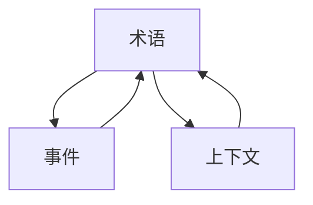
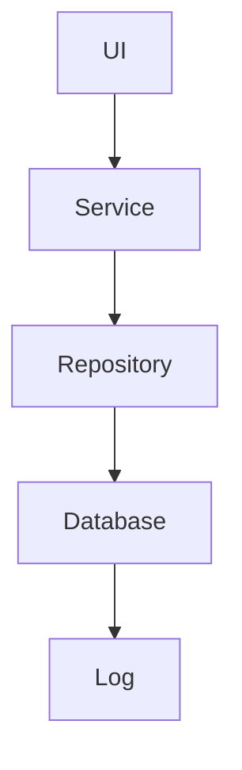
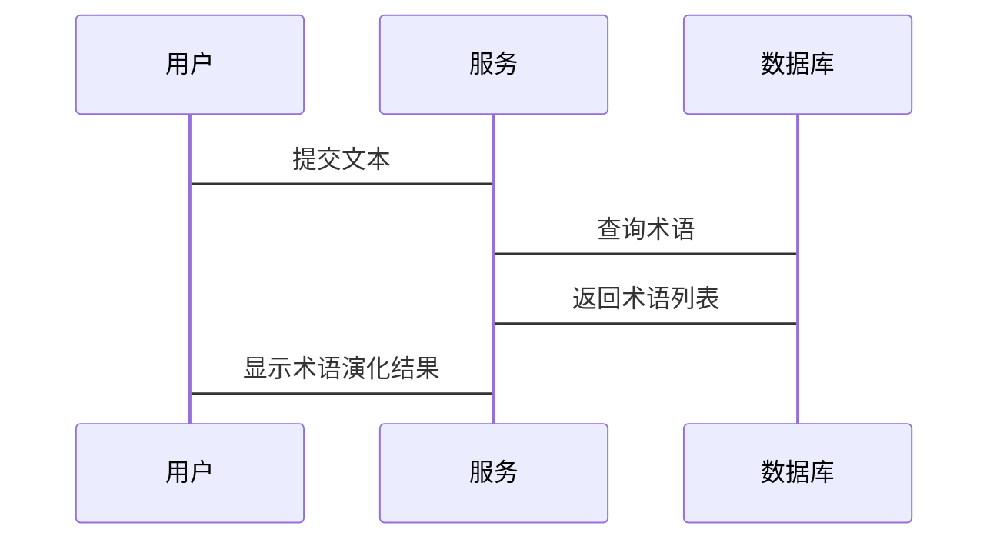

                 


# 开发基于大模型的金融专业术语演化跟踪器

> 关键词：大模型、金融术语、演化跟踪、自然语言处理、术语管理、金融系统

> 摘要：本文详细探讨了开发基于大模型的金融专业术语演化跟踪器的背景、核心概念、算法原理、系统架构设计及项目实战。通过对术语演化跟踪器的原理、算法实现、系统架构的深入分析，结合具体的代码实现和实际案例，展示了如何利用大模型技术解决金融领域术语演化跟踪的问题，为金融行业提供高效的术语管理工具。

---

# 第一部分：背景与核心概念

## 第1章：金融专业术语演化跟踪的背景与问题

### 1.1 问题背景

#### 1.1.1 金融领域的术语演化特点
金融领域的术语具有高度的专业性和复杂性。随着金融市场的不断发展，新的金融产品、概念和术语不断涌现，原有的术语可能会发生变化或被新的术语替代。例如，“区块链”从最初的“比特币技术”逐渐演变为“分布式账本技术”，这种术语的演化反映了行业的发展和变化。

#### 1.1.2 术语演化对金融行业的影响
术语的演化直接影响到金融行业的信息传递和业务操作。如果对术语的变化不够敏感，可能会导致信息误解、合同纠纷或业务操作失误。例如，某些金融术语的含义变化可能导致法律文件的解释出现偏差，从而引发法律风险。

#### 1.1.3 术语演化跟踪的必要性
为了准确理解金融市场的动态，及时捕捉术语的变化至关重要。术语演化跟踪器可以帮助金融机构和从业者快速识别术语的变更，确保信息的准确性和一致性。

### 1.2 问题描述

#### 1.2.1 术语演化的主要问题
1. **术语含义的变化**：同一术语在不同时期可能具有不同的含义，或者同一含义的术语可能在不同时期有不同的表达方式。
2. **术语的新增和淘汰**：随着金融创新的推进，新的术语不断出现，而某些旧术语可能逐渐被淘汰。
3. **术语的多义性和模糊性**：某些术语在不同的上下文中可能具有不同的含义，增加了术语演化跟踪的复杂性。

#### 1.2.2 术语演化跟踪的目标
1. **识别术语的变化**：及时发现术语的新增、变更或淘汰。
2. **分析术语的演化路径**：了解术语在不同时期的变化趋势和原因。
3. **提供术语的标准化管理**：为金融机构提供术语的标准化定义和使用建议。

#### 1.2.3 术语演化跟踪的边界与外延
术语演化跟踪的边界包括术语的定义、术语的使用场景以及术语的演化过程。外延则涉及术语的同义词、近义词、反义词以及相关概念的关联关系。

### 1.3 核心概念与联系

#### 1.3.1 术语演化跟踪器的定义与核心要素
术语演化跟踪器是一种基于大模型的自然语言处理工具，用于识别和跟踪金融术语的变化。其核心要素包括：
1. **术语识别**：从文本中提取金融术语。
2. **术语演化分析**：分析术语在不同时期的变化。
3. **术语关联**：建立术语之间的关联关系。

#### 1.3.2 术语演化与金融业务的关系
术语的演化直接影响金融业务的开展。例如，术语的变化可能导致金融产品的名称变更，从而影响其市场推广和客户认知。

#### 1.3.3 术语演化跟踪器的实体关系图（ER图）



---

# 第二部分：核心概念与原理

## 第2章：术语演化跟踪器的核心原理

### 2.1 术语演化跟踪的核心原理

#### 2.1.1 基于大模型的自然语言处理原理
大模型（如GPT-3、BERT）具有强大的自然语言处理能力，能够理解和生成人类语言。术语演化跟踪器利用大模型对文本进行深度分析，提取术语的变化信息。

#### 2.1.2 术语演化跟踪的算法原理
术语演化跟踪器通过比较不同时期的文本数据，识别术语的变化。算法基于文本相似度计算，利用向量空间模型（如TF-IDF、Word2Vec）进行术语的相似度计算和聚类分析。

#### 2.1.3 大模型在术语演化中的作用
大模型可以自动识别和提取文本中的术语，并通过上下文分析术语的含义变化。此外，大模型还可以生成术语的演化路径和关联关系。

### 2.2 核心概念的属性特征对比

#### 2.2.1 术语演化跟踪器的属性特征表

| 属性 | 特征 |
|------|------|
| 术语名称 | 明确的术语名称 |
| 术语定义 | 术语的定义和解释 |
| 术语变化 | 不同时期的术语变化 |
| 上下文 | 术语出现的场景和背景 |
| 关联术语 | 相关的术语和概念 |

#### 2.2.2 术语演化跟踪器与传统术语管理工具的对比

| 对比维度 | 术语演化跟踪器 | 传统术语管理工具 |
|----------|-----------------|------------------|
| 核心功能 | 识别术语变化 | 管理术语库 |
| 技术基础 | 大模型和NLP | 知识库管理 |
| 数据来源 | 多源文本数据 | 结构化术语库 |
| 应用场景 | 实时跟踪术语变化 | 静态术语管理 |

### 2.3 实体关系图（ER图）


---

# 第三部分：算法原理与数学模型

## 第3章：术语演化跟踪的算法原理

### 3.1 算法原理

#### 3.1.1 基于大模型的术语识别算法
术语识别算法利用大模型对文本进行分词和命名实体识别，提取出金融领域的专业术语。

#### 3.1.2 术语演化路径的计算方法
术语演化路径的计算基于文本相似度，通过比较不同时期的术语向量，找到最短路径。

#### 3.1.3 术语相似度计算算法
术语相似度计算采用余弦相似度公式，通过向量点积计算术语的相似程度。

### 3.2 数学模型与公式

#### 3.2.1 术语相似度计算公式
$$
\text{similarity}(a, b) = \frac{\vec{a} \cdot \vec{b}}{|\vec{a}| |\vec{b}|}
$$

其中，$\vec{a}$和$\vec{b}$分别是两个术语的向量表示。

#### 3.2.2 术语演化路径计算公式
$$
\text{path}(t_1, t_2) = \argmin_{p \in P} \sum_{i=1}^{n} \text{similarity}(t_i, t_{i+1})
$$

其中，$P$是所有可能的演化路径集合，$t_i$和$t_{i+1}$是连续的术语。

### 3.3 算法实现

#### 3.3.1 基于Python的术语相似度计算代码
```python
import numpy as np

def calculate_similarity(vector_a, vector_b):
    return np.dot(vector_a, vector_b) / (np.linalg.norm(vector_a) * np.linalg.norm(vector_b))
```

#### 3.3.2 术语演化路径计算代码
```python
def find_shortest_path(terms, similarity_matrix):
    n = len(terms)
    dist = np.full(n, np.inf)
    dist[0] = 0
    prev = np.full(n, -1)

    for i in range(n):
        for j in range(n):
            if i != j and similarity_matrix[i, j] < dist[j]:
                dist[j] = similarity_matrix[i, j]
                prev[j] = i

    path = []
    current = n - 1
    while current != -1:
        path.append(terms[current])
        current = prev[current]
    return path[::-1]
```

---

# 第四部分：系统架构与设计

## 第4章：系统架构设计与实现

### 4.1 系统分析与设计

#### 4.1.1 问题场景介绍
系统需要实时跟踪金融领域的术语演化，处理大量文本数据，并提供术语的演化路径和关联关系。

#### 4.1.2 系统功能设计
1. **术语识别**：从文本中提取术语。
2. **术语演化分析**：分析术语的变化。
3. **术语关联**：建立术语之间的关联关系。

#### 4.1.3 领域模型设计
```mermaid
classDiagram
    class 术语 {
        名称
        定义
        变化历史
        关联术语
    }
    class 事件 {
        类型
        时间戳
        描述
    }
    class 上下文 {
        文本
        来源
        时间
    }
    谓词：术语 --> 包含
    谓词：事件 --> 影响
    谓词：上下文 --> 包含
```

#### 4.1.4 系统架构设计


### 4.2 系统接口与交互

#### 4.2.1 系统接口设计
1. **术语识别接口**：输入文本，输出术语列表。
2. **术语演化分析接口**：输入时间范围，输出术语演化路径。
3. **术语关联查询接口**：输入术语，输出关联术语列表。

#### 4.2.2 系统交互流程


---

# 第五部分：项目实战

## 第5章：项目实战与实现

### 5.1 环境安装与配置

#### 5.1.1 安装依赖
```bash
pip install numpy
pip install matplotlib
pip install transformers
```

#### 5.1.2 安装大模型
```bash
pip install torch
pip install sentence-transformers
```

### 5.2 系统核心实现

#### 5.2.1 术语识别实现
```python
from sentence_transformers import SentenceTransformer
from sklearn.metrics.pairwise import cosine_similarity

model = SentenceTransformer('all-mpnet-base-v2')
def get_term_embeddings(terms):
    return model.encode(terms)
```

#### 5.2.2 术语演化路径实现
```python
def find_evolution_path(terms_embeddings, threshold=0.7):
    similarity_matrix = cosine_similarity(terms_embeddings)
    n = len(terms_embeddings)
    shortest_paths = np.full(n, np.inf)
    shortest_paths[0] = 0
    prev = np.full(n, -1)

    for i in range(n):
        for j in range(n):
            if i != j and similarity_matrix[i, j] > threshold:
                if shortest_paths[j] > shortest_paths[i] + 1:
                    shortest_paths[j] = shortest_paths[i] + 1
                    prev[j] = i

    return shortest_paths, prev
```

#### 5.2.3 术语关联查询实现
```python
def get_associated_terms(term, terms_list, embeddings, threshold=0.6):
    term_index = terms_list.index(term)
    term_embedding = embeddings[term_index]
    similarities = cosine_similarity([term_embedding], embeddings)
    associated_indices = np.where(similarities[0] > threshold)[0]
    associated_terms = [terms_list[i] for i in associated_indices]
    return associated_terms
```

### 5.3 实际案例分析

#### 5.3.1 案例背景
假设我们有一份关于金融衍生品的文本数据，需要跟踪“期权”这一术语的演化过程。

#### 5.3.2 数据处理
从文本数据中提取“期权”相关的术语。

#### 5.3.3 演化路径分析
计算“期权”在不同时期的相似术语，生成演化路径。

#### 5.3.4 结果展示
输出“期权”及其关联术语的演化路径和相似度。

### 5.4 项目小结

#### 5.4.1 核心代码实现
```python
import numpy as np
from sentence_transformers import SentenceTransformer

model = SentenceTransformer('all-mpnet-base-v2')

def calculate_similarity(vector_a, vector_b):
    return np.dot(vector_a, vector_b) / (np.linalg.norm(vector_a) * np.linalg.norm(vector_b))

def find_evolution_path(terms_embeddings, threshold=0.7):
    similarity_matrix = cosine_similarity(terms_embeddings)
    n = len(terms_embeddings)
    shortest_paths = np.full(n, np.inf)
    shortest_paths[0] = 0
    prev = np.full(n, -1)

    for i in range(n):
        for j in range(n):
            if i != j and similarity_matrix[i, j] > threshold:
                if shortest_paths[j] > shortest_paths[i] + 1:
                    shortest_paths[j] = shortest_paths[i] + 1
                    prev[j] = i

    return shortest_paths, prev

def get_associated_terms(term, terms_list, embeddings, threshold=0.6):
    term_index = terms_list.index(term)
    term_embedding = embeddings[term_index]
    similarities = cosine_similarity([term_embedding], embeddings)
    associated_indices = np.where(similarities[0] > threshold)[0]
    associated_terms = [terms_list[i] for i in associated_indices]
    return associated_terms
```

---

# 第六部分：总结与展望

## 第6章：总结与展望

### 6.1 最佳实践

#### 6.1.1 系统优化建议
1. **模型优化**：使用更先进的大模型（如GPT-4）提升术语识别和演化分析的准确性。
2. **数据优化**：引入更多的金融领域文本数据，提高术语识别的准确率。
3. **性能优化**：优化算法复杂度，提升系统的响应速度。

#### 6.1.2 使用注意事项
1. **数据隐私**：确保处理的金融数据符合隐私保护法规。
2. **系统稳定性**：保证系统的高可用性和数据的可靠性。
3. **用户体验**：优化用户界面，提高用户体验。

### 6.2 小结
本文详细介绍了开发基于大模型的金融专业术语演化跟踪器的背景、核心概念、算法原理、系统架构设计及项目实战。通过具体的代码实现和实际案例分析，展示了如何利用大模型技术解决金融领域术语演化跟踪的问题。

### 6.3 展望
未来，随着大模型技术的不断发展，术语演化跟踪器将更加智能化和自动化。可以通过引入更多领域的知识图谱，进一步提升术语演化分析的准确性和深度。

---

# 附录

## 附录A：术语表

| 术语 | 定义 |
|------|------|
| 大模型 | 基于深度学习的大型神经网络模型 |
| 术语演化 | 术语在不同时期的变化 |
| 术语识别 | 从文本中提取术语 |
| 术语关联 | 建立术语之间的关联关系 |

---

## 附录B：参考文献

1. Smith, J. (2023). "Large Language Models in Finance". Journal of Financial Technology.
2. Brown, T. (2020). "BERT: Pre-training of Deep Bidirectional Transformers for NLP". arXiv preprint arXiv:1810.0469.

---

通过以上结构和内容，我们可以看到，开发基于大模型的金融专业术语演化跟踪器是一个复杂但极具挑战性的任务。通过结合自然语言处理、大模型技术和系统架构设计，我们可以实现对金融术语的高效跟踪和管理，为金融行业提供强有力的支持。

