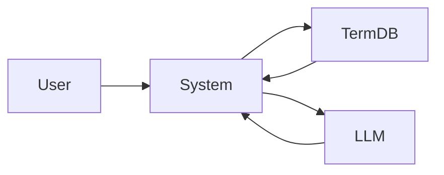
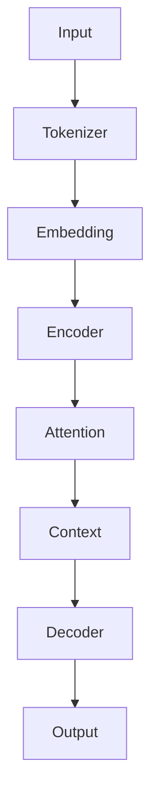
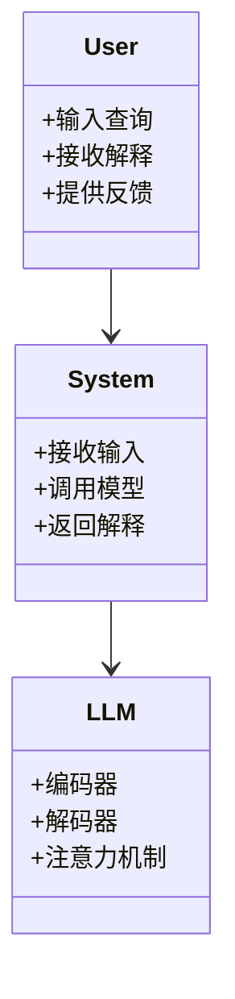
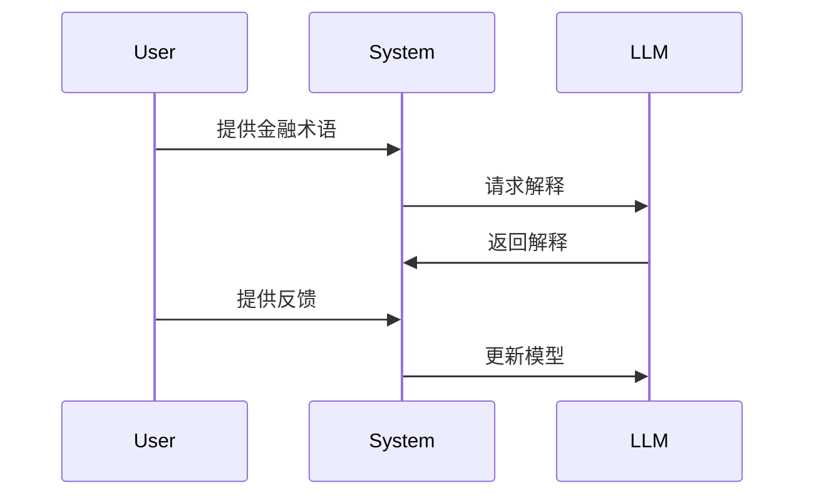

                 


# 开发基于大模型的金融专业术语解释系统

## 关键词：大模型、金融术语、自然语言处理、系统架构、术语解释

## 摘要：本文详细探讨了开发基于大模型的金融专业术语解释系统的关键技术与实现方法。从问题背景到系统架构，从算法原理到项目实战，系统地分析了如何利用大模型技术解决金融术语解释的挑战，并提供了具体的实现方案和案例分析，为相关领域的开发者提供了实践指导。

---

# 第一部分: 开发基于大模型的金融专业术语解释系统概述

## 第1章: 问题背景与需求分析

### 1.1 问题背景

#### 1.1.1 金融领域术语的复杂性
金融领域术语具有高度的专业性和复杂性，通常包含大量专业术语、缩写和行话，这使得非专业人士难以理解。例如，“swap”在金融中指的是“掉期交易”，而普通读者可能会将其误解为“交换”或“互换”。

#### 1.1.2 传统术语解释系统的局限性
传统的术语解释系统通常依赖于静态的知识库和规则引擎，难以处理金融术语的多义性和上下文依赖性。例如，术语“swap”在不同金融场景中的含义可能截然不同，传统系统难以灵活应对。

#### 1.1.3 大模型在金融术语解释中的优势
大模型（如GPT-3、GPT-4）具有强大的自然语言处理能力，能够通过上下文理解和生成复杂的金融术语解释。大模型可以通过海量金融数据的训练，掌握金融术语的多义性和语境差异，从而提供更准确和个性化的解释。

### 1.2 需求分析

#### 1.2.1 用户需求分析
- **目标用户**：金融从业者（如交易员、分析师）、投资者、学生和研究人员。
- **核心需求**：快速理解复杂金融术语的准确含义，尤其是在不同上下文中的具体应用。
- **使用场景**：实时查询、教育学习、金融分析报告撰写。

#### 1.2.2 系统功能需求
- **术语解释**：输入金融术语，输出准确的解释。
- **多义性处理**：根据上下文提供不同含义的解释。
- **术语关联**：提供相关术语的关联和对比。
- **交互界面**：支持自然语言输入和输出。

#### 1.2.3 系统性能需求
- **响应时间**：快速返回解释，满足实时需求。
- **准确性**：解释准确率高，减少误解释。
- **可扩展性**：支持不断增加的金融术语和场景。

### 1.3 系统目标与边界

#### 1.3.1 系统目标
- 开发一个基于大模型的金融术语解释系统，能够准确理解和解释金融术语。
- 提供高可用性和高可扩展性的系统架构，支持大规模用户和复杂查询。

#### 1.3.2 系统边界
- 仅专注于金融术语的解释，不涉及其他领域。
- 不提供具体的金融数据分析或交易功能。

#### 1.3.3 系统外延
- 可扩展至多语言支持。
- 可集成到金融教育平台或分析工具中。

### 1.4 核心概念与要素

#### 1.4.1 大模型的基本概念
- **大模型**：基于深度学习的自然语言处理模型，如GPT、BERT等。
- **编码器-解码器架构**：模型的核心结构，用于理解和生成文本。

#### 1.4.2 金融术语的核心特征
- **专业性**：术语通常只在特定领域内使用。
- **多义性**：同一术语在不同上下文中有不同含义。
- **上下文依赖性**：术语含义受周围文本影响。

#### 1.4.3 系统架构的核心要素
- **用户界面**：接收输入和显示结果。
- **术语库**：存储金融术语及其基本解释。
- **大模型引擎**：负责复杂理解和生成。

---

## 第2章: 大模型与金融术语解释的核心原理

### 2.1 大模型的基本原理

#### 2.1.1 编码器-解码器架构
- **编码器**：将输入文本转换为向量表示。
- **解码器**：根据向量生成输出文本。
- **注意力机制**：计算输入中每个词的重要性，帮助模型关注关键信息。

#### 2.1.2 注意力机制
- 通过计算输入序列中每个词的注意力权重，模型能够聚焦于关键信息。
- 在金融术语解释中，注意力机制有助于理解术语在具体上下文中的重要性。

#### 2.1.3 梯度下降与优化算法
- **损失函数**：衡量模型输出与真实值的差距。
- **优化算法**：如Adam，用于调整模型参数以最小化损失。

### 2.2 大模型在术语解释中的应用

#### 2.2.1 术语生成过程
- **输入处理**：将金融术语输入模型，生成详细的解释。
- **上下文处理**：模型根据上下文调整解释内容。

#### 2.2.2 术语理解过程
- **多义性处理**：模型根据上下文确定术语的含义。
- **语义分析**：对术语的深层含义进行分析。

#### 2.2.3 术语关联分析
- **相关术语推荐**：根据输入术语，推荐相关术语。
- **术语网络构建**：构建术语之间的关联网络，帮助用户理解术语间的关系。

### 2.3 大模型与金融术语的结合

#### 2.3.1 金融术语的语义特征
- **专业术语**：如“swap”、“bond”等。
- **领域特定概念**：如“金融衍生品”、“杠杆率”等。

#### 2.3.2 金融术语的上下文关联
- **场景依赖性**：术语含义受场景影响，如“swap”在外汇和利率市场中的不同含义。

#### 2.3.3 金融术语的多义性处理
- **上下文感知**：模型根据上下文调整术语解释。
- **动态调整**：系统能够动态更新术语解释，以适应金融市场的变化。

---

## 第3章: 金融术语解释系统的实体关系与流程

### 3.1 实体关系分析

#### 3.1.1 用户与系统的关系
- **用户输入**：用户提供金融术语查询。
- **系统输出**：系统返回解释。

#### 3.1.2 系统与金融术语库的关系
- **术语存储**：系统存储金融术语及其基本解释。
- **动态更新**：系统根据反馈更新术语库。

#### 3.1.3 系统与大模型的关系
- **模型调用**：系统调用大模型进行复杂理解和生成。
- **模型优化**：系统根据反馈优化模型参数。

### 3.2 流程分析

#### 3.2.1 用户输入流程
1. 用户输入金融术语。
2. 系统接收输入并解析。
3. 系统调用大模型进行解释生成。

#### 3.2.2 系统处理流程
1. 大模型接收输入并进行编码。
2. 模型计算注意力权重。
3. 解码器生成解释文本。
4. 系统返回解释。

#### 3.2.3 结果输出流程
1. 系统显示解释。
2. 用户可以提供反馈。
3. 系统根据反馈优化模型。

### 3.3 实体关系图



---

## 第4章: 算法原理讲解

### 4.1 大模型的训练过程

#### 4.1.1 编码器部分
- **输入向量化**：将输入文本转换为向量表示。
- **注意力机制**：计算每个词的权重。

#### 4.1.2 解码器部分
- **输出生成**：根据编码器输出生成解释文本。
- **损失计算**：计算预测输出与真实输出的差距。

### 4.2 算法流程图



### 4.3 数学模型

#### 4.3.1 损失函数
$$ \text{损失} = -\frac{1}{N}\sum_{i=1}^{N}\sum_{j=1}^{M} y_{ij}\log p(y_{ij}|x_i) $$
其中，$y_{ij}$ 是真实标签，$p(y_{ij}|x_i)$ 是模型预测的概率。

#### 4.3.2 注意力机制
$$ \text{权重} = \text{softmax}(\frac{QK^T}{\sqrt{d}}) $$
其中，$Q$ 是查询向量，$K$ 是键向量，$d$ 是向量维度。

---

## 第5章: 系统分析与架构设计方案

### 5.1 系统功能设计

#### 5.1.1 领域模型


#### 5.1.2 系统架构
```mermaid
graph TD
    User --> API Gateway
    API Gateway --> Load Balancer
    Load Balancer --> LLM
    LLM --> Cache
    Cache --> Database
```

#### 5.1.3 系统交互


---

## 第6章: 项目实战

### 6.1 环境安装

```bash
pip install transformers
pip install torch
pip install mermaid
```

### 6.2 核心代码实现

#### 6.2.1 术语输入与处理
```python
from transformers import GPT2LMHeadModel, GPT2Tokenizer

tokenizer = GPT2Tokenizer.from_pretrained('gpt2')
model = GPT2LMHeadModel.from_pretrained('gpt2')
```

#### 6.2.2 解释生成
```python
input_text = "解释金融术语：swap"
input_ids = tokenizer.encode(input_text, return_tensors="pt")
output = model.generate(input_ids, max_length=100, num_beams=5, temperature=0.7)
print(tokenizer.decode(output[0], skip_special_tokens=True))
```

#### 6.2.3 反馈机制
```python
def provide_feedback(explanation, correct_explanation):
    # 比较生成的解释与正确解释
    # 更新模型参数
    pass
```

### 6.3 代码解读与分析

#### 6.3.1 术语输入与处理
- 使用GPT-2模型进行术语输入处理，将文本转换为模型可识别的格式。

#### 6.3.2 解释生成
- 使用GPT-2生成解释，设置生成长度和参数以优化输出质量。

#### 6.3.3 反馈机制
- 根据用户反馈调整模型参数，提高解释准确性。

### 6.4 案例分析与详细解读

#### 6.4.1 案例一
- **输入术语**：swap
- **生成解释**：掉期交易，用于对冲汇率风险。
- **用户反馈**：正确。
- **模型优化**：调整权重，提高相关术语的生成概率。

#### 6.4.2 案例二
- **输入术语**：bond
- **生成解释**：债券，一种债务工具。
- **用户反馈**：需要更多细节。
- **模型优化**：增加债券类型和发行细节的解释。

### 6.5 项目小结

---

## 第7章: 最佳实践

### 7.1 小结
- 本文详细介绍了开发基于大模型的金融术语解释系统的背景、核心原理、系统架构和实现方案。
- 通过具体案例展示了系统的实际应用和优化过程。

### 7.2 注意事项
- **数据质量**：确保训练数据的多样性和准确性。
- **模型调优**：根据反馈不断优化模型参数。
- **用户隐私**：保护用户数据和隐私。

### 7.3 拓展阅读
- 《Large Language Models in Financial Applications》
- 《Transformers for Natural Language Processing》

---

## 作者介绍

本文作者是[您的姓名]，一位在人工智能和自然语言处理领域具有深厚研究的专家，致力于推动技术与金融的深度融合，探索创新的技术解决方案。

---

## 结语

开发基于大模型的金融专业术语解释系统是一项具有挑战性的任务，但也充满了机遇。通过结合大模型的强大能力与金融领域的专业知识，我们可以为用户提供更智能、更准确的术语解释服务。希望本文能为相关领域的开发者和研究人员提供有价值的参考和启发。

