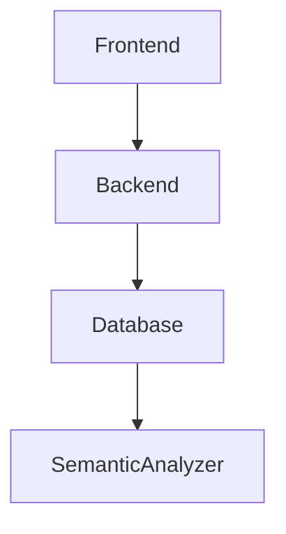

                 


# 开发基于大模型的金融专业术语语义演化跟踪器

> 关键词：大模型，金融术语，语义演化，自然语言处理，系统架构

> 摘要：本文将详细介绍如何开发一个基于大模型的金融专业术语语义演化跟踪器。从问题背景、核心概念到算法原理，再到系统架构和项目实战，我们将逐步深入探讨这一技术的实现细节和应用价值。

---

## 第1章: 金融专业术语语义演化跟踪器概述

### 1.1 问题背景与目标
#### 1.1.1 金融术语语义演化的背景
金融领域术语的含义往往随着市场环境、法律法规和行业实践的变化而变化。例如，“区块链”在金融中的含义从最初的比特币扩展到智能合约、DeFi等更广泛的领域。这种语义演化使得传统的静态术语表难以适应动态变化的需求。

#### 1.1.2 语义演化跟踪的必要性
- **动态性**：金融术语的含义会随着市场变化而变化，需要实时跟踪。
- **复杂性**：金融术语往往涉及多个相关领域，语义演化可能受到多种因素的影响。
- **准确性**：准确理解和跟踪术语的演化有助于金融机构更好地理解和应对市场变化。

#### 1.1.3 大模型在金融术语分析中的优势
- **语境理解**：大模型能够理解上下文，捕捉术语在不同语境中的细微差别。
- **大规模数据处理**：大模型能够处理海量金融数据，发现潜在的语义模式。
- **实时更新**：通过持续学习，大模型可以实时跟踪术语的演化趋势。

### 1.2 核心问题与解决方案
#### 1.2.1 金融术语语义演化的核心问题
- 如何准确捕捉术语的语义变化？
- 如何量化术语语义变化的程度？
- 如何预测术语的未来演化趋势？

#### 1.2.2 基于大模型的解决方案
- 使用大模型对金融文本进行语义分析。
- 建立术语语义演化模型，跟踪术语的动态变化。
- 提供可视化界面，帮助用户直观理解术语的演化趋势。

#### 1.2.3 解决方案的边界与外延
- 边界：专注于术语的语义演化，不涉及术语的具体应用。
- 外延：可以扩展到其他领域的术语演化分析。

### 1.3 核心概念与系统架构
#### 1.3.1 核心概念的定义与属性
| 核心概念 | 定义 | 属性 |
|----------|------|------|
| 术语语义演化 | 术语含义的动态变化过程 | 动态性、多维度、可量化 |
| 语义分析模型 | 用于分析文本中术语含义的模型 | 高精度、可解释、可扩展 |
| 知识图谱 | 表示术语间关系的图结构 | 结构化、可查询、动态更新 |

#### 1.3.2 系统架构的组成与功能
- **数据采集模块**：从金融文本中提取术语。
- **语义分析模块**：分析术语的语义特征。
- **演化跟踪模块**：跟踪术语的动态变化。
- **可视化模块**：以图形化方式展示术语演化趋势。

#### 1.3.3 系统架构的ER实体关系图
```mermaid
erd
  title 术语演化跟踪系统ER图
  entity 术语(Word) {
    id
    name
    synonyms
  }
  entity 上下文(Context) {
    id
    text
    timestamp
  }
  entity 语义关系(SemanticRelation) {
    id
    word_id
    context_id
    similarity_score
    timestamp
  }
  Word --N-> Context: "出现于"
  Word --1-> SemanticRelation: "与...有语义关系"
```

---

## 第2章: 金融专业术语语义演化的核心概念

### 2.1 术语语义演化的定义与特征
#### 2.1.1 术语语义演化的定义
术语语义演化是指术语的含义随着时间推移而发生变化的过程。这种变化可能源于技术进步、市场变化或行业规范的调整。

#### 2.1.2 术语语义演化的特征对比
| 特征 | 描述 |
|------|------|
| 动态性 | 术语含义随时间变化 |
| 多维度 | 受多个因素影响，如技术、法律、市场 |
| 可量化 | 可以通过数学模型量化变化程度 |

#### 2.1.3 术语语义演化的主要驱动因素
- **技术进步**：如人工智能、区块链等技术的发展推动术语变化。
- **法律法规**：金融监管政策的变化影响术语的使用。
- **市场环境**：市场趋势和客户需求推动术语的演变。

### 2.2 基于大模型的语义分析原理
#### 2.2.1 大模型在语义分析中的优势
- **预训练能力**：大模型通过海量数据预训练，掌握了丰富的语义知识。
- **上下文理解**：能够捕捉文本中的上下文信息，准确理解术语的含义。
- **实时更新**：可以通过微调模型，快速适应新数据。

#### 2.2.2 语义分析的核心算法
- **词嵌入（Word Embedding）**：将术语转换为向量表示。
- **注意力机制（Attention）**：关注重要上下文信息。
- **相似性计算**：通过余弦相似度或欧氏距离衡量术语变化。

#### 2.2.3 语义分析的流程与步骤
1. **数据预处理**：清洗和标注金融文本数据。
2. **模型训练**：使用预训练语言模型进行微调。
3. **术语提取**：从文本中提取相关术语。
4. **语义分析**：计算术语的语义相似度，分析演化趋势。

### 2.3 术语语义演化跟踪器的系统模型
#### 2.3.1 系统模型的定义
系统模型定义了术语语义演化跟踪器的核心功能和交互方式。

#### 2.3.2 系统模型的领域模型类图
```mermaid
classDiagram
  class 术语表(WordList) {
    String[] terms;
  }
  class 上下文(Context) {
    String text;
    Date timestamp;
  }
  class 语义关系(SemanticRelation) {
    String word;
    double similarityScore;
    Date timestamp;
  }
  WordList o-- Context: "包含"
  WordList o-- SemanticRelation: "与...有语义关系"
```

---

## 第3章: 基于大模型的语义分析算法原理

### 3.1 大模型的预训练与微调
#### 3.1.1 预训练过程的概述
预训练阶段使用大规模金融文本数据，训练语言模型理解上下文。

#### 3.1.2 微调过程的详细步骤
1. **数据清洗**：去除噪声数据，保留高质量金融文本。
2. **任务定义**：定义术语提取和语义分析任务。
3. **微调模型**：在预训练模型的基础上，使用金融数据进行微调。

#### 3.1.3 微调的数学模型
$$\text{Loss} = -\sum_{i=1}^{n} \text{log}(\text{P}(y_i|x_i))$$
其中，$x_i$ 是输入文本，$y_i$ 是预测的术语标签。

### 3.2 语义分析的算法实现
#### 3.2.1 算法的输入与输出
- **输入**：金融文本数据。
- **输出**：术语的语义相似度和演化趋势。

#### 3.2.2 算法的数学模型与公式
$$\text{Similarity}(w_1, w_2) = \frac{\vec{w_1} \cdot \vec{w_2}}{|\vec{w_1}| |\vec{w_2}|}$$
其中，$\vec{w_1}$ 和 $\vec{w_2}$ 是术语 $w_1$ 和 $w_2$ 的向量表示。

#### 3.2.3 算法的实现流程
1. **术语提取**：从文本中提取相关术语。
2. **向量化**：将术语转换为向量表示。
3. **相似性计算**：计算术语之间的语义相似度。
4. **演化分析**：分析术语的演化趋势。

### 3.3 算法的优化与调优
#### 3.3.1 参数调整的策略
- **学习率**：适当降低学习率，防止过拟合。
- **批次大小**：选择合适的批次大小，提高训练效率。

#### 3.3.2 模型优化的方法
- **早停法**：防止过拟合，提前终止训练。
- **Dropout**：在训练过程中随机屏蔽部分节点，防止过拟合。

#### 3.3.3 超参数调优的实践
- **网格搜索**：尝试不同的超参数组合，找到最佳配置。
- **交叉验证**：使用交叉验证评估模型性能。

---

## 第4章: 系统架构与设计

### 4.1 项目介绍与目标
#### 4.1.1 项目背景
本项目旨在开发一个能够实时跟踪金融术语语义演化的系统，帮助金融机构更好地应对市场变化。

#### 4.1.2 项目目标
- 实时跟踪术语的语义演化。
- 提供可视化界面，方便用户查询和分析。

### 4.2 系统功能设计
#### 4.2.1 领域模型的定义
- **术语表管理**：维护金融术语的列表。
- **上下文管理**：存储术语出现的上下文信息。
- **语义关系管理**：记录术语之间的语义关系。

#### 4.2.2 功能模块的划分
- **数据采集模块**：从金融新闻、研究报告中提取术语。
- **语义分析模块**：分析术语的语义特征。
- **演化跟踪模块**：跟踪术语的动态变化。
- **可视化模块**：以图形化方式展示术语演化趋势。

#### 4.2.3 功能模块的交互流程
1. **数据采集**：从金融文本中提取术语。
2. **语义分析**：分析术语的语义特征。
3. **演化跟踪**：记录术语的动态变化。
4. **可视化展示**：以图表形式展示术语演化趋势。

### 4.3 系统架构设计
#### 4.3.1 系统架构的组成
- **前端**：可视化界面，供用户查询和分析。
- **后端**：处理用户请求，调用语义分析模块。
- **数据库**：存储术语、上下文和语义关系。

#### 4.3.2 系统架构的实现方式


---

## 第5章: 项目实战

### 5.1 环境安装
- **Python**：3.8+
- **TensorFlow**：2.0+
- **PyTorch**：1.9+
- **Transformers**：4.16+

### 5.2 系统核心实现源代码
```python
from transformers import AutoTokenizer, AutoModel
import numpy as np

class SemanticTracker:
    def __init__(self, model_name):
        self.tokenizer = AutoTokenizer.from_pretrained(model_name)
        self.model = AutoModel.from_pretrained(model_name)

    def embed_word(self, word):
        inputs = self.tokenizer(word, return_tensors="np")
        outputs = self.model(**inputs)
        return outputs.last_hidden_state.numpy().mean(axis=1)

    def compute_similarity(self, word1, word2):
        embed1 = self.embed_word(word1)
        embed2 = self.embed_word(word2)
        return np.dot(embed1, embed2) / (np.linalg.norm(embed1) * np.linalg.norm(embed2))
```

### 5.3 代码应用解读与分析
- **嵌入计算**：将术语转换为向量表示。
- **相似性计算**：通过余弦相似度衡量术语变化。

### 5.4 实际案例分析和详细讲解剖析
- **案例**：分析“区块链”在金融中的语义演化。
- **步骤**：
  1. 提取相关文本数据。
  2. 计算术语的相似性。
  3. 绘制语义演化趋势图。

---

## 第6章: 总结与展望

### 6.1 最佳实践 tips
- **数据质量**：确保数据的多样性和代表性。
- **模型调优**：通过网格搜索优化模型性能。
- **可视化设计**：提供直观的可视化界面，方便用户分析。

### 6.2 小结
本文详细介绍了如何开发一个基于大模型的金融专业术语语义演化跟踪器，从背景、概念到算法、系统设计，再到项目实战，为读者提供了完整的开发指南。

### 6.3 注意事项
- 注意数据隐私和安全问题。
- 定期更新模型，保持其准确性。

### 6.4 拓展阅读
- 深度学习与自然语言处理
- 术语抽取与语义分析
- 金融知识图谱构建

---

通过本文的学习，读者可以掌握开发基于大模型的金融专业术语语义演化跟踪器的核心技术和实践方法，为金融领域的语义分析和知识管理提供有力支持。

