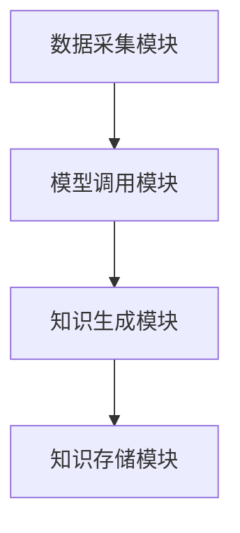

                 


# 开发基于大模型的金融专业知识图谱动态更新系统

> 关键词：知识图谱、大模型、动态更新、金融领域、系统架构

> 摘要：本文详细探讨了基于大模型的金融专业知识图谱动态更新系统的开发方法。文章从背景和概念入手，深入分析了知识图谱与大模型的核心原理，详细阐述了动态更新算法的实现过程，并结合系统架构设计和项目实战，展示了如何将理论应用于实践。文章还总结了开发中的最佳实践和注意事项，为读者提供了全面的技术指导。

---

# 第1章: 金融专业知识图谱动态更新系统概述

## 1.1 问题背景与描述

### 1.1.1 金融领域的知识图谱需求
随着金融市场的快速发展，金融机构需要快速理解和处理海量的金融数据。知识图谱作为一种结构化的知识表示方法，能够帮助金融机构更好地管理和分析数据。

### 1.1.2 知识图谱动态更新的必要性
金融市场的信息变化迅速，知识图谱需要动态更新以反映最新的市场变化。动态更新机制能够确保知识图谱的准确性和时效性。

### 1.1.3 大模型在金融知识图谱中的应用前景
大模型（如GPT、BERT等）具有强大的语义理解和生成能力，能够有效支持知识图谱的构建和更新。

## 1.2 问题解决与边界

### 1.2.1 知识图谱动态更新的核心问题
知识图谱的动态更新需要解决数据异构性、更新频率和更新效率等问题。

### 1.2.2 系统的边界与外延
系统边界包括数据输入、模型训练和更新结果输出。外延则包括数据源的多样性和模型的可扩展性。

### 1.2.3 核心要素与组成结构
知识图谱动态更新系统的核心要素包括数据源、大模型、更新算法和知识图谱存储。

## 1.3 核心概念与联系

### 1.3.1 知识图谱的构建原理
知识图谱通过实体和关系的抽取，将金融领域的信息结构化表示。

### 1.3.2 大模型在知识图谱中的作用
大模型能够从文本中提取实体和关系，并生成新的知识，支持知识图谱的构建和更新。

### 1.3.3 动态更新机制的实现方式
动态更新机制通过检测数据变化，触发知识图谱的更新，并通过大模型生成新的知识。

## 1.4 本章小结
本章介绍了金融专业知识图谱动态更新系统的背景、核心问题和解决方案，为后续章节奠定了基础。

---

# 第2章: 知识图谱与大模型的核心概念

## 2.1 知识图谱的基本原理

### 2.1.1 知识图谱的定义与特点
知识图谱是一种结构化的知识表示方法，具有语义丰富、可扩展性强的特点。

### 2.1.2 知识图谱的构建流程
知识图谱的构建包括数据获取、实体识别、关系抽取和知识融合等步骤。

### 2.1.3 知识图谱的存储与表示
知识图谱通常使用图数据库进行存储，并通过RDF或JSON-LD等格式表示。

## 2.2 大模型的基本原理

### 2.2.1 大模型的定义与特点
大模型是一种基于深度学习的生成模型，具有强大的语义理解和生成能力。

### 2.2.2 大模型的训练与优化
大模型通过大量的金融文本数据进行预训练，并通过微调优化特定领域的性能。

### 2.2.3 大模型的推理与生成
大模型能够根据输入的上下文生成相关的金融信息，支持知识图谱的构建和更新。

## 2.3 动态更新机制的核心原理

### 2.3.1 动态更新的定义与特点
动态更新机制能够实时检测金融数据的变化，并自动触发知识图谱的更新。

### 2.3.2 动态更新的触发条件
触发条件包括新的金融事件、市场数据变化和用户查询需求等。

### 2.3.3 动态更新的实现方式
动态更新可以通过增量学习、在线更新和事件驱动等方式实现。

## 2.4 核心概念的对比与联系

### 2.4.1 知识图谱与大模型的对比分析
知识图谱强调结构化的知识表示，而大模型强调语义理解和生成能力。

### 2.4.2 动态更新机制与知识图谱的结合
动态更新机制通过大模型生成新的知识，实时更新知识图谱。

## 2.5 本章小结
本章详细讲解了知识图谱、大模型和动态更新机制的核心概念及其联系，为后续的算法实现奠定了理论基础。

---

# 第3章: 大模型驱动的知识图谱动态更新算法原理

## 3.1 知识图谱动态更新的算法框架

### 3.1.1 算法的整体流程
知识图谱动态更新的流程包括数据获取、模型调用、知识生成和更新存储。

### 3.1.2 算法的输入与输出
输入包括金融文本数据，输出包括更新后的知识图谱。

### 3.1.3 算法的优化方向
优化方向包括提高更新效率、降低计算成本和增强生成准确性。

## 3.2 大模型在动态更新中的应用

### 3.2.1 大模型的特征提取
大模型能够从金融文本中提取关键实体和关系特征。

### 3.2.2 大模型的语义理解
大模型能够理解金融文本的语义，并生成相关的知识。

### 3.2.3 大模型的推理与生成
大模型能够根据上下文进行推理，并生成新的知识。

## 3.3 动态更新算法的数学模型

### 3.3.1 损失函数
损失函数用于衡量生成知识与实际知识的差异：
$$ L = \sum_{i=1}^{n} (y_i - \hat{y}_i)^2 $$

### 3.3.2 优化算法
优化算法采用Adam优化器：
$$ \theta_{t+1} = \theta_t - \eta \nabla L $$

## 3.4 本章小结
本章详细讲解了大模型驱动的知识图谱动态更新算法，包括算法框架、大模型的应用和数学模型的实现。

---

# 第4章: 系统架构设计与实现

## 4.1 系统架构设计

### 4.1.1 问题场景介绍
系统需要支持金融机构实时更新知识图谱，满足快速响应的业务需求。

### 4.1.2 系统功能设计
系统功能包括数据采集、模型调用、知识生成和知识存储。

### 4.1.3 系统架构图


## 4.2 接口设计与交互

### 4.2.1 接口设计
系统提供API接口，支持外部数据源的接入和知识图谱的查询。

### 4.2.2 交互设计
用户通过API调用系统功能，系统返回更新后的知识图谱。

## 4.3 系统实现

### 4.3.1 环境安装
需要安装Python、TensorFlow和Neo4j等工具。

### 4.3.2 核心代码实现
```python
def update_knowledge_graph():
    # 获取最新金融数据
    data = fetch_financial_data()
    # 调用大模型生成新知识
    new_knowledge = model.generate(data)
    # 更新知识图谱
    graph.update(new_knowledge)
```

## 4.4 本章小结
本章详细讲解了系统架构设计和实现过程，包括功能模块的设计、接口交互和代码实现。

---

# 第5章: 项目实战与案例分析

## 5.1 项目实战

### 5.1.1 环境安装
安装必要的Python库和工具，如TensorFlow、Neo4j和Flask。

### 5.1.2 核心代码实现
```python
from flask import Flask
from neo4j import GraphDatabase

app = Flask(__name__)
driver = GraphDatabase.driver("neo4j://localhost:7687")

@app.route("/update_knowledge", methods=["POST"])
def update_knowledge():
    data = request.json
    # 调用大模型生成新知识
    new_knowledge = model.generate(data)
    # 更新知识图谱
    graph.update(new_knowledge)
    return "Knowledge updated successfully"

if __name__ == "__main__":
    app.run()
```

### 5.1.3 代码解读与分析
代码实现了一个基于Flask的Web服务，接收金融数据，调用大模型生成新知识，并更新知识图谱。

## 5.2 案例分析

### 5.2.1 案例背景
假设一家金融机构需要实时更新其知识图谱，以反映最新的市场动态。

### 5.2.2 实际应用分析
通过系统的动态更新机制，金融机构能够快速响应市场变化，提高决策的准确性。

## 5.3 本章小结
本章通过项目实战和案例分析，展示了如何将理论应用于实际，帮助读者更好地理解系统的实现过程。

---

# 第6章: 最佳实践与注意事项

## 6.1 最佳实践

### 6.1.1 数据质量控制
确保数据的准确性和完整性，避免噪声数据的干扰。

### 6.1.2 模型优化
通过微调和参数调整，提高模型的生成准确性和效率。

### 6.1.3 系统性能优化
优化系统的计算效率，降低资源消耗。

## 6.2 小结
总结全文的核心内容，强调大模型在金融知识图谱动态更新中的重要性。

## 6.3 注意事项
在实际应用中，需要注意数据隐私、模型安全和系统稳定性等问题。

## 6.4 拓展阅读
推荐相关领域的书籍和论文，供读者进一步学习。

---

# 附录

## 附录A: 常用工具与库

- Python
- TensorFlow
- Neo4j
- Flask

## 附录B: 代码示例

```python
def update_knowledge_graph():
    data = fetch_financial_data()
    new_knowledge = model.generate(data)
    graph.update(new_knowledge)
```

---

# 结束语

通过本文的学习，读者能够全面了解基于大模型的金融专业知识图谱动态更新系统的开发方法，并能够将其应用于实际项目中。希望本文对读者有所帮助，激发更多的思考和实践。

--- 

# THE END

