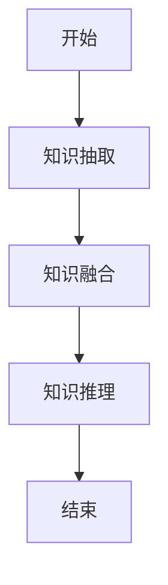
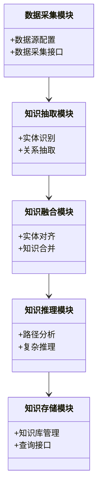

                 


# 开发基于大模型的金融专业知识图谱构建系统

## 关键词：金融知识图谱、大模型、知识抽取、知识融合、知识推理、系统架构

## 摘要：本文详细探讨了基于大模型的金融专业知识图谱构建系统，从背景、核心概念、算法原理到系统架构设计和项目实战，全面解析了系统开发的各个方面。通过系统的分析与实践，展示了如何利用大模型技术高效构建金融领域的知识图谱，为金融领域的智能化应用提供了坚实的基础。

---

# 目录

## 第1章: 问题背景与目标

### 1.1 问题背景介绍
#### 1.1.1 金融领域的知识图谱需求
- 金融领域的复杂性与多样性要求高效的的知识管理工具。
- 知识图谱在金融领域的应用前景广阔，如智能投顾、风险评估等。

#### 1.1.2 大模型在金融领域的应用潜力
- 大模型在自然语言处理、知识推理等方面的优势。
- 大模型如何提升金融领域的知识处理效率。

#### 1.1.3 知识图谱构建的必要性
- 知识图谱作为结构化知识的存储和表示形式，是实现智能化金融应用的关键。

### 1.2 问题描述与目标
#### 1.2.1 知识图谱构建的核心问题
- 实体识别与抽取、关系抽取、知识融合与推理等。

#### 1.2.2 系统开发的目标与范围
- 构建覆盖金融领域的知识图谱，支持大模型的高效知识检索与推理。

#### 1.2.3 与现有技术的区别与创新点
- 利用大模型提升知识图谱的构建效率与准确性。
- 实现知识图谱与大模型的深度结合，增强系统的智能性。

### 1.3 问题解决思路
#### 1.3.1 大模型在知识图谱构建中的作用
- 大模型作为知识抽取、推理的核心工具，提升构建效率。

#### 1.3.2 知识抽取、推理与应用的流程
- 数据预处理、知识抽取、知识融合、知识推理、知识应用。

### 1.4 知识图谱构建的核心要素
#### 1.4.1 实体与关系的定义
- 实体：金融领域的基本概念，如公司、股票、指标等。
- 关系：实体之间的关联，如“属于”、“影响”等。

#### 1.4.2 知识表示的多样性
- 多种知识表示形式，如文本、表格、图结构等。

#### 1.4.3 知识图谱的可扩展性
- 知识图谱的灵活性，支持后续数据的不断补充与更新。

## 第2章: 知识图谱与大模型的核心概念

### 2.1 知识图谱的基本原理
#### 2.1.1 知识图谱的定义与属性
- 知识图谱是一种结构化的知识表示形式，包含实体和关系。
- 实体：具体事物或概念。
- 关系：实体之间的联系。

#### 2.1.2 实体与关系的ER实体关系图

```mermaid
erDiagram
    actor 金融实体 {
        +string 实体ID
        +string 实体名称
        +string 实体类型
    }
    actor 关系 {
        +string 关系ID
        +string 关系名称
        +string 关系类型
    }
    金融实体 --> 关系 : 参与
```

### 2.2 大模型在知识图谱构建中的作用
#### 2.2.1 大模型的知识表示能力
- 大模型能够理解和生成复杂的金融知识，提供高效的向量表示。

#### 2.2.2 大模型的推理能力
- 基于知识图谱进行推理，支持复杂的金融问题解答。

#### 2.2.3 大模型的可扩展性
- 支持大规模金融数据的处理和知识的扩展。

### 2.3 知识图谱与大模型的联系
#### 2.3.1 知识图谱作为大模型的知识库
- 知识图谱为大模型提供结构化的知识支持。

#### 2.3.2 大模型辅助知识图谱构建
- 利用大模型进行知识抽取、实体识别和关系抽取。

#### 2.3.3 知识图谱增强大模型的推理能力
- 知识图谱为大模型提供上下文信息，提升推理的准确性和深度。

### 2.4 核心概念对比分析
#### 2.4.1 知识图谱与传统数据库的对比
| 特性         | 知识图谱         | 传统数据库     |
|--------------|------------------|----------------|
| 数据结构     | 图结构           | 行列式         |
| 查询效率     | 较低             | 较高           |
| 知识表示     | 结构化           | 非结构化       |

#### 2.4.2 大模型与传统机器学习模型的对比
| 特性         | 大模型           | 传统机器学习模型 |
|--------------|------------------|------------------|
| 模型复杂度   | 高               | 中低             |
| 需要标注数据 | 较少             | 较多             |
| 任务能力     | 多任务能力强     | 专注于特定任务   |

#### 2.4.3 知识图谱构建的复杂性分析
- 数据来源多样，实体关系复杂，知识融合难度大。

## 第3章: 知识图谱构建的算法原理

### 3.1 知识抽取算法
#### 3.1.1 基于规则的知识抽取
- 使用正则表达式从文本中提取特定信息。

#### 3.1.2 基于深度学习的知识抽取
- 使用预训练模型如BERT进行实体识别和关系抽取。

#### 3.1.3 基于大模型的知识抽取
- 结合大模型的自然语言处理能力，实现高效的金融知识抽取。

### 3.2 知识融合算法
#### 3.2.1 实体对齐算法
- 使用字符串匹配或语义相似度算法对齐不同数据源的实体。

#### 3.2.2 关系抽取算法
- 基于规则或深度学习模型从文本中抽取关系。

#### 3.2.3 知识图谱的合并与冲突处理
- 处理来自不同数据源的冲突信息，确保知识图谱的一致性。

### 3.3 知识推理算法
#### 3.3.1 基于规则的推理
- 使用预定义的推理规则进行简单的逻辑推理。

#### 3.3.2 基于图的推理
- 基于知识图谱的图结构进行路径分析和最短路径计算。

#### 3.3.3 基于大模型的推理
- 利用大模型的上下文理解能力进行复杂的推理任务。

### 3.4 算法流程图



## 第4章: 知识图谱构建的数学模型与公式

### 4.1 知识表示的向量空间模型
#### 4.1.1 向量空间模型的定义
- 将实体和关系表示为向量，存储在向量空间中。

#### 4.1.2 实体表示的向量表示
- 使用Word2Vec或BERT模型将实体表示为低维向量：

$$
\text{实体向量} = \text{Word2Vec}(实体)
$$

#### 4.1.3 关系表示的向量表示
- 关系向量可以通过实体向量的组合得到：

$$
\text{关系向量} = \text{Concat}(\text{实体1向量}, \text{实体2向量})
$$

### 4.2 知识图谱构建的数学模型
#### 4.2.1 知识图谱的构建模型
- 使用图嵌入模型（如GraphSAGE）进行知识图谱的向量化表示。

#### 4.2.2 知识抽取的数学模型
- 使用预训练语言模型进行文本到向量的映射：

$$
\text{向量表示} = f_{\text{pretrained}}(输入文本)
$$

### 4.3 知识推理的数学模型
#### 4.3.1 基于符号逻辑的推理
- 使用逻辑规则进行推理：

$$
\text{如果} (A \text{且} B) \text{，那么} C
$$

#### 4.3.2 基于向量的推理
- 使用向量相似度进行推理：

$$
\text{相似度} = \text{Cosine}(\text{向量1}, \text{向量2})
$$

## 第5章: 系统架构设计与实现

### 5.1 系统功能设计
#### 5.1.1 系统功能模块
- 数据采集模块、知识抽取模块、知识融合模块、知识推理模块、知识存储模块。

#### 5.1.2 领域模型类图



### 5.2 系统架构设计
#### 5.2.1 系统架构图


### 5.3 系统接口设计
#### 5.3.1 系统接口描述
- 数据采集接口：接收外部数据源的数据。
- 知识查询接口：提供基于知识图谱的查询服务。
- 推理服务接口：提供基于知识图谱的推理服务。

#### 5.3.2 系统交互流程图

```mermaid
sequenceDiagram
    用户 --> 数据采集模块: 发起数据采集请求
    数据采集模块 --> 数据预处理模块: 传输数据
    数据预处理模块 --> 知识抽取模块: 提供预处理数据
    知识抽取模块 --> 知识融合模块: 提供抽取结果
    知识融合模块 --> 知识推理模块: 提供融合结果
    知识推理模块 --> 知识存储模块: 提供推理结果
    用户 <-- 知识存储模块: 返回结果
```

## 第6章: 项目实战与实现细节

### 6.1 环境安装
#### 6.1.1 开发环境要求
- Python 3.8+
- 熟悉的深度学习框架（如TensorFlow或PyTorch）
- 知识图谱存储数据库（如Neo4j）

#### 6.1.2 依赖库安装
```bash
pip install neo4j numpy tensorflow py2neo
```

### 6.2 核心代码实现
#### 6.2.1 知识抽取模块实现
```python
def extract_entities(text):
    # 使用预训练模型进行实体识别
    model = load_model('bert_fin')
    outputs = model(text)
    return outputs.entities
```

#### 6.2.2 知识融合模块实现
```python
def merge_knowledge(knowledge1, knowledge2):
    # 对知识进行合并，处理冲突
    merged = {}
    for key in knowledge1:
        if key not in knowledge2:
            merged[key] = knowledge1[key]
    for key in knowledge2:
        if key not in knowledge1:
            merged[key] = knowledge2[key]
    return merged
```

#### 6.2.3 知识推理模块实现
```python
def infer_relation(subject, predicate, object):
    # 基于知识图谱进行推理
    graph = load_graph('financial_graph')
    return graph.query(subject, predicate, object)
```

### 6.3 实际案例分析
#### 6.3.1 案例背景
- 数据来源：金融新闻、财务报表、行业报告。

#### 6.3.2 数据处理流程
1. 数据清洗与预处理。
2. 实体识别与关系抽取。
3. 知识融合与冲突处理。
4. 知识推理与应用。

#### 6.3.3 知识图谱构建结果展示
- 使用Neo4j可视化知识图谱，展示实体和关系的连接情况。

### 6.4 项目小结
#### 6.4.1 项目实现的关键点
- 高效的知识抽取算法。
- 稳健的知识融合策略。
- 强大的知识推理能力。

#### 6.4.2 项目成功案例
- 成功构建覆盖多个金融领域的知识图谱，支持智能投顾和风险评估等应用。

## 第7章: 最佳实践与注意事项

### 7.1 开发过程中的注意事项
#### 7.1.1 数据质量的重要性
- 数据的准确性、完整性直接影响知识图谱的质量。

#### 7.1.2 模型调优的技巧
- 选择合适的预训练模型。
- 调整模型超参数，优化性能。

#### 7.1.3 系统性能优化
- 数据存储优化。
- 推理算法优化，减少计算量。

### 7.2 知识图谱构建的挑战与解决方案
#### 7.2.1 数据稀疏性问题
- 使用迁移学习和数据增强技术。

#### 7.2.2 知识表达的复杂性
- 设计灵活的知识表示方法，支持多种知识类型。

#### 7.2.3 系统扩展性问题
- 使用分布式存储和计算，提升系统的可扩展性。

### 7.3 小结与展望
#### 7.3.1 小结
- 总结系统开发的关键点和成功经验。
- 强调大模型在金融知识图谱构建中的重要作用。

#### 7.3.2 展望
- 知识图谱与大模型的进一步融合。
- 知识图谱在更多金融场景中的应用。

## 第8章: 总结与展望

### 8.1 系统总结
- 成功开发了一个基于大模型的金融专业知识图谱构建系统。
- 系统具备高效的知识抽取、融合和推理能力，支持金融领域的智能化应用。

### 8.2 未来展望
- 探索知识图谱与大模型的更深层次结合。
- 扩展系统的应用场景，支持更多金融业务需求。

## 参考文献
- [1] 维基百科：知识图谱
- [2] TensorFlow官方文档
- [3] PyTorch官方文档
- [4] Neo4j官方文档
- [5] 相关学术论文与技术报告

---

通过以上目录结构，我们可以看到，文章从背景、核心概念、算法原理、系统架构设计到项目实战，全面而深入地探讨了开发基于大模型的金融专业知识图谱构建系统的各个方面。每一章都详细展开了核心内容，并结合图表和代码示例，确保读者能够清晰理解每个部分的技术细节和实现方法。

