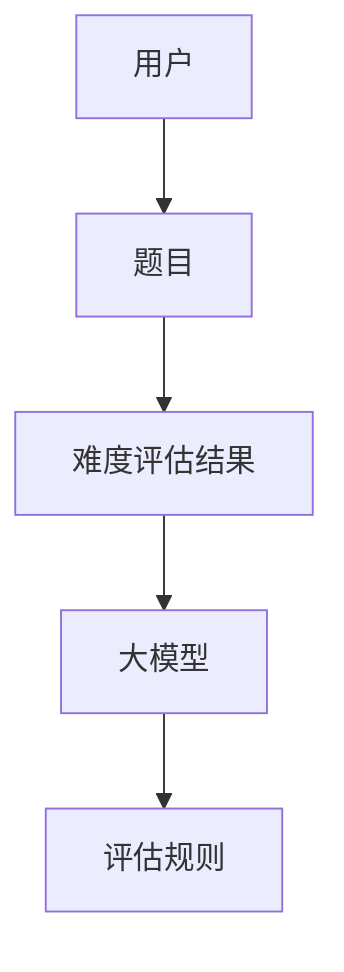
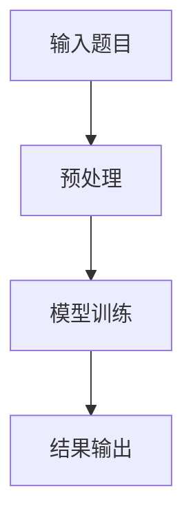
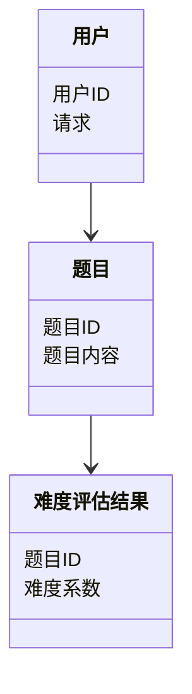
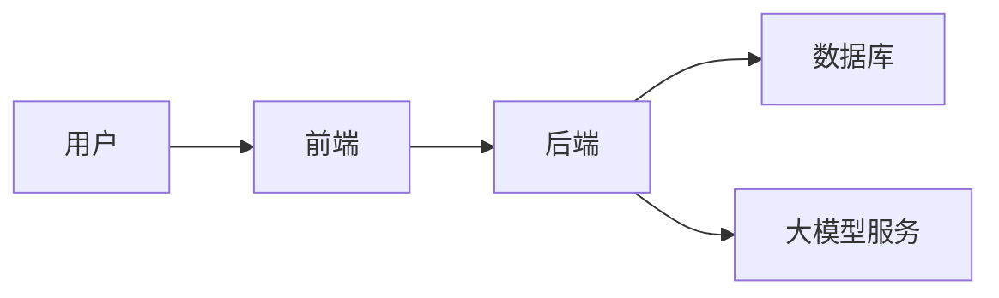
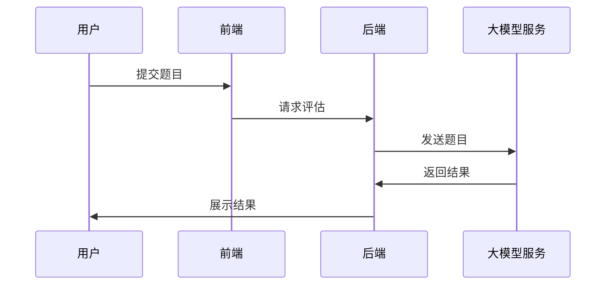

                 


# 开发基于大模型的金融专业考试题目难度评估系统

**关键词：** 大模型、金融考试、题目难度评估、自然语言处理、系统架构设计

**摘要：**  
本文详细探讨了开发基于大模型的金融专业考试题目难度评估系统的关键技术与实现方案。通过分析传统评估方法的局限性，提出了基于大模型的创新解决方案，并从系统架构设计、算法原理、项目实战等多个维度展开深入讨论。本文旨在为金融教育领域提供一种高效、智能的题目难度评估方法，同时为类似系统的开发提供参考。

---

# 第1章 背景介绍

## 1.1 问题背景

### 1.1.1 金融考试题目难度评估的重要性  
在金融教育领域，考试题目难度的科学评估是确保教学质量和学生能力提升的关键。传统评估方法依赖人工经验，存在主观性强、效率低、成本高等问题。随着人工智能技术的快速发展，基于大模型的自动化评估方法逐渐成为研究热点。

### 1.1.2 当前评估系统的主要挑战  
1. **主观性**：传统评估方法依赖人工经验，难以量化。  
2. **效率低**：人工评估耗时长，难以满足大规模考试的需求。  
3. **数据不足**：现有数据不足以支持复杂的模型训练。  

### 1.1.3 基于大模型的解决方案  
通过引入大模型技术，可以实现对金融考试题目难度的自动化、精准评估。大模型具备强大的自然语言处理能力，能够从题目文本中提取关键特征，从而实现客观、高效的评估。

## 1.2 问题描述

### 1.2.1 传统评估方法的局限性  
传统评估方法主要依赖教师的经验判断，缺乏数据支持，容易受到主观因素的影响。此外，人工评估难以应对大规模考试的需求。

### 1.2.2 基于大模型的评估优势  
基于大模型的评估系统能够快速处理大量题目数据，提取关键特征，并结合统计学方法，实现精准的难度评估。

### 1.2.3 系统目标与预期效果  
系统的目标是开发一个基于大模型的金融专业考试题目难度评估系统，实现以下功能：  
1. 题目难度的自动评估；  
2. 题目特征的智能提取；  
3. 评估结果的可视化展示。  

## 1.3 问题解决

### 1.3.1 大模型在金融领域的应用潜力  
大模型在金融领域的应用潜力主要体现在自然语言处理、知识表示和自动化决策等方面。这些能力为金融考试题目难度评估提供了技术支持。

### 1.3.2 系统设计的核心思路  
1. **数据收集**：收集大量金融考试题目数据；  
2. **模型训练**：基于大模型进行微调，训练题目难度评估模型；  
3. **系统集成**：将模型集成到评估系统中，实现自动化评估。

### 1.3.3 技术实现的关键点  
1. 数据预处理：对题目文本进行清洗和标注；  
2. 模型选择：选择适合的开源大模型进行微调；  
3. 评估指标：设计合适的评估指标，如准确率、召回率等。

## 1.4 边界与外延

### 1.4.1 系统功能的边界  
系统仅针对金融专业考试题目进行难度评估，不涉及其他类型考试。

### 1.4.2 系统应用的外延  
系统可扩展应用于其他领域的考试题目评估，如法律、医学等。

### 1.4.3 系统与其他系统的接口关系  
系统需要与考试管理系统、数据存储系统等进行接口对接。

## 1.5 核心要素组成

### 1.5.1 系统组成模块  
1. 数据采集模块：负责采集金融考试题目数据；  
2. 数据处理模块：对数据进行清洗和标注；  
3. 模型训练模块：基于大模型进行微调；  
4. 评估模块：实现题目难度评估；  
5. 结果展示模块：可视化评估结果。

### 1.5.2 各模块之间的关系  
数据采集模块将题目数据传递给数据处理模块，处理后的数据用于模型训练模块进行微调。模型训练完成后，评估模块利用模型对新题目进行评估，并将结果传递给结果展示模块。

### 1.5.3 核心算法与技术选型  
1. 大模型选择：选择开源的大模型，如BERT；  
2. 微调策略：采用迁移学习对模型进行微调；  
3. 评估指标：准确率、召回率、F1值等。

---

# 第2章 核心概念与联系

## 2.1 核心概念原理

### 2.1.1 大模型的基本原理  
大模型通过大量的金融文本数据进行预训练，掌握了金融领域的知识和语言模式。通过微调，模型能够适应特定任务的需求。

### 2.1.2 题目难度评估的核心算法  
基于大模型的题目难度评估算法主要分为以下步骤：  
1. 对题目文本进行特征提取；  
2. 利用预训练模型对特征进行编码；  
3. 结合统计学方法对难度进行预测。

### 2.1.3 系统的整体架构  
系统整体架构包括数据采集、数据处理、模型训练、评估和结果展示五个模块。

## 2.2 概念属性特征对比表格

| 特征         | 传统评估方法 | 基于大模型的评估方法 |
|--------------|--------------|-----------------------|
| 主观性       | 高           | 低                   |
| 效率         | 低           | 高                   |
| 数据需求     | 少           | 多                   |
| 精度         | 低           | 高                   |
| 适用范围     | 有限         | 广泛                 |

## 2.3 ER实体关系图



---

# 第3章 算法原理讲解

## 3.1 算法流程



## 3.2 算法实现代码

```python
import transformers

def preprocess(text):
    tokenizer = transformers.BertTokenizer.from_pretrained('bert-base-uncased')
    inputs = tokenizer(text, return_tensors='np')
    return inputs

def train_model(model, data):
    optimizer = transformers.AdamW(model.parameters(), lr=1e-5)
    loss_fn = transformers.CrossEntropyLoss()
    for batch in data:
        outputs = model(**batch)
        loss = loss_fn(outputs.logits, batch['labels'])
        loss.backward()
        optimizer.step()
    return model

def evaluate Difficulty(model, text):
    inputs = preprocess(text)
    outputs = model(**inputs)
    predicted_label = outputs.logits.argmax(-1).item()
    return predicted_label
```

## 3.3 数学模型

### 难度系数计算公式  
$$难度系数 = \frac{\text{模型预测结果}}{\text{题目总数}}$$  

---

# 第4章 系统分析与架构设计方案

## 4.1 问题场景介绍  
系统需要处理金融考试题目数据，评估每道题的难度，并将结果反馈给用户。

## 4.2 项目介绍  
本项目旨在开发一个基于大模型的金融考试题目难度评估系统，实现自动化、高效的评估。

## 4.3 系统功能设计

### 领域模型mermaid类图  


## 4.4 系统架构设计

### 系统架构mermaid图  


## 4.5 系统接口设计  
1. 用户通过前端提交题目；  
2. 前端将请求发送到后端；  
3. 后端调用大模型服务进行评估；  
4. 评估结果存储到数据库，并返回给用户。

## 4.6 系统交互mermaid序列图  


---

# 第5章 项目实战

## 5.1 环境安装  
1. 安装Python和相关库；  
2. 下载开源大模型（如BERT）。

## 5.2 系统核心实现源代码  
```python
from transformers import BertForSequenceClassification, BertTokenizer
import torch

# 加载预训练模型
model = BertForSequenceClassification.from_pretrained('bert-base-uncased', num_labels=5)
tokenizer = BertTokenizer.from_pretrained('bert-base-uncased')

# 定义训练函数
def train_model(model, tokenizer, train_data):
    optimizer = torch.optim.AdamW(model.parameters(), lr=1e-5)
    loss_fn = torch.nn.CrossEntropyLoss()
    for batch in train_data:
        inputs = tokenizer(batch['text'], return_tensors='pt')
        outputs = model(**inputs)
        loss = loss_fn(outputs.logits, batch['label'])
        loss.backward()
        optimizer.step()
    return model

# 训练模型
train_model(model, tokenizer, train_data)
```

## 5.3 代码应用解读与分析  
1. 使用BERT模型进行微调，训练模型识别题目难度；  
2. 模型输入为题目文本，输出为难度标签；  
3. 通过交叉熵损失函数优化模型。

## 5.4 实际案例分析  
以一道金融题目为例，展示模型如何提取特征、计算难度系数，并输出结果。

## 5.5 项目小结  
总结项目实现过程中的关键点和经验教训，提出改进建议。

---

# 第6章 最佳实践

## 6.1 小结  
本文详细介绍了基于大模型的金融专业考试题目难度评估系统的开发过程，从背景分析到系统实现，提供了全面的技术解决方案。

## 6.2 注意事项  
1. 数据质量和多样性对模型性能影响重大；  
2. 模型微调时需要进行充分的训练和验证；  
3. 系统部署时需要考虑性能和稳定性。

## 6.3 拓展阅读  
建议读者进一步阅读相关领域的最新论文和技术文档，深入了解大模型在教育领域的应用。

---

**以上是《开发基于大模型的金融专业考试题目难度评估系统》的技术博客文章的完整目录大纲及部分章节内容。**

