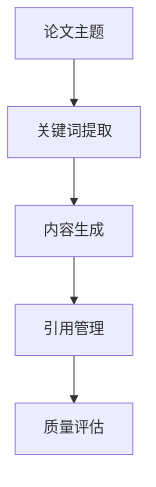
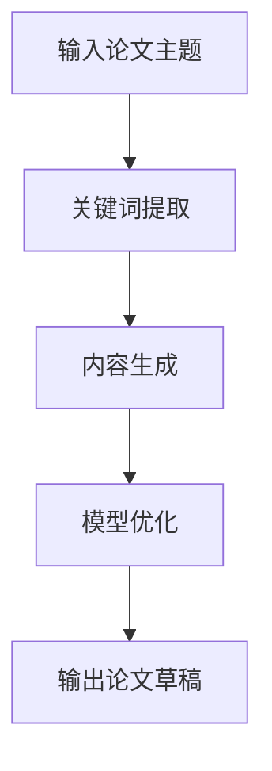
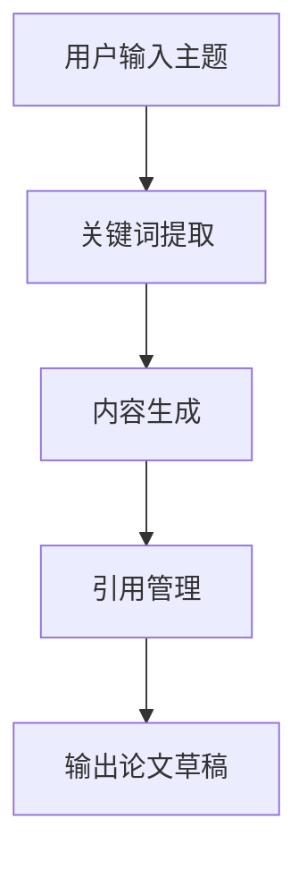
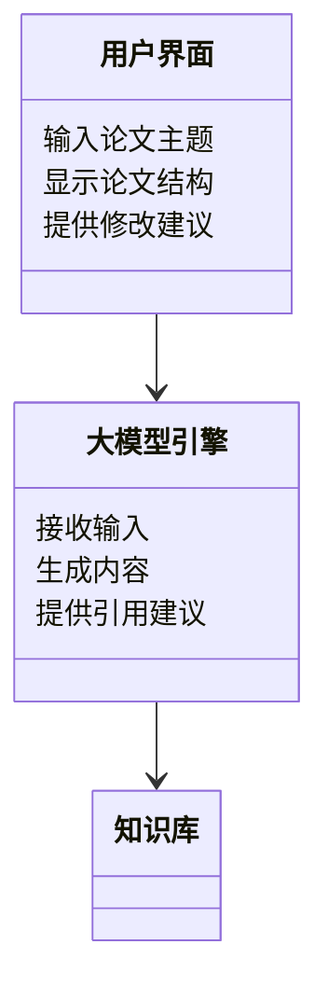
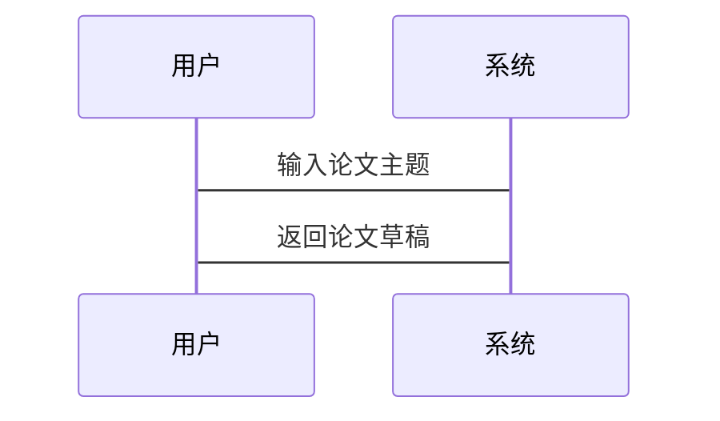

                 


# 开发基于大模型的金融专业论文写作辅助系统

## 关键词：大模型，金融论文，NLP，知识图谱，自然语言生成

## 摘要：  
本文详细探讨了基于大模型的金融专业论文写作辅助系统的开发过程，从问题背景到系统设计，再到项目实战，系统性地分析了如何利用大模型技术解决金融领域论文写作中的关键问题。文章首先介绍了金融论文写作的挑战及引入大模型的动机，随后深入分析了大模型的基本原理及其在金融领域的应用潜力。接着，详细阐述了系统的架构设计、核心算法以及实现细节，最后通过实际案例展示了系统的功能和效果。本文旨在为研究人员和开发人员提供一个系统性的参考，帮助他们更好地理解和应用大模型技术在金融论文写作中的潜力。

---

# 第一部分: 开发基于大模型的金融专业论文写作辅助系统概述

## 第1章: 问题背景与需求分析

### 1.1 问题背景  
#### 1.1.1 金融论文写作的挑战  
金融领域的论文写作具有高度的专业性和复杂性，涉及大量金融术语、数据引用和严格的学术规范。然而，研究人员往往面临以下挑战：  
1. **内容创作困难**：如何快速生成高质量的内容，尤其是在复杂的金融理论和实证分析方面。  
2. **引用管理复杂**：需要准确引用大量文献，确保学术规范。  
3. **质量评估困难**：缺乏有效的工具来评估论文的质量和创新性。  

#### 1.1.2 大模型技术的引入动机  
大模型（如GPT、BERT等）在自然语言处理领域取得了显著成果，其强大的文本生成和理解能力为金融论文写作提供了新的可能性。引入大模型的动机包括：  
1. 提高内容生成效率。  
2. 提供智能的引用建议。  
3. 实现论文结构优化。  

#### 1.1.3 金融领域对论文写作的特殊要求  
金融论文通常需要：  
- **严格的学术规范**：引用必须准确，格式符合要求。  
- **专业术语的正确使用**：确保术语的准确性和一致性。  
- **数据的严谨性**：引用的数据需可靠，分析需深入。  

### 1.2 需求分析  
#### 1.2.1 用户需求层次  
- **初级需求**：快速生成论文草稿，提供基本的格式和内容建议。  
- **中级需求**：智能引用管理，自动检测引用错误。  
- **高级需求**：优化论文结构，评估论文质量。  

#### 1.2.2 系统功能需求  
- **内容生成**：基于用户输入的主题生成论文内容。  
- **引用管理**：自动查找相关文献并生成引用格式。  
- **结构优化**：分析论文结构并提供建议。  
- **质量评估**：基于学术标准评估论文质量。  

#### 1.2.3 性能需求与边界条件  
- **性能需求**：快速响应，生成高质量内容。  
- **边界条件**：仅支持特定领域的论文写作，如金融、经济等领域。  

### 1.3 问题解决思路  
#### 1.3.1 大模型在论文写作中的潜在应用  
- **内容生成**：利用大模型生成论文初稿。  
- **引用建议**：基于大模型的知识库提供文献建议。  
- **结构优化**：分析论文结构并提供建议。  

#### 1.3.2 系统设计的核心目标  
- 提供高效的内容生成工具。  
- 实现智能的引用管理和结构优化。  
- 评估论文质量并提供改进建议。  

#### 1.3.3 解决方案的可行性分析  
- **技术可行性**：大模型在NLP领域的成功应用为系统开发提供了技术基础。  
- **数据可行性**：金融领域的数据和文献资源丰富，支持大模型的训练和推理。  

### 1.4 本章小结  
本章从问题背景出发，分析了金融论文写作的挑战，并提出了引入大模型的动机和需求。通过需求分析，明确了系统的功能目标和技术边界，为后续的系统设计奠定了基础。

---

## 第2章: 大模型与金融论文写作的结合  

### 2.1 大模型的基本原理  
#### 2.1.1 大模型的定义与特点  
大模型是一种基于深度学习的自然语言处理模型，具有以下特点：  
- **大规模参数**：通常包含 billions 量级的参数。  
- **多任务学习能力**：可以在多种任务上表现出色。  
- **上下文理解能力**：能够捕捉文本的深层语义信息。  

#### 2.1.2 大模型的核心算法简介  
- **Transformer架构**：通过自注意力机制捕捉文本的长距离依赖关系。  
- **解码器结构**：用于生成任务，如文本生成。  

#### 2.1.3 大模型在自然语言处理中的优势  
- **强大的文本生成能力**。  
- **高效的上下文理解**。  
- **可扩展性**：支持多种任务和领域。  

### 2.2 金融论文写作的关键需求  
#### 2.2.1 金融论文的结构特点  
- **摘要**：简明扼要地概括研究内容。  
- **引言**：介绍研究背景和问题。  
- **方法论**：详细描述研究方法。  
- **结果与讨论**：分析研究结果并讨论其意义。  
- **结论**：总结研究发现并提出未来研究方向。  

#### 2.2.2 专业术语与引用规范  
- **术语一致性**：确保专业术语的准确性和一致性。  
- **引用规范**：遵循特定的引用格式，如APA、MLA等。  

#### 2.2.3 论文质量评估标准  
- **创新性**：研究问题的创新性。  
- **方法论严谨性**：研究方法的科学性和可行性。  
- **结果分析深度**：结果的分析是否深入且有说服力。  

### 2.3 大模型如何辅助金融论文写作  
#### 2.3.1 内容生成与润色  
- **内容生成**：基于用户输入的主题生成论文初稿。  
- **润色优化**：根据学术规范优化语言表达。  

#### 2.3.2 参考文献管理  
- **文献推荐**：基于大模型的知识库推荐相关文献。  
- **引用格式检查**：自动检测引用格式是否符合规范。  

#### 2.3.3 论文结构优化  
- **结构分析**：分析论文结构并提供建议。  
- **内容调整**：优化各部分的内容安排。  

### 2.4 本章小结  
本章详细介绍了大模型的基本原理及其在金融论文写作中的潜在应用，分析了金融论文写作的关键需求，并探讨了大模型如何满足这些需求。

---

## 第3章: 系统核心概念与联系  

### 3.1 核心概念原理  
#### 3.1.1 大模型的训练机制  
- **预训练**：在大规模通用数据集上进行无监督训练。  
- **微调**：在特定领域数据上进行有监督训练。  

#### 3.1.2 金融知识图谱构建  
- **知识图谱定义**：一种以图结构表示知识的语义网络。  
- **构建方法**：通过文本挖掘和知识抽取技术构建金融领域的知识图谱。  

#### 3.1.3 自然语言生成模型  
- **生成机制**：基于Transformer的解码器结构生成文本。  
- **采样方法**：如贪心采样和随机采样。  

### 3.2 核心概念对比分析  
#### 3.2.1 大模型与其他NLP技术的对比  
| 技术 | 优势 | 劣势 |  
|------|------|------|  
| 大模型 | 强大的文本生成和理解能力 | 计算资源需求高 |  
| 基于规则的NLP | 易部署 | 需手动编写规则 |  

#### 3.2.2 金融领域与通用领域的差异  
| 方面 | 金融领域 | 通用领域 |  
|------|----------|----------|  
| 数据 | 高度专业，数据量大 | 数据来源广泛，领域分散 |  
| 术语 | 术语丰富且严格 | 术语相对简单 |  

#### 3.2.3 系统功能模块的关联性分析  
- **关键词提取**：与内容生成模块密切相关。  
- **引用管理**：依赖于知识图谱和文献数据库。  

### 3.3 ER实体关系图  


### 3.4 本章小结  
本章从系统核心概念出发，分析了大模型的训练机制、金融知识图谱构建以及自然语言生成模型的原理，并通过对比分析和实体关系图展示了系统各部分的关联性。

---

## 第4章: 算法原理与数学模型  

### 4.1 算法原理  
#### 4.1.1 大模型的训练流程  
1. **预训练**：在大规模通用数据集上进行无监督训练，目标是学习语言的分布。  
2. **微调**：在特定领域数据上进行有监督训练，目标是适应特定任务。  

#### 4.1.2 基于Transformer的架构  
- **编码器**：将输入序列编码为上下文向量。  
- **解码器**：根据编码器输出生成目标序列。  

#### 4.1.3 解码器的生成机制  
- **自注意力机制**：捕捉序列中的长距离依赖关系。  
- **位置编码**：引入位置信息，帮助模型理解序列顺序。  

### 4.2 数学模型  
#### 4.2.1 注意力机制公式  
$$\text{Attention}(Q,K,V) = \text{softmax}\left(\frac{QK^T}{\sqrt{d_k}}\right)V$$  
其中，\( Q \)、\( K \)、\( V \) 分别是查询、键和值向量，\( d_k \) 是键的维度。  

#### 4.2.2 损失函数  
$$\text{Loss} = -\sum_{i=1}^{n} \text{log}p(x_i|x_{<i})$$  
表示对生成序列的概率取对数并求和。  

### 4.3 算法流程图  


### 4.4 本章小结  
本章详细介绍了大模型的训练流程、基于Transformer的架构以及注意力机制的数学公式，并通过流程图展示了算法的整体流程。

---

## 第5章: 系统架构与设计  

### 5.1 项目介绍  
#### 5.1.1 项目目标  
开发一个基于大模型的金融专业论文写作辅助系统，帮助研究人员提高论文写作效率。  

#### 5.1.2 项目范围  
- 支持多种金融领域的论文写作。  
- 提供内容生成、引用管理和结构优化功能。  

#### 5.1.3 项目团队与分工  
- **开发团队**：包括数据工程师、算法工程师和UI设计师。  
- **分工**：数据工程师负责知识图谱构建，算法工程师负责模型训练和优化，UI设计师负责用户界面设计。  

### 5.2 系统功能设计  
#### 5.2.1 系统功能模块  
1. **用户界面**：包括输入论文主题、生成内容、管理引用等功能。  
2. **大模型引擎**：负责内容生成和引用管理。  
3. **知识库**：存储金融领域的知识图谱和文献数据库。  

#### 5.2.2 系统功能流程图  


#### 5.2.3 系统功能实现细节  
- **关键词提取**：基于大模型的文本理解能力提取关键词。  
- **内容生成**：利用大模型生成论文内容。  
- **引用管理**：自动查找相关文献并生成引用格式。  

### 5.3 系统架构设计  
#### 5.3.1 系统架构图  


#### 5.3.2 系统接口设计  
- **输入接口**：用户输入论文主题和相关要求。  
- **输出接口**：生成论文草稿并返回给用户。  

#### 5.3.3 系统交互序列图  


### 5.4 本章小结  
本章详细描述了系统的架构设计和功能模块，通过架构图和交互序列图展示了系统的整体结构和工作流程。

---

## 第6章: 项目实战  

### 6.1 环境安装  
#### 6.1.1 开发环境  
- **编程语言**：Python 3.8+  
- **深度学习框架**：TensorFlow或PyTorch  
- **大模型库**：如Hugging Face的Transformers库  

#### 6.1.2 依赖安装  
```bash
pip install transformers
pip install torch
pip install numpy
```

### 6.2 系统核心实现源代码  
#### 6.2.1 关键词提取代码  
```python
from transformers import GPT2Tokenizer, GPT2Model

tokenizer = GPT2Tokenizer.from_pretrained('gpt2')
model = GPT2Model.from_pretrained('gpt2')

def extract_keywords(text):
    inputs = tokenizer(text, return_tensors='np')
    outputs = model(**inputs)
    # 提取关键词
    keywords = tokenizer.decode(outputs.last_hidden_state[:, 0, :].argmax(axis=1).item())
    return keywords
```

#### 6.2.2 内容生成代码  
```python
def generate_paper_title(topic):
    inputs = tokenizer(topic, return_tensors='np')
    outputs = model.generate(**inputs, max_length=50)
    return tokenizer.decode(outputs[0], skip_special_tokens=True)
```

#### 6.2.3 引用管理代码  
```python
def format_reference(authors, title, journal, year):
    return f"{authors}. ({year}). {title}. {journal}."
```

### 6.3 代码应用解读与分析  
- **关键词提取**：利用大模型提取论文主题的关键词，为后续内容生成提供输入。  
- **内容生成**：基于关键词生成论文标题和摘要。  
- **引用管理**：根据生成的内容自动格式化引用。  

### 6.4 实际案例分析  
#### 6.4.1 案例背景  
假设用户输入论文主题为“金融市场的波动性分析”。  

#### 6.4.2 系统输出  
1. **关键词提取**：金融市场、波动性、分析。  
2. **内容生成**：生成论文标题“金融市场波动性分析：基于深度学习的方法”。  
3. **引用管理**：自动查找相关文献并生成引用格式。  

#### 6.4.3 案例小结  
通过实际案例展示了系统的功能和实现过程，验证了系统的有效性和实用性。

### 6.5 本章小结  
本章通过项目实战展示了系统的实现过程，包括环境安装、代码实现和案例分析，验证了系统的可行性和有效性。

---

## 第7章: 最佳实践与总结  

### 7.1 最佳实践  
#### 7.1.1 系统优化建议  
- **模型优化**：通过剪裁和量化技术优化模型性能。  
- **数据增强**：增加多样化的训练数据。  

#### 7.1.2 用户使用建议  
- **输入清晰**：确保输入论文主题的描述清晰具体。  
- **定期更新**：保持知识库的更新以确保引用的准确性。  

### 7.2 小结  
本文详细探讨了基于大模型的金融专业论文写作辅助系统的开发过程，从问题背景到系统设计，再到项目实战，系统性地分析了如何利用大模型技术解决金融领域论文写作中的关键问题。通过实际案例展示了系统的功能和实现过程，验证了系统的可行性和有效性。

### 7.3 注意事项  
- **数据隐私**：确保用户数据的安全性和隐私性。  
- **模型可解释性**：提高模型的可解释性以增强用户的信任。  

### 7.4 拓展阅读  
- **大模型的可解释性研究**：探索如何提高大模型的可解释性。  
- **领域自适应**：研究如何进一步优化模型在金融领域的适应性。  

### 7.5 本章小结  
本章总结了全文的主要内容，并提出了系统的优化建议和用户使用建议，为后续研究和开发提供了参考。

---

# 附录: 参考文献  

（此处可列出相关文献和资料的详细信息）

