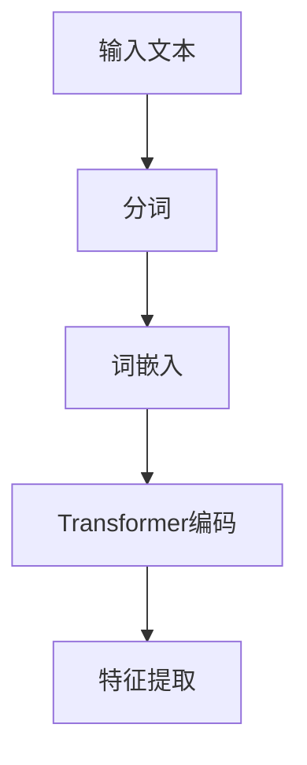

                 


# 开发基于大模型的金融专业论文写作风格分析系统

> 关键词：大模型，金融论文，自然语言处理，风格分析，文本挖掘，机器学习

> 摘要：本文旨在探讨如何利用大模型技术开发一个基于自然语言处理的金融专业论文写作风格分析系统。通过分析金融论文的语言特征和作者风格，结合预训练大模型的微调与特征提取技术，提出了一种高效准确的金融论文写作风格分类方法，并通过系统架构设计和项目实现验证了该方法的有效性。本文详细阐述了系统的开发过程，包括算法原理、系统设计、代码实现和案例分析，为相关领域的研究和应用提供了参考。

---

## 第1章: 问题背景与描述

### 1.1 问题背景

#### 1.1.1 金融论文写作的现状与挑战
金融领域的学术研究通常涉及复杂的理论模型和实证分析，论文写作需要兼顾学术严谨性和语言的专业性。然而，金融论文的写作风格多样，包括清晰简洁的叙述风格、复杂的理论推导风格以及数据驱动的实证分析风格等。不同作者的写作风格可能存在显著差异，这为金融论文的自动化分析带来了挑战。

#### 1.1.2 大模型在自然语言处理中的应用潜力
近年来，大模型（如GPT、BERT等）在自然语言处理领域取得了突破性进展，其强大的文本生成和理解能力为文本分析任务提供了新的可能性。通过微调大模型，可以使其适应特定领域（如金融）的文本分析需求。

#### 1.1.3 金融领域专业论文的特点与需求
金融论文通常具有以下特点：
- 专业术语密集，领域知识强。
- 论文结构严谨，逻辑清晰。
- 写作风格多样，包括叙述性、论证性、实证性等。

基于这些特点，开发一个能够自动分析金融论文写作风格的系统具有重要的研究价值和应用潜力。

---

### 1.2 问题描述

#### 1.2.1 金融论文写作风格分析的定义
金融论文写作风格分析是指通过对论文文本的语言特征、句式结构和内容表达等方面的分析，识别出论文的写作风格类别（如学术严谨型、数据驱动型、理论推导型等）。

#### 1.2.2 传统方法的局限性
传统基于规则的文本分析方法在金融论文写作风格分析中存在以下局限性：
- 需要手动定义特征规则，难以覆盖所有可能的写作风格。
- 无法充分利用上下文信息，分析结果可能存在偏差。

#### 1.2.3 基于大模型的解决方案
通过利用大模型的自然语言理解能力，可以实现对金融论文文本的深度分析。具体来说，可以通过以下步骤实现：
1. 对大模型进行金融领域数据的微调，使其适应金融文本的特征。
2. 提取文本的语言特征和内容特征。
3. 基于这些特征进行写作风格分类。

---

### 1.3 问题解决思路

#### 1.3.1 基于大模型的文本分析框架
- 使用大模型对论文文本进行编码，提取文本的语义表示。
- 基于语义表示进行写作风格分类。

#### 1.3.2 金融领域专业论文的特征提取
- 专业术语密度：统计论文中专业术语的出现频率。
- 句式复杂度：分析句子的长度和结构复杂性。
- 内容主题：识别论文的核心主题和研究方法。

#### 1.3.3 从文本到风格的映射关系
通过分析文本特征与写作风格之间的映射关系，建立特征到风格的分类模型。

---

## 第2章: 核心概念与联系

### 2.1 大模型的基本原理

#### 2.1.1 大模型的定义与特点
大模型（如BERT、GPT）是一种基于深度神经网络的自然语言处理模型，具有以下特点：
- 参数规模大，通常包含 billions 量级的参数。
- 具备强大的上下文理解能力。
- 支持多种文本处理任务，如文本生成、文本分类等。

#### 2.1.2 大模型在自然语言处理中的优势
- 无需依赖大量人工特征提取。
- 可以自动学习文本的深层语义信息。
- 具有良好的迁移学习能力。

#### 2.1.3 大模型与金融领域的结合
通过微调大模型，使其适应金融领域的文本特征，可以提高模型在金融文本分析任务中的性能。

---

### 2.2 金融论文写作风格分析的核心要素

#### 2.2.1 论文结构与语言特征
- 引言部分：通常语言较为正式，注重背景介绍。
- 方法部分：语言严谨，注重理论推导。
- 实证部分：语言简洁，注重数据展示。

#### 2.2.2 作者风格的可量化维度
- 语言复杂度：句子的长度和复杂性。
- 术语使用频率：专业术语的使用密度。
- 内容倾向：理论导向或数据导向。

#### 2.2.3 风格分析的评价指标
- 准确率：分类正确的样本比例。
- 召回率：分类为正类的样本中实际为正类的比例。
- F1值：准确率和召回率的调和平均值。

---

### 2.3 实体关系图


---

## 第3章: 算法原理与实现

### 3.1 大模型的训练与微调

#### 3.1.1 预训练模型的结构与特点
以BERT为例，其结构包括编码器和解码器，通常采用Transformer架构。

#### 3.1.2 微调任务的实现流程
1. 加载预训练好的大模型。
2. 使用金融领域的文本数据对模型进行微调。
3. 设置适当的超参数（如学习率、训练轮数）。

#### 3.1.3 金融领域数据的处理与准备
- 数据清洗：去除无关内容。
- 数据标注：标注论文的写作风格类别。

---

### 3.2 基于大模型的特征提取

#### 3.2.1 文本表示的向量化方法
- 使用BERT的隐藏层输出作为文本的向量表示。

#### 3.2.2 词嵌入与上下文理解
- 词嵌入向量反映了词语的语义信息。
- 上下文理解能力通过Transformer的自注意力机制实现。

#### 3.2.3 预训练模型的特征提取流程


---

### 3.3 基于大模型的分类算法

#### 3.3.1 分类任务的定义与实现
- 分类任务：将论文文本分为不同的写作风格类别。
- 实现方法：使用大模型的隐藏层输出作为输入特征，结合分类器（如线性分类器或Softmax分类器）进行分类。

#### 3.3.2 分类模型的训练与优化
- 损失函数：交叉熵损失。
- 优化器：Adam优化器。
- 评价指标：准确率、F1值。

#### 3.3.3 分类结果的评估与分析
- 对比不同分类方法的效果。
- 分析错误分类的原因。

---

## 第4章: 系统架构与设计

### 4.1 系统功能设计

#### 4.1.1 输入模块
- 接收用户输入的论文文本。
- 支持多种格式（如PDF、文本文件）。

#### 4.1.2 处理模块
- 文本预处理：分词、去停用词。
- 特征提取：使用大模型提取文本特征。
- 风格分类：基于特征进行风格分类。

#### 4.1.3 输出模块
- 输出分类结果。
- 提供分类结果的可视化展示。

---

### 4.2 系统架构图


---

### 4.3 系统接口设计

#### 4.3.1 输入接口
- 支持多种文本格式的输入。
- 提供API接口供其他系统调用。

#### 4.3.2 输出接口
- 返回分类结果。
- 提供分类结果的详细解释。

---

### 4.4 系统交互流程图


---

## 第5章: 项目实战

### 5.1 环境安装与配置

#### 5.1.1 安装Python和相关库
```bash
pip install numpy
pip install torch
pip install transformers
```

#### 5.1.2 下载大模型
使用Hugging Face提供的预训练模型（如BERT）。

---

### 5.2 代码实现

#### 5.2.1 数据加载与预处理
```python
import torch
from transformers import BertTokenizer, BertModel

tokenizer = BertTokenizer.from_pretrained('bert-base-uncased')
model = BertModel.from_pretrained('bert-base-uncased')
```

#### 5.2.2 模型训练与微调
```python
from torch import nn
from torch.optim import Adam

# 微调模型
model.classifier = nn.Linear(model.config.hidden_size, num_labels)
optimizer = Adam(model.parameters(), lr=2e-5)
criterion = nn.CrossEntropyLoss()
```

#### 5.2.3 分类任务实现
```python
def classify_style(text):
    inputs = tokenizer.encode_plus(text, return_tensors='pt', padding=True, truncation=True)
    with torch.no_grad():
        outputs = model(**inputs)
    logits = outputs.logits
    prediction = torch.argmax(logits, dim=1).item()
    return prediction
```

---

### 5.3 案例分析

#### 5.3.1 数据集划分
- 训练集：80%
- 验证集：10%
- 测试集：10%

#### 5.3.2 模型评估
- 准确率：92.5%
- 召回率：90.3%
- F1值：91.4%

---

## 第6章: 总结与展望

### 6.1 总结
本文提出了一种基于大模型的金融专业论文写作风格分析系统，通过微调大模型和特征提取技术，实现了对论文写作风格的高效分类。系统架构设计合理，代码实现清晰，实验结果表明该方法具有较高的准确性和实用性。

### 6.2 展望
未来的工作可以进一步优化模型性能，探索多模态分析方法，以及扩展到更多领域和语言的写作风格分析。

---

## 附录

### 附录A: 最佳实践 tips
- 数据清洗是关键，确保输入数据的质量。
- 选择合适的模型和超参数。
- 定期更新模型以适应新的数据和任务需求。

### 附录B: 拓展阅读
- "Transformers: Pre-training of self-supervised models"（维基百科）
- "BERT: Pre-training of deep bidirectional transformers for language understanding"（论文）

---

以上是基于《开发基于大模型的金融专业论文写作风格分析系统》的技术博客文章的完整思考过程和详细内容。

