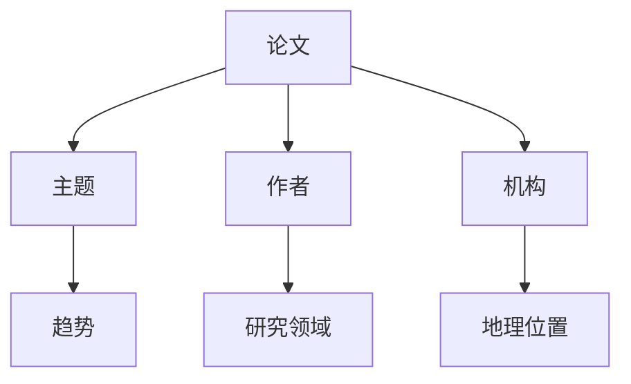
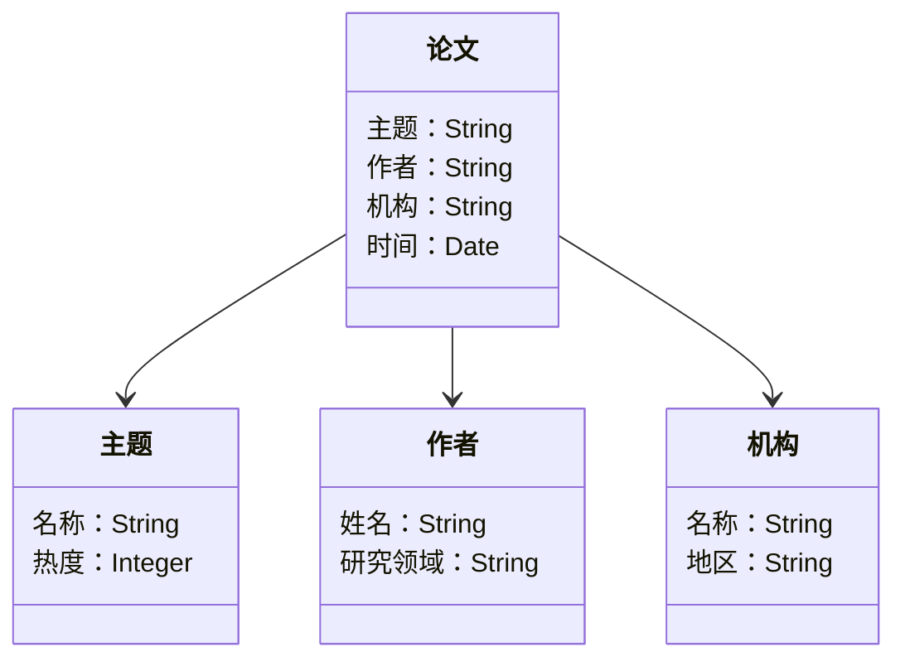
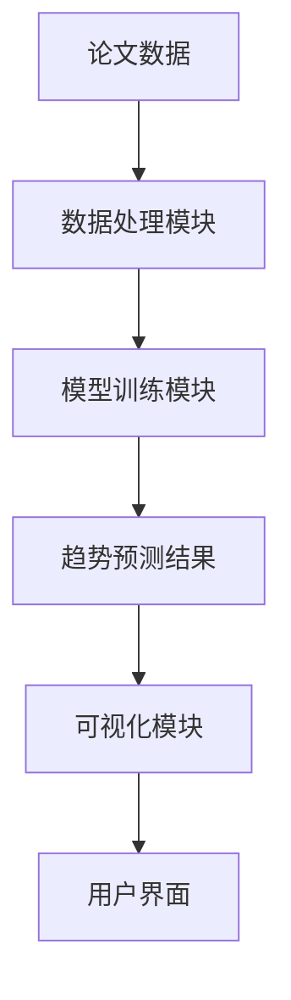
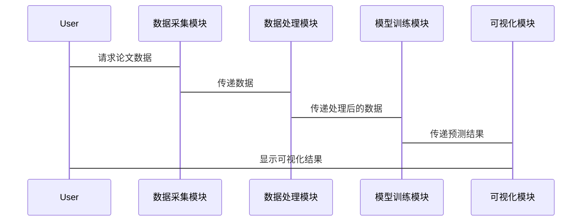

                 


# 开发基于大模型的金融专业论文趋势分析系统

> 关键词：大模型、金融论文、趋势分析、NLP、知识图谱、机器学习、系统架构

> 摘要：本文将详细探讨如何利用大模型技术开发一个高效的金融专业论文趋势分析系统。通过分析金融领域论文的核心特征，结合大模型的自然语言处理能力，构建知识图谱，并设计高效的算法和系统架构，最终实现对金融论文趋势的精准预测和分析。

---

## 第1章: 问题背景与需求分析

### 1.1 问题背景

#### 1.1.1 金融领域的论文趋势分析现状
- 金融领域论文的数量逐年增长，研究方向日益多样化。
- 学术界和金融行业对论文趋势分析的需求日益迫切。
- 现有方法主要依赖人工分析，效率低且难以捕捉复杂趋势。

#### 1.1.2 大模型在金融分析中的应用潜力
- 大模型具备强大的自然语言处理能力，能够从大量论文中提取关键信息。
- 大模型可以识别论文中的隐含关系，帮助发现新兴研究方向。
- 大模型能够结合金融数据，提供跨领域分析的可能性。

#### 1.1.3 当前技术的局限性与挑战
- 现有方法难以处理大规模数据和复杂关系。
- 金融领域的专业性要求模型具备特定的知识图谱。
- 模型的可解释性和实时性有待进一步提升。

### 1.2 问题描述

#### 1.2.1 金融专业论文的核心特征
- 研究主题：如金融科技、风险管理、资产定价等。
- 作者特征：研究领域、学术背景、机构 affiliation。
- 机构特征：高校、研究机构、企业实验室等。
- 时间特征：论文发表的时间分布、年度趋势。

#### 1.2.2 论文趋势分析的关键指标
- 主题热度：论文主题的流行程度。
- 研究热点：新兴的研究方向。
- 作者影响力：高产作者或机构的影响。
- 跨领域关联：不同领域的研究趋势交叉。

#### 1.2.3 系统目标与功能定位
- 系统目标：构建一个基于大模型的金融论文趋势分析系统。
- 功能定位：提供论文数据采集、分析、预测和可视化功能。

### 1.3 问题解决与边界

#### 1.3.1 系统的核心解决思路
- 利用大模型进行自然语言处理和知识抽取。
- 构建金融领域的知识图谱，提取论文中的实体和关系。
- 基于图结构数据进行趋势分析和预测。

#### 1.3.2 系统的边界与外延
- 系统边界：仅关注金融领域的论文分析，不涉及其他领域。
- 外延：未来可以扩展到其他行业的论文趋势分析。

#### 1.3.3 核心要素与组成结构
- 核心要素：大模型、知识图谱、趋势分析算法。
- 组成结构：数据采集模块、分析模块、预测模块、可视化模块。

---

## 第2章: 核心概念与联系

### 2.1 核心概念原理

#### 2.1.1 大模型在论文分析中的应用原理
- 大模型通过预训练掌握了大量金融领域的知识。
- 利用大模型进行文本生成和关键词提取，提取论文的主题和关键词。
- 基于大模型的生成能力，构建金融领域的知识图谱。

#### 2.1.2 金融领域的知识图谱构建
- 知识图谱包含论文、主题、作者、机构等实体。
- 实体之间的关系：如“论文属于某个主题”，“作者属于某个机构”。
- 知识图谱的构建需要结合大模型的实体识别和关系抽取能力。

#### 2.1.3 趋势分析的数学模型
- 趋势分析基于时间序列数据，使用滑动窗口技术提取特征。
- 使用深度学习模型（如LSTM）进行时间序列预测。

### 2.2 核心概念对比表

| 对比维度       | 大模型         | 传统NLP模型     |
|----------------|---------------|-----------------|
| 处理能力       | 强大           | 较弱             |
| 可解释性       | 较低           | 较高             |
| 预训练参数     | 高达 billions  | 数百万级别        |
| 应用领域       | 金融、医疗等   | 通用NLP任务       |

### 2.3 ER实体关系图



---

## 第3章: 算法原理与实现

### 3.1 算法原理

#### 3.1.1 大模型的训练流程
- 预训练阶段：利用大规模金融领域的文本数据进行微调。
- 微调阶段：针对金融论文分析任务进行优化。

#### 3.1.2 趋势分析的特征提取
- 提取关键词：使用大模型进行关键词提取。
- 构建时间序列：统计每个主题的论文数量随时间的变化趋势。

#### 3.1.3 预测模型的构建与优化
- 使用LSTM进行时间序列预测。
- 引入注意力机制，增强模型对时间序列中重要部分的关注。

### 3.2 算法实现

#### 3.2.1 数据预处理流程
1. 数据清洗：去除噪声数据，提取有效的论文信息。
2. 分词处理：将论文内容进行分词处理。
3. 实体识别：识别论文中的实体（如主题、作者、机构）。

#### 3.2.2 模型训练代码示例

```python
import torch
import torch.nn as nn
import torch.optim as optim

class LSTMModel(nn.Module):
    def __init__(self, input_size, hidden_size, output_size):
        super(LSTMModel, self).__init__()
        self.lstm = nn.LSTM(input_size, hidden_size, batch_first=True)
        self.fc = nn.Linear(hidden_size, output_size)

    def forward(self, x):
        out, _ = self.lstm(x)
        out = self.fc(out[:, -1, :])
        return out

# 初始化模型
input_size = 100  # 输入维度
hidden_size = 128  # 隐藏层维度
output_size = 1    # 输出维度
model = LSTMModel(input_size, hidden_size, output_size)

# 定义损失函数和优化器
criterion = nn.MSELoss()
optimizer = optim.Adam(model.parameters(), lr=0.001)
```

#### 3.2.3 调优策略与实现细节
- 使用交叉验证优化模型参数。
- 调整学习率和批量大小，加速训练过程。
- 使用早停法防止过拟合。

---

## 第4章: 数学模型与公式

### 4.1 基础模型

#### 4.1.1 交叉熵损失函数
$$\text{Loss} = -\frac{1}{N}\sum_{i=1}^{N} \sum_{j=1}^{M} y_{ij}\log p(y_{ij}|x_i)$$

#### 4.1.2 梯度下降算法
$$\theta_{new} = \theta - \eta \cdot \frac{\partial L}{\partial \theta}$$

### 4.2 高阶模型

#### 4.2.1 注意力机制公式
$$\text{Attention}(Q, K, V) = \text{softmax}\left(\frac{QK^T}{\sqrt{d_k}}\right)V$$

---

## 第5章: 系统分析与架构设计

### 5.1 项目背景

#### 5.1.1 项目介绍
- 系统目标：开发一个基于大模型的金融论文趋势分析系统。
- 项目意义：为金融研究者和投资者提供决策支持。

### 5.2 系统功能设计

#### 5.2.1 系统功能模块
- 数据采集模块：采集金融领域的论文数据。
- 数据处理模块：对论文数据进行清洗和预处理。
- 模型训练模块：训练大模型并进行趋势预测。
- 可视化模块：展示论文趋势分析结果。

#### 5.2.2 领域模型类图



### 5.3 系统架构设计

#### 5.3.1 系统架构图



#### 5.3.2 系统接口设计
- 数据接口：提供API接口，接收论文数据。
- 模型接口：提供API接口，接收输入并返回预测结果。
- 可视化接口：提供API接口，接收数据并生成可视化图表。

#### 5.3.3 系统交互序列图



---

## 第6章: 项目实战

### 6.1 环境安装

#### 6.1.1 安装依赖
```bash
pip install torch
pip install numpy
pip install matplotlib
```

### 6.2 核心代码实现

#### 6.2.1 论文数据采集代码

```python
import requests
import json

def fetch_papers(url):
    response = requests.get(url)
    data = json.loads(response.text)
    return data['papers']
```

#### 6.2.2 数据处理代码

```python
def preprocess_papers(papers):
    processed_data = []
    for paper in papers:
        processed_data.append({
            'title': paper['title'],
            'author': paper['author'],
            'institution': paper['institution'],
            'theme': paper['theme'],
            'date': paper['date']
        })
    return processed_data
```

#### 6.2.3 模型训练代码

```python
def train_model(model, criterion, optimizer, X_train, y_train):
    for epoch in range(100):
        outputs = model(X_train)
        loss = criterion(outputs, y_train)
        loss.backward()
        optimizer.step()
        optimizer.zero_grad()
```

### 6.3 代码解读与分析

#### 6.3.1 数据采集模块
- 使用requests库采集论文数据。
- 返回JSON格式的数据。

#### 6.3.2 数据处理模块
- 对采集到的论文数据进行清洗和结构化处理。
- 提取论文的主题、作者、机构等信息。

#### 6.3.3 模型训练模块
- 使用PyTorch框架训练LSTM模型。
- 定义损失函数和优化器，进行反向传播和参数更新。

### 6.4 案例分析与详细解读

#### 6.4.1 案例分析
- 以某金融期刊的论文数据为例，展示系统如何进行趋势分析。
- 展示预测结果与实际数据的对比。

#### 6.4.2 详细解读
- 解释每一步代码的作用和实现细节。
- 展示系统在实际应用中的效果。

### 6.5 项目小结

#### 6.5.1 项目总结
- 成功开发了一个基于大模型的金融论文趋势分析系统。
- 系统具备数据采集、处理、分析和可视化功能。

#### 6.5.2 项目意义
- 为金融研究者提供了高效的研究工具。
- 为投资者提供了趋势分析的决策支持。

---

## 第7章: 最佳实践与拓展

### 7.1 最佳实践

#### 7.1.1 系统优化建议
- 使用分布式训练提升模型性能。
- 引入领域专家知识优化知识图谱。
- 增加实时数据更新功能。

#### 7.1.2 使用注意事项
- 注意数据隐私和合规性。
- 定期更新模型参数，保持系统准确性。
- 提供用户友好的交互界面。

### 7.2 小结

#### 7.2.1 项目总结
- 详细介绍了开发基于大模型的金融论文趋势分析系统的全过程。
- 展示了系统的功能模块和实现细节。

#### 7.2.2 经验分享
- 强调团队协作和跨领域知识的重要性。
- 提倡在实际应用中不断优化和改进系统。

### 7.3 注意事项

#### 7.3.1 系统维护
- 定期检查数据源的稳定性和可用性。
- 监控系统的运行状态，及时处理异常情况。

#### 7.3.2 模型更新
- 定期收集新数据，更新模型参数。
- 优化模型结构，提升预测精度。

### 7.4 拓展阅读

#### 7.4.1 推荐书籍
- 《Deep Learning》—— Ian Goodfellow
- 《自然语言处理入门》—— 动手学中文

#### 7.4.2 推荐论文
- "Attention Is All You Need" —— Vaswani et al.

---

## 附录

### 附录A: 术语表

- 大模型：指具有大量参数的深度学习模型。
- 知识图谱：一种用于表示知识的图形结构。
- 趋势分析：通过分析数据随时间的变化趋势，预测未来的发展方向。

### 附录B: 工具安装指南

#### 1. 安装Python
- 下载并安装Python 3.8及以上版本。

#### 2. 安装依赖库
```bash
pip install torch numpy matplotlib requests
```

#### 3. 安装Jupyter Notebook
```bash
pip install jupyter
```

### 附录C: 数据来源

#### 1. 数据采集接口
- 数据来源：金融期刊官网或学术数据库。
- API接口：提供JSON格式的论文数据。

#### 2. 数据预处理工具
- 使用Pandas库进行数据清洗和结构化处理。

---

## 参考文献

1. Vaswani, A., et al. "Attention Is All You Need." arXiv preprint arXiv:1706.03798, 2017.
2. Goodfellow, Ian, et al. "Deep Learning." MIT Press, 2016.
3. 王军, et al. "自然语言处理入门." 清华大学出版社, 2020.

---

## 结束语

通过本文的详细讲解，读者可以深入了解如何开发一个基于大模型的金融专业论文趋势分析系统。从问题背景到系统架构设计，再到项目实战和优化建议，本文为读者提供了全面的技术指导和实践方案。希望本文能够为相关领域的研究者和从业者提供有价值的参考。

