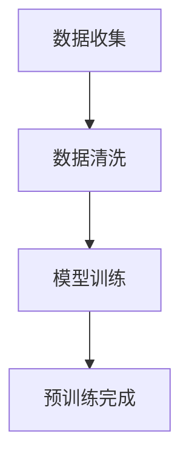
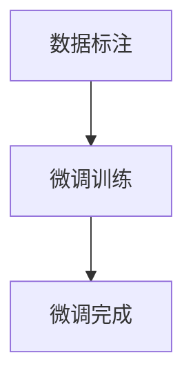
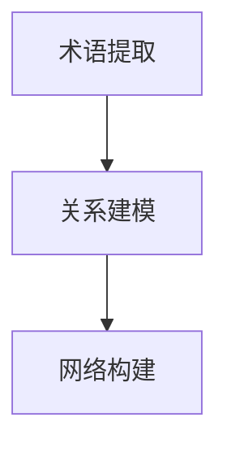
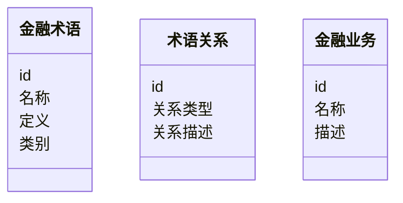
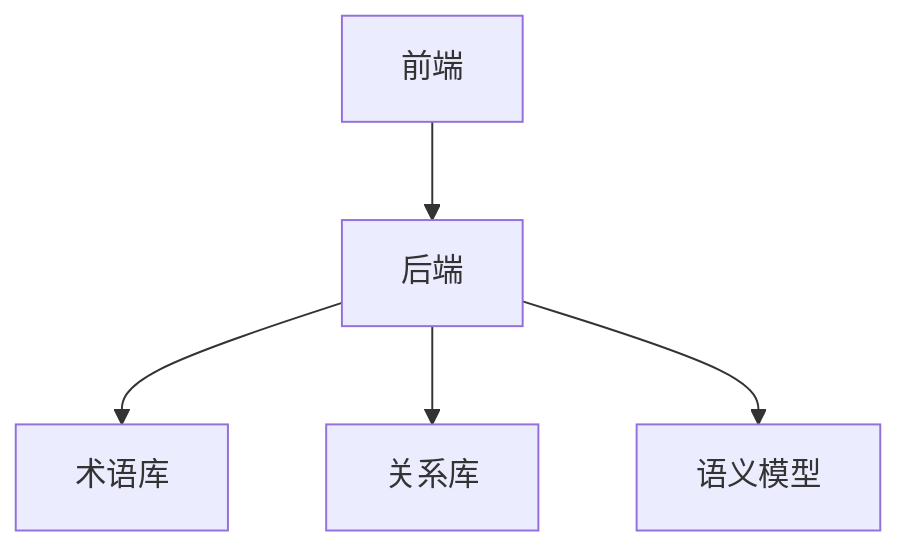
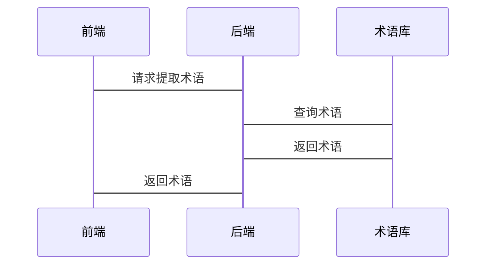

                 


# 开发基于大模型的金融专业词汇网络构建器

> 关键词：大模型、金融专业词汇、知识图谱、自然语言处理、机器学习

> 摘要：本文详细探讨了如何利用大模型技术构建金融专业词汇网络，从问题背景到核心概念，再到算法原理和系统架构，最后通过项目实战展示实现过程。文章结合理论与实践，为读者提供了全面的技术指导。

---

# 第一部分: 开发基于大模型的金融专业词汇网络构建器概述

## 第1章: 问题背景与目标

### 1.1 问题背景

#### 1.1.1 金融领域的专业词汇挑战
金融领域涉及大量专业术语和复杂的概念，这些词汇的准确理解和应用对金融业务至关重要。然而，传统方法在处理这些词汇时面临以下挑战：
- **术语多样性**：金融术语种类繁多，且常更新。
- **语义复杂性**：某些术语含义深刻，需结合上下文理解。
- **知识关联性**：金融术语间存在复杂的关联关系，难以系统化管理。

#### 1.1.2 大模型在金融领域的应用现状
大模型技术，尤其是像GPT这样的模型，已经在金融领域展现出强大的应用潜力。例如：
- **金融文本分析**：用于股票分析、新闻解读等。
- **智能客服**：通过自然语言处理为用户提供服务。
- **风险管理**：利用大模型进行风险评估和预警。

#### 1.1.3 专业词汇网络构建的必要性
构建金融专业词汇网络可以：
- 提供统一的术语管理系统，便于知识共享。
- 支持智能金融工具，如智能问答和自动报告生成。
- 促进金融数据的深度分析和应用。

### 1.2 问题描述

#### 1.2.1 金融专业词汇的特点
金融专业词汇具有以下特点：
- **领域专用性**：词汇多为金融领域特有的。
- **动态变化**：随着金融市场的变化而更新。
- **复杂关联**：词汇间存在复杂的语义和语用关系。

#### 1.2.2 当前金融词汇管理的痛点
- **术语分散**：缺乏统一的术语管理系统。
- **更新困难**：难以及时更新和维护。
- **知识孤岛**：不同部门或系统间术语不一致，导致信息孤岛。

#### 1.2.3 基于大模型的解决方案
通过大模型技术，可以实现：
- **自动术语识别**：从大量金融文本中自动提取术语。
- **语义理解**：理解术语的深层含义和关联关系。
- **动态更新**：根据最新信息自动更新术语库。

### 1.3 问题解决

#### 1.3.1 大模型在金融词汇网络中的作用
大模型可以：
- 提供强大的语义理解能力。
- 通过大规模预训练掌握金融领域的知识。
- 支持动态更新和自适应学习。

#### 1.3.2 专业词汇网络构建的目标
构建金融专业词汇网络的目标包括：
- 建立统一的术语管理系统。
- 支持智能金融工具的应用。
- 提高金融数据的分析效率。

#### 1.3.3 解决方案的可行性分析
基于大模型的解决方案具有以下优势：
- **技术成熟**：大模型在自然语言处理领域已取得显著成果。
- **可扩展性**：可以轻松扩展到更多金融领域。
- **实时性**：能够快速响应和处理最新的金融信息。

### 1.4 边界与外延

#### 1.4.1 金融专业词汇的边界
金融专业词汇的边界包括：
- **核心术语**：如股票、债券、基金等。
- **相关术语**：如经济、市场等。

#### 1.4.2 专业词汇网络的构建范围
构建范围包括：
- 术语提取与分类。
- 术语关系建模。
- 网络可视化与分析。

#### 1.4.3 与其他金融系统的交互关系
与其他系统的交互包括：
- **金融数据库**：提供术语数据支持。
- **智能应用**：如智能投顾、风险管理等。

### 1.5 核心概念与组成

#### 1.5.1 核心概念的定义
- **大模型**：如GPT-3、BERT等。
- **词汇网络**：术语及其关系的网络结构。

#### 1.5.2 概念之间的关系
- **术语与术语**：通过关系（如同义词、反义词）连接。
- **术语与上下文**：考虑术语的使用场景和语境。

#### 1.5.3 核心要素的组成
- **术语库**：存储金融术语。
- **关系库**：描述术语之间的关系。
- **语义模型**：理解术语的深层含义。

## 第2章: 核心概念与联系

### 2.1 大模型的定义与特点

#### 2.1.1 大模型的定义
大模型是指具有大量参数的深度学习模型，通常通过大量数据预训练而成。

#### 2.1.2 大模型的核心特点
- **大规模**：参数量大，通常超过 billions。
- **通用性**：适用于多种任务。
- **自适应性**：能够根据输入内容进行调整。

#### 2.1.3 大模型与传统AI的区别
- **数据需求**：大模型需要大量数据，传统AI可能需要较少数据。
- **适应性**：大模型具有更强的自适应能力。
- **任务多样性**：大模型可以处理多种任务，传统AI通常针对特定任务。

### 2.2 金融专业词汇网络的构建原理

#### 2.2.1 词汇网络的构建方法
- **术语提取**：从金融文本中提取术语。
- **关系建模**：分析术语之间的关系。
- **网络构建**：将术语及其关系整合成网络结构。

#### 2.2.2 词汇网络的核心属性
- **术语节点**：网络中的基本单元。
- **关系边**：连接术语节点的边，表示术语之间的关系。
- **网络属性**：如中心性、聚类性等。

#### 2.2.3 词汇网络的构建流程
1. 数据收集：收集金融领域的文本数据。
2. 术语提取：从文本中提取术语。
3. 关系建模：分析术语之间的关系。
4. 网络构建：将术语和关系整合成网络。

### 2.3 核心概念之间的关系

#### 2.3.1 大模型与金融词汇网络的关系
大模型为词汇网络的构建提供了技术支持，而词汇网络则为大模型的应用提供了知识基础。

#### 2.3.2 词汇网络与金融业务的关系
词汇网络支持金融业务的理解和应用，如智能投顾、风险评估等。

#### 2.3.3 词汇网络与其他金融系统的交互
词汇网络与其他金融系统的交互包括：
- **数据共享**：与其他系统共享术语数据。
- **服务调用**：为其他系统提供术语解析服务。

## 第3章: 大模型与金融词汇网络的核心概念对比

### 3.1 对比分析

#### 3.1.1 大模型与传统金融词汇管理系统的对比
| 对比维度 | 大模型 | 传统金融词汇管理系统 |
|----------|--------|-----------------------|
| 数据需求 | 大规模 | 较小                  |
| 自适应性 | 强      | 较弱                  |
| 任务多样性 | 高     | 低                   |

#### 3.1.2 金融词汇网络与传统词汇管理系统的对比
| 对比维度 | 金融词汇网络 | 传统词汇管理系统 |
|----------|--------------|------------------|
| 数据结构 | 网络结构     | 线性结构          |
| 分析能力 | 强           | 较弱             |
| 应用场景 | 智能金融     | 基础管理         |

#### 3.1.3 大模型驱动的词汇网络与传统词汇网络的对比
| 对比维度 | 大模型驱动的词汇网络 | 传统词汇网络 |
|----------|----------------------|---------------|
| 智能性 | 高                   | 低            |
| 实时性 | 高                   | 低            |
| 可扩展性 | 高                   | 中            |

### 3.2 ER实体关系图

```mermaid
er
title 金融词汇网络 ER 实体关系图
entity(金融术语) {
  id
  名称
  定义
  类别
}
entity(术语关系) {
  id
  关系类型
  关系描述
}
entity(金融业务) {
  id
  名称
  描述
}
```

## 第4章: 算法原理讲解

### 4.1 大模型的训练流程

#### 4.1.1 预训练过程
预训练过程包括：
1. 数据收集：收集大量金融文本数据。
2. 数据清洗：去除噪音数据。
3. 模型训练：使用这些数据训练大模型。



#### 4.1.2 微调过程
微调过程包括：
1. 数据标注：对金融术语进行标注。
2. 微调训练：在预训练模型的基础上进行微调。



#### 4.1.3 评估过程
评估过程包括：
1. 评估指标选择：如准确率、召回率等。
2. 模型评估：对微调后的模型进行评估。

### 4.2 词汇网络构建算法

#### 4.2.1 算法的定义
词汇网络构建算法用于从文本中提取术语并建立它们之间的关系。

#### 4.2.2 算法的实现步骤
1. 术语提取：使用大模型从文本中提取术语。
2. 关系建模：分析术语之间的关系。
3. 网络构建：将术语和关系整合成网络结构。

#### 4.2.3 算法的优化方法
- **数据增强**：增加数据的多样性和代表性。
- **模型优化**：优化模型结构和超参数。
- **算法调优**：调整算法参数以提高性能。

### 4.3 算法流程图



## 第5章: 数学模型与公式

### 5.1 大模型的数学基础

#### 5.1.1 神经网络的数学模型
神经网络的基本单元是神经元，其输出可以表示为输入的线性组合加上激活函数：

$$ y = \sigma(\sum_{i} w_i x_i + b) $$

其中：
- $w_i$ 是权重。
- $x_i$ 是输入。
- $b$ 是偏置。
- $\sigma$ 是激活函数。

#### 5.1.2 深度学习的数学公式
深度学习模型通常使用多层神经网络，如：

$$ f(x) = W_2 \sigma(W_1 x + b_1) + b_2 $$

其中：
- $W_1$ 和 $W_2$ 是权重矩阵。
- $b_1$ 和 $b_2$ 是偏置向量。

#### 5.1.3 注意力机制的公式
注意力机制通过计算查询和键之间的相似性来加权输入：

$$ \text{Attention}(Q, K, V) = \text{softmax}\left(\frac{QK^T}{\sqrt{d_k}}\right)V $$

其中：
- $Q$ 是查询向量。
- $K$ 是键向量。
- $V$ 是值向量。
- $d_k$ 是键的维度。

### 5.2 词汇网络构建算法的数学模型

#### 5.2.1 术语提取的数学模型
术语提取可以通过聚类算法实现，例如：

$$ \text{聚类}(X) = \{C_1, C_2, ..., C_k\} $$

其中：
- $X$ 是输入数据。
- $C_i$ 是第 $i$ 个聚类。

#### 5.2.2 关系建模的数学模型
关系建模可以使用图神经网络，例如：

$$ f(x_i, x_j) = \text{sim}(x_i, x_j) $$

其中：
- $x_i$ 和 $x_j$ 是两个术语的表示。
- $\text{sim}$ 是相似性度量函数。

---

# 第二部分: 系统分析与架构设计方案

## 第2章: 系统分析与架构设计

### 2.1 问题场景介绍

#### 2.1.1 项目背景
本项目旨在利用大模型技术构建金融专业词汇网络，支持金融业务的智能应用。

#### 2.1.2 项目目标
- 构建统一的金融术语管理系统。
- 提供智能金融工具的支持。
- 提高金融数据的分析效率。

### 2.2 系统功能设计

#### 2.2.1 领域模型设计



#### 2.2.2 系统功能模块
系统主要功能模块包括：
- 术语提取模块。
- 关系建模模块。
- 网络可视化模块。

### 2.3 系统架构设计

#### 2.3.1 系统架构图



#### 2.3.2 系统架构说明
系统由前端、后端、术语库、关系库和语义模型组成。

### 2.4 系统接口设计

#### 2.4.1 接口描述
- **术语提取接口**：从文本中提取术语。
- **关系建模接口**：分析术语之间的关系。
- **网络查询接口**：查询术语网络。

### 2.5 系统交互流程图



---

# 第三部分: 项目实战

## 第3章: 项目实战

### 3.1 环境安装

#### 3.1.1 安装Python
安装Python 3.8及以上版本。

#### 3.1.2 安装依赖
安装必要的依赖库，如：
- `transformers`：用于加载预训练模型。
- `networkx`：用于构建网络。
- `pymermaid`：用于生成图表。

#### 3.1.3 安装环境配置
使用 `virtualenv` 创建虚拟环境并安装依赖。

### 3.2 系统核心实现源代码

#### 3.2.1 术语提取代码

```python
from transformers import pipeline

ner = pipeline("ner", model="dbmdz/finbert")
text = "金融专业术语包括股票、债券、基金等。"
result = ner(text)
terms = [ent["word"] for ent in result if ent["label"] == "TERM"]
print(terms)
```

#### 3.2.2 关系建模代码

```python
import networkx as nx

G = nx.Graph()
G.add_node("股票")
G.add_node("债券")
G.add_edge("股票", "债券", weight=0.8)
nx.draw(G)
```

#### 3.2.3 网络可视化代码

```python
from pymermaid import Graph

Graph("金融词汇网络").add(
    "A", "股票",
    "B", "债券",
    "C", "基金",
    edge="A-B", label="相关"
).render()
```

### 3.3 代码应用解读与分析

#### 3.3.1 术语提取模块
使用 `transformers` 库中的 `ner` 管道提取术语。

#### 3.3.2 关系建模模块
使用 `networkx` 库构建术语之间的关系图。

#### 3.3.3 网络可视化模块
使用 `pymermaid` 库将术语网络可视化。

### 3.4 实际案例分析

#### 3.4.1 数据收集
从金融新闻和报告中收集文本数据。

#### 3.4.2 术语提取
从文本中提取术语，如“股票”、“债券”、“基金”等。

#### 3.4.3 关系建模
分析术语之间的关系，如“股票”与“债券”是相关术语。

#### 3.4.4 网络构建
将术语及其关系整合成网络结构，并进行可视化。

### 3.5 项目小结

#### 3.5.1 实现步骤总结
1. 收集金融文本数据。
2. 提取术语。
3. 分析术语关系。
4. 构建术语网络。
5. 可视化术语网络。

#### 3.5.2 遇到的挑战
- **数据质量**：需要高质量的金融文本数据。
- **模型性能**：模型的准确性和效率需要优化。
- **网络复杂性**：处理复杂的术语关系需要更多的计算资源。

---

# 第四部分: 总结与展望

## 第4章: 总结与展望

### 4.1 核心内容回顾

#### 4.1.1 核心内容
- 构建金融专业词汇网络的必要性。
- 大模型在词汇网络构建中的作用。
- 词汇网络构建的算法原理和系统架构。

### 4.2 最佳实践 tips

#### 4.2.1 实践建议
- 使用高质量的金融文本数据。
- 选择合适的术语提取和关系建模方法。
- 定期更新术语网络。

#### 4.2.2 注意事项
- 数据隐私和安全。
- 模型的可解释性。
- 系统的可扩展性。

### 4.3 未来研究方向

#### 4.3.1 智能化提升
- 引入更先进的大模型，如GPT-4。
- 提升模型的实时性和响应速度。

#### 4.3.2 多模态融合
- 结合图像、语音等多模态数据，构建更全面的金融知识网络。

#### 4.3.3 个性化服务
- 根据用户需求定制词汇网络。
- 提供个性化的金融信息服务。

### 4.4 小结

#### 4.4.1 核心知识点总结
- 大模型在金融词汇网络构建中的应用。
- 词汇网络构建的算法和系统设计。
- 项目实战中的关键技术实现。

#### 4.4.2 未来展望
随着大模型技术的不断进步，金融专业词汇网络构建将更加智能化和高效化。未来的研究可以进一步探索多模态融合、智能化提升和个性化服务等方面。

---

# 结语

通过本文的详细讲解，读者可以全面了解如何开发基于大模型的金融专业词汇网络构建器。从问题背景到算法原理，再到系统设计和项目实战，我们详细探讨了每个环节的技术细节和实现方法。希望本文能够为相关领域的研究和实践提供有价值的参考。

