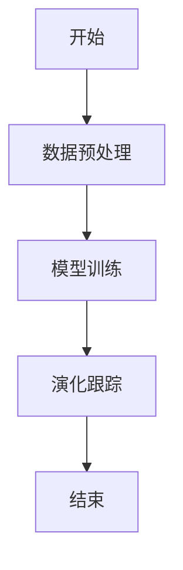
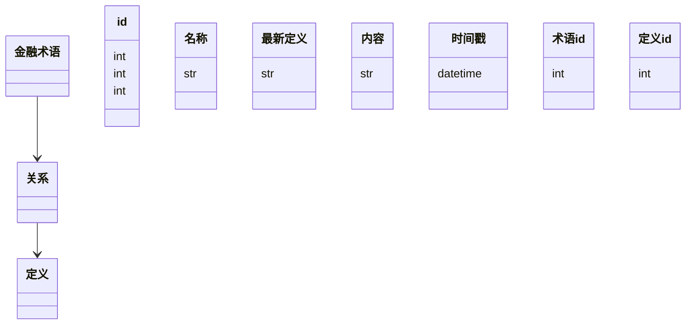
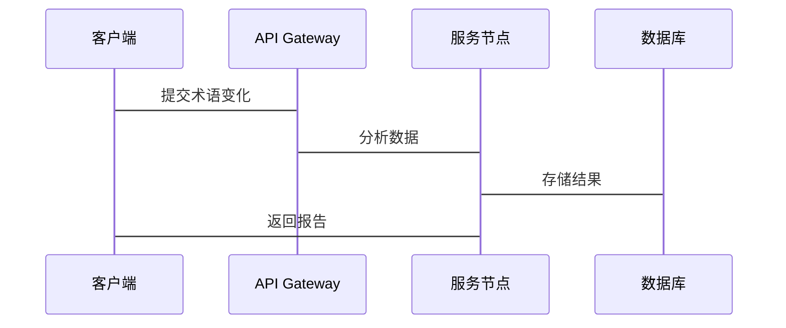

                 


# 开发基于大模型的金融专业词汇语义演化跟踪器

## 关键词：大模型，金融专业词汇，语义演化，跟踪器，自然语言处理

## 摘要：本文详细介绍了如何基于大模型开发金融专业词汇语义演化跟踪器。文章从背景介绍、核心概念、算法原理、系统架构到项目实战，全面阐述了该跟踪器的开发过程。通过分析语义演化的特点，结合大模型的优势，提出了一种高效的解决方案，并通过实际案例展示了其应用价值。

---

# 第1章: 背景介绍

## 1.1 问题背景

### 1.1.1 金融专业词汇的语义演化问题
金融领域中的专业词汇常常随着时间的推移而发生变化，这种变化可能源于市场环境的变化、法律法规的更新或行业术语的演变。例如，“区块链”一词在不同年份的含义可能有所不同，尤其是在技术应用和金融监管中的定义差异显著。

### 1.1.2 语义演化对金融领域的影响
语义演化可能影响金融市场的决策、法律法规的解释以及金融产品的设计。例如，如果一个术语的含义被误解，可能导致交易错误或法律纠纷。

### 1.1.3 当前解决方案的局限性
传统的基于规则的解决方案难以应对语义的动态变化，尤其是在处理复杂金融术语时，容易出现遗漏或错误。此外，现有工具通常只能识别静态术语，无法跟踪其动态演变。

## 1.2 问题描述

### 1.2.1 金融专业词汇的定义与特征
金融专业词汇是指在金融行业中使用的特定术语，具有高度的专业性和技术性。这些词汇在不同上下文中的含义可能不同。

### 1.2.2 语义演化的主要表现形式
语义演化可能表现为词汇的扩展、缩小、转移或模糊。例如，“智能合约”一词的含义可能从技术实现扩展到法律层面。

### 1.2.3 语义演化跟踪的必要性
为了准确理解和应用金融术语，及时跟踪其语义变化至关重要。这有助于金融机构制定正确的策略和避免潜在风险。

## 1.3 问题解决

### 1.3.1 基于大模型的解决方案
利用大模型的自然语言处理能力，可以自动捕捉和分析金融术语的语义变化。

### 1.3.2 解决方案的核心思想
通过大模型分析大量金融文本，识别术语的变化趋势，并生成语义演化报告。

### 1.3.3 解决方案的实现步骤
1. 数据收集：获取金融领域的文本数据。
2. 数据预处理：清洗和标注数据。
3. 模型训练：使用大模型进行语义分析。
4. 演化跟踪：实时监控术语变化。

## 1.4 边界与外延

### 1.4.1 语义演化跟踪的边界
仅关注金融专业术语的语义变化，不涉及其他领域。

### 1.4.2 与相关领域的区别
与其他领域术语跟踪的区别在于金融术语的复杂性和监管要求的严格性。

### 1.4.3 解决方案的适用范围
适用于金融行业的术语跟踪，包括银行、保险、证券等领域。

## 1.5 核心概念与组成要素

### 1.5.1 核心概念的定义
语义演化跟踪器用于监测和记录金融术语的语义变化。

### 1.5.2 核心概念的属性特征
- 实时性：实时跟踪术语变化。
- 准确性：准确识别语义变化。
- 可扩展性：支持多种金融术语。

### 1.5.3 组成要素的相互关系
数据源、处理模块、模型和输出模块相互协作，共同完成语义演化跟踪任务。

---

# 第2章: 核心概念与联系

## 2.1 核心概念原理

### 2.1.1 语义演化跟踪器的工作原理
跟踪器通过分析大量文本数据，识别术语的变化模式，并生成演化报告。

### 2.1.2 基于大模型的语义分析方法
利用大模型的深度学习能力，提取术语的语义特征。

### 2.1.3 语义演化与金融领域的结合
将语义演化分析应用于金融监管、风险管理等领域，提升决策的准确性。

## 2.2 概念属性特征对比表格

| 特性         | 传统术语管理 | 基于大模型的语义演化跟踪 |
|--------------|--------------|---------------------------|
| 实时性       | 低           | 高                         |
| 准确性       | 一般         | 高                         |
| 可扩展性     | 低           | 高                         |
| 自动化程度   | 低           | 高                         |

## 2.3 ER实体关系图

```mermaid
erd
    title 金融术语语义演化跟踪ER图
    词汇表
        id: int, primary key
        术语: varchar(255)
        最近更新时间: datetime
    定义
        id: int, primary key
        定义内容: text
        更新时间: datetime
    关系
        词汇表_定义
            词汇表.id -> 定义.id
            关联类型: many-to-many
```

---

# 第3章: 算法原理

## 3.1 算法原理概述

### 3.1.1 大模型的输入输出
- 输入：金融文本数据。
- 输出：术语的语义演化报告。

### 3.1.2 数据预处理
- 文本清洗：去除无关内容。
- 分词：将文本分割为词语或短语。

### 3.1.3 模型训练
- 使用预训练的大模型进行微调。
- 训练目标：优化语义分析的准确率。

### 3.1.4 演化跟踪
- 定期分析新文本，更新术语的语义信息。

## 3.2 算法流程图



## 3.3 数学模型与公式

### 3.3.1 损失函数
$$ L = -\sum_{i=1}^{n} y_i \log(p_i) + (1 - y_i) \log(1 - p_i) $$

### 3.3.2 优化器
使用Adam优化器：
$$ \theta_{t+1} = \theta_t - \eta \frac{\partial L}{\partial \theta} $$

### 3.3.3 示例代码

```python
import torch
import torch.nn as nn

class SemanticEvolutionModel(nn.Module):
    def __init__(self, vocab_size, embedding_dim):
        super().__init__()
        self.embedding = nn.Embedding(vocab_size, embedding_dim)
        self.fc = nn.Linear(embedding_dim, 1)

    def forward(self, x):
        embed = self.embedding(x)
        output = self.fc(embed)
        return output

model = SemanticEvolutionModel(vocab_size=1000, embedding_dim=50)
criterion = nn.BCEWithLogitsLoss()
optimizer = torch.optim.Adam(model.parameters(), lr=0.001)
```

---

# 第4章: 系统分析与架构设计

## 4.1 项目背景

### 4.1.1 问题场景介绍
金融行业需要实时跟踪术语变化，以确保业务合规和准确决策。

### 4.1.2 项目介绍
开发一个基于大模型的金融术语语义演化跟踪系统，帮助金融机构及时了解术语变化。

## 4.2 系统功能设计

### 4.2.1 领域模型类图



### 4.2.2 系统架构图


## 4.3 系统接口设计

### 4.3.1 API接口
- `/api/trackSemanticEvolution`: 提交术语变化数据。
- `/api/getEvolutionReport`: 获取演化报告。

### 4.3.2 序列图



---

# 第5章: 项目实战

## 5.1 环境安装

### 5.1.1 安装Python和必要的库
```bash
pip install torch transformers mermaid4jupyter
```

## 5.2 核心代码实现

### 5.2.1 数据预处理代码

```python
import pandas as pd

def preprocess_data(data_path):
    df = pd.read_csv(data_path)
    df['processed_text'] = df['text'].apply(lambda x: x.lower().split())
    return df

preprocess_data('financial_text.csv')
```

### 5.2.2 训练代码

```python
def train_model(model, optimizer, criterion, train_loader, epochs=10):
    for epoch in range(epochs):
        for inputs, labels in train_loader:
            outputs = model(inputs)
            loss = criterion(outputs, labels)
            optimizer.zero_grad()
            loss.backward()
            optimizer.step()

train_model(model, optimizer, criterion, train_loader, 5)
```

## 5.3 实际案例分析

### 5.3.1 案例分析
假设跟踪术语“智能合约”，通过系统分析，发现其定义从技术实现扩展到法律层面，及时更新术语库。

### 5.3.2 代码解读
模型通过分析大量金融文本，识别术语的语义变化，并生成演化报告。

## 5.4 项目总结

### 5.4.1 项目成果
成功开发了一个基于大模型的金融术语语义演化跟踪系统。

### 5.4.2 经验总结
- 数据质量对结果影响重大。
- 模型需要定期重新训练以适应新变化。

---

# 第6章: 总结与展望

## 6.1 最佳实践 tips

### 6.1.1 开发建议
- 使用高质量的金融文本数据。
- 定期更新模型以适应新变化。

### 6.1.2 部署建议
- 部署在云平台上，便于金融机构使用。
- 设置自动化数据更新机制。

## 6.2 小结

通过本文的介绍，读者可以了解如何利用大模型开发金融专业词汇的语义演化跟踪系统。该系统能够帮助金融机构实时跟踪术语变化，提升决策的准确性和及时性。

## 6.3 注意事项

- 确保数据隐私和合规性。
- 定期监控模型性能，防止过时。

## 6.4 拓展阅读

- 大模型在金融领域的其他应用。
- 语义演化分析的最新研究进展。

---

# 结语

开发基于大模型的金融专业词汇语义演化跟踪器是一项具有重要价值的工作。通过本文的详细讲解，读者可以掌握从理论到实践的完整流程，为实际应用提供有力支持。未来，随着大模型技术的不断进步，语义演化跟踪器将在金融领域发挥更大的作用。

--- 

希望这篇文章能满足您的需求。如果需要进一步的修改或补充，请随时告诉我！

