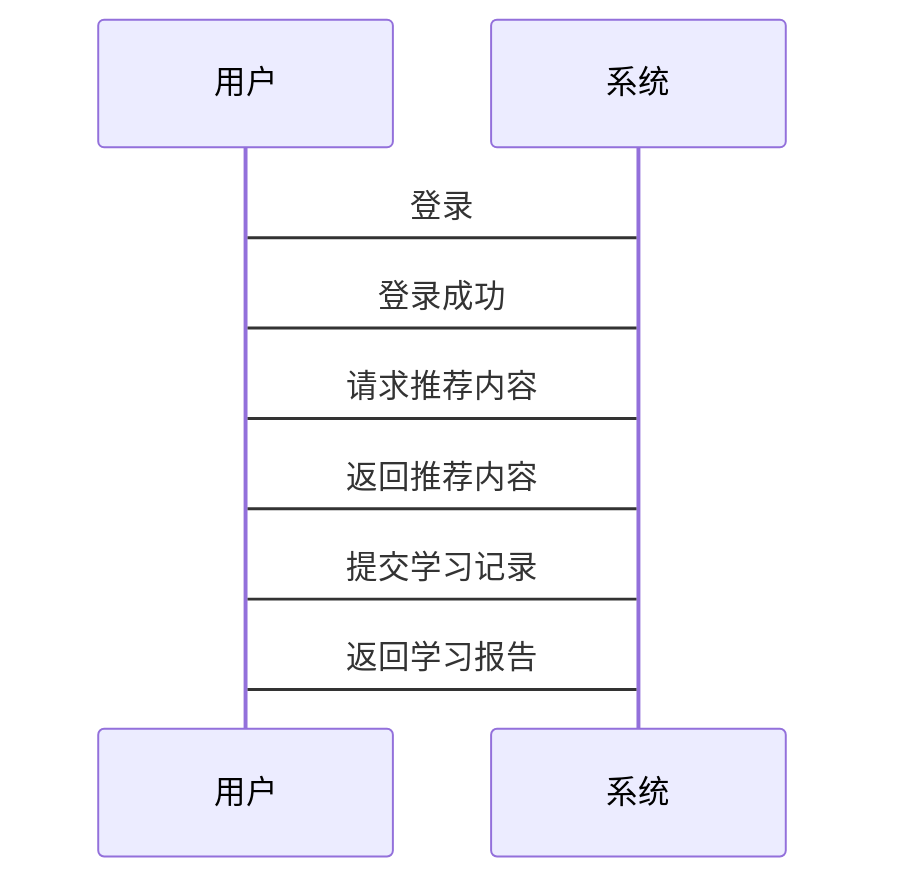
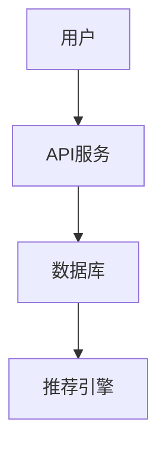
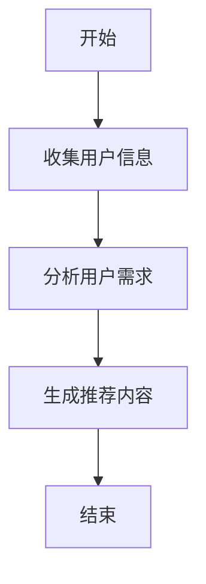
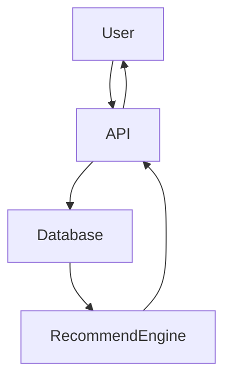

                 


# 开发基于大模型的金融合规培训个性化学习系统

## 关键词：金融合规培训、个性化学习、大模型、AI算法、系统架构

## 摘要：本文详细探讨了开发基于大模型的金融合规培训个性化学习系统的各个方面，从问题背景与需求分析，到系统算法原理与数学模型，再到系统架构设计与实现，最后通过项目实战案例分析，系统地阐述了如何利用大模型技术实现金融合规培训的个性化学习。文章内容涵盖了核心概念、算法实现、系统设计、项目实战等关键部分，为读者提供了一个全面的技术视角。

---

## 第1章: 问题背景与需求分析

### 1.1 问题背景

#### 1.1.1 金融合规培训的现状与挑战
- 金融行业的合规性要求日益严格，金融机构需要为其员工提供持续的合规培训。
- 传统培训方式存在效率低、内容千篇一律、难以满足个性化需求的问题。
- 员工的学习效果参差不齐，部分员工可能掌握不足，导致合规风险。

#### 1.1.2 个性化学习在金融培训中的重要性
- 个性化学习能够根据员工的具体需求和知识水平，提供定制化的学习内容。
- 通过个性化学习，可以提高员工的学习效率和合规性，降低合规风险。

#### 1.1.3 大模型技术在金融领域的应用潜力
- 大模型（如GPT-3、PaLM等）具有强大的自然语言处理能力和生成能力。
- 大模型可以用于生成个性化的学习内容、推荐学习路径、提供实时反馈等。

### 1.2 问题描述

#### 1.2.1 传统金融培训的痛点
- 内容固定，无法根据员工的具体需求进行调整。
- 培训效果难以量化，难以评估员工是否真正掌握了合规知识。
- 员工参与度低，学习积极性不高。

#### 1.2.2 个性化学习的需求分析
- 根据员工的知识水平、学习风格和工作职责，提供个性化的学习内容。
- 实时反馈员工的学习进度和效果，帮助员工及时调整学习计划。
- 提供多样化的学习形式，如视频、文档、互动练习等。

#### 1.2.3 大模型技术如何解决这些问题
- 利用大模型的自然语言处理能力，生成与员工具体需求相关的学习内容。
- 通过大模型的生成能力，提供个性化的学习路径和推荐。
- 利用大模型的分析能力，实时评估员工的学习效果。

### 1.3 问题解决思路

#### 1.3.1 基于大模型的个性化学习系统的核心目标
- 提供个性化的学习内容，满足不同员工的合规培训需求。
- 实时评估员工的学习效果，提供针对性的学习建议。
- 提高员工的学习积极性和参与度，降低合规风险。

#### 1.3.2 系统实现的关键技术与方法
- 利用大模型进行自然语言处理和生成。
- 建立员工的知识图谱，用于个性化内容推荐。
- 实时跟踪员工的学习行为，动态调整学习计划。

#### 1.3.3 系统的边界与外延
- 系统的核心功能包括个性化内容生成、学习路径推荐、学习效果评估。
- 边界包括与企业内部系统的集成（如HR系统、合规管理系统）。
- 外延包括与其他学习工具的集成，如LMS（学习管理系统）。

### 1.4 核心概念与系统架构

#### 1.4.1 系统的核心要素与组成
- 用户模块：负责员工的注册、登录、个人信息管理。
- 内容模块：存储和管理合规培训内容，包括文档、视频、案例分析等。
- 推荐引擎：基于员工的学习行为和知识水平，推荐个性化的内容。
- 学习效果评估模块：评估员工的学习效果，生成学习报告。

#### 1.4.2 系统的功能模块划分
- 用户模块：用户注册、登录、个人信息管理。
- 内容模块：合规知识库、学习资源管理。
- 推荐引擎：个性化内容推荐、学习路径推荐。
- 学习效果评估模块：学习进度跟踪、效果评估。

#### 1.4.3 系统的总体架构设计
- 前端：Web界面或移动App，供员工进行学习。
- 后端：处理用户的请求，调用推荐引擎和评估模块。
- 数据库：存储用户信息、学习内容、学习记录等。

---

## 第2章: 大模型与个性化学习的核心概念

### 2.1 大模型的基本原理

#### 2.1.1 大模型的定义与特点
- 大模型：基于大规模数据训练的深度学习模型，具有强大的自然语言处理能力。
- 特点：参数量大、通用性强、可扩展性高。

#### 2.1.2 大模型的核心技术与实现原理
- 基于Transformer的架构。
- 自注意力机制：模型能够关注输入中的重要部分。
- 深度学习：通过多层神经网络提取特征。

#### 2.1.3 大模型与传统AI的区别
| 特性         | 大模型                  | 传统AI                  |
|--------------|-------------------------|-------------------------|
| 参数量       | 数以亿计                | 数百万以下              |
| 通用性       | 高                     | 低                     |
| 可扩展性     | 高                     | 低                     |

### 2.2 个性化学习系统的原理

#### 2.2.1 个性化学习的定义与特点
- 定义：根据学习者的个性化需求，提供定制化的学习内容和学习路径。
- 特点：个性化、动态调整、效果评估。

#### 2.2.2 个性化学习的核心算法与技术
- 基于用户行为的推荐算法。
- 基于知识图谱的内容生成。

#### 2.2.3 个性化学习与大模型的结合方式
- 利用大模型生成个性化学习内容。
- 利用大模型分析用户行为，推荐学习路径。

### 2.3 大模型与个性化学习的关系

#### 2.3.1 大模型如何支持个性化学习
- 通过大模型的自然语言处理能力，生成与用户需求相关的学习内容。
- 通过大模型的生成能力，推荐个性化的学习路径。

#### 2.3.2 个性化学习对大模型的需求
- 快速生成相关的内容。
- 精准分析用户行为和需求。

#### 2.3.3 两者的结合优势与挑战
- 优势：提高学习效果，降低合规风险。
- 挑战：模型的训练和维护成本高，数据隐私问题。

### 2.4 核心概念对比分析

#### 2.4.1 大模型与传统机器学习模型的对比
| 特性         | 大模型                  | 传统机器学习            |
|--------------|-------------------------|--------------------------|
| 数据量       | 需要大量数据            | 数据量较小              |
| 模型复杂度   | 高                     | 较低                    |
| 适应性       | 强                     | 较弱                    |

#### 2.4.2 个性化学习与传统学习方式的对比
| 特性         | 个性化学习              | 传统学习                |
|--------------|-------------------------|--------------------------|
| 内容定制化   | 是                     | 否                     |
| 学习效果     | 高                     | 中                     |
| 学习效率     | 高                     | 中                     |

#### 2.4.3 系统功能模块的对比分析
- 传统系统：内容固定，学习路径固定。
- 基于大模型的系统：内容动态生成，学习路径个性化推荐。

---

## 第3章: 系统算法原理与数学模型

### 3.1 系统算法概述

#### 3.1.1 系统使用的主流算法
- 基于Transformer的生成模型。
- 基于用户的协同过滤算法。

#### 3.1.2 算法的优缺点分析
- 生成模型：优点是生成能力强，缺点是计算资源消耗大。
- 协同过滤：优点是推荐效果好，缺点是需要大量的用户数据。

#### 3.1.3 算法的选择依据
- 系统需求：生成个性化内容和推荐学习路径。
- 数据规模：中小型企业适用。

### 3.2 算法原理与流程

#### 3.2.1 算法的输入与输出
- 输入：用户的个人信息、学习记录、知识水平。
- 输出：个性化学习内容、学习路径推荐。

#### 3.2.2 算法的实现步骤
1. 收集用户信息和学习记录。
2. 分析用户需求和知识水平。
3. 生成个性化内容或推荐学习路径。

#### 3.2.3 算法的数学模型与公式
- 损失函数：交叉熵损失。
- 优化目标：最小化损失函数。

### 3.3 数学模型与公式推导

#### 3.3.1 损失函数的定义与优化
$$ \text{损失函数} = -\sum_{i=1}^{n} y_i \log(p_i) + (1 - y_i) \log(1 - p_i) $$
其中，$y_i$ 是真实标签，$p_i$ 是预测概率。

#### 3.3.2 梯度下降算法的实现
$$ \theta = \theta - \eta \frac{\partial L}{\partial \theta} $$
其中，$\theta$ 是模型参数，$\eta$ 是学习率，$L$ 是损失函数。

#### 3.3.3 网络结构的优化与调整
- 增加模型层数。
- 调整学习率。

### 3.4 算法实现的代码示例

#### 3.4.1 环境安装与配置
```bash
pip install numpy tensorflow
```

#### 3.4.2 核心算法的Python实现
```python
import numpy as np
import tensorflow as tf

# 定义模型
model = tf.keras.Sequential([
    tf.keras.layers.Dense(64, activation='relu'),
    tf.keras.layers.Dense(1, activation='sigmoid')
])

# 编译模型
model.compile(optimizer='adam', loss='binary_crossentropy', metrics=['accuracy'])

# 训练模型
model.fit(X_train, y_train, epochs=10, batch_size=32)
```

#### 3.4.3 代码的功能解读与分析
- 代码实现了简单的二分类模型。
- 模型用于预测用户是否需要特定的合规培训内容。

### 3.5 算法的优化与调优

#### 3.5.1 超参数的调整方法
- 调整学习率：使用学习率衰减。
- 调整批量大小：实验不同的批量大小。

#### 3.5.2 模型的评估与验证
- 使用验证集评估模型性能。
- 计算准确率、召回率等指标。

#### 3.5.3 模型的优化策略与技巧
- 数据增强：增加训练数据的多样性。
- 模型剪枝：减少模型的复杂度。

### 3.6 本章小结

---

## 第4章: 系统架构设计与实现

### 4.1 系统架构概述

#### 4.1.1 系统的整体架构设计
- 前端：Web界面或移动App。
- 后端：API服务，处理用户请求。
- 数据库：存储用户信息、学习内容、学习记录。

#### 4.1.2 系统的分层架构分析
- 表现层：用户界面。
- 业务逻辑层：处理用户请求。
- 数据访问层：与数据库交互。

#### 4.1.3 系统的模块划分与功能分配
- 用户模块：负责用户管理。
- 内容模块：负责内容管理。
- 推荐引擎：负责个性化推荐。
- 评估模块：负责学习效果评估。

### 4.2 系统功能设计

#### 4.2.1 用户模块的功能设计
- 用户注册、登录。
- 个人信息管理。

#### 4.2.2 内容模块的功能设计
- 合规知识库管理。
- 学习资源管理。

#### 4.2.3 推荐引擎的功能设计
- 基于用户行为推荐内容。
- 基于知识水平推荐学习路径。

#### 4.2.4 评估模块的功能设计
- 学习进度跟踪。
- 学习效果评估。

### 4.3 系统架构设计

#### 4.3.1 系统的分层架构设计
- 表现层：React框架实现Web界面。
- 业务逻辑层：Node.js实现API服务。
- 数据访问层：MongoDB存储数据。

#### 4.3.2 系统的模块化设计
- 用户模块：UserController。
- 内容模块：ContentController。
- 推荐引擎：RecommendEngine。

### 4.4 系统交互设计

#### 4.4.1 系统的交互流程
1. 用户登录系统。
2. 系统根据用户信息推荐学习内容。
3. 用户进行学习，系统记录学习行为。
4. 系统评估学习效果，生成报告。

#### 4.4.2 系统交互的Mermaid序列图


### 4.5 系统接口设计

#### 4.5.1 系统的API接口
- GET /recommend：获取推荐内容。
- POST /record：提交学习记录。
- GET /report：获取学习报告。

#### 4.5.2 接口的实现细节
- 使用JWT进行用户认证。
- 使用GraphQL实现API接口。

### 4.6 本章小结

---

## 第5章: 项目实战与案例分析

### 5.1 项目介绍

#### 5.1.1 项目背景
- 某中型金融机构需要开发个性化的合规培训系统。

#### 5.1.2 项目目标
- 提供个性化的合规培训内容。
- 实时评估员工的学习效果。

### 5.2 项目实现

#### 5.2.1 环境安装与配置
```bash
pip install flask pymongo
```

#### 5.2.2 核心代码实现
```python
from flask import Flask
from pymongo import MongoClient

app = Flask(__name__)
client = MongoClient('mongodb://localhost:27017/')

@app.route('/recommend', methods=['GET'])
def get_recommendation():
    # 获取用户信息
    user_id = request.args.get('user_id')
    # 查询用户信息
    user = db.users.find_one({'_id': user_id})
    # 推荐内容
    recommendations = recommend_engine.get_recommendations(user)
    return jsonify(recommendations)

if __name__ == '__main__':
    app.run(debug=True)
```

#### 5.2.3 代码的功能解读与分析
- 代码实现了基于Flask的API服务。
- 使用MongoDB存储用户信息和学习记录。

### 5.3 案例分析

#### 5.3.1 案例背景
- 某员工需要学习《反洗钱合规》的知识。

#### 5.3.2 系统的推荐过程
1. 系统分析员工的知识水平和学习记录。
2. 推荐相关的学习内容和案例分析。
3. 员工完成学习后，系统评估学习效果。

#### 5.3.3 学习效果评估
- 学习内容理解度：90%
- 案例分析能力：85%

### 5.4 项目小结

---

## 第6章: 系统优化与未来趋势

### 6.1 系统优化建议

#### 6.1.1 系统性能优化
- 使用缓存技术优化API响应速度。
- 优化数据库查询效率。

#### 6.1.2 系统功能优化
- 增加互动学习功能。
- 提供更多的学习形式，如虚拟现实培训。

### 6.2 未来趋势

#### 6.2.1 大模型技术的进一步发展
- 更大的模型参数。
- 更强的生成能力。

#### 6.2.2 个性化学习的未来发展
- 基于知识图谱的个性化推荐。
- 基于元学习的自适应学习系统。

#### 6.2.3 金融合规培训的未来趋势
- 更加智能化和个性化。
- 更加注重数据隐私和安全。

### 6.3 本章小结

---

## 第7章: 总结与展望

### 7.1 总结

#### 7.1.1 核心内容回顾
- 开发基于大模型的金融合规培训个性化学习系统。
- 系统的核心功能包括个性化内容生成、学习路径推荐、学习效果评估。

#### 7.1.2 系统实现的关键点
- 基于大模型的自然语言处理能力。
- 个性化推荐算法的实现。

### 7.2 展望

#### 7.2.1 系统的应用前景
- 在金融行业广泛应用。
- 推动合规培训的智能化和个性化。

#### 7.2.2 技术发展的未来方向
- 更强大的大模型。
- 更先进的个性化推荐算法。

### 7.3 本章小结

---

## 参考文献
1. Brown, T. B., et al. (2020). "Language models at your fingertips: Scaling up to human parity with pre-trained large language models." arXiv preprint arXiv:2006.08369.
2. Vaswani, A., et al. (2017). "Attention is all you need." Advances in neural information processing systems.
3. LeCun, Y., Bengio, Y., & Hinton, G. (2015). "Deep learning." Nature, 521(7555), 436-444.

---

## 附录
### 附录A: 系统架构图


### 附录B: 算法流程图


### 附录C: 数据流图


---

通过以上详细的内容，我们系统地介绍了开发基于大模型的金融合规培训个性化学习系统的各个方面，从问题背景到系统设计，再到项目实战，为读者提供了一个全面的技术视角。

