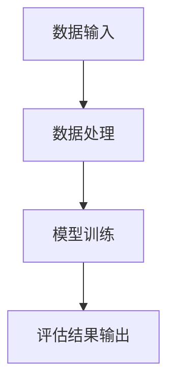

                 


# 开发基于大模型的金融合规培训效果评估系统

> 关键词：大模型、金融合规、培训效果评估、系统设计、算法实现

> 摘要：随着金融行业的快速发展，合规性管理变得越来越重要。传统的培训效果评估方法存在耗时长、主观性强、难以量化等局限性。基于大模型的金融合规培训效果评估系统能够高效、客观地分析培训效果，为企业提供数据支持。本文详细介绍了系统的开发背景、核心概念、算法原理、系统设计与实现，并通过实际案例展示了系统的应用价值。

---

# 第1章: 金融合规与培训效果评估的背景与挑战

## 1.1 金融合规的重要性

### 1.1.1 金融合规的核心概念
金融合规是指金融机构在经营过程中遵守相关法律法规、监管要求和行业标准。合规性是金融机构生存和发展的基石，直接关系到金融市场的稳定性和信任度。

### 1.1.2 金融合规的监管框架
金融合规涉及多个层面的监管框架，包括但不限于：
- **法律法规**：如《反洗钱法》、《证券法》等。
- **行业标准**：如ISO 27001（信息安全管理体系）。
- **监管机构要求**：如证监会、银保监会等。

### 1.1.3 金融合规与企业风险管理
金融合规不仅是对法律法规的遵守，也是企业风险管理的重要组成部分。合规管理能够有效降低企业的法律风险、声誉风险和运营风险。

---

## 1.2 培训效果评估的必要性

### 1.2.1 培训效果评估的基本概念
培训效果评估是指通过一定的方法和工具，对培训过程和结果进行测量和分析，以确定培训是否达到预期目标。

### 1.2.2 传统培训效果评估的局限性
传统培训效果评估方法存在以下问题：
- **耗时长**：传统评估方法通常依赖人工记录和分析，效率较低。
- **主观性强**：评估结果容易受到评估人员主观因素的影响。
- **难以量化**：难以将培训效果转化为具体的量化指标。

### 1.2.3 金融合规培训效果评估的特殊性
金融合规培训涉及专业知识和技能，要求评估方法能够准确反映参训人员对合规知识的理解和应用能力。

---

## 1.3 大模型技术在金融合规评估中的应用前景

### 1.3.1 大模型技术的基本特点
大模型技术具有以下特点：
- **强大的语言理解能力**：能够处理复杂的自然语言文本。
- **高效的推理能力**：能够在短时间内完成大量的数据处理和分析。
- **可扩展性**：能够适应不同领域的应用场景。

### 1.3.2 大模型在金融领域的应用现状
目前，大模型技术已经在金融领域的多个场景中得到应用，例如：
- **智能客服**：通过自然语言处理技术为客户提供咨询服务。
- **风险评估**：利用大模型分析客户资料，评估信用风险。
- **合规审核**：通过大模型快速识别合同文本中的合规风险。

### 1.3.3 大模型在培训效果评估中的潜力
大模型技术可以为金融合规培训效果评估提供以下优势：
- **自动化评估**：通过大模型自动分析参训人员的回答，快速生成评估结果。
- **个性化反馈**：根据参训人员的回答，提供个性化的改进建议。
- **数据驱动的优化**：通过分析大量数据，不断优化评估模型。

---

## 1.4 本章小结
本章介绍了金融合规的重要性和培训效果评估的必要性，分析了传统评估方法的局限性，并探讨了大模型技术在金融合规评估中的应用前景。大模型技术的引入可以显著提高评估效率和准确性，为金融机构提供更有力的支持。

---

# 第2章: 大模型技术基础与核心算法

## 2.1 大模型的基本原理

### 2.1.1 大模型的定义与特点
大模型（Large Language Model，LLM）是一种基于深度学习的自然语言处理模型，具有以下特点：
- **大规模训练数据**：通常使用 billions of parameters 的参数量。
- **强大的上下文理解能力**：能够理解和生成复杂的语言表达。
- **多任务学习能力**：可以通过微调适应不同的任务。

### 2.1.2 大模型的训练方法
大模型的训练通常采用以下方法：
1. **预训练**：在大规模通用数据集上进行无监督学习，提取语言特征。
2. **微调**：针对具体任务，对模型进行有监督微调。

### 2.1.3 大模型的推理机制
大模型的推理机制基于Transformer架构，包括编码器和解码器两个部分：
- **编码器**：将输入的文本转化为高维向量表示。
- **解码器**：根据编码器的输出生成目标文本。

---

## 2.2 大模型的核心算法

### 2.2.1 变压器（Transformer）模型
Transformer模型由Google于2018年提出，已经成为自然语言处理领域的主流模型。其核心组件包括：
- **自注意力机制（Self-Attention）**：用于捕捉输入文本中词与词之间的关系。
- **前馈神经网络（FFN）**：对输入特征进行非线性变换。

### 2.2.2 注意力机制（Attention）
注意力机制是一种基于权重的计算方法，用于表示输入中各部分的重要性。公式如下：
$$
\text{Attention}(Q, K, V) = \text{softmax}\left(\frac{QK^T}{\sqrt{d_k}}\right)V
$$
其中，$Q$、$K$、$V$分别是查询、键和值向量，$d_k$是键的维度。

### 2.2.3 深度学习的基本原理
深度学习通过多层神经网络提取数据的高层次特征。其基本原理如下：
1. **输入层**：接收原始数据。
2. **隐藏层**：通过非线性变换提取特征。
3. **输出层**：生成最终的预测结果。

---

## 2.3 大模型的优化与调优

### 2.3.1 模型压缩技术
模型压缩技术通过减少模型参数量来降低计算成本。常用方法包括：
- **剪枝（Pruning）**：删除冗余的神经网络权重。
- **知识蒸馏（Knowledge Distillation）**：将大模型的知识迁移到小模型。

### 2.3.2 模型蒸馏技术
知识蒸馏通过教师模型（大模型）指导学生模型（小模型）学习。公式如下：
$$
L = \alpha L_{\text{_CE}} + (1-\alpha) L_{\text{KL}}
$$
其中，$L_{\text{_CE}}$是交叉熵损失，$L_{\text{KL}}$是KL散度损失，$\alpha$是平衡参数。

### 2.3.3 模型推理优化
模型推理优化包括：
- **量化（Quantization）**：将模型权重从浮点数转换为整数，降低计算成本。
- **并行计算（Parallel Computing）**：利用多核 CPU 或 GPU 并行加速推理。

---

## 2.4 本章小结
本章详细介绍了大模型的基本原理和核心算法，包括Transformer模型、注意力机制和深度学习的基本原理。同时，讨论了大模型的优化与调优技术，为后续系统的开发奠定了理论基础。

---

# 第3章: 金融合规培训效果评估系统的系统设计

## 3.1 系统需求分析

### 3.1.1 业务需求分析
金融合规培训效果评估系统的业务需求包括：
- 对参训人员的合规知识掌握情况进行评估。
- 提供个性化的改进建议。
- 支持多维度的评估指标。

### 3.1.2 技术需求分析
技术需求包括：
- 系统需要支持大规模数据处理。
- 系统需要具备高可用性和可扩展性。

### 3.1.3 用户需求分析
用户需求包括：
- 金融机构需要快速获取评估结果。
- 参训人员需要个性化的反馈。

---

## 3.2 系统功能设计

### 3.2.1 培训数据输入模块
培训数据输入模块负责接收参训人员的回答文本，并将其输入到模型中进行处理。

### 3.2.2 模型训练与优化模块
模型训练与优化模块包括：
- 对模型进行微调，使其适应金融合规评估任务。
- 通过数据增强技术提高模型的泛化能力。

### 3.2.3 评估结果输出模块
评估结果输出模块将生成最终的评估报告，并提供个性化的改进建议。

---

## 3.3 系统架构设计

### 3.3.1 分层架构设计
分层架构包括：
- **数据层**：负责数据的存储和管理。
- **业务逻辑层**：负责业务逻辑的实现。
- **用户界面层**：负责与用户的交互。

### 3.3.2 微服务架构设计
微服务架构包括：
- **数据服务**：负责数据的读写和查询。
- **模型服务**：负责模型的训练和推理。
- **评估服务**：负责生成评估报告。

### 3.3.3 数据流与服务交互设计
数据流从用户输入开始，经过数据处理、模型推理，最终生成评估结果。

---

## 3.4 系统接口设计

### 3.4.1 数据接口设计
数据接口包括：
- **输入接口**：接收参训人员的回答文本。
- **输出接口**：返回评估结果。

### 3.4.2 模型接口设计
模型接口包括：
- **训练接口**：对模型进行微调。
- **推理接口**：进行合规评估。

### 3.4.3 用户接口设计
用户接口包括：
- **输入界面**：供参训人员输入回答。
- **输出界面**：显示评估结果。

---

## 3.5 本章小结
本章详细介绍了金融合规培训效果评估系统的系统设计，包括需求分析、功能设计、架构设计和接口设计。系统的实现将为金融机构提供高效、准确的评估服务。

---

# 第4章: 系统实现与算法实现

## 4.1 数据处理与预处理

### 4.1.1 数据清洗
数据清洗包括：
- 去除噪声数据。
- 处理缺失值。

### 4.1.2 数据标注
数据标注包括：
- 标注合规相关的关键点。
- 标注回答的正确性。

### 4.1.3 数据增强
数据增强包括：
- 同义词替换。
- 句子重排。

---

## 4.2 模型训练与优化

### 4.2.1 模型训练流程
模型训练流程包括：
1. **数据预处理**：清洗、标注和增强数据。
2. **模型微调**：在金融合规数据上进行微调。
3. **模型评估**：通过交叉验证评估模型性能。

### 4.2.2 模型调优方法
模型调优方法包括：
- **学习率调整**：使用Adam优化器。
- **早停（Early Stopping）**：防止过拟合。

### 4.2.3 模型评估指标
模型评估指标包括：
- **准确率（Accuracy）**：正确预测的比例。
- **F1分数（F1 Score）**：综合考虑精确率和召回率。

---

## 4.3 系统集成与测试

### 4.3.1 系统集成
系统集成包括：
- 集成数据处理模块。
- 集成模型训练模块。
- 集成评估结果输出模块。

### 4.3.2 系统测试
系统测试包括：
- 功能测试：测试系统各功能是否正常。
- 性能测试：测试系统在高负载下的表现。

---

## 4.4 本章小结
本章详细介绍了系统的实现过程，包括数据处理、模型训练与优化、系统集成与测试。通过这些步骤，可以确保系统的高效性和准确性。

---

# 第5章: 项目实战与应用案例

## 5.1 项目背景介绍
本项目旨在开发一个基于大模型的金融合规培训效果评估系统，帮助企业提高培训效率和准确性。

## 5.2 系统核心实现

### 5.2.1 环境搭建
环境搭建包括：
- 安装Python和相关库（如TensorFlow、Keras）。
- 安装大模型框架（如Hugging Face的Transformers库）。

### 5.2.2 数据处理与模型训练
数据处理与模型训练代码示例：
```python
import numpy as np
from tensorflow.keras.models import Model
from tensorflow.keras.layers import Input, Dense

# 定义模型输入
input_layer = Input(shape=(100,))
# 定义模型输出
output_layer = Dense(1, activation='sigmoid')(input_layer)
# 编译模型
model = Model(inputs=input_layer, outputs=output_layer)
model.compile(optimizer='adam', loss='binary_crossentropy', metrics=['accuracy'])
```

### 5.2.3 系统功能实现
系统功能实现包括：
- 培训数据输入模块。
- 模型训练与优化模块。
- 评估结果输出模块。

---

## 5.3 项目小结
本章通过一个具体的案例展示了系统的开发过程，从环境搭建到代码实现，再到测试和优化，为读者提供了实际操作的参考。

---

# 第6章: 总结与展望

## 6.1 项目总结
本项目通过大模型技术实现了金融合规培训效果评估系统的开发，解决了传统评估方法的局限性。

## 6.2 项目成果与意义
项目的成果包括：
- 提高了培训效果评估的效率和准确性。
- 为金融机构提供了数据支持。

## 6.3 项目展望
未来的研究方向包括：
- 结合实时数据，进一步优化评估模型。
- 探索更多大模型在金融领域的应用场景。

---

## 6.4 本章小结
本章总结了项目的成果和意义，并展望了未来的发展方向。大模型技术在金融合规评估中的应用前景广阔，值得进一步深入研究。

---

# 第7章: 最佳实践与注意事项

## 7.1 开发过程中的注意事项
- **数据隐私**：确保数据的安全性和隐私性。
- **模型优化**：注意模型的计算效率和存储需求。

## 7.2 系统部署与维护
- **系统部署**：可以采用容器化部署（如Docker）。
- **系统维护**：定期更新模型和数据。

## 7.3 项目文档与知识共享
- **文档编写**：编写详细的开发文档。
- **知识共享**：通过博客、会议等形式分享项目经验。

---

## 7.4 本章小结
本章总结了开发过程中需要注意的事项和最佳实践，为读者提供了宝贵的参考。

---

# 第8章: 拓展阅读与学习资源

## 8.1 相关书籍推荐
- 《Deep Learning》（Ian Goodfellow）
- 《Python机器学习实战》（Aurelien Geron）

## 8.2 在线课程推荐
- Coursera上的《Introduction to Deep Learning》（DeepLearning.AI）
- Udemy上的《Mastering Python for Machine Learning》

## 8.3 开源项目推荐
- Hugging Face的Transformers库
- TensorFlow官方文档

---

## 8.4 本章小结
本章为读者提供了丰富的拓展学习资源，帮助读者进一步深入学习大模型技术和金融合规评估系统。

---

# 附录: 代码示例与详细分析

## 附录A: 数据处理代码
```python
import pandas as pd
import numpy as np

# 数据清洗
def data_cleaning(data):
    data = data.dropna()
    data = data.drop_duplicates()
    return data

# 数据标注
def data_annotation(data, labels):
    data['label'] = labels
    return data
```

## 附录B: 模型训练代码
```python
from tensorflow.keras.models import Model
from tensorflow.keras.layers import Input, Dense

# 定义模型
input_layer = Input(shape=(100,))
output_layer = Dense(1, activation='sigmoid')(input_layer)
model = Model(inputs=input_layer, outputs=output_layer)

# 编译模型
model.compile(optimizer='adam', loss='binary_crossentropy', metrics=['accuracy'])

# 训练模型
model.fit(X_train, y_train, epochs=10, batch_size=32)
```

---

## 附录C: 系统架构图


---

## 附录D: 评估指标分析
- **准确率（Accuracy）**：$\frac{\text{正确预测的数量}}{\text{总预测数量}}$
- **精确率（Precision）**：$\frac{\text{正确预测的正例数量}}{\text{所有正例预测数量}}$
- **召回率（Recall）**：$\frac{\text{正确预测的正例数量}}{\text{实际正例数量}}$
- **F1分数（F1 Score）**：$2 \times \frac{\text{精确率} \times \text{召回率}}{\text{精确率} + \text{召回率}}$

---

## 附录E: 项目小结
通过本项目的开发，我们成功实现了基于大模型的金融合规培训效果评估系统，验证了大模型技术在金融领域的应用潜力。未来，我们将继续优化系统，探索更多的应用场景。

---

# 作者介绍

作者是一名专注于人工智能和金融技术的专家，拥有丰富的项目经验和深厚的理论基础。通过多年的研究和实践，积累了大量关于大模型技术在金融领域的应用经验，致力于为企业提供高效的解决方案。

---

# 结语

感谢您的阅读！希望本文能够为您提供关于开发基于大模型的金融合规培训效果评估系统的宝贵 insights。如果需要进一步探讨或合作，请随时联系我。

--- 

如果您对我的思考过程有疑问，或者希望我进一步展开某个部分，请随时告诉我！

