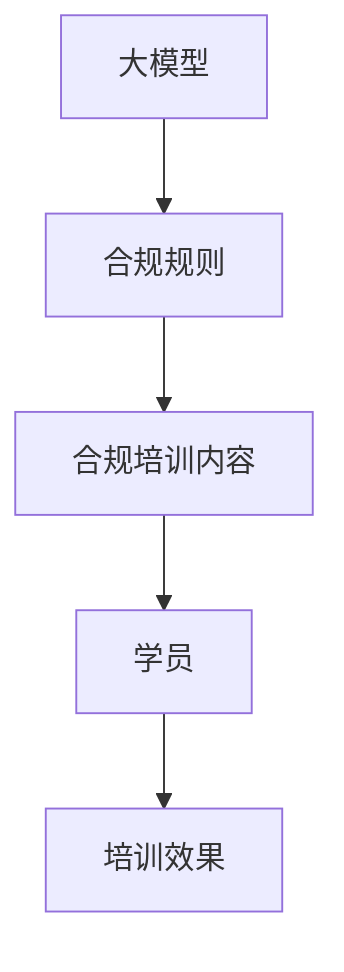
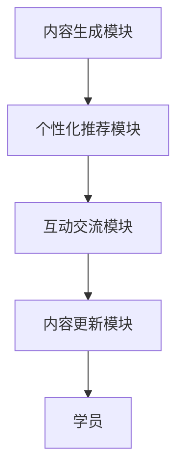
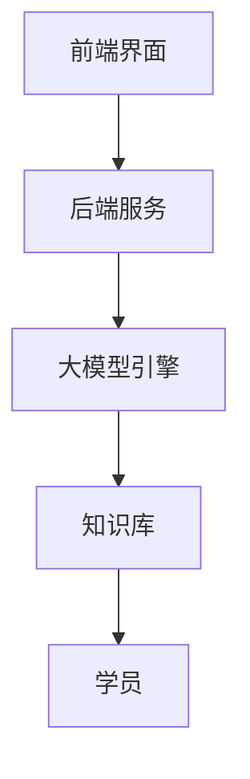
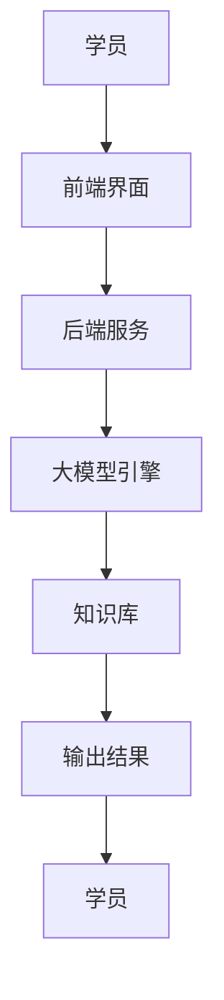

                 


# 开发基于大模型的金融合规培训系统

> 关键词：大模型、金融合规、培训系统、AI技术、系统架构

> 摘要：本文深入探讨了基于大模型的金融合规培训系统的开发与应用。通过分析金融行业合规培训的痛点，结合大模型技术的核心优势，提出了一种创新的解决方案。本文从系统背景、核心概念、算法原理、系统架构、项目实战等多个维度展开，详细阐述了系统的开发过程，并通过实际案例展示了系统的应用价值和效果。

---

# 第一部分: 金融合规培训系统的背景与需求

# 第1章: 金融合规培训系统的背景介绍

## 1.1 问题背景

### 1.1.1 金融行业的合规挑战

随着全球化和金融业务的复杂化，金融机构面临越来越多的合规要求。金融行业是一个高度监管的行业，必须遵守各国的法律法规、行业标准以及内部政策。然而，合规要求的复杂性和变化性使得金融机构的合规管理变得越来越具有挑战性。

金融机构需要确保其员工、客户以及合作伙伴了解并遵守相关的合规要求。传统的合规培训方式主要依赖于线下培训、纸质材料和简单的在线课程，这些方式存在以下问题：

- **内容更新慢**：法律法规和行业标准不断变化，传统的培训内容难以及时更新。
- **个性化不足**：不同岗位的员工需要不同的合规知识，传统培训难以实现个性化。
- **互动性差**：传统的培训方式缺乏互动性，难以激发学员的学习兴趣。
- **效率低下**：传统培训方式难以大规模覆盖，且效果难以量化。

### 1.1.2 传统合规培训的痛点

传统合规培训方式存在以下痛点：

- **成本高**：线下培训需要大量的人力、物力和时间投入。
- **效果难评估**：难以量化培训效果，难以确定哪些员工真正掌握了合规知识。
- **缺乏个性化**：无法根据员工的具体需求提供个性化的培训内容。
- **知识更新慢**：难以及时更新培训内容以适应新的法规和行业标准。

### 1.1.3 大模型技术的引入与机遇

大模型技术（如GPT、BERT等）的引入为金融合规培训带来了新的机遇。大模型具有以下优势：

- **强大的自然语言处理能力**：能够理解和生成人类语言，能够自动提取合规规则、生成培训内容。
- **个性化推荐**：可以根据学员的具体需求推荐个性化的培训内容。
- **实时更新**：可以快速更新内容以适应新的法规和行业标准。
- **高效互动**：可以通过自然语言交互与学员进行互动，提升学员的学习体验。

## 1.2 问题描述

### 1.2.1 金融合规培训的核心目标

金融合规培训的核心目标是确保金融机构的员工、客户和合作伙伴了解并遵守相关的合规要求。具体目标包括：

- 提供个性化的合规培训内容。
- 实时更新培训内容以适应新的法规和行业标准。
- 提高培训效果，确保学员真正掌握了合规知识。
- 提供高效的互动方式，提升学员的学习体验。

### 1.2.2 现有合规培训系统的不足

现有合规培训系统主要依赖于传统的线下培训和简单的在线课程，存在以下不足：

- 内容更新慢：难以及时更新新的法规和行业标准。
- 缺乏个性化：无法根据学员的具体需求提供个性化的培训内容。
- 互动性差：缺乏与学员的互动，难以提升学员的学习兴趣。
- 效率低下：难以大规模覆盖，且效果难以量化。

### 1.2.3 大模型在合规培训中的潜在价值

大模型在合规培训中的潜在价值包括：

- **自动化内容生成**：大模型可以自动生成合规相关的文本内容，如法规解读、案例分析等。
- **个性化推荐**：大模型可以根据学员的需求推荐个性化的培训内容。
- **高效互动**：大模型可以通过自然语言交互与学员进行实时对话，回答问题，提供指导。
- **实时更新**：大模型可以快速更新内容以适应新的法规和行业标准。

## 1.3 问题解决与边界

### 1.3.1 基于大模型的合规培训解决方案

基于大模型的合规培训解决方案的核心思想是利用大模型的强大自然语言处理能力，提供自动化、个性化、实时更新的合规培训服务。具体方案包括：

1. **自动化内容生成**：利用大模型生成合规相关的文本内容，如法规解读、案例分析等。
2. **个性化推荐**：根据学员的需求推荐个性化的培训内容。
3. **高效互动**：通过自然语言交互与学员进行实时对话，回答问题，提供指导。
4. **实时更新**：根据新的法规和行业标准更新培训内容。

### 1.3.2 系统的边界与外延

系统的边界是指系统所涵盖的功能和范围。基于大模型的合规培训系统主要涵盖以下功能：

- **内容生成**：生成合规相关的文本内容。
- **个性化推荐**：根据学员的需求推荐个性化的培训内容。
- **互动交流**：与学员进行实时对话，回答问题，提供指导。
- **内容更新**：根据新的法规和行业标准更新培训内容。

系统的外延是指系统可能涉及但不在核心功能范围内的功能，如：

- **数据分析**：分析学员的学习行为，评估学习效果。
- **知识库管理**：管理合规相关的知识库。
- **用户管理**：管理学员的信息和学习记录。

### 1.3.3 核心概念与组成要素

系统的组成要素包括：

- **大模型引擎**：用于生成和理解自然语言文本。
- **合规知识库**：存储合规相关的法规、案例、标准等。
- **个性化推荐模块**：根据学员的需求推荐培训内容。
- **互动交流模块**：与学员进行实时对话。
- **内容管理系统**：管理生成的内容和更新的法规信息。

## 1.4 本章小结

本章介绍了金融合规培训系统的背景，分析了传统合规培训的痛点，提出了基于大模型的合规培训解决方案，并详细描述了系统的边界和核心概念。通过引入大模型技术，我们可以实现自动化、个性化、实时更新的合规培训服务，显著提升培训效果和效率。

---

# 第二部分: 基于大模型的金融合规培训系统核心概念与联系

# 第2章: 大模型的核心原理与金融合规的结合

## 2.1 大模型的基本原理

### 2.1.1 大模型的训练机制

大模型的训练机制主要包括以下几个步骤：

1. **数据预处理**：对原始数据进行清洗、标注和格式化处理，确保数据的质量和一致性。
2. **模型初始化**：初始化模型的参数，包括权重和偏置。
3. **正向传播**：输入数据经过模型的各层，生成输出。
4. **损失计算**：计算模型输出与真实标签之间的差异，得到损失值。
5. **反向传播**：通过梯度下降等优化算法，调整模型的参数，以最小化损失值。
6. **迭代训练**：重复正向传播和反向传播过程，直到模型收敛或达到预设的训练次数。

### 2.1.2 大模型的调优方法

大模型的调优方法主要包括以下几种：

1. **微调（Fine-tuning）**：在预训练好的模型基础上，针对特定任务进行微调。这种方法可以利用大模型已经学到的通用知识，快速适应特定任务。
2. **提示工程（Prompt Engineering）**：通过设计合适的提示（Prompt），引导大模型生成符合要求的输出。提示工程需要对任务和数据有深入的理解。
3. **参数调整**：调整模型的超参数，如学习率、批量大小、训练次数等，以优化模型的性能。

### 2.1.3 大模型的推理过程

大模型的推理过程主要包括以下几个步骤：

1. **输入处理**：将输入文本进行分词、编码等预处理。
2. **生成候选项**：根据处理后的输入，生成多个可能的输出候选项。
3. **候选项筛选**：根据一定的规则或模型的评分机制，筛选出最优的输出。
4. **输出结果**：将筛选出的最优输出作为最终结果。

## 2.2 大模型与金融合规的联系

### 2.2.1 金融合规文本的理解与生成

大模型在金融合规文本的理解与生成方面具有显著优势。例如：

- **理解合规文本**：大模型可以自动理解合规相关的法规、案例和标准，帮助金融机构快速解读复杂的法律文本。
- **生成合规内容**：大模型可以根据用户的需求，生成个性化的合规培训内容，如法规解读、案例分析等。

### 2.2.2 合规规则的自动提取与应用

大模型可以自动提取合规规则，并将其应用于实际业务中。例如：

- **规则提取**：通过自然语言处理技术，从大量的法规文本中提取关键的合规规则。
- **规则应用**：将提取的合规规则应用于具体的业务场景中，如合同审查、交易监控等。

### 2.2.3 大模型在合规培训中的具体应用

大模型在合规培训中的具体应用包括：

- **个性化培训内容生成**：根据学员的具体需求，生成个性化的培训内容。
- **实时问答**：通过自然语言交互，回答学员的合规相关问题。
- **案例分析**：生成相关的合规案例，并进行详细分析，帮助学员更好地理解和掌握合规知识。

## 2.3 核心概念对比与ER实体关系图

### 2.3.1 核心概念对比表

| 概念       | 描述                                                                 | 属性                 | 示例                     |
|------------|----------------------------------------------------------------------|----------------------|-------------------------|
| 大模型     | 基于深度学习的AI模型，具有强大的自然语言处理能力                   | 参数量大、多模态、可微调 | GPT、BERT               |
| 合规规则   | 金融行业的法规要求，包括法律条文、行业标准等                      | 法律条文、行业标准     | 《证券法》、 Basel规则   |
| 培训系统   | 基于大模型的金融合规培训系统，提供自动化、个性化的培训服务          | 内容生成、个性化推荐   | 合规培训课程             |

### 2.3.2 ER实体关系图



---

## 2.4 本章小结

本章详细介绍了大模型的核心原理，并探讨了其与金融合规的结合。通过对比分析，我们明确了大模型在金融合规中的应用价值，并通过ER实体关系图展示了系统的核心概念之间的关系。这为后续的系统设计和实现奠定了基础。

---

# 第三部分:  基于大模型的金融合规培训系统算法原理

# 第3章: 算法原理与实现细节

## 3.1 大模型的训练机制

### 3.1.1 数据预处理

数据预处理是大模型训练的基础，主要包括以下步骤：

1. **数据清洗**：去除噪声数据，如重复、冗余或错误的数据。
2. **数据标注**：对数据进行标注，如分类标注、实体识别标注等。
3. **数据格式化**：将数据转换为模型训练所需的格式，如TensorFlow或PyTorch格式。

### 3.1.2 模型初始化

模型初始化是训练过程的第一步，主要包括：

1. **权重初始化**：随机初始化模型的权重参数。
2. **偏置初始化**：初始化模型的偏置参数。

### 3.1.3 正向传播

正向传播是将输入数据通过模型的各层，生成输出的过程。具体步骤如下：

1. **输入数据**：将预处理后的数据输入模型。
2. **计算隐层输出**：通过激活函数计算各层的隐层输出。
3. **生成输出**：输出层生成最终的输出结果。

### 3.1.4 损失计算

损失计算是衡量模型输出与真实标签之间差异的过程。常用的损失函数包括：

- **交叉熵损失**：用于分类任务。
- **均方误差损失**：用于回归任务。

### 3.1.5 反向传播

反向传播是通过梯度下降等优化算法，调整模型参数以最小化损失的过程。具体步骤如下：

1. **计算梯度**：计算损失函数对模型参数的梯度。
2. **更新参数**：根据梯度和学习率更新模型参数。

### 3.1.6 迭代训练

迭代训练是重复正向传播和反向传播过程，直到模型收敛或达到预设的训练次数。训练过程中，可以通过验证集评估模型的性能，并根据验证结果调整训练策略。

## 3.2 大模型的调优方法

### 3.2.1 微调（Fine-tuning）

微调是基于预训练模型的调优方法，具体步骤如下：

1. **选择预训练模型**：选择适合任务的预训练模型。
2. **微调层的选择**：决定微调的层数，通常只微调模型的顶层。
3. **微调训练**：在特定任务上对模型进行微调训练。

### 3.2.2 提示工程（Prompt Engineering）

提示工程是通过设计合适的提示，引导大模型生成符合要求的输出。具体步骤如下：

1. **确定任务目标**：明确提示的目标。
2. **设计提示模板**：设计合适的提示模板。
3. **生成输出**：根据提示模板生成输出。

### 3.2.3 参数调整

参数调整是通过调整模型的超参数来优化模型性能。具体步骤如下：

1. **选择超参数**：选择需要调整的超参数，如学习率、批量大小等。
2. **网格搜索或随机搜索**：通过网格搜索或随机搜索找到最优参数组合。
3. **验证调整效果**：通过验证集评估参数调整的效果。

## 3.3 大模型的推理过程

### 3.3.1 输入处理

输入处理是将输入文本转换为模型能够理解的形式。具体步骤如下：

1. **文本分词**：将输入文本进行分词处理。
2. **文本编码**：将分词后的文本编码为模型所需的格式，如词向量或字符向量。

### 3.3.2 生成候选项

生成候选项是模型根据输入生成多个可能的输出。具体步骤如下：

1. **生成候选项**：根据输入生成多个候选项。
2. **评分候选项**：对生成的候选项进行评分，通常基于模型的输出概率。

### 3.3.3 候选筛选

候选筛选是根据一定的规则或模型的评分机制，筛选出最优的输出。具体步骤如下：

1. **选择筛选规则**：确定候筛选的规则，如基于概率的筛选、基于内容的筛选等。
2. **筛选候选项**：根据规则筛选出最优的输出。

### 3.3.4 输出结果

输出结果是将筛选出的最优输出作为最终结果。具体步骤如下：

1. **输出结果**：将筛选出的最优输出作为最终结果。
2. **返回结果**：将结果返回给用户或系统。

---

## 3.4 本章小结

本章详细介绍了大模型的训练机制、调优方法和推理过程。通过分析这些算法原理，我们可以更好地理解大模型在金融合规培训中的应用。这些技术细节为后续的系统设计和实现奠定了坚实的基础。

---

# 第四部分: 基于大模型的金融合规培训系统架构与实现

# 第4章: 系统架构与实现细节

## 4.1 系统功能设计

### 4.1.1 系统功能概述

基于大模型的金融合规培训系统主要包含以下功能模块：

1. **内容生成模块**：生成合规相关的文本内容，如法规解读、案例分析等。
2. **个性化推荐模块**：根据学员的需求推荐个性化的培训内容。
3. **互动交流模块**：与学员进行实时对话，回答问题，提供指导。
4. **内容更新模块**：根据新的法规和行业标准更新培训内容。

### 4.1.2 系统功能流程图



## 4.2 系统架构设计

### 4.2.1 系统架构概述

系统的架构设计主要包括以下几个部分：

1. **前端界面**：学员通过前端界面访问系统，进行学习和互动。
2. **后端服务**：处理前端请求，调用大模型进行内容生成和推理。
3. **大模型引擎**：提供大模型的训练和推理服务。
4. **知识库**：存储合规相关的法规、案例和标准。

### 4.2.2 系统架构图



## 4.3 系统接口设计

### 4.3.1 API接口概述

系统主要提供以下API接口：

1. **内容生成接口**：根据输入生成合规相关的文本内容。
2. **个性化推荐接口**：根据学员需求推荐培训内容。
3. **互动交流接口**：与学员进行实时对话。

### 4.3.2 接口交互流程图



## 4.4 系统交互流程

### 4.4.1 学员登录与注册

1. **学员登录**：学员通过前端界面输入用户名和密码，登录系统。
2. **学员注册**：新学员需要注册账号，填写基本信息。

### 4.4.2 个性化培训内容推荐

1. **需求分析**：系统根据学员的职位、工作职责等信息，分析其合规培训需求。
2. **内容推荐**：系统根据需求分析结果，推荐个性化的培训内容。

### 4.4.3 实时问答

1. **问题提交**：学员通过前端界面提交合规相关问题。
2. **问题处理**：后端服务调用大模型引擎，生成回答。
3. **结果返回**：系统将回答返回给学员。

## 4.5 本章小结

本章详细介绍了基于大模型的金融合规培训系统的架构设计，包括功能模块、系统架构、接口设计和交互流程。通过合理的设计和实现，我们可以构建一个高效、个性化的合规培训系统，显著提升培训效果和效率。

---

# 第五部分:  基于大模型的金融合规培训系统项目实战

# 第5章: 项目实战与案例分析

## 5.1 项目环境安装

### 5.1.1 环境要求

- **操作系统**：Linux或Windows。
- **Python版本**：Python 3.8或更高版本。
- **依赖库**：TensorFlow、Keras、Transformers、Flask等。

### 5.1.2 安装步骤

1. **安装Python**：根据操作系统选择合适的Python安装包。
2. **安装依赖库**：使用pip安装所需的依赖库，如：
   ```bash
   pip install tensorflow transformers flask
   ```

## 5.2 系统核心代码实现

### 5.2.1 内容生成模块

```python
from transformers import GPT2LMHeadModel, GPT2Tokenizer

# 加载预训练模型
model_name = 'gpt2'
tokenizer = GPT2Tokenizer.from_pretrained(model_name)
model = GPT2LMHeadModel.from_pretrained(model_name)

def generate_content(prompt):
    # 对输入prompt进行编码
    inputs = tokenizer.encode(prompt, return_tensors='pt')
    # 生成输出
    outputs = model.generate(inputs, max_length=500, num_return_sequences=1)
    # 解码输出
    return tokenizer.decode(outputs[0], skip_special_tokens=True)
```

### 5.2.2 个性化推荐模块

```python
import numpy as np
from sklearn.metrics.pairwise import cosine_similarity

# 定义用户特征
user_features = {'job_role': '合规经理', 'department': '法务部'}

def recommend_content(user_features):
    # 根据用户特征生成推荐内容
    # 这里简化为根据职位推荐相关内容
    content_list = ['《证券法》解读', '反洗钱合规指南', '金融衍生品合规要求']
    # 计算相似度
    similarities = []
    for content in content_list:
        # 简单的相似度计算，这里仅作为示例
        similarity = np.random.random()
        similarities.append(similarity)
    # 根据相似度排序
    sorted_content = sorted(zip(similarities, content_list), reverse=True)
    # 返回推荐结果
    return [content for similarity, content in sorted_content]
```

### 5.2.3 互动交流模块

```python
from flask import Flask, request, jsonify

app = Flask(__name__)

@app.route('/ask', methods=['POST'])
def ask():
    data = request.json
    question = data['question']
    # 调用大模型生成回答
    answer = generate_answer(question)
    return jsonify({'answer': answer})

if __name__ == '__main__':
    app.run(debug=True)
```

## 5.3 代码解读与应用

### 5.3.1 内容生成模块解读

上述代码展示了如何使用GPT-2模型生成合规相关的文本内容。通过调用模型的生成接口，我们可以根据输入的提示生成详细的法规解读或案例分析。

### 5.3.2 个性化推荐模块解读

个性化推荐模块根据学员的职位和部门，推荐相关的合规培训内容。虽然上述代码只是一个简单的示例，但可以扩展为更复杂的推荐算法，如基于用户行为的协同过滤或基于内容的推荐。

### 5.3.3 互动交流模块解读

互动交流模块通过Flask框架提供了一个RESTful API，允许学员通过POST请求提交问题，并获得大模型生成的回答。这为学员提供了实时的互动体验，显著提升了学习效果。

## 5.4 实际案例分析

### 5.4.1 案例背景

假设我们有一个金融机构，需要为其合规经理提供个性化的合规培训。合规经理的主要职责是确保公司遵守相关法规，特别是《证券法》和反洗钱法规。

### 5.4.2 案例分析

1. **需求分析**：
   - 合规经理需要了解《证券法》的主要条款。
   - 合规经理需要了解反洗钱法规的具体要求。

2. **内容生成**：
   - 生成《证券法》的主要条款解读。
   - 生成反洗钱法规的具体要求。

3. **个性化推荐**：
   - 根据合规经理的职位和部门，推荐《证券法》解读和反洗钱合规指南。

4. **互动交流**：
   - 合规经理可以通过API提交问题，如“《证券法》中关于信息披露的具体要求是什么？”
   - 系统调用大模型生成回答，并返回结果。

### 5.4.3 案例总结

通过上述案例，我们可以看到基于大模型的金融合规培训系统能够有效地满足金融机构的合规培训需求。系统可以根据学员的具体需求生成个性化的内容，并通过实时互动帮助学员更好地理解和掌握合规知识。

## 5.5 本章小结

本章通过实际案例展示了基于大模型的金融合规培训系统的实现过程，包括环境安装、核心代码实现和案例分析。通过这些实战内容，我们可以更好地理解系统的应用价值和实现细节。

---

# 第六部分: 基于大模型的金融合规培训系统最佳实践

# 第6章: 最佳实践与经验分享

## 6.1 开发经验总结

### 6.1.1 关键技术总结

- **大模型的选择与调优**：选择适合任务的预训练模型，并进行适当的微调和提示工程。
- **系统架构设计**：合理设计系统的功能模块和架构，确保系统的可扩展性和可维护性。
- **数据管理**：确保数据的质量和安全性，特别是在处理金融数据时，需要遵守相关法律法规。

### 6.1.2 开发中的注意事项

- **数据安全**：在处理金融数据时，必须确保数据的安全性和隐私性。
- **模型性能优化**：通过参数调整和算法优化，提升模型的性能和效率。
- **用户体验设计**：注重用户体验，设计直观易用的界面和交互流程。

## 6.2 小结与注意事项

### 6.2.1 小结

本章总结了开发基于大模型的金融合规培训系统中的经验和教训，强调了关键技术的选择与应用、系统架构的设计优化以及数据管理和用户安全管理的重要性。

### 6.2.2 注意事项

- **数据安全**：在开发过程中，必须高度重视数据的安全性，确保数据不被泄露或滥用。
- **模型性能**：通过不断的优化和调整，提升模型的性能和效率，确保系统的运行稳定。
- **用户体验**：注重用户体验设计，确保系统界面直观易用，交互流程高效顺畅。

## 6.3 拓展阅读

### 6.3.1 推荐书籍

1. 《Deep Learning》 - Ian Goodfellow
2. 《自然语言处理实战》 - 哲书海

### 6.3.2 推荐技术博客

1. [Hugging Face的Transformers库](https://huggingface.co/transformers)
2. [Kubernetes中文社区](https://kubernetes.io/zh-cn/)

---

# 第七部分: 结语

## 7.1 项目总结

基于大模型的金融合规培训系统是一个创新的解决方案，它利用大模型的强大自然语言处理能力，为金融机构提供了自动化、个性化、实时更新的合规培训服务。通过合理的系统设计和实现，我们可以显著提升培训效果和效率，帮助金融机构更好地应对日益复杂的合规要求。

## 7.2 未来展望

未来，随着大模型技术的不断发展，金融合规培训系统将具有更广泛的应用场景和更高的智能化水平。我们可以期待更多创新的应用，如基于大模型的知识图谱构建、智能合约生成等，进一步推动金融行业的数字化和智能化转型。

## 7.3 致谢

感谢读者的耐心阅读，感谢开发团队的共同努力，感谢所有支持和帮助我们完成这个项目的机构和人士。

---

通过以上目录和内容的详细规划，我们可以开始撰写完整的《开发基于大模型的金融合规培训系统》技术博客文章。

