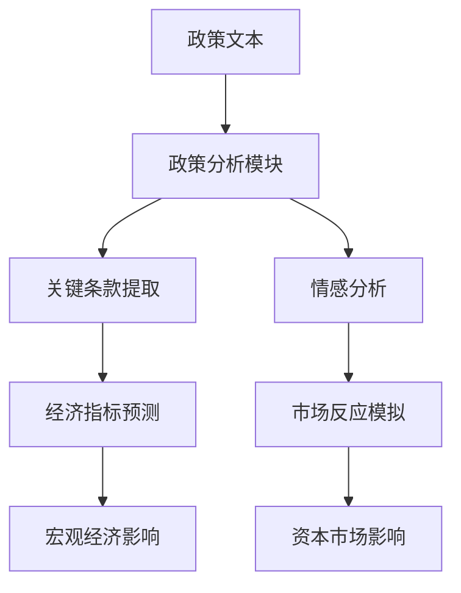
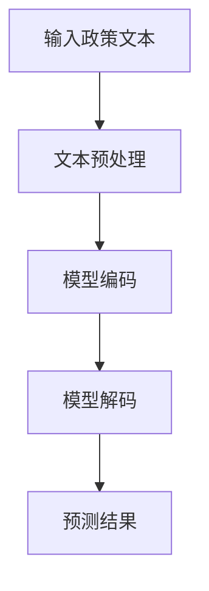
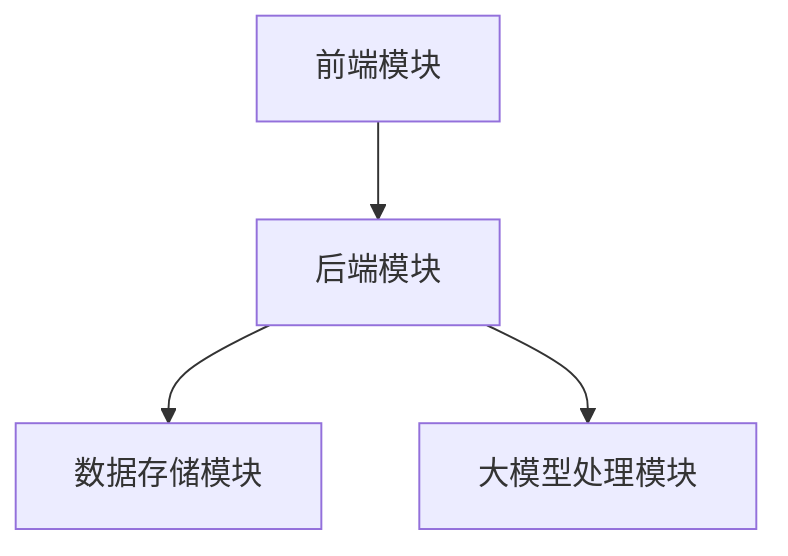
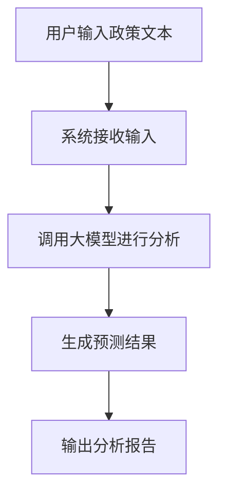

                 


# 开发基于大模型的金融政策影响评估工具

## 关键词：
- 大模型、金融政策、影响评估、自然语言处理、预测分析

## 摘要：
本文详细探讨了开发基于大模型的金融政策影响评估工具的全过程，从问题背景到系统实现，结合理论分析和实践案例，深入阐述了大模型在金融政策评估中的应用原理和实现方法，为相关领域的研究和实践提供了参考。

---

## 第一部分: 金融政策影响评估工具开发背景与需求分析

### 第1章: 金融政策影响评估工具概述

#### 1.1 问题背景与目标
##### 1.1.1 金融政策影响评估的重要性
金融政策的制定和实施对经济运行、市场行为和企业经营具有深远影响。传统的评估方法依赖于经济模型和专家经验，但存在数据量不足、预测精度低、分析维度有限等问题。大模型的引入为金融政策评估提供了新的技术手段。

##### 1.1.2 当前评估工具的局限性
- 数据依赖性：传统模型通常基于有限的历史数据，难以捕捉复杂市场环境下的多维度影响。
- 预测精度：传统统计模型在面对非线性关系和复杂事件时表现有限。
- 可解释性：部分高级模型（如随机森林）虽然预测能力强，但缺乏可解释性，难以满足金融领域的严格要求。

##### 1.1.3 基于大模型的解决方案优势
- 大模型具备强大的自然语言处理能力和深度学习能力，能够从海量文本数据中提取关键信息。
- 通过大模型，可以实现对政策文本的自动分析、经济指标的预测以及市场反应的模拟，显著提高评估的准确性和全面性。

#### 1.2 核心问题描述
##### 1.2.1 金融政策的多维度影响
金融政策可能影响股市、债市、汇率等多个市场，涉及宏观经济指标（如GDP、失业率）和微观市场行为（如企业投资、消费者行为）。

##### 1.2.2 数据复杂性与不确定性
金融数据具有高度的波动性和不确定性，政策文本的解读也存在主观性和模糊性，这对模型的鲁棒性和泛化能力提出了更高要求。

##### 1.2.3 传统评估方法的局限性
传统方法通常基于假设和简化模型，难以应对复杂多变的金融环境。

#### 1.3 问题解决思路
##### 1.3.1 大模型在金融分析中的潜力
- 大模型可以处理结构化和非结构化数据，具备强大的模式识别能力。
- 通过预训练和微调，大模型可以适应特定的金融应用场景。

##### 1.3.2 基于大模型的评估工具设计思路
- 采用大模型进行政策文本分析，提取关键信息。
- 基于大模型生成经济指标预测和市场反应模拟。
- 结合多种数据源，构建综合评估体系。

##### 1.3.3 工具的核心功能与目标
- 提供政策文本分析功能，识别关键条款和潜在影响。
- 实现经济指标预测，评估政策对宏观经济的影响。
- 模拟市场反应，预测政策对资本市场的影响。

#### 1.4 问题边界与外延
##### 1.4.1 评估工具的功能边界
- 仅针对特定金融政策进行评估，不支持多政策组合分析。
- 评估范围限于宏观经济和资本市场，不涉及微观市场行为。

##### 1.4.2 与相关系统的接口关系
- 与数据源（如政策数据库、经济指标数据库）对接。
- 与用户界面（如Web平台或API接口）交互。

##### 1.4.3 适用场景与限制条件
- 适用于单政策评估，不支持多政策组合评估。
- 评估结果依赖于模型训练数据的质量和完整性。

#### 1.5 核心概念与架构
##### 1.5.1 金融政策影响评估的核心要素
- 政策文本：政策内容的结构化和非结构化信息。
- 经济指标：GDP、失业率、通胀率等宏观经济指标。
- 市场反应：股市、债市、汇率等市场的波动情况。

##### 1.5.2 大模型在评估中的角色
- 作为核心计算引擎，负责政策文本分析和预测任务。
- 提供自然语言处理能力和深度学习能力，支持复杂场景的分析。

##### 1.5.3 系统架构的初步设想
- 前端界面：用户输入政策文本，选择评估指标。
- 后端处理：大模型进行文本分析和预测计算。
- 数据存储：存储政策文本、预测结果和历史数据。

#### 1.6 本章小结
本章从金融政策影响评估的重要性和当前工具的局限性出发，提出了基于大模型的解决方案，并明确了工具的核心功能和系统架构。

---

## 第二部分: 基于大模型的金融政策影响评估工具核心概念

### 第2章: 基于大模型的金融政策影响评估工具核心概念

#### 2.1 大模型在金融分析中的应用原理
##### 2.1.1 大模型的基本原理
大模型（如GPT、BERT）通过预训练掌握了大量语言模式，能够理解和生成人类语言。在金融分析中，大模型可以用于文本分类、信息提取、预测生成等任务。

##### 2.1.2 大模型在文本分析中的优势
- 自然语言处理能力：能够理解政策文本中的关键词和上下文含义。
- 模式识别能力：能够识别政策文本中的潜在影响因素。
- 可扩展性：可以处理多种语言和格式的文本数据。

##### 2.1.3 大模型在预测中的应用
- 通过微调大模型，可以将其应用于金融时间序列预测。
- 大模型能够捕捉数据中的复杂模式和非线性关系。

#### 2.2 金融政策影响评估的核心要素
##### 2.2.1 政策文本分析
- 政策文本的结构化处理：提取关键条款和潜在影响。
- 文本的情感分析：识别政策文本中隐含的积极或消极倾向。

##### 2.2.2 经济指标预测
- GDP预测：基于政策文本和历史数据，预测政策对GDP的影响。
- 失业率预测：评估政策对就业市场的影响。

##### 2.2.3 市场反应模拟
- 股市模拟：预测政策对股市指数的影响。
- 债市模拟：评估政策对债券收益率的影响。

#### 2.3 大模型与金融政策评估的结合
##### 2.3.1 大模型的文本处理能力
- 支持多语言处理，能够分析中文、英文等多种语言的政策文本。
- 具备上下文理解能力，能够识别政策文本中的关键信息。

##### 2.3.2 大模型的预测能力
- 通过微调，大模型可以用于金融时间序列预测。
- 大模型能够处理非线性关系，捕捉数据中的复杂模式。

##### 2.3.3 大模型的可解释性问题
- 大模型通常被视为“黑箱”，预测结果的可解释性较低。
- 为提高可解释性，可以结合可解释性模型（如SHAP值）进行分析。

#### 2.4 核心概念对比分析
##### 2.4.1 传统评估方法与大模型方法的对比
| 对比维度       | 传统评估方法 | 基于大模型的评估方法 |
|----------------|--------------|-----------------------|
| 数据依赖性     | 高           | 低                   |
| 预测精度       | 低           | 高                   |
| 可解释性       | 高           | 低                   |

##### 2.4.2 不同大模型的性能对比
| 模型名称       | 参数量       | 适用场景               |
|----------------|--------------|-----------------------|
| GPT-3         | 175B         | 文本生成和对话系统     |
| BERT          | 110M         | 文本分类和问答系统     |
| T5            | 220M         | 文本摘要和翻译系统     |

##### 2.4.3 评估结果的可解释性对比
| 模型类型       | 可解释性       | 适用场景               |
|----------------|----------------|-----------------------|
| 统计模型       | 高             | 线性关系               |
| 大模型         | 低             | 非线性关系             |

#### 2.5 实体关系图


---

## 第三部分: 基于大模型的金融政策影响评估算法原理

### 第3章: 基于大模型的金融政策影响评估算法原理

#### 3.1 大模型在金融分析中的算法选择
##### 3.1.1 常见的大模型架构
- GPT系列：适合文本生成和对话系统。
- BERT系列：适合文本分类和问答系统。
- T5系列：适合文本摘要和翻译系统。

##### 3.1.2 适合金融分析的模型选择
- T5：适合文本摘要和预测任务。
- GPT：适合文本生成和模拟市场反应。

##### 3.1.3 模型调优策略
- 微调大模型：基于金融领域的数据进行微调。
- 优化超参数：通过网格搜索优化模型性能。
- 数据增强：通过数据增强技术提高模型的泛化能力。

#### 3.2 大模型的文本处理流程
##### 3.2.1 文本预处理
- 分词：将文本分割成词语或短语。
- 停用词处理：去除无意义的词汇。
- 词干提取：提取词语的根形式。

##### 3.2.2 模型编码
- 将文本转换为模型可以处理的格式（如tokens）。
- 使用预训练的词向量表示文本。

##### 3.2.3 解码与预测
- 基于编码的文本进行解码，生成预测结果。
- 使用beam search算法生成最优预测。

#### 3.3 金融政策影响预测的数学模型
##### 3.3.1 模型假设
- 政策文本的信息可以被模型准确提取。
- 经济指标的变化可以用时间序列模型预测。

##### 3.3.2 模型输入与输出
- 输入：政策文本、历史经济指标。
- 输出：预测的经济指标变化、市场反应预测。

##### 3.3.3 模型训练与优化
- 使用金融领域的数据对大模型进行微调。
- 通过交叉验证优化模型参数。

#### 3.4 算法流程图


#### 3.5 代码实现示例
##### 3.5.1 环境安装
```bash
pip install transformers
pip install torch
pip install numpy
```

##### 3.5.2 模型加载
```python
from transformers import AutoTokenizer, AutoModelForCausalLM
tokenizer = AutoTokenizer.from_pretrained("gpt2")
model = AutoModelForCausalLM.from_pretrained("gpt2")
```

##### 3.5.3 文本处理与预测
```python
def predict_policy_impact(policy_text):
    inputs = tokenizer(policy_text, return_tensors="np")
    outputs = model.generate(inputs.input_ids, max_length=100)
    return tokenizer.decode(outputs[0], skip_special_tokens=True)
```

#### 3.6 本章小结
本章详细介绍了大模型在金融政策评估中的算法选择和实现流程，结合具体的代码示例，展示了如何利用大模型进行文本处理和预测。

---

## 第四部分: 金融政策影响评估系统的系统分析与架构设计

### 第4章: 金融政策影响评估系统的系统分析与架构设计

#### 4.1 系统功能需求分析
##### 4.1.1 用户需求
- 政策制定者需要快速了解政策的潜在影响。
- 研究人员需要获取详细的分析报告。
- 投资者需要了解政策对市场的潜在影响。

##### 4.1.2 系统功能模块
- 政策文本分析模块：提取关键条款和潜在影响。
- 经济指标预测模块：预测宏观经济指标的变化。
- 市场反应模拟模块：模拟政策对资本市场的反应。

##### 4.1.3 功能优先级
1. 政策文本分析模块：优先开发，确保核心功能可用。
2. 经济指标预测模块：次优先开发，提供基本预测能力。
3. 市场反应模拟模块：最后开发，提升系统综合能力。

#### 4.2 系统架构设计
##### 4.2.1 模块划分
- 前端模块：用户界面和交互功能。
- 后端模块：大模型处理和预测计算。
- 数据存储模块：存储政策文本、预测结果和历史数据。

##### 4.2.2 模块交互
- 用户通过前端模块输入政策文本。
- 后端模块调用大模型进行文本分析和预测。
- 数据存储模块存储分析结果和预测数据。

##### 4.2.3 系统整体架构


#### 4.3 系统接口设计
##### 4.3.1 输入接口
- 政策文本输入接口：支持文本文件和直接输入。
- 参数设置接口：允许用户设置预测指标和参数。

##### 4.3.2 输出接口
- 分析报告输出接口：生成PDF或HTML格式的报告。
- 预测结果输出接口：返回预测的经济指标和市场反应。

##### 4.3.3 数据接口
- 数据存储接口：存储政策文本、预测结果和历史数据。
- 数据查询接口：允许用户查询历史数据。

#### 4.4 系统交互流程图


#### 4.5 本章小结
本章从系统功能需求出发，设计了系统的整体架构和模块交互流程，明确了各模块的功能和接口关系。

---

## 第五部分: 基于大模型的金融政策影响评估工具的项目实战

### 第5章: 项目实战

#### 5.1 环境安装
```bash
pip install transformers torch numpy
```

#### 5.2 系统核心实现源代码
##### 5.2.1 模型加载
```python
from transformers import AutoTokenizer, AutoModelForCausalLM
tokenizer = AutoTokenizer.from_pretrained("gpt2")
model = AutoModelForCausalLM.from_pretrained("gpt2")
```

##### 5.2.2 文本处理与预测
```python
def predict_policy_impact(policy_text):
    inputs = tokenizer(policy_text, return_tensors="np")
    outputs = model.generate(inputs.input_ids, max_length=100)
    return tokenizer.decode(outputs[0], skip_special_tokens=True)
```

##### 5.2.3 预测结果分析
```python
policy_text = "降低企业税"
result = predict_policy_impact(policy_text)
print(result)
```

#### 5.3 代码应用解读与分析
- 模型加载：使用预训练的GPT-2模型，加载词表和模型权重。
- 文本处理：将政策文本转换为模型可以处理的格式。
- 模型预测：生成预测结果并进行解码。

#### 5.4 实际案例分析
##### 5.4.1 案例背景
假设某国政府宣布降低企业税，需要评估其对股市的影响。

##### 5.4.2 数据准备
政策文本：降低企业税。

##### 5.4.3 模型预测
```python
policy_text = "降低企业税"
result = predict_policy_impact(policy_text)
print(result)
```

##### 5.4.4 预测结果解读
预测结果可能包括股市指数的变化、企业盈利能力的提升等。

#### 5.5 项目小结
通过实际案例分析，验证了基于大模型的金融政策影响评估工具的有效性和可行性。

---

## 第六部分: 基于大模型的金融政策影响评估工具的最佳实践

### 第6章: 最佳实践

#### 6.1 系统优化建议
- 数据增强：通过数据增强技术提高模型的泛化能力。
- 模型调优：通过微调和超参数优化提升模型性能。
- 结果验证：通过回测和对比实验验证模型的准确性。

#### 6.2 开发注意事项
- 数据安全：确保政策文本和预测结果的安全性。
- 可解释性：尽量提高模型预测的可解释性。
- 系统稳定性：确保系统的稳定运行和高可用性。

#### 6.3 拓展阅读
- 《大模型在金融领域的应用》
- 《金融时间序列分析》
- 《深度学习在自然语言处理中的应用》

#### 6.4 本章小结
本章总结了开发基于大模型的金融政策影响评估工具的最佳实践，包括系统优化建议、开发注意事项和拓展阅读内容。

---

## 结论

开发基于大模型的金融政策影响评估工具是一项具有挑战性和创新性的任务。通过结合大模型的自然语言处理能力和深度学习能力，可以显著提高金融政策评估的准确性和全面性。本文详细探讨了工具的开发背景、核心概念、算法原理、系统设计和项目实战，为相关领域的研究和实践提供了参考。未来，随着大模型技术的不断发展，金融政策影响评估工具将具备更大的潜力和更广阔的应用前景。

