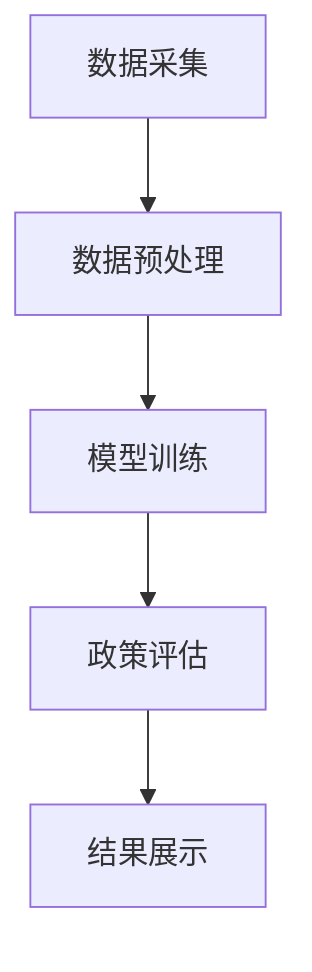

                 


# 开发基于大模型的金融政策影响评估系统

## 关键词：大模型、金融政策、影响评估、系统开发、算法实现

## 摘要：  
本文详细探讨了开发基于大模型的金融政策影响评估系统的全过程。首先介绍了金融政策影响评估的重要性及大模型在金融领域的应用前景。然后从系统设计的角度，分析了大模型的核心原理与技术，详细阐述了系统架构与功能模块的设计。接着通过具体案例，展示了如何基于大模型实现金融政策的文本分析、数据预测和结果评估。最后总结了开发经验，并展望了未来的研究方向。

---

## 第1章: 金融政策影响评估系统背景介绍

### 1.1 问题背景与目标

#### 1.1.1 金融政策影响评估的必要性  
金融政策的制定和实施对经济运行有着深远的影响。传统的政策评估方法依赖于复杂的经济模型和专家经验，但存在耗时长、成本高、结果不够精准等问题。随着大模型技术的快速发展，利用其强大的自然语言处理和数据分析能力，可以更高效、更准确地评估金融政策的影响。

#### 1.1.2 大模型在金融领域的应用前景  
大模型在金融领域的应用涵盖了金融文本分析、市场预测、风险评估等多个方面。金融政策的文本解读和影响分析是其中之一，大模型可以通过对海量金融数据和政策文本的学习，帮助评估政策的潜在影响。

#### 1.1.3 本研究的核心目标  
本研究旨在开发一个基于大模型的金融政策影响评估系统，实现对金融政策的自动化分析、预测和评估，为政策制定者提供科学依据。

---

### 1.2 问题描述与解决思路

#### 1.2.1 金融政策影响评估的关键问题  
金融政策影响评估需要考虑政策的多维度效应，包括对市场、企业、消费者等多个方面的影响。传统方法难以全面捕捉这些复杂关系。

#### 1.2.2 基于大模型的解决方案  
利用大模型的自然语言处理能力和深度学习技术，可以实现对金融政策文本的自动分析和数据预测，从而评估政策的潜在影响。

#### 1.2.3 系统的边界与外延  
本系统聚焦于金融政策的文本分析和数据预测，不涉及政策的具体执行和实施过程。

---

### 1.3 核心概念与系统架构

#### 1.3.1 系统的核心要素组成  
系统主要由数据采集模块、模型训练模块、政策评估模块和结果展示模块组成。

#### 1.3.2 系统功能模块划分  
- 数据采集模块：负责收集相关的金融政策文本和市场数据。  
- 模型训练模块：对收集的数据进行预处理和模型训练。  
- 政策评估模块：基于训练好的模型，评估政策的影响。  
- 结果展示模块：将评估结果以可视化形式呈现。

#### 1.3.3 系统的整体架构图  


---

## 第2章: 大模型的核心原理与技术

### 2.1 大模型的基本原理

#### 2.1.1 大模型的训练机制  
大模型通过海量数据的训练，学习语言的规律和语义信息。常用的训练方法包括监督学习和无监督学习。

#### 2.1.2 大模型的推理机制  
大模型在金融政策评估中的推理过程包括文本解析、特征提取和结果预测。

#### 2.1.3 大模型的可解释性问题  
大模型的可解释性是金融应用中的重要问题。本文通过模型解释技术，提升评估结果的可解释性。

---

### 2.2 大模型在金融领域的应用特点

#### 2.2.1 金融数据的特殊性  
金融数据具有高复杂性和高波动性，需要模型具备强大学习能力和鲁棒性。

#### 2.2.2 金融模型的复杂性  
金融模型通常涉及多个变量和复杂的关系，大模型可以有效捕捉这些关系。

#### 2.2.3 金融政策的多维度影响  
金融政策的影响涉及经济、社会等多个方面，大模型可以实现多维度的分析和预测。

---

### 2.3 大模型与金融政策评估的结合

#### 2.3.1 大模型处理金融文本的能力  
大模型可以通过自然语言处理技术，分析政策文本中的关键信息。

#### 2.3.2 大模型分析金融数据的能力  
大模型可以对金融数据进行深度学习，提取有用的信息和模式。

#### 2.3.3 大模型预测金融市场的潜力  
大模型可以通过历史数据和市场动态，预测政策实施后的市场反应。

---

## 第3章: 系统设计与架构

### 3.1 系统功能模块设计

#### 3.1.1 数据采集模块  
数据采集模块负责从公开渠道获取相关的金融政策文本和市场数据。

#### 3.1.2 数据预处理模块  
对采集的数据进行清洗、格式转换和特征提取，为模型训练做好准备。

#### 3.1.3 模型训练模块  
使用预处理后的数据训练大模型，优化模型参数以提高预测准确性。

#### 3.1.4 政策评估模块  
基于训练好的模型，评估特定金融政策的影响，生成评估报告。

#### 3.1.5 结果展示模块  
将评估结果以图表形式展示，帮助用户直观理解评估结果。

---

### 3.2 系统架构设计

#### 3.2.1 分层架构设计  
系统采用分层架构，包括数据层、模型层和应用层。

#### 3.2.2 微服务架构设计  
各功能模块独立运行，通过API进行通信，确保系统的可扩展性和维护性。

#### 3.2.3 数据流与服务交互图  


---

### 3.3 系统接口设计

#### 3.3.1 数据接口  
负责数据的输入输出，包括政策文本和市场数据的读取和存储。

#### 3.3.2 模型接口  
定义模型的输入输出接口，方便与其他模块进行交互。

#### 3.3.3 用户接口  
提供友好的用户界面，方便用户输入政策文本并查看评估结果。

---

## 第4章: 项目实战与实现

### 4.1 开发环境配置

#### 4.1.1 安装Python与相关库  
安装Python 3.8以上版本，安装TensorFlow、Keras、Pandas等库。

#### 4.1.2 安装大模型框架  
选择使用开源的大模型框架，如GPT-3或BERT，进行二次开发。

#### 4.1.3 数据集准备与预处理  
收集相关的金融政策文本和市场数据，进行清洗和特征提取。

---

### 4.2 核心代码实现

#### 4.2.1 数据加载与处理  
```python
import pandas as pd
import numpy as np

# 加载数据
data = pd.read_csv('financial_policy.csv')

# 数据清洗
data.dropna(inplace=True)
data = data.sample(frac=0.1, random_state=42)
```

#### 4.2.2 模型定义与训练  
```python
import tensorflow as tf
from tensorflow.keras import layers

# 定义模型
model = tf.keras.Sequential([
    layers.Embedding(input_dim=10000, output_dim=16),
    layers.LSTM(64, return_sequences=True),
    layers.Dense(1, activation='sigmoid')
])

# 编译模型
model.compile(loss='binary_crossentropy', optimizer='adam', metrics=['accuracy'])
```

#### 4.2.3 模型评估与优化  
```python
# 训练模型
model.fit(x_train, y_train, epochs=10, batch_size=32, validation_split=0.2)

# 评估模型
loss, accuracy = model.evaluate(x_test, y_test)
print(f"Loss: {loss}, Accuracy: {accuracy}")
```

---

### 4.3 代码解读与分析

#### 4.3.1 数据加载与处理  
上述代码展示了如何从CSV文件中加载数据，并进行抽样处理，确保数据集的均衡性。

#### 4.3.2 模型定义与训练  
模型采用了嵌入层、LSTM层和全连接层，适合处理序列数据，如金融政策文本的时序分析。

#### 4.3.3 模型评估与优化  
通过训练和验证集评估模型性能，调整超参数以优化模型表现。

---

## 第5章: 总结与展望

### 5.1 项目总结

#### 5.1.1 开发经验  
基于大模型的金融政策影响评估系统具有高效、准确的特点，但在实际应用中仍需注意数据质量和模型解释性问题。

#### 5.1.2 系统优势  
系统能够快速处理海量数据，提供高精度的评估结果，为政策制定者提供有力支持。

#### 5.1.3 实践意义  
本系统的开发为金融领域的智能化评估提供了新的思路和方法。

---

### 5.2 未来展望

#### 5.2.1 模型优化  
进一步优化模型结构，提升评估的准确性和可解释性。

#### 5.2.2 功能扩展  
增加更多的政策评估维度，如社会影响、环境影响等。

#### 5.2.3 应用场景拓展  
将系统应用于更多金融领域，如风险管理、投资决策等。

---

## 关键词：大模型、金融政策、影响评估、系统开发、算法实现

## 结语  
开发基于大模型的金融政策影响评估系统是一项具有挑战性但极具价值的工作。通过本文的详细阐述，读者可以了解系统开发的全过程，包括背景分析、系统设计、算法实现和项目总结。未来，随着大模型技术的不断发展，金融政策的评估将更加智能化和精准化，为政策制定者提供更有力的支持。

