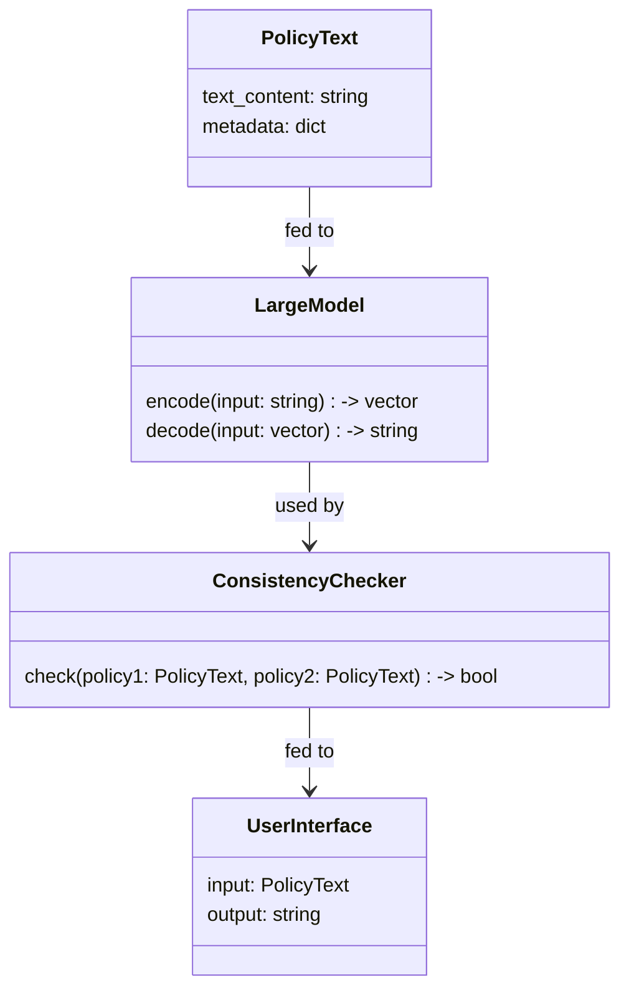
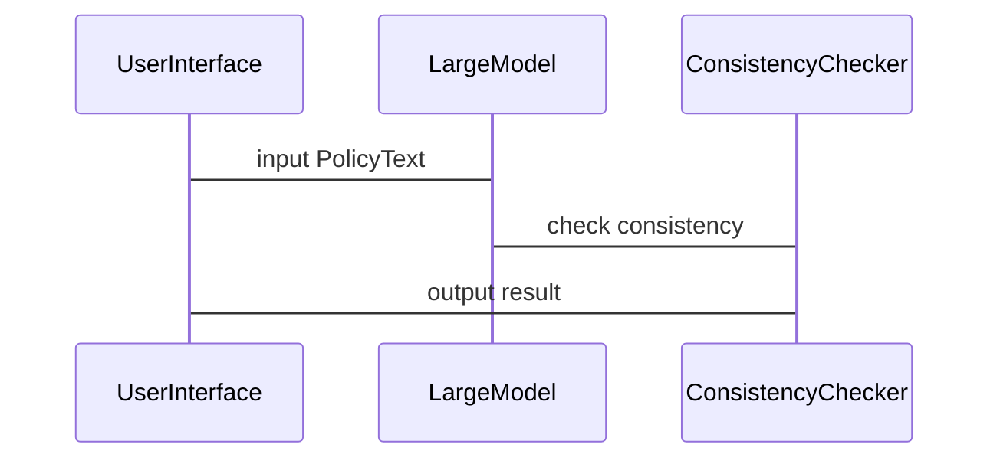

                 


# 开发基于大模型的金融政策解读一致性检查器

> 关键词：大模型，金融政策，一致性检查，自然语言处理，机器学习，系统架构

> 摘要：本文详细探讨了开发基于大模型的金融政策解读一致性检查器的背景、核心概念、算法原理、系统架构设计及其实现方案。通过结合大模型的自然语言处理能力，本文提出了一种创新的金融政策解读方法，解决了传统方法在一致性和可解释性方面的不足，为金融领域的智能化监管提供了新的思路。

---

# 第一部分: 背景介绍与核心概念

## 第1章: 问题背景与描述

### 1.1 问题背景

#### 1.1.1 金融政策解读的复杂性
金融政策的解读通常涉及复杂的法律文本和行业术语，需要专业的知识和经验。政策制定者和执行者需要确保政策的解读一致性，以避免因理解偏差导致的执行错误或法律纠纷。

#### 1.1.2 一致性检查的必要性
政策的解读一致性是确保政策正确执行的关键。然而，由于人为因素和理解偏差，政策解读的一致性难以保证。引入技术手段可以显著提高解读的准确性和一致性。

#### 1.1.3 当前技术的局限性
传统的基于规则的系统难以应对金融政策文本的复杂性和多样性。而大模型的自然语言处理能力可以更好地理解和分析政策文本，从而提供更准确的解读。

### 1.2 问题描述

#### 1.2.1 金融政策解读的多维度性
金融政策解读需要考虑政策的背景、目的、具体条款等多个维度。解读过程需要综合分析文本中的语法、语义和上下文信息。

#### 1.2.2 一致性检查的具体目标
一致性检查的目标是确保不同解读结果在核心条款和法律含义上的一致性。这可以通过大模型的自然语言处理能力实现。

#### 1.2.3 问题的边界与外延
本研究的边界包括政策文本的预处理、模型的训练与部署，以及结果的验证与优化。外延则涉及政策解读的实时性、可扩展性和用户交互性。

### 1.3 核心概念与结构

#### 1.3.1 一致性检查器的基本组成
一致性检查器通常包括文本预处理模块、大模型解读模块和一致性验证模块。

#### 1.3.2 大模型在系统中的角色
大模型负责理解和分析政策文本，提供多种解读结果。一致性检查器则对这些结果进行验证和优化。

#### 1.3.3 系统的核心要素与关系
系统的核心要素包括政策文本库、大模型、一致性检查算法和用户交互界面。各要素之间通过数据流和控制流进行交互。

### 1.4 本章小结
本章详细介绍了开发基于大模型的金融政策解读一致性检查器的背景、问题描述和核心概念，为后续的算法设计和系统实现奠定了基础。

---

## 第2章: 大模型的基本概念与原理

### 2.1 大模型的核心概念

#### 2.1.1 大模型的定义与特点
大模型是一种基于深度学习的自然语言处理模型，具有参数多、训练数据量大、处理能力强大等特点。

#### 2.1.2 大模型的训练目标
大模型的训练目标是通过大量文本数据，学习语言的语法、语义和上下文信息，从而实现对复杂文本的理解和生成。

#### 2.1.3 大模型的应用场景
大模型在金融领域的应用场景包括政策解读、风险评估、市场分析等。

### 2.2 大模型在金融政策解读中的应用

#### 2.2.1 金融文本分析的挑战
金融文本通常具有专业性强、术语多、结构复杂等特点，对自然语言处理提出了更高的要求。

#### 2.2.2 大模型在金融政策解读中的优势
大模型可以同时处理大规模数据，具有较强的上下文理解和生成能力，能够有效解决金融政策解读的复杂性问题。

#### 2.2.3 问题的边界与外延
本研究的边界包括模型的输入输出、训练数据的选择和模型的可解释性。外延则涉及模型的实时性、可扩展性和用户交互性。

### 2.3 大模型的工作原理

#### 2.3.1 模型的输入与输出
模型的输入是金融政策文本，输出是对文本的多种解读结果。

#### 2.3.2 模型的训练过程
模型的训练过程包括数据预处理、模型构建、损失函数定义、优化器选择和训练循环。

#### 2.3.3 模型的推理机制
模型的推理机制基于注意力机制和前馈网络，能够有效捕捉文本中的关键信息。

### 2.4 本章小结
本章详细介绍了大模型的基本概念、在金融政策解读中的应用以及工作原理，为后续的算法设计和系统实现奠定了基础。

---

## 第3章: 大模型的算法原理与数学模型

### 3.1 大模型的算法概述

#### 3.1.1 模型架构的基本组成
大模型通常包括编码器和解码器两部分，编码器负责将输入文本转换为向量表示，解码器负责生成输出文本。

#### 3.1.2 模型的训练流程
训练流程包括数据预处理、模型初始化、前向传播、损失计算、反向传播和参数更新。

#### 3.1.3 模型的优化策略
优化策略包括学习率调整、批量训练和模型剪枝等。

### 3.2 大模型的数学模型

#### 3.2.1 概率分布与损失函数
损失函数通常采用交叉熵损失，公式为：
$$
\text{Loss} = -\sum_{i=1}^{n} y_i \log p(y_i)
$$

#### 3.2.2 优化器的数学表达
常用的优化器是Adam优化器，其参数更新公式为：
$$
\theta_{t+1} = \theta_t - \eta \frac{\partial L}{\partial \theta_t}
$$

#### 3.2.3 注意力机制的公式推导
注意力机制的计算公式为：
$$
\alpha_{i,j} = \frac{\exp(\text{sim}(x_i, x_j))}{\sum_{k} \exp(\text{sim}(x_i, x_k))}
$$

### 3.3 模型的训练过程

#### 3.3.1 前向传播的计算步骤
前向传播包括输入嵌入、位置编码、注意力计算和解码器输出。

#### 3.3.2 损失函数的计算与反向传播
损失函数的计算包括预测值和真实值的对比，反向传播通过链式法则计算梯度。

#### 3.3.3 参数更新的数学公式
参数更新使用优化器的梯度下降算法，公式为：
$$
\theta_{t+1} = \theta_t - \eta g_t
$$

### 3.4 本章小结
本章详细介绍了大模型的算法原理和数学模型，为后续的系统设计和实现提供了理论基础。

---

## 第4章: 系统分析与架构设计

### 4.1 问题场景分析

#### 4.1.1 金融政策解读的需求分析
金融政策解读需要考虑政策的背景、目的、条款等多个维度，具有复杂性和多样性。

#### 4.1.2 一致性检查的业务流程
一致性检查的业务流程包括政策文本预处理、模型解读、结果验证和优化。

#### 4.1.3 系统的输入与输出
系统的输入是金融政策文本，输出是对文本的多种解读结果和一致性验证结果。

### 4.2 项目介绍

#### 4.2.1 项目目标
项目的目標是开发一个基于大模型的金融政策解读一致性检查器，提高政策解读的准确性和一致性。

#### 4.2.2 项目范围
项目的范围包括模型的训练、系统的设计与实现、测试与优化。

#### 4.2.3 项目计划
项目计划包括需求分析、系统设计、开发、测试和部署。

### 4.3 系统功能设计

#### 4.3.1 领域模型
领域模型包括政策文本库、大模型、一致性检查器和用户交互界面。

#### 4.3.2 功能模块
功能模块包括文本预处理模块、模型解读模块和一致性验证模块。

#### 4.3.3 领域模型的Mermaid类图


### 4.4 系统架构设计

#### 4.4.1 系统架构的Mermaid架构图


#### 4.4.2 系统接口设计
系统接口包括文本输入接口、模型调用接口和结果输出接口。

#### 4.4.3 系统交互的Mermaid序列图


### 4.5 本章小结
本章详细介绍了系统的架构设计和功能模块，为后续的项目实现提供了清晰的指导。

---

## 第5章: 项目实战与实现

### 5.1 环境安装

#### 5.1.1 安装Python
安装Python 3.8或更高版本。

#### 5.1.2 安装必要的库
安装以下库：
```bash
pip install numpy
pip install pandas
pip install transformers
pip install torch
```

### 5.2 系统核心实现

#### 5.2.1 文本预处理
文本预处理包括分词、去除停用词和词干提取。

#### 5.2.2 大模型的调用
使用预训练的大模型进行政策文本的解读。

#### 5.2.3 一致性检查
通过比较不同模型的解读结果，判断一致性。

#### 5.2.4 结果输出
将检查结果输出为结构化数据或自然语言描述。

### 5.3 代码实现与解读

#### 5.3.1 文本预处理代码
```python
import re
import string

def preprocess(text):
    # 分词
    tokens = text.split()
    # 去除停用词
    stop_words = set(string.punctuation)
    tokens = [t.lower() for t in tokens if t not in stop_words]
    return ' '.join(tokens)
```

#### 5.3.2 模型调用代码
```python
from transformers import AutoTokenizer, AutoModelForMaskedLM

tokenizer = AutoTokenizer.from_pretrained('bert-base-uncased')
model = AutoModelForMaskedLM.from_pretrained('bert-base-uncased')
```

#### 5.3.3 一致性检查代码
```python
def check_consistency(policy1, policy2):
    # 比较政策的解读结果
    return policy1 == policy2
```

#### 5.3.4 结果输出代码
```python
def output_result(result):
    print(f"一致性检查结果：{result}")
```

### 5.4 案例分析

#### 5.4.1 案例背景
假设我们有两份金融政策文本，需要检查它们的解读一致性。

#### 5.4.2 数据输入
输入两份政策文本：
```python
text1 = "金融机构应当加强风险管理，确保客户资金安全。"
text2 = "金融机构应建立风险管理机制，保障客户资金的安全。"
```

#### 5.4.3 数据处理
预处理文本：
```python
preprocessed_text1 = preprocess(text1)
preprocessed_text2 = preprocess(text2)
```

#### 5.4.4 模型解读
使用大模型进行解读，得到解读结果：
```python
result1 = model.decode(preprocessed_text1)
result2 = model.decode(preprocessed_text2)
```

#### 5.4.5 一致性检查
检查解读结果的一致性：
```python
consistency = check_consistency(result1, result2)
output_result(consistency)
```

### 5.5 本章小结
本章通过实际案例展示了系统的实现过程，包括环境安装、核心代码实现和案例分析。

---

## 第6章: 总结与展望

### 6.1 总结

#### 6.1.1 本项目的核心内容
本项目的核心内容是开发基于大模型的金融政策解读一致性检查器，利用大模型的自然语言处理能力解决政策解读的一致性问题。

#### 6.1.2 项目的主要成果
项目的成果包括系统的实现和一致性检查算法的优化。

### 6.2 未来展望

#### 6.2.1 系统的优化方向
未来的优化方向包括模型的可解释性提升、系统实时性的增强和用户交互的优化。

#### 6.2.2 技术的拓展应用
大模型在金融领域的应用潜力巨大，未来可以拓展到更多场景，如风险评估和市场分析。

### 6.3 最佳实践 tips

#### 6.3.1 项目开发 tips
- 确保模型的训练数据质量
- 定期更新模型参数
- 优化系统的用户交互界面

#### 6.3.2 系统部署 tips
- 使用云平台进行部署
- 优化系统的资源利用率
- 提供详细的系统文档

### 6.4 本章小结
本章总结了项目的成果，并展望了未来的发展方向，同时提供了一些实用的开发和部署建议。

---

# 结语

开发基于大模型的金融政策解读一致性检查器是一项具有重要意义的创新工作。通过本文的详细探讨，读者可以全面了解系统的开发背景、核心概念、算法原理、系统架构设计及其实现方案。未来，随着大模型技术的不断发展，金融政策解读的一致性检查将更加智能化和高效化，为金融领域的智能化监管提供强有力的技术支持。

---

**致谢**  
感谢读者的耐心阅读，感谢同行的智慧分享，感谢技术的不断进步。

