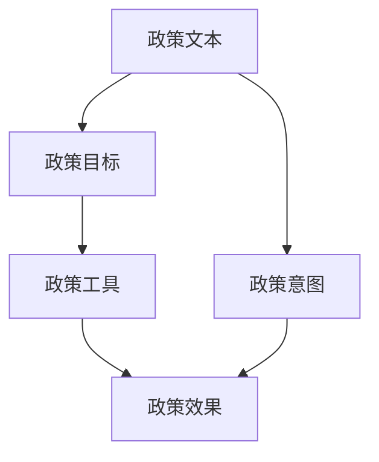
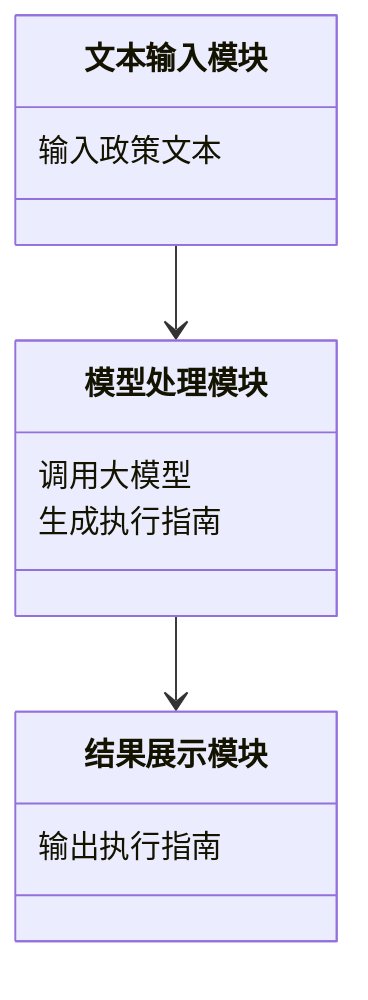

                 


# 开发基于大模型的金融政策解读与执行指南生成器

## 关键词：大模型、金融政策、执行指南生成器、自然语言处理、深度学习

## 摘要：本文详细探讨了如何利用大模型技术开发金融政策解读与执行指南生成器。从问题背景到系统设计，再到项目实现，系统地分析了大模型在金融领域的应用，展示了如何通过大模型理解复杂的政策文本并生成有效的执行指南。

---

## 第1章: 问题背景与需求分析

### 1.1 问题背景

#### 1.1.1 金融政策解读的复杂性
金融政策解读是一项高度复杂且专业性极强的任务，涉及法律法规、经济指标、市场动态等多个维度。政策文本通常包含大量专业术语和隐含含义，需要结合上下文和行业知识进行理解。

#### 1.1.2 传统政策解读方法的局限性
传统的政策解读方法依赖于人工分析，存在效率低、一致性差、覆盖面有限等问题。不同解读人员可能对同一政策的理解存在差异，导致执行指南的不一致性和不确定性。

#### 1.1.3 大模型技术的引入与优势
随着大模型技术的快速发展，其强大的自然语言处理能力和深度学习算法为金融政策解读提供了新的解决方案。通过大模型，可以实现高效的政策理解、一致的执行指南生成，以及对大规模数据的快速处理。

### 1.2 问题描述

#### 1.2.1 金融政策的多样性与复杂性
金融政策涉及货币政策、财政政策、监管政策等多个方面，且不同政策之间可能存在相互影响和制约。解读时需要考虑政策的多层次、多维度特征。

#### 1.2.2 政策解读的主观性与不一致性
由于解读人员的经验、知识和视角不同，可能导致对同一政策的不同解读，进而影响执行指南的制定和实施。

#### 1.2.3 执行指南生成的效率问题
传统的执行指南生成过程耗时较长，且容易受到人为因素的影响。如何高效、准确地生成执行指南成为亟待解决的问题。

### 1.3 问题解决与边界定义

#### 1.3.1 大模型在政策解读中的应用目标
通过大模型技术，实现金融政策的自动化解读和执行指南的自动生成，提高解读效率和一致性。

#### 1.3.2 系统边界与功能范围
系统主要针对中文金融政策文本，支持政策解读、执行指南生成、政策影响评估等功能。目前不支持多语言处理和实时动态更新。

#### 1.3.3 解决方案的技术路线
采用大模型技术，结合金融领域的专业知识，构建金融政策解读与执行指南生成器。通过数据预处理、模型训练、接口开发等步骤，实现系统功能。

### 1.4 本章小结
本章从问题背景出发，分析了传统政策解读方法的局限性，介绍了大模型技术的优势，并提出了系统的应用目标和功能范围。

---

## 第2章: 核心概念与原理

### 2.1 金融政策解读的核心要素

#### 2.1.1 政策文本的结构特征
金融政策文本通常包括政策目标、实施主体、政策工具、政策效果等内容。文本结构复杂，涉及多种文体和术语。

#### 2.1.2 政策意图的识别
政策意图是解读的核心，包括政策制定者的意图、政策目标的实现方式等。需要通过自然语言处理技术提取关键信息。

#### 2.1.3 政策影响的评估
评估政策的经济、社会影响，通常需要结合定量分析和定性分析。大模型可以通过文本生成提供初步的评估建议。

### 2.2 大模型生成执行指南的原理

#### 2.2.1 大模型的文本生成能力
大模型通过预训练和微调，具备强大的文本生成能力，能够根据输入的政策文本生成相应的执行指南。

#### 2.2.2 政策解读与指南生成的结合
政策解读是生成执行指南的基础，大模型通过对政策文本的理解生成结构化信息，再根据结构化信息生成具体的执行指南。

#### 2.2.3 大模型的可解释性问题
大模型的黑箱特性使得政策解读和指南生成的可解释性成为挑战。需要结合领域知识和人工审核，确保生成结果的准确性和合理性。

### 2.3 核心概念对比与ER图

#### 2.3.1 传统NLP方法与大模型的对比分析
| 方法 | 优点 | 缺点 |
|------|------|------|
| 传统NLP | 简单易懂，计算效率高 | 需要大量特征工程，表达能力有限 |
| 大模型 | 表达能力强，自动学习特征 | 黑箱问题，可解释性差，计算资源消耗大 |

#### 2.3.2 ER实体关系图


---

## 第3章: 算法原理与数学模型

### 3.1 大模型的训练与推理流程

#### 3.1.1 大模型的训练流程
1. 数据预处理：清洗、分词、标注。
2. 模型初始化：选择大模型架构，如GPT、BERT等。
3. 微调训练：在金融政策领域数据上进行微调，优化模型参数。
4. 模型评估：通过验证集评估模型性能。

#### 3.1.2 政策文本的特征提取
使用大模型的编码层输出政策文本的语义向量，捕捉文本的关键信息。

#### 3.1.3 指南生成的推理过程
输入政策文本，通过大模型生成执行指南，输出结果。

### 3.2 数学模型与公式

#### 3.2.1 损失函数与优化目标
大模型的训练目标是最小化生成文本的交叉熵损失：
$$ L = -\sum_{i=1}^{n} \log p(x_i|y_i) $$

#### 3.2.2 生成概率计算
根据最大似然估计，生成概率计算公式为：
$$ P(y|x) = \frac{P(y|x,D)}{\sum_{y'} P(y'|x,D)} $$

#### 3.2.3 注意力机制公式
大模型中的注意力机制用于捕捉文本中的长程依赖关系：
$$ \text{Attention}(Q,K,V) = \text{softmax}\left(\frac{QK^T}{\sqrt{d_k}}\right)V $$

### 3.3 算法流程图


---

## 第4章: 系统分析与架构设计

### 4.1 问题场景介绍
系统需要处理金融政策文本，生成执行指南。用户通过输入政策文本，系统输出结构化执行指南。

### 4.2 系统功能设计

#### 4.2.1 系统功能模块
1. 文本输入模块：接收用户输入的政策文本。
2. 模型处理模块：调用大模型进行文本生成。
3. 结果展示模块：输出生成的执行指南。

#### 4.2.2 领域模型图


### 4.3 系统架构设计

#### 4.3.1 系统架构图


### 4.4 接口设计

#### 4.4.1 API接口定义
接口名称：/generate_guidance
请求方式：POST
请求参数：policy_text（字符串）
返回参数：guidance（字符串）

#### 4.4.2 接口交互流程
1. 用户通过前端输入政策文本。
2. 前端调用后端API接口。
3. 后端调用大模型服务生成执行指南。
4. 后端返回结果到前端，展示给用户。

---

## 第5章: 项目实战

### 5.1 环境安装
安装Python环境，安装必要的库，如torch、transformers等。

### 5.2 系统核心实现源代码

#### 5.2.1 模型加载代码
```python
from transformers import AutoModelForCausalLM, AutoTokenizer

model_name = "gpt2"
tokenizer = AutoTokenizer.from_pretrained(model_name)
model = AutoModelForCausalLM.from_pretrained(model_name)
```

#### 5.2.2 文本生成代码
```python
def generate_guidance(policy_text):
    inputs = tokenizer.encode(policy_text, return_tensors="pt")
    outputs = model.generate(inputs, max_length=500, num_beams=5)
    guidance = tokenizer.decode(outputs[0], skip_special_tokens=True)
    return guidance
```

### 5.3 代码应用解读与分析
代码通过加载预训练的大模型，实现政策文本的解读与执行指南生成。生成结果需要结合领域知识进行验证和优化。

### 5.4 实际案例分析
以某金融政策为例，输入政策文本，生成执行指南，并对比分析生成结果的准确性和合理性。

### 5.5 项目小结
本章通过实际代码实现，展示了大模型在金融政策解读中的应用，验证了系统的可行性和有效性。

---

## 第6章: 最佳实践与总结

### 6.1 最佳实践 tips
1. 数据质量至关重要，需确保训练数据的多样性和代表性。
2. 结合领域知识，优化模型的可解释性。
3. 定期更新模型，保持生成结果的时效性。

### 6.2 小结
本文详细探讨了大模型在金融政策解读与执行指南生成中的应用，从理论到实践，系统地分析了相关技术和实现方案。

### 6.3 注意事项
1. 模型的可解释性问题需要重点关注。
2. 数据隐私和安全问题需严格遵守相关法律法规。

### 6.4 拓展阅读
推荐相关领域的书籍和论文，供读者进一步学习和研究。

---

## 附录: 参考文献与工具资源

### 附录1: 参考文献
1. [1] Vaswani, A., et al. "Attention is all you need." arXiv preprint arXiv:1706.03798 (2017).
2. [2] Radford, A., et al. "Language models are few-shot learners." arXiv preprint arXiv:1909.02793 (2019).

### 附录2: 工具资源
1. Hugging Face Transformers库：https://huggingface.co/transformers
2. OpenAI API：https://openai.com/api

---

## 结语
通过本文的探讨，读者可以深入了解大模型在金融政策解读中的应用，掌握系统设计和实现的关键点，为后续的研究和实践提供参考。

