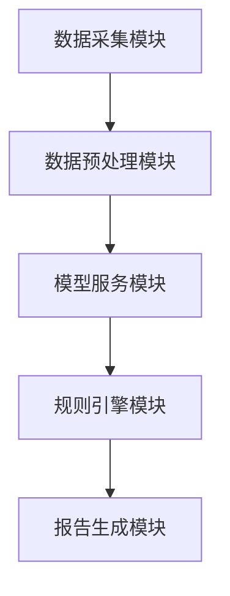

                 


# 开发基于大模型的金融法规遵从性检查系统

> 关键词：金融法规，大模型，自然语言处理，法规检查，系统架构

> 摘要：随着金融市场的快速发展和监管要求的日益严格，传统的金融法规检查方法已经难以满足需求。基于大模型的金融法规遵从性检查系统通过自然语言处理技术，能够高效、准确地识别和分析复杂的金融法规文本，帮助金融机构实现合规性管理。本文将详细探讨该系统的开发背景、核心原理、系统架构以及实际应用案例。

---

## 第一部分：背景与概述

### 第1章：金融法规遵从性检查系统概述

#### 1.1 金融法规的重要性与挑战

- **1.1.1 金融法规的基本概念**  
  金融法规是指由政府或监管机构制定的，用于规范金融市场行为、保护投资者利益、维护金融秩序的法律和规章制度。这些法规涵盖了从证券、银行、保险到反洗钱等各个方面。

- **1.1.2 金融法规遵从性的必要性**  
  金融机构必须遵守相关法规，以避免罚款、法律风险和声誉损失。然而，随着法规的复杂化和多样化，传统的手动检查方法效率低下，容易出错。

- **1.1.3 传统法规检查的局限性**  
  传统方法依赖于人工审查，耗时且成本高。此外，法规文本通常复杂且冗长，人工理解容易出现偏差，尤其是在处理大量数据时。

#### 1.2 大模型技术的兴起与应用

- **1.2.1 大模型技术的基本概念**  
  大模型（Large Language Models, LLMs）是一种基于深度学习的自然语言处理模型，具有强大的文本理解和生成能力。它们通过大量的数据训练，能够处理复杂的语言任务。

- **1.2.2 大模型在金融领域的应用潜力**  
  大模型在金融领域的应用包括智能客服、风险评估、市场分析等。在法规检查方面，大模型能够快速分析大量文本，识别潜在的合规问题。

- **1.2.3 金融法规检查中的大模型优势**  
  大模型能够快速处理大量法规文本，提供准确的解读，并通过自然语言处理技术生成合规建议，显著提高了检查效率和准确性。

#### 1.3 本章小结

本章介绍了金融法规的重要性及其检查的挑战，并探讨了大模型技术在金融法规检查中的潜力和优势。

---

## 第二部分：核心概念与原理

### 第2章：大模型与金融法规的结合

#### 2.1 大模型的基本原理

- **2.1.1 大模型的定义与特点**  
  大模型是一种基于Transformer架构的深度学习模型，具有参数量大、训练数据多、语言理解能力强等特点。

- **2.1.2 大模型的核心算法**  
  大模型的核心算法包括编码器和解码器，通过自注意力机制捕捉文本中的长距离依赖关系，实现对上下文的理解。

- **2.1.3 大模型的训练与优化**  
  大模型的训练过程包括预训练和微调。预训练阶段通过大规模通用文本数据进行无监督学习，微调阶段针对特定任务（如金融法规检查）进行有监督优化。

#### 2.2 金融法规检查的核心概念

- **2.2.1 金融法规的分类与特点**  
  金融法规可以分为实体法、程序法、处罚法等类别。实体法规定了金融机构的权利和义务，程序法规定了监管流程和方法。

- **2.2.2 法规检查的关键要素**  
  法规检查的关键要素包括法律条文的理解、业务场景的匹配以及合规性的判断。

- **2.2.3 法规检查的流程与方法**  
  法规检查通常包括数据采集、文本分析、规则匹配和结果输出四个步骤。

#### 2.3 大模型在金融法规检查中的应用

- **2.3.1 大模型的自然语言处理能力**  
  大模型能够理解和生成自然语言，能够准确解析法规文本中的复杂语义。

- **2.3.2 大模型的推理与分析能力**  
  大模型通过自注意力机制，能够捕捉文本中的关键信息，进行推理和分析。

- **2.3.3 大模型的实时性与可扩展性**  
  大模型能够快速处理大量文本，适用于实时检查和大规模数据处理。

#### 2.4 本章小结

本章详细探讨了大模型的基本原理及其在金融法规检查中的应用，重点分析了大模型在自然语言处理和推理分析方面的优势。

---

## 第三部分：系统分析与架构设计

### 第3章：系统功能设计

#### 3.1 系统功能模块划分

- **3.1.1 数据采集模块**  
  数据采集模块负责从金融机构获取需要检查的文本数据，包括合同、协议、合规报告等。

- **3.1.2 模型服务模块**  
  模型服务模块负责调用大模型API，对输入文本进行分析和解读。

- **3.1.3 规则引擎模块**  
  规则引擎模块负责根据法规要求，定义检查规则，并对模型输出进行验证。

- **3.1.4 报告生成模块**  
  报告生成模块负责将检查结果生成合规报告，供金融机构参考。

#### 3.2 系统功能流程设计

- **3.2.1 数据采集与预处理**  
  数据采集后需要进行清洗、分词和格式化处理，确保模型能够正确解析。

- **3.2.2 模型调用与分析**  
  模型服务模块调用大模型API，对输入文本进行分析，生成初步解读结果。

- **3.2.3 规则匹配与结果输出**  
  规则引擎模块根据解读结果进行合规性判断，生成最终检查结果。

- **3.2.4 报告生成与输出**  
  根据检查结果生成详细报告，包括问题描述、合规建议和整改方案。

#### 3.3 本章小结

本章详细描述了系统的功能模块和流程设计，为后续的系统实现奠定了基础。

---

## 第四部分：算法原理与数学模型

### 第4章：大模型的训练与优化

#### 4.1 大模型的训练流程

- **4.1.1 数据预处理**  
  数据预处理包括清洗、分词、格式化等步骤，确保数据适合模型训练。

- **4.1.2 模型微调**  
  模型微调是在预训练的基础上，针对特定任务（如金融法规检查）进行有监督优化。

- **4.1.3 模型评估与优化**  
  通过评估指标（如准确率、召回率、F1分数）对模型性能进行评估，并进行参数调优。

#### 4.2 优化算法

- **4.2.1 梯度下降优化**  
  梯度下降是一种常用优化算法，通过最小化损失函数来更新模型参数。

- **4.2.2 学习率调度**  
  学习率调度通过动态调整学习率，加速模型收敛。

#### 4.3 数学模型

- **4.3.1 损失函数**  
  损失函数用于衡量模型预测值与真实值之间的差异。常用的损失函数包括交叉熵损失和均方误差。

- **4.3.2 优化器**  
  优化器用于更新模型参数。常用的优化器包括随机梯度下降（SGD）和Adam优化器。

$$ L(y_{\text{pred}}, y_{\text{true}}) = -\sum_{i=1}^{n} y_{\text{true}} \log y_{\text{pred}} + (1 - y_{\text{true}}) \log (1 - y_{\text{pred}}) $$

- **4.3.3 自注意力机制**  
  自注意力机制通过计算文本中每个词与其他词的相关性，生成位置权重。

$$ \text{Attention}(Q, K, V) = \text{softmax}\left( \frac{QK^T}{\sqrt{d_k}} \right)V $$

#### 4.4 本章小结

本章详细介绍了大模型的训练流程和优化算法，重点分析了损失函数和自注意力机制的数学模型。

---

## 第五部分：系统架构与实现

### 第5章：系统架构设计

#### 5.1 系统架构概述

- **5.1.1 模块划分**  
  系统由数据采集模块、模型服务模块、规则引擎模块和报告生成模块组成。

- **5.1.2 模块交互流程**  
  数据采集模块首先获取数据，经过预处理后传递给模型服务模块进行分析，分析结果由规则引擎模块验证，最终生成报告。

#### 5.2 系统架构图



#### 5.3 接口设计

- **5.3.1 数据接口**  
  数据接口负责与金融机构的系统对接，获取需要检查的文本数据。

- **5.3.2 模型接口**  
  模型接口负责调用大模型API，接收输入文本并返回分析结果。

#### 5.4 本章小结

本章详细描述了系统的架构设计，包括模块划分、交互流程和接口设计。

---

## 第六部分：项目实战

### 第6章：项目实战

#### 6.1 环境安装

- **6.1.1 安装Python环境**  
  使用Anaconda安装Python 3.8及以上版本。

- **6.1.2 安装依赖库**  
  安装必要的依赖库，如TensorFlow、PyTorch、Hugging Face的Transformers库。

#### 6.2 核心代码实现

- **6.2.1 数据预处理代码**  
  ```python
  import pandas as pd
  def preprocess_data(data):
      # 数据清洗和分词
      pass
  ```

- **6.2.2 模型调用代码**  
  ```python
  from transformers import AutoTokenizer, AutoModelForMaskedLM
  tokenizer = AutoTokenizer.from_pretrained('bert-base-uncased')
  model = AutoModelForMaskedLM.from_pretrained('bert-base-uncased')
  ```

- **6.2.3 规则引擎代码**  
  ```python
  def check_compliance(text, rules):
      # 根据规则进行检查
      pass
  ```

#### 6.3 案例分析

- **6.3.1 案例背景**  
  某金融机构需要检查一份复杂的贷款协议，确保其符合最新的反洗钱法规。

- **6.3.2 案例实现**  
  使用大模型对协议文本进行分析，识别潜在的违规点，并生成合规建议。

#### 6.4 本章小结

本章通过实际案例展示了系统的实现过程，包括环境安装、代码实现和案例分析。

---

## 第七部分：最佳实践与总结

### 第7章：最佳实践与总结

#### 7.1 最佳实践

- **7.1.1 数据质量管理**  
  数据质量直接影响模型性能，需要确保数据的准确性和完整性。

- **7.1.2 模型调优**  
  根据具体任务需求，对模型进行微调和参数优化，以提高检查效率和准确性。

- **7.1.3 规则引擎优化**  
  定期更新法规库，确保规则引擎能够覆盖最新的法规要求。

#### 7.2 小结

本文详细探讨了开发基于大模型的金融法规遵从性检查系统的各个方面，包括背景、原理、架构和实现。

#### 7.3 注意事项

- 确保系统的安全性和稳定性，防止数据泄露和系统崩溃。
- 定期进行系统维护和更新，以适应新的法规要求和技术发展。

#### 7.4 拓展阅读

- 建议读者进一步学习大模型的高级应用，如多模态模型和强化学习。

---

## 结语

开发基于大模型的金融法规遵从性检查系统是一项具有重要意义的工程，它能够显著提高法规检查的效率和准确性。通过本文的探讨，读者可以深入了解系统的开发背景、核心原理和实现方法，为实际应用提供有价值的参考。

---

通过以上结构，我们可以系统地开发和实现一个基于大模型的金融法规遵从性检查系统，为金融机构提供高效、准确的合规性管理解决方案。

