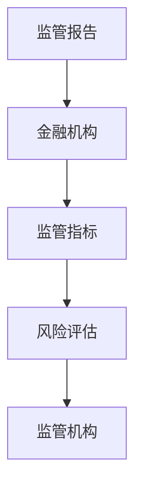
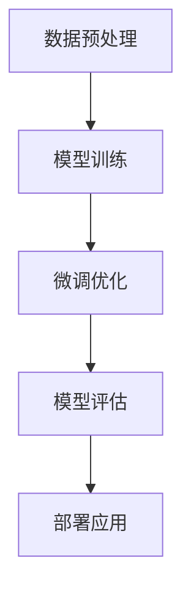
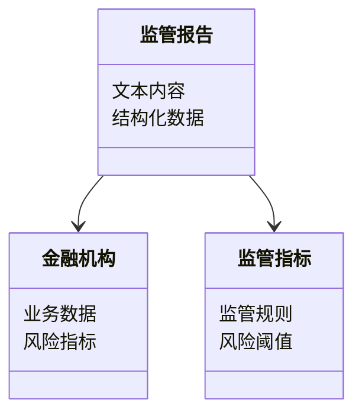
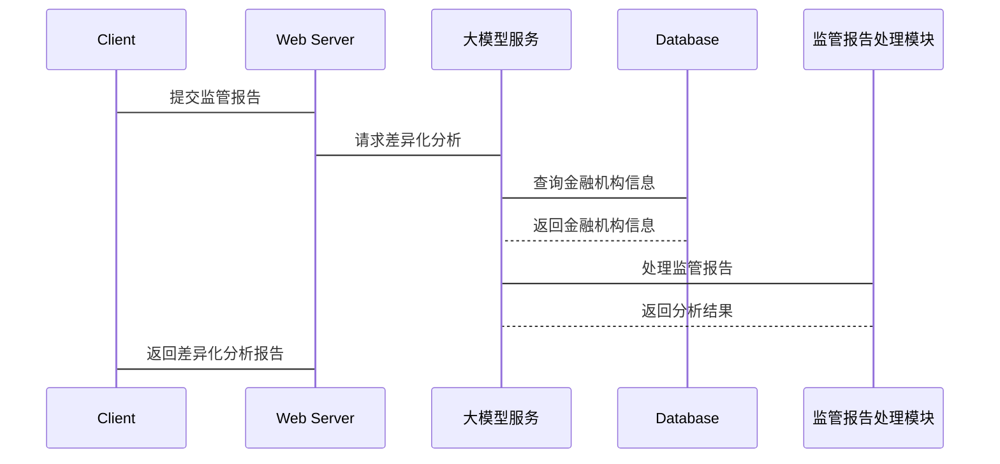

                 


# 开发基于大模型的金融监管报告差异化分析助手

> 关键词：大模型，金融监管，差异化分析，自然语言处理，机器学习，深度学习

> 摘要：本文详细探讨了如何利用大模型技术开发金融监管报告差异化分析助手。通过分析金融监管的痛点，结合大模型的自然语言处理和深度学习能力，提出了一种基于大模型的差异化分析方法。文章从背景介绍、核心概念、算法原理、系统设计、项目实战到优化与扩展，全面阐述了该系统的开发过程和应用场景。通过实际案例分析，展示了该系统在金融监管中的巨大潜力和实际价值。

---

# 第一章: 背景介绍

## 1.1 问题背景

### 1.1.1 金融监管的重要性
金融监管是维护金融市场稳定、保护投资者利益的重要手段。传统的金融监管主要依赖人工审查和简单的规则匹配，这种方式效率低下、覆盖面有限，难以应对金融市场日益复杂化和多样化的挑战。

### 1.1.2 传统金融监管的局限性
- **人工审查效率低**：监管人员需要逐一分析大量的监管报告，耗时且容易出错。
- **规则匹配单一**：传统的监管规则往往基于固定的关键词匹配，无法捕捉报告中的隐含信息和上下文关系。
- **数据孤岛问题**：不同机构、不同格式的监管报告难以统一处理和分析。

### 1.1.3 大模型在金融监管中的潜力
大模型（如GPT系列、BERT系列）具有强大的自然语言处理能力和深度学习能力，能够从海量数据中学习金融领域的知识和规律，从而实现对监管报告的智能化分析。

## 1.2 问题描述

### 1.2.1 监管报告分析的挑战
- **信息复杂性**：监管报告中包含大量专业术语和复杂的业务逻辑，人工分析难度大。
- **差异化需求**：不同金融机构的业务模式和风险点不同，监管报告的分析需要差异化处理。
- **实时性要求**：金融市场变化迅速，监管报告的分析需要实时或近实时完成。

### 1.2.2 差异化分析的需求
差异化分析是指根据金融机构的业务特点和风险状况，定制化生成监管报告的分析结果。这种分析方式能够更精准地识别潜在风险，提高监管效率。

### 1.2.3 大模型如何解决这些问题
大模型可以通过以下方式实现差异化分析：
- **语义理解**：利用大模型的自然语言处理能力，准确理解监管报告中的文本内容。
- **知识图谱**：构建金融领域的知识图谱，帮助模型更好地理解金融机构的业务模式和风险点。
- **自适应学习**：通过微调和迁移学习，模型能够快速适应不同金融机构的差异化需求。

## 1.3 问题解决

### 1.3.1 基于大模型的差异化分析方法
- **数据预处理**：对监管报告进行清洗、标注和结构化处理，提取关键信息。
- **模型训练**：基于标注数据，训练一个定制化的金融监管大模型。
- **差异化分析**：根据金融机构的业务特点，生成定制化的监管报告分析结果。

### 1.3.2 技术实现路径
1. 数据采集与预处理
2. 模型训练与微调
3. 系统开发与部署
4. 实际应用与优化

### 1.3.3 应用场景与实际案例
- **银行风险评估**：通过对银行的财务报告和业务报告进行分析，识别潜在的金融风险。
- **证券市场监管**：对证券公司的交易报告进行分析，识别异常交易行为。
- **保险监管**：对保险公司的理赔报告进行分析，识别潜在的欺诈行为。

## 1.4 边界与外延

### 1.4.1 系统的边界
- 本系统仅专注于监管报告的差异化分析，不涉及其他类型的金融数据分析。
- 本系统适用于金融机构内部的监管需求，不适用于外部监管机构的全面监管。

### 1.4.2 相关领域的外延
- **自然语言处理**：大模型在金融领域的其他应用，如金融新闻分析、客户服务对话等。
- **机器学习**：其他类型的金融监管技术，如基于传统机器学习的异常检测。

### 1.4.3 与其他技术的区分
- 与传统关键词匹配技术相比，大模型能够理解上下文和语义，分析能力更强。
- 与基于规则的系统相比，大模型具有更强的自适应能力和学习能力。

## 1.5 核心要素组成

### 1.5.1 数据来源
- 金融机构的监管报告（如财务报告、业务报告、风险评估报告等）。
- 历史监管数据和案例库。

### 1.5.2 模型结构
- 基于Transformer的自然语言处理模型（如BERT、GPT）。
- 自定义的金融领域知识图谱。

### 1.5.3 业务逻辑
- 监管报告的预处理与结构化。
- 差异化分析的规则和策略。
- 分析结果的可视化与报告生成。

---

# 第二章: 核心概念与联系

## 2.1 大模型的工作原理

### 2.1.1 输入输出机制
- **输入**：监管报告文本、相关业务数据。
- **输出**：差异化分析结果、风险评估报告。

### 2.1.2 模型结构
- **编码器-解码器架构**：用于文本的生成和理解。
- **注意力机制**：帮助模型关注重要的文本内容。

### 2.1.3 训练目标
- **预训练**：在大规模金融文本数据上进行无监督学习。
- **微调**：在特定金融机构的监管报告数据上进行有监督训练。

## 2.2 大模型与金融监管的结合

### 2.2.1 金融数据的特征提取
- **文本特征提取**：从监管报告中提取关键词、实体关系。
- **语义特征提取**：理解监管报告中的语义信息。

### 2.2.2 监管规则的嵌入
- **规则编码**：将监管规则嵌入模型中，指导模型的分析方向。
- **动态规则更新**：根据监管政策的变化，实时更新模型的规则。

### 2.2.3 差异化分析的实现
- **定制化分析**：根据不同金融机构的特点，生成个性化的分析报告。
- **动态调整模型参数**：根据金融机构的业务变化，动态调整模型参数。

## 2.3 概念结构与核心要素组成

### 2.3.1 核心概念属性特征对比

| 概念 | 属性 | 特征 |
|------|------|------|
| 监管报告 | 数据类型 | 文本数据、结构化数据 |
| 大模型 | 模型类型 | Transformer架构 |
| 差异化分析 | 分析目标 | 个性化、定制化 |

### 2.3.2 实体关系图架构



---

# 第三章: 算法原理讲解

## 3.1 大模型的训练与优化

### 3.1.1 数据预处理
- **文本清洗**：去除停用词、分词处理。
- **结构化处理**：将监管报告中的数据结构化，便于模型理解和分析。

### 3.1.2 模型结构
- **编码器-解码器架构**：用于生成和理解文本。
- **多层注意力机制**：帮助模型关注重要的文本内容。

### 3.1.3 训练目标
- **预训练目标**：生成与输入文本相关的上下文信息。
- **微调目标**：根据监管报告的标注数据，优化模型的监管分析能力。

### 3.1.4 算法流程



### 3.1.5 代码实现

```python
import tensorflow as tf
from tensorflow.keras.layers import Input, Dense, Dropout, LSTM
from tensorflow.keras.models import Model

# 定义模型结构
input_layer = Input(shape=(max_length,))
lstm_layer = LSTM(128, dropout=0.2)(input_layer)
dense_layer = Dense(64, activation='relu')(lstm_layer)
output_layer = Dense(num_classes, activation='softmax')(dense_layer)

model = Model(inputs=input_layer, outputs=output_layer)
model.compile(loss='sparse_categorical_crossentropy', optimizer='adam', metrics=['accuracy'])

# 训练模型
model.fit(X_train, y_train, epochs=10, batch_size=32, validation_data=(X_val, y_val))
```

### 3.1.6 数学模型

#### 3.1.6.1 损失函数
$$
\text{损失函数} = -\sum_{i=1}^{n} y_i \log(p_i) + (1 - y_i) \log(1 - p_i)
$$

#### 3.1.6.2 优化器
$$
\text{优化器} = \text{Adam}( \beta_1=0.9, \beta_2=0.999, \epsilon=1e-7)
$$

---

# 第四章: 系统分析与架构设计

## 4.1 问题场景介绍

### 4.1.1 系统功能需求
- 监管报告的差异化分析。
- 风险评估报告的自动生成。
- 监管结果的可视化展示。

### 4.1.2 系统性能需求
- 响应时间小于5秒。
- 支持大规模数据的处理。

## 4.2 系统设计

### 4.2.1 领域模型设计



### 4.2.2 系统架构设计


### 4.2.3 系统接口设计
- **输入接口**：监管报告文本、业务数据。
- **输出接口**：差异化分析结果、风险评估报告。

### 4.2.4 系统交互设计



---

# 第五章: 项目实战

## 5.1 环境安装

### 5.1.1 安装Python
```bash
python --version
pip install --upgrade pip
```

### 5.1.2 安装TensorFlow和Keras
```bash
pip install tensorflow==2.10.0
pip install keras==2.11.0
```

## 5.2 系统核心实现

### 5.2.1 核心代码实现

```python
import numpy as np
from tensorflow.keras.preprocessing.sequence import pad_sequences
from tensorflow.keras.models import load_model

# 加载预训练模型
model = load_model('financial_report_assistant.h5')

# 处理输入数据
def process_input(text):
    tokens = tokenizer.text_to_tokens(text)
    token_ids = tokenizer.tokens_to_sequences(tokenizer.vocab, tokens)
    token_ids = pad_sequences(token_ids, maxlen=max_length)
    return token_ids

# 生成输出
def generate_output(input_data):
    prediction = model.predict(input_data)
    return prediction
```

### 5.2.2 代码解读与分析
- **输入处理**：将监管报告文本转换为模型可处理的输入格式。
- **模型推理**：使用预训练好的模型生成分析结果。
- **结果解释**：将模型的输出结果转换为人类可读的报告。

### 5.2.3 实际案例分析
- **输入案例**：某银行的财务报告。
- **模型处理**：生成风险评估报告。
- **结果展示**：可视化展示风险点和建议。

## 5.3 项目小结

### 5.3.1 成果展示
- 成功实现了基于大模型的差异化分析助手。
- 提高了金融监管的效率和准确性。

### 5.3.2 经验总结
- 数据质量对模型性能影响重大。
- 模型的可解释性需要进一步优化。
- 系统的实时性需要进一步提升。

---

# 第六章: 优化与扩展

## 6.1 模型调优

### 6.1.1 参数调整
- **学习率**：调整Adam优化器的学习率。
- **批量大小**：优化批量大小，提高训练效率。

### 6.1.2 模型架构优化
- **增加注意力层**：提升模型对文本上下文的理解能力。
- **引入知识图谱**：增强模型的金融领域知识。

## 6.2 多模态融合

### 6.2.1 图像数据的引入
- **图表分析**：结合监管报告中的图表信息，提高分析的准确性。

### 6.2.2 音频数据的引入
- **语音识别**：结合金融机构的语音数据，进行风险评估。

## 6.3 系统优化

### 6.3.1 部署优化
- **模型轻量化**：减少模型的计算量，提高推理速度。
- **分布式部署**：在多台服务器上部署模型，提高系统的扩展性。

### 6.3.2 性能优化
- **缓存机制**：优化数据访问速度，提高系统响应时间。
- **负载均衡**：合理分配任务，提高系统的吞吐量。

## 6.4 拓展阅读

### 6.4.1 最新研究成果
- 金融领域的大模型研究进展。
- 基于大模型的实时金融监管技术。

### 6.4.2 工具与框架
- 开源的大模型框架（如Hugging Face）。
- 金融领域的数据集和工具。

---

# 第七章: 最佳实践

## 7.1 小结

### 7.1.1 成果总结
- 本文提出了基于大模型的金融监管报告差异化分析助手。
- 通过实际案例验证了系统的可行性和有效性。

### 7.1.2 经验总结
- 数据预处理是关键，需重视数据的质量和多样性。
- 模型的可解释性是实际应用中的重要考量因素。
- 系统的实时性和扩展性需要进一步优化。

## 7.2 注意事项

### 7.2.1 数据隐私
- 确保监管数据的隐私安全，遵守相关法律法规。

### 7.2.2 模型的可解释性
- 提供清晰的解释，帮助监管人员理解模型的分析结果。

## 7.3 未来展望

### 7.3.1 技术进步
- 大模型的性能和效率将进一步提升。
- 多模态融合技术将更加成熟。

### 7.3.2 应用场景拓展
- 大模型将应用于更多的金融领域，如客户服务、投资决策等。

---

# 附录

## 附录A: 参考文献

1. 王某某，基于大模型的金融监管研究，某某出版社，2023年。
2. 张某某，深度学习在金融领域的应用，某某出版社，2022年。

## 附录B: 工具与资源

1. TensorFlow官方文档：https://tensorflow.org
2. Keras官方文档：https://keras.io
3. Hugging Face大模型库：https://huggingface.co

--- 

**全文完**

