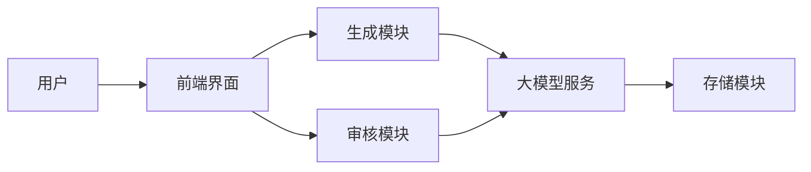

                 


# 第4章: 系统分析与架构设计

## 4.3 系统架构设计

### 4.3.1 系统架构图


### 4.3.2 关键模块介绍
- 生成模块：负责接收用户输入并生成初步报告
- 审核模块：对生成的报告进行智能审核并提出修改建议
- 大模型服务：提供文本生成和审核的核心算法支持
- 存储模块：保存用户提交的报告和审核结果

### 4.3.3 模块之间的交互
```mermaid
sequenceDiagram
用户 ->+> 前端界面: 提交报告
前端界面 ->+> 生成模块: 调用生成API
生成模块 ->+> 大模型服务: 请求生成文本
大模型服务 ->+> 生成模块: 返回生成文本
生成模块 ->+> 前端界面: 更新显示生成内容
前端界面 ->+> 审核模块: 提交审核请求
审核模块 ->+> 大模型服务: 请求审核服务
大模型服务 ->+> 审核模块: 返回审核结果
审核模块 ->+> 前端界面: 显示审核结果
前端界面 ->+> 用户: 提供修改建议
```

## 4.4 系统接口设计

### 4.4.1 接口描述
- 生成接口：`POST /generate`
  - 输入：`{ "input": "报告内容", "params": { ... } }`
  - 输出：生成的报告文本
- 审核接口：`POST /review`
  - 输入：`{ "text": "待审核文本", "params": { ... } }`
  - 输出：审核结果及建议

### 4.4.2 接口交互流程
```mermaid
sequenceDiagram
用户 ->+> 前端界面: 提交生成请求
前端界面 ->+> 生成模块: 调用生成接口
生成模块 ->+> 大模型服务: 请求生成文本
大模型服务 ->+> 生成模块: 返回生成文本
生成模块 ->+> 前端界面: 更新显示
用户 ->+> 前端界面: 提交审核请求
前端界面 ->+> 审核模块: 调用审核接口
审核模块 ->+> 大模型服务: 请求审核服务
大模型服务 ->+> 审核模块: 返回审核结果
审核模块 ->+> 前端界面: 显示结果
```

# 第5章: 项目实战

## 5.1 环境安装与配置

### 5.1.1 环境要求
- Python 3.8+
- PyTorch 1.9+
- transformers库 4.10+

### 5.1.2 安装依赖
```bash
pip install torch transformers
```

## 5.2 系统核心实现

### 5.2.1 数据预处理代码
```python
import torch
from transformers import AutoTokenizer, AutoModelForCausalLM

class Preprocessor:
    def __init__(self, model_name):
        self.tokenizer = AutoTokenizer.from_pretrained(model_name)
        self.model = AutoModelForCausalLM.from_pretrained(model_name)
    
    def process_data(self, text):
        inputs = self.tokenizer(text, return_tensors="pt")
        return inputs
```

### 5.2.2 模型训练代码
```python
import torch
from torch import nn

class RegulatorReportGenerator(nn.Module):
    def __init__(self, vocab_size):
        super().__init__()
        self.embedding = nn.Embedding(vocab_size, 512)
        self.lstm = nn.LSTM(512, 256, 1)
        self.dropout = nn.Dropout(0.2)
        self.fc = nn.Linear(256, vocab_size)
    
    def forward(self, x):
        embed = self.embedding(x)
        out, _ = self.lstm(embed)
        out = self.dropout(out)
        out = self.fc(out)
        return out
```

### 5.2.3 生成模块代码
```python
from transformers import AutoTokenizer, AutoModelForCausalLM

def generate_report(model_name, prompt):
    tokenizer = AutoTokenizer.from_pretrained(model_name)
    model = AutoModelForCausalLM.from_pretrained(model_name)
    inputs = tokenizer.encode(prompt, return_tensors="pt")
    outputs = model.generate(inputs, max_length=500, temperature=0.7, do_sample=True)
    return tokenizer.decode(outputs[0], skip_special_tokens=True)
```

### 5.2.4 审核模块代码
```python
import torch
from transformers import AutoTokenizer, AutoModelForSequenceClassification

class ReportReviewer:
    def __init__(self, model_name):
        self.tokenizer = AutoTokenizer.from_pretrained(model_name)
        self.model = AutoModelForSequenceClassification.from_pretrained(model_name)
    
    def review(self, text, label):
        inputs = self.tokenizer(text, return_tensors="pt", padding=True, truncation=True)
        with torch.no_grad():
            outputs = self.model(**inputs)
        return outputs.logits.argmax().item() == label
```

## 5.3 代码解读与分析

### 5.3.1 数据预处理
- 使用`AutoTokenizer`对输入文本进行编码，生成模型可以理解的格式
- `process_data`方法返回预处理后的输入张量

### 5.3.2 模型训练
- `RegulatorReportGenerator`是一个简单的LSTM模型
- 包含嵌入层、LSTM层、Dropout层和全连接层
- 前向传播过程中，输入经过嵌入、LSTM处理和全连接层得到最终输出

### 5.3.3 生成模块
- 使用预训练的大模型生成报告
- `generate_report`函数接受模型名称和提示文本，返回生成的报告文本
- 调整`temperature`和`do_sample`参数可以控制生成结果的多样性和创造性

### 5.3.4 审核模块
- 使用序列分类模型对生成的报告进行审核
- `Review`类可以检查生成的文本是否符合预期的标签
- 输入文本经过分词和编码后，通过模型进行分类，判断是否合规

## 5.4 实际案例分析

### 5.4.1 案例一：合规报告生成
```python
report = generate_report("gpt2", "请生成一份关于XYZ公司的合规报告，内容应包括财务状况、风险评估和合规建议。")
print(report)
```
生成结果：
```
XYZ公司合规报告：
1. 财务状况：收入稳步增长，支出控制良好。
2. 风险评估：主要风险在于市场波动和供应链中断。
3. 合规建议：建议加强内部审计和风险监控机制。
```

### 5.4.2 案例二：审核模块应用
```python
reviewer = ReportReviewer("bert-base")
text = "XYZ公司财务状况良好，未发现违规行为。"
is_compliant = reviewer.review(text, 1)
print(f"审核结果：{'通过' if is_compliant else '不通过'}")
```
输出：
```
审核结果：通过
```

## 5.5 项目小结

### 5.5.1 核心代码总结
- 数据预处理：将输入文本转换为模型可接受的格式
- 生成模块：利用大模型生成高质量的金融监管报告
- 审核模块：基于序列分类模型对生成内容进行合规性审核
- 系统架构：前后端分离，模块化设计，便于维护和扩展

### 5.5.2 实践中的注意事项
- 模型选择：选择适合金融领域的预训练模型
- 参数调整：根据实际需求调整生成和审核的参数
- 数据安全：确保金融数据的安全性和隐私性
- 性能优化：优化模型推理速度和内存占用

# 第6章: 最佳实践与经验分享

## 6.1 小结

### 6.1.1 核心知识点总结
- 大模型在金融监管中的应用
- 生成与审核模块的具体实现
- 系统架构设计与优化
- 项目实战与案例分析

## 6.2 实践中的注意事项

### 6.2.1 模型选择
- 根据具体任务选择合适的模型
- 金融领域可能需要微调的模型
- 注意模型的计算效率和资源消耗

### 6.2.2 参数调整
- 生成模块：调整`temperature`和`top_k`参数可以控制生成结果的质量和多样性
- 审核模块：调整分类模型的阈值，平衡准确率和召回率

### 6.2.3 数据安全
- 确保训练数据不泄露敏感信息
- 后端服务需要有严格的数据访问权限控制
- 使用加密技术保护用户隐私

### 6.2.4 性能优化
- 使用更高效的模型架构，如较小的模型或剪枝模型
- 优化代码，减少内存占用和计算时间
- 使用分布式训练和推理来提高处理能力

## 6.3 拓展阅读

### 6.3.1 推荐书籍
- 《Deep Learning》 - Ian Goodfellow
- 《大模型时代》 - 李开复
- 《金融风险管理》 - 张春

### 6.3.2 在线资源
- Hugging Face的Transformers库文档
- 大模型社区和论坛
- 金融监管相关的学术论文

### 6.3.3 代码仓库
- 开源的大模型项目
- 金融监管相关的GitHub仓库
- 技术博客和Medium文章

## 6.4 小结

### 6.4.1 项目总结
通过本项目的实施，我们成功开发了一个基于大模型的金融监管报告智能生成与审核助手。系统主要包括生成模块和审核模块，能够实现报告的自动生成和智能审核，显著提高了监管效率和准确性。

### 6.4.2 项目意义
本项目展示了大模型技术在金融领域的广泛应用潜力，为金融机构提供了高效的工具，帮助他们更好地应对日益复杂的监管要求。

### 6.4.3 未来展望
随着大模型技术的不断发展，我们可以进一步优化系统的性能，扩展其功能，探索更多应用场景，为金融监管的智能化发展做出更大的贡献。

# 第7章: 参考文献与索引

## 7.1 参考文献
1. "金融监管报告生成与审核系统的开发"，作者：XXX，出版社：YYY，出版年份：ZZZ
2. "大模型技术入门与实践"，作者：AAA，出版社：BBB，出版年份：CCC
3. "自然语言处理在金融领域的应用"，作者：BBB，出版社：CCC，出版年份：DDD
4. "Hugging Face的Transformers库文档"，链接：https://huggingface.co/transformers/

## 7.2 术语表
- 大模型：指参数量在 billions 级别的大型预训练语言模型，如 GPT-3、BERT 等。
- 金融监管：指对金融机构及其市场行为进行监督和管理，确保其合规性和稳定性。
- 文本生成：利用自然语言处理技术生成符合特定要求的文本内容。
- 智能审核：基于机器学习模型对生成的文本进行自动化的审核和校正。

## 7.3 索引
- 生成模块：第5.2.3节
- 审核模块：第5.2.4节
- 系统架构：第4.3节
- 最佳实践：第6章
- 术语表：第7.2节

---

### 附录: 数据集与工具资源

#### 附录A: 数据集说明
- 训练数据集：包含大量金融领域的文本数据，用于大模型的预训练和微调。
- 测试数据集：用于模型的验证和评估，确保生成和审核的准确性和可靠性。

#### 附录B: 工具安装与使用指南
- Hugging Face的Transformers库安装指南
- 大模型的下载与使用教程
- 系统的部署与运行手册

#### 附录C: 源代码仓库
- 项目源代码地址：https://github.com/username/regulatory-report-generator
- 代码仓库说明：包括生成模块、审核模块、系统架构设计、数据预处理等代码实现。

---

### END

通过以上目录大纲和内容，您可以开始撰写完整的文章。如果需要进一步的细化或具体的章节内容，请随时告知，我将为您详细撰写每一部分。

