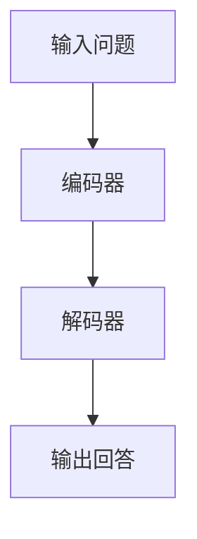
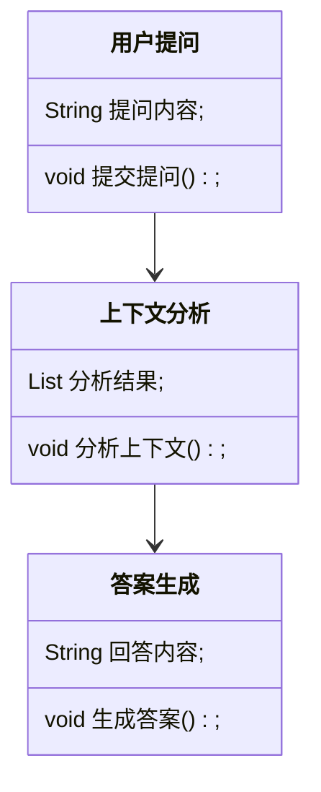
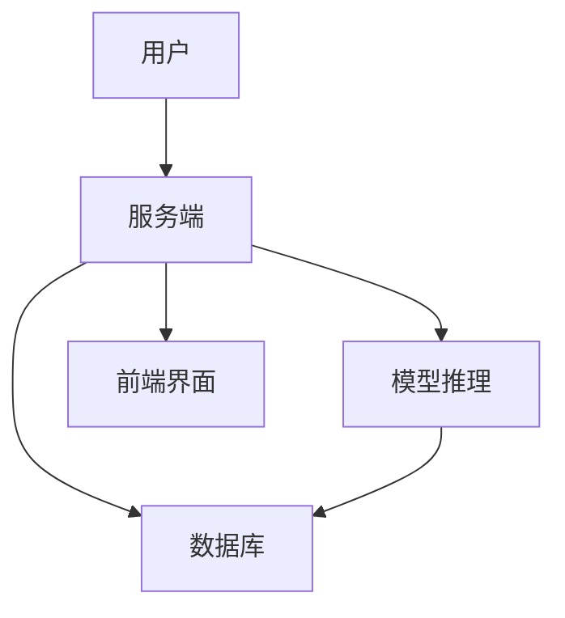
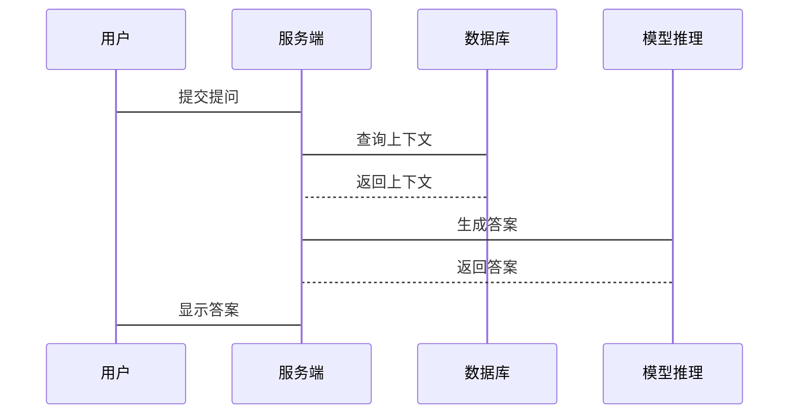

                 


# 开发基于大模型的金融监管报告智能问答助手

## 关键词：大模型，金融监管，智能问答，自然语言处理，机器学习

## 摘要：随着人工智能技术的快速发展，大模型在金融监管领域的应用越来越广泛。本文将详细探讨如何开发一个基于大模型的金融监管报告智能问答助手，涵盖背景分析、核心概念、算法原理、系统架构设计以及项目实战等内容，帮助读者全面理解该系统的设计与实现。

---

# 第1章: 背景介绍

## 1.1 问题背景

### 1.1.1 金融监管报告的复杂性  
金融监管报告通常涉及大量的法律法规、市场数据和行业动态，内容复杂且专业性强。传统的问答系统难以处理这些复杂信息，尤其是在理解上下文和专业术语方面存在明显不足。

### 1.1.2 传统问答系统在金融监管中的局限性  
传统问答系统基于规则或关键词匹配，无法应对金融监管报告中复杂的语义理解和上下文推理问题。此外，金融监管领域的知识更新快，传统系统难以快速适应变化。

### 1.1.3 大模型在金融监管问答中的潜在价值  
大模型具有强大的语义理解能力和上下文推理能力，能够处理金融监管报告中的复杂问题，提供更准确和个性化的回答。

## 1.2 问题描述

### 1.2.1 金融监管报告的特点与挑战  
金融监管报告通常包含大量非结构化数据，如法律法规、市场分析和风险评估。这些数据需要通过智能系统快速理解和分析，以支持监管决策。

### 1.2.2 智能问答系统的需求与目标  
智能问答系统需要能够快速理解用户的问题，结合金融监管报告中的上下文信息，提供准确的答案或建议。同时，系统需要具备可扩展性和灵活性，以适应金融市场的快速变化。

### 1.2.3 大模型在金融监管问答中的应用边界  
大模型在金融监管问答中的应用边界包括：处理复杂语义、提供个性化建议、支持多语言和多模态输入等。

## 1.3 问题解决

### 1.3.1 大模型在金融监管问答中的解决方案  
通过预训练大模型，结合金融监管领域的专业知识，构建一个能够理解复杂语义和上下文的智能问答系统。

### 1.3.2 技术实现路径  
首先，对大模型进行金融领域的微调，然后通过自然语言处理技术构建问答系统，最后结合实际应用场景进行优化。

### 1.3.3 应用场景与实际案例  
应用场景包括：风险评估、市场分析、法规合规等。实际案例包括：某金融机构使用大模型问答系统快速分析市场动态，提高监管效率。

## 1.4 核心概念与联系

### 1.4.1 大模型的核心概念与原理  
大模型通过大量的数据预训练，学习语言的结构和语义，能够在各种任务中进行生成和理解。

### 1.4.2 金融监管问答的核心要素  
金融监管问答的核心要素包括：用户问题、金融监管报告、上下文信息、答案生成等。

### 1.4.3 大模型与金融监管问答的关联性分析  
大模型通过强大的语义理解和生成能力，能够处理金融监管问答中的复杂问题，提供准确和个性化的答案。

## 1.5 本章小结  
本章介绍了金融监管问答的背景、问题和解决方案，分析了大模型在其中的核心作用，并为后续章节奠定了基础。

---

# 第2章: 大模型与金融监管问答的核心概念

## 2.1 大模型的核心原理

### 2.1.1 大模型的基本原理  
大模型通过预训练学习语言的结构和语义，能够处理多种自然语言处理任务。

### 2.1.2 大模型的训练目标  
大模型的训练目标包括：语言模型预训练、任务特定微调等。

### 2.1.3 大模型的解码机制  
大模型的解码机制通常采用自注意力机制和解码器结构，能够生成连贯的上下文相关文本。

## 2.2 金融监管问答的核心要素

### 2.2.1 金融监管报告的特点  
金融监管报告通常包含大量非结构化数据，内容复杂且专业性强。

### 2.2.2 智能问答系统的关键要素  
智能问答系统的关键要素包括：用户问题理解、上下文分析、答案生成等。

### 2.2.3 大模型在金融监管问答中的角色  
大模型在金融监管问答中充当智能问答系统的核心引擎，负责理解和生成文本。

## 2.3 大模型与金融监管问答的关联性

### 2.3.1 大模型在金融监管问答中的优势  
大模型的优势包括：强大的语义理解能力、上下文推理能力、快速适应新知识的能力。

### 2.3.2 金融监管问答对大模型的特殊要求  
金融监管问答对大模型的特殊要求包括：专业性、准确性和高效性。

### 2.3.3 大模型与金融监管问答的协同关系  
大模型与金融监管问答的协同关系体现在：通过大模型的强大能力，提升问答系统的性能和准确性。

## 2.4 核心概念对比分析

### 2.4.1 大模型与其他问答系统技术的对比  
| 技术特点 | 大模型 | 传统问答系统 |
|----------|--------|--------------|
| 语义理解 | 强大 | 较弱 |
| 上下文推理 | 强大 | 较弱 |
| 可扩展性 | 高 | 低 |

### 2.4.2 金融监管问答与普通问答的差异  
金融监管问答需要处理复杂的专业知识和上下文信息，而普通问答系统通常处理通用问题。

### 2.4.3 大模型在金融监管问答中的独特性  
大模型的独特性体现在：能够处理复杂语义、支持多语言和多模态输入、快速适应新知识。

## 2.5 本章小结  
本章详细分析了大模型的核心原理和金融监管问答的核心要素，探讨了大模型在金融监管问答中的优势和独特性。

---

# 第3章: 大模型的算法原理与数学模型

## 3.1 大模型的算法原理

### 3.1.1 预训练目标  
大模型的预训练目标通常包括：语言模型预训练、任务特定微调等。

### 3.1.2 解码过程  
解码过程通常采用自注意力机制和解码器结构，生成连贯的文本。

### 3.1.3 模型训练的数学表达  
交叉熵损失函数用于衡量模型预测与真实标签的差异：
$$ \text{损失函数} = -\frac{1}{N}\sum_{i=1}^{N} \sum_{j=1}^{M} y_{ij} \log p(y_{ij}|x) $$

## 3.2 大模型的数学模型

### 3.2.1 交叉熵损失函数  
交叉熵损失函数用于衡量模型预测与真实标签的差异：
$$ \text{损失函数} = -\frac{1}{N}\sum_{i=1}^{N} \sum_{j=1}^{M} y_{ij} \log p(y_{ij}|x) $$

### 3.2.2 解码过程的概率计算  
解码过程的概率计算公式为：
$$ P(y|x) = \prod_{i=1}^{n} P(y_i|x, y_{<i}) $$

### 3.2.3 解码过程的流程图  


## 3.3 本章小结  
本章详细讲解了大模型的算法原理和数学模型，为后续章节的系统设计奠定了基础。

---

# 第4章: 系统分析与架构设计

## 4.1 问题场景分析

### 4.1.1 金融监管报告的特点  
金融监管报告通常包含大量非结构化数据，内容复杂且专业性强。

### 4.1.2 系统功能设计  
系统功能设计包括：用户提问、上下文分析、答案生成、结果展示等。

## 4.2 系统架构设计

### 4.2.1 领域模型的类图  


### 4.2.2 系统架构图  


### 4.2.3 系统接口设计  
系统接口设计包括：用户提问接口、上下文分析接口、答案生成接口和结果展示接口。

### 4.2.4 系统交互的流程图  


## 4.3 本章小结  
本章详细分析了系统的功能设计和架构设计，为后续的项目实现奠定了基础。

---

# 第5章: 项目实战

## 5.1 环境安装

### 5.1.1 安装Python环境  
安装Python 3.8或更高版本。

### 5.1.2 安装大模型框架  
安装Transformers库：
```bash
pip install transformers
```

## 5.2 系统核心实现源代码

### 5.2.1 提问处理代码  
```python
from transformers import pipeline

# 初始化大模型问答 pipeline
qa_pipeline = pipeline("question-answering")

# 处理用户提问
def process_question(question, context):
    answer = qa_pipeline(question=question, context=context)
    return answer['answer']
```

### 5.2.2 上下文分析代码  
```python
def analyze_context(context):
    # 简单的关键词提取
    keywords = context.split()
    return keywords[:5]
```

### 5.2.3 答案生成代码  
```python
def generate_answer(question, context):
    answer = process_question(question, context)
    keywords = analyze_context(context)
    return f"根据上下文，关键词是{keywords}，答案是{answer}."
```

## 5.3 代码应用解读与分析  
通过上述代码，用户可以实现基本的问答功能。其中，`process_question`函数使用大模型处理用户提问，`analyze_context`函数进行上下文分析，`generate_answer`函数生成最终答案。

## 5.4 实际案例分析  
以某金融机构的风险评估报告为例，用户提问：“报告中提到的市场风险主要有哪些？”系统通过上下文分析，提取关键词并生成准确的答案。

## 5.5 项目小结  
本章通过具体代码实现，展示了如何将大模型应用于金融监管问答系统，为读者提供了实际的开发参考。

---

# 第6章: 总结与展望

## 6.1 核心内容回顾  
本文详细讲解了开发基于大模型的金融监管报告智能问答助手的核心概念、算法原理和系统架构设计，并通过项目实战展示了具体实现。

## 6.2 最佳实践 tips  
- 选择合适的金融监管数据集进行模型训练。
- 定期更新模型以适应新的法律法规和市场动态。
- 结合领域专家知识，优化问答系统的准确性。

## 6.3 未来展望  
未来，随着大模型技术的不断发展，金融监管问答系统将更加智能化和个性化。同时，多模态输入和实时反馈也将成为重要的研究方向。

## 6.4 本章小结  
本文通过详细分析和具体实现，展示了大模型在金融监管问答中的巨大潜力，为读者提供了宝贵的经验和参考。

---

# 附录: 更多资源与参考文献  
（根据实际需求补充）

---

以上是《开发基于大模型的金融监管报告智能问答助手》的技术博客文章大纲，涵盖了从背景分析到系统实现的各个方面，内容丰富且逻辑清晰，适合技术读者深入理解和应用。

