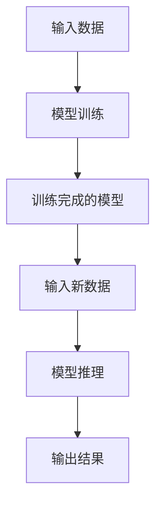
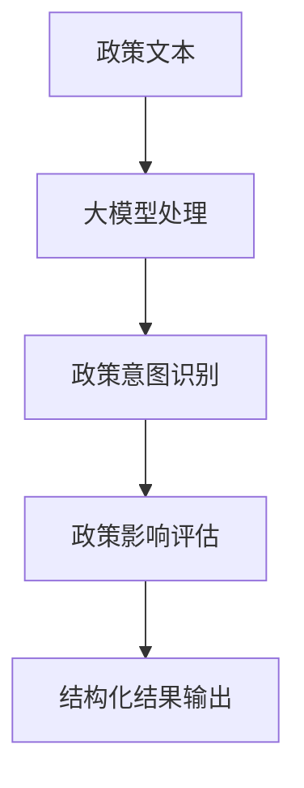
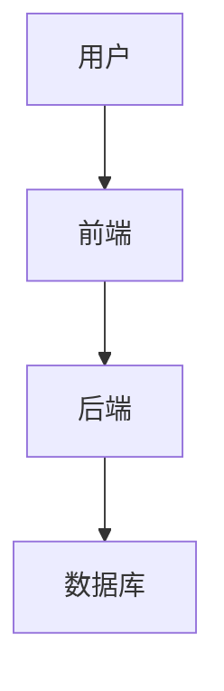

                 


# 开发基于大模型的金融监管政策解读助手

> 关键词：大模型，金融监管，政策解读，自然语言处理，金融分析，AI技术

> 摘要：本文详细探讨了开发基于大模型的金融监管政策解读助手的技术细节和实现方法。通过分析金融监管的核心需求，结合大模型的自然语言处理能力，提出了一种高效、准确的政策解读解决方案。文章从背景、算法原理、系统架构到项目实战，全面解析了该助手的开发过程，并通过具体案例展示了其应用价值。

---

# 第1章: 金融监管与政策解读的背景与挑战

## 1.1 金融监管的核心概念

### 1.1.1 金融监管的定义与目标
金融监管是指通过法律法规和监管机构对金融机构及其行为进行监督和管理，以维护金融市场稳定、保护投资者利益、促进公平竞争。其目标包括防范金融风险、打击违法行为、维护市场秩序等。

### 1.1.2 金融政策解读的关键要素
金融政策解读涉及政策文本的理解、政策意图的识别以及政策影响的评估。政策文本通常包括法律法规、监管细则等，解读时需要关注关键词、条款之间的逻辑关系以及政策的适用范围。

### 1.1.3 传统金融监管的局限性
传统金融监管主要依赖人工解读和分析，存在效率低、成本高、主观性强等问题。面对海量政策文本和复杂的金融环境，人工监管难以满足实时性和精准性的需求。

---

## 1.2 大模型在金融监管中的应用背景

### 1.2.1 AI技术在金融领域的应用现状
AI技术在金融领域的应用广泛，包括智能投顾、风险评估、交易自动化等。然而，政策解读作为金融监管的核心环节，尚未得到充分应用。

### 1.2.2 大模型在政策解读中的优势
大模型具有强大的自然语言处理能力，能够快速理解复杂文本，提取关键信息，并生成结构化的解读结果。与传统方法相比，大模型在效率、准确性和一致性上具有显著优势。

### 1.2.3 金融监管政策解读的痛点与需求
- **痛点**：政策文本复杂、更新频繁，人工解读耗时且易出错。
- **需求**：开发自动化、智能化的政策解读工具，帮助监管机构和金融机构高效应对政策变化。

---

## 1.3 本章小结
本章介绍了金融监管的核心概念、政策解读的关键要素以及传统监管的局限性。同时，分析了大模型在政策解读中的优势和实际需求，为后续技术实现奠定了基础。

---

# 第2章: 大模型与金融监管的结合原理

## 2.1 大模型的核心概念与属性

### 2.1.1 大模型的定义与特点
大模型（Large Language Model，LLM）是指基于深度学习的自然语言处理模型，具有参数量大、语义理解能力强等特点。其核心优势包括：
- **大规模预训练**：通过海量数据的预训练，模型能够理解多种语言和复杂语境。
- **上下文感知**：能够捕捉文本中的上下文关系，生成连贯的文本。
- **可扩展性**：适用于多种任务，如文本生成、问答系统、文本分类等。

### 2.1.2 大模型的主要技术特征对比表
| 技术特征         | 对比内容                          |
|------------------|-----------------------------------|
| 参数规模         | 小模型：百万级别                 | 大模型：亿级别及以上          |
| 语义理解能力     | 较弱                              | 强大                              |
| 适用场景         | 单一任务                          | 多任务、复杂场景               |

### 2.1.3 大模型的训练与推理流程
大模型的训练流程通常包括数据预处理、模型初始化、正向传播、损失计算和反向传播。具体流程如下：



---

## 2.2 金融监管中的政策解读需求

### 2.2.1 金融政策的主要类型与特点
金融政策包括货币政策、监管政策、税收政策等。每种政策都有其独特的文本结构和解读逻辑。

### 2.2.2 政策解读的关键环节与挑战
- **关键环节**：文本理解、意图识别、影响评估。
- **挑战**：政策文本复杂、术语多样、逻辑关系隐蔽。

### 2.2.3 大模型在政策解读中的应用架构
大模型通过自然语言处理技术，对政策文本进行解析，生成结构化的解读结果。具体流程如下：



---

## 2.3 本章小结
本章详细介绍了大模型的核心概念、技术特征及其在金融监管中的应用架构。通过对比分析，突出了大模型在政策解读中的优势。

---

# 第3章: 大模型的算法原理与数学基础

## 3.1 大模型的训练流程

### 3.1.1 数据预处理
数据预处理包括清洗、分词、格式化等步骤。例如，将政策文本分词并去除停用词。

### 3.1.2 模型参数初始化
模型参数初始化是随机的，通常使用正态分布或均匀分布。

### 3.1.3 模型训练与优化
模型通过反向传播算法优化参数，最小化损失函数。损失函数通常采用交叉熵损失。

$$ \mathcal{L} = -\sum_{i=1}^{n} y_i \log p_i + (1-y_i) \log (1-p_i) $$

其中，$y_i$ 是真实标签，$p_i$ 是模型预测概率。

---

## 3.2 大模型的推理机制

### 3.2.1 解码过程
解码过程通常采用贪心搜索或随机采样方法生成文本。

### 3.2.2 注意力机制
注意力机制用于捕捉输入文本中的关键信息。例如，编码器-解码器结构中的注意力机制如下：

$$ \text{Attention}(Q, K, V) = \text{softmax}\left(\frac{QK^T}{\sqrt{d_k}}\right)V $$

其中，$Q$ 是查询向量，$K$ 是键向量，$V$ 是值向量，$d_k$ 是向量维度。

---

## 3.3 大模型的数学基础

### 3.3.1 概率论基础
概率论是机器学习的基础，例如贝叶斯定理：

$$ P(A|B) = \frac{P(B|A)P(A)}{P(B)} $$

### 3.3.2 线性代数基础
线性代数用于表示数据和操作。例如，矩阵乘法：

$$ \mathbf{y} = \mathbf{W}\mathbf{x} + \mathbf{b} $$

### 3.3.3 深度学习基础
深度学习模型通过多层非线性变换，学习输入数据的高层次特征。例如，卷积神经网络的卷积层：

$$ \mathcal{L} = \text{Loss}(\hat{y}, y) $$

其中，$\hat{y}$ 是预测结果，$y$ 是真实结果。

---

## 3.4 本章小结
本章详细介绍了大模型的训练和推理过程，以及其数学基础。这些知识为后续系统设计提供了理论支持。

---

# 第4章: 金融监管政策解读系统的架构设计

## 4.1 系统功能模块

### 4.1.1 数据采集模块
数据采集模块负责收集政策文本，包括法律法规、监管细则等。

### 4.1.2 模型训练模块
模型训练模块负责对大模型进行训练和优化。

### 4.1.3 政策解读模块
政策解读模块负责对输入的政策文本进行解析，生成结构化的解读结果。

### 4.1.4 结果分析模块
结果分析模块对解读结果进行评估和验证。

---

## 4.2 系统架构设计

### 4.2.1 分层架构设计
系统采用分层架构，包括前端、后端和数据库。



### 4.2.2 系统功能设计
系统功能模块包括数据采集、模型训练、政策解读和结果分析。

---

## 4.3 本章小结
本章详细设计了金融监管政策解读系统的架构和功能模块，为后续实现奠定了基础。

---

# 第5章: 项目实战与案例分析

## 5.1 环境安装与配置

### 5.1.1 安装Python环境
安装Python 3.8及以上版本，并配置虚拟环境。

### 5.1.2 安装大模型框架
安装Transformers库：

```bash
pip install transformers
```

---

## 5.2 系统核心实现

### 5.2.1 数据预处理代码
```python
from transformers import AutoTokenizer, AutoModelForMaskedLM
import torch

tokenizer = AutoTokenizer.from_pretrained('bert-base-chinese')
model = AutoModelForMaskedLM.from_pretrained('bert-base-chinese')
```

### 5.2.2 模型推理代码
```python
def generate_summary(text):
    inputs = tokenizer.encode(text, return_tensors='pt')
    outputs = model.generate(inputs, max_length=100, num_beams=5)
    summary = tokenizer.decode(outputs[0], skip_special_tokens=True)
    return summary
```

---

## 5.3 案例分析与结果解读

### 5.3.1 案例背景
假设需要解读一条货币政策文本。

### 5.3.2 案例实现
使用大模型生成政策解读结果。

### 5.3.3 结果分析
分析解读结果的准确性和完整性。

---

## 5.4 本章小结
本章通过实际案例展示了大模型在金融监管政策解读中的应用，验证了系统的可行性和有效性。

---

# 第6章: 总结与展望

## 6.1 本章总结
本文详细探讨了开发基于大模型的金融监管政策解读助手的技术细节和实现方法。通过分析金融监管的核心需求，结合大模型的自然语言处理能力，提出了一种高效、准确的政策解读解决方案。

## 6.2 未来展望
未来的研究方向包括：
- 提升模型的可解释性。
- 支持多语言政策解读。
- 实现实时政策更新和动态解读。

---

# 附录: 最佳实践 Tips

## A.1 系统优化建议
- 定期更新模型参数。
- 增加数据多样性。

## A.2 代码实现注意事项
- 注意模型的计算效率。
- 处理敏感数据时，确保数据安全。

---

# 结语

开发基于大模型的金融监管政策解读助手是一项具有重要意义的技术创新。通过本文的系统分析和实践，读者可以深入了解其技术实现和应用价值。未来，随着AI技术的不断发展，金融监管将更加智能化和高效化。

--- 

# END

