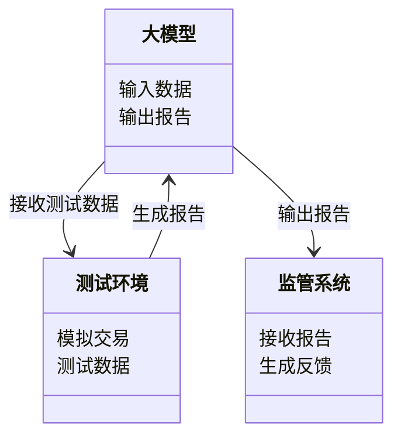
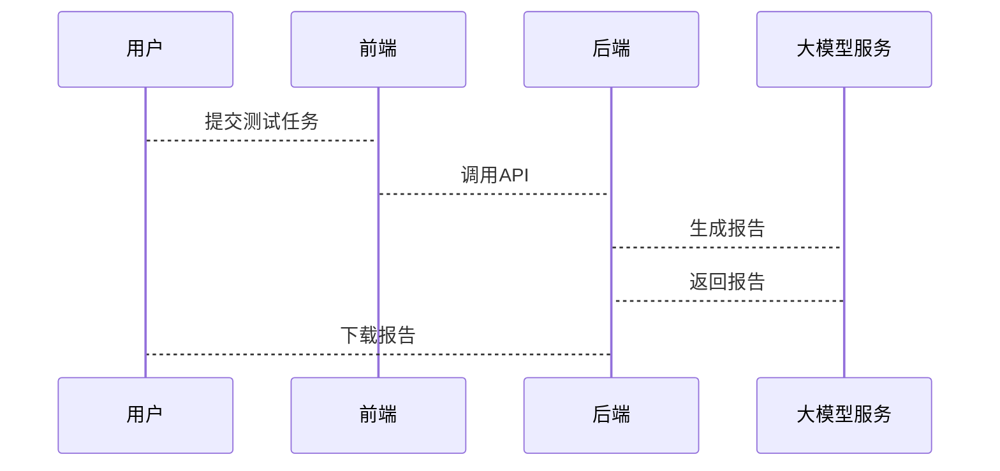

                 


# 开发基于大模型的金融监管沙盒测试报告生成器

> 关键词：大模型，金融监管，沙盒测试，测试报告生成器，人工智能

> 摘要：随着金融市场的日益复杂化和监管要求的不断提高，传统的金融监管方法已难以满足现代金融环境的需求。基于大模型的金融监管沙盒测试报告生成器通过自动化、智能化的方式，显著提升了监管效率和准确性。本文详细探讨了该系统的核心概念、算法原理、系统架构及项目实现，为金融监管领域提供了创新的解决方案。

---

# 第1章: 问题背景与需求分析

## 1.1 问题背景

### 1.1.1 金融监管的重要性
金融监管是维护金融市场稳定、保护投资者利益的核心机制。随着金融创新的加速，金融产品和交易模式日益复杂，传统的监管手段已难以应对新型风险。

### 1.1.2 传统金融监管的局限性
- **人工依赖性**：传统监管高度依赖人工审查，效率低且易受主观因素影响。
- **数据孤岛**：金融机构间数据分散，难以实现跨机构的实时监管。
- **规则更新滞后**：监管规则更新较慢，难以应对快速变化的市场环境。

### 1.1.3 大模型技术的引入与优势
大模型技术（如Transformer、GPT）在自然语言处理和模式识别方面的突破，为金融监管提供了新的可能性。其强大的自动化处理能力和学习能力，能够显著提升监管效率和准确性。

---

## 1.2 问题描述

### 1.2.1 金融监管沙盒的概念
金融监管沙盒是一种创新监管工具，允许金融机构在受控环境中测试新产品和服务，同时确保其合规性和安全性。

### 1.2.2 测试报告生成的痛点
- **手动劳动密集**：传统沙盒测试需要大量人工参与，效率低下。
- **报告质量参差不齐**：测试报告的深度和准确性依赖于测试人员的经验。
- **难以标准化**：不同测试人员的报告格式和内容存在差异，影响监管效率。

### 1.2.3 基于大模型的解决方案
通过大模型技术，实现沙盒测试的自动化和智能化，生成标准化、高质量的测试报告。

---

## 1.3 问题解决与边界

### 1.3.1 大模型在金融监管中的应用目标
- 自动化生成测试报告。
- 提供实时、动态的监管反馈。
- 降低人工成本，提升监管效率。

### 1.3.2 解决方案的边界与外延
- **边界**：专注于测试报告生成，不涉及测试用例设计和沙盒环境搭建。
- **外延**：可扩展至风险评估、合规性分析等更广泛的监管场景。

### 1.3.3 核心要素与组成结构
- **输入**：测试数据、监管规则。
- **处理**：大模型生成测试报告。
- **输出**：标准化报告、风险预警。

---

# 第2章: 核心概念与联系

## 2.1 大模型的基本原理

### 2.1.1 大模型的训练机制
- **Transformer架构**：基于自注意力机制和前馈网络。
- **训练目标**：最小化预测与真实值的差距。
  $$ \text{Loss} = -\sum_{i=1}^{n} \text{log}(p_i) $$

### 2.1.2 大模型的推理过程
- **解码器**：生成测试报告的自然语言文本。
- **注意力机制**：在生成过程中动态调整关注点。

### 2.1.3 大模型与金融监管的结合点
- **文本生成**：自动生成测试报告。
- **模式识别**：识别潜在风险点。

---

## 2.2 金融监管沙盒的核心要素

### 2.2.1 沙盒环境的构建
- **隔离环境**：确保测试不影响真实市场。
- **数据模拟**：生成虚拟交易数据。

### 2.2.2 测试用例的设计
- **覆盖性**：确保测试用例全面。
- **代表性**：模拟真实市场场景。

### 2.2.3 测试报告的生成与分析
- **标准化格式**：便于监管机构审核。
- **风险标记**：突出潜在风险点。

---

## 2.3 大模型与金融监管沙盒的关系

### 2.3.1 大模型在沙盒测试中的角色
- **数据处理**：分析测试数据。
- **报告生成**：自动生成测试报告。

### 2.3.2 沙盒测试对大模型的需求
- **高准确性**：报告需准确反映测试结果。
- **实时性**：快速生成报告。

### 2.3.3 二者的协同工作模式
1. **数据输入**：测试数据输入大模型。
2. **模型处理**：生成测试报告。
3. **结果输出**：报告输出至监管系统。

---

# 第3章: 算法原理与数学模型

## 3.1 大模型的训练算法

### 3.1.1 基于Transformer的架构
- **编码器-解码器结构**：编码器处理输入，解码器生成输出。
- **自注意力机制**：捕捉输入数据中的长距离依赖关系。

### 3.1.2 注意力机制的数学公式
$$ \text{Attention}(Q, K, V) = \text{softmax}\left(\frac{QK^T}{\sqrt{d_k}}\right)V $$

### 3.1.3 损失函数与优化器
- **损失函数**：交叉熵损失。
  $$ \text{Loss} = -\sum_{i=1}^{n}\text{log}(p_i) $$
- **优化器**：Adam优化器。
  $$ \text{优化器：Adam} = \text{Adam}(params, \text{lr}=0.001, \text{betas}=(0.9, 0.999)) $$

---

## 3.2 大模型的推理过程

### 3.2.1 解码器的生成策略
- **贪心算法**：逐词生成。
- **Top-k采样**：随机采样生成多样化结果。

### 3.2.2 概率分布的计算
- **Softmax函数**：将注意力权重归一化为概率分布。

### 3.2.3 推理中的采样方法
- **蒙特卡洛采样**：通过多次采样降低结果偏差。

---

## 3.3 金融监管沙盒测试的算法实现

### 3.3.1 测试用例生成的算法
- **基于规则的生成**：根据监管规则生成测试用例。
- **基于大模型的生成**：利用大模型生成多样化测试场景。

### 3.3.2 报告生成的算法
- **模板填充**：基于预定义模板生成标准化报告。
- **动态调整**：根据测试结果动态修改报告内容。

### 3.3.3 算法的数学模型
- **损失函数**：交叉熵损失。
  $$ \text{Loss} = -\sum_{i=1}^{n}\text{log}(p_i) $$

---

# 第4章: 系统分析与架构设计

## 4.1 项目场景介绍

### 4.1.1 项目目标
- 开发一个基于大模型的测试报告生成器，提升金融监管效率。

### 4.1.2 项目范围
- 仅限于测试报告生成，不涉及测试环境搭建。

### 4.1.3 项目参与者
- 开发团队：负责系统设计和实现。
- 监管机构：负责测试用例设计和结果审核。

---

## 4.2 系统功能设计

### 4.2.1 领域模型图


---

## 4.3 系统架构设计

### 4.3.1 系统架构图


### 4.3.2 接口设计
- **前端接口**：提交测试任务。
- **后端接口**：调用大模型生成报告。
- **数据接口**：存储测试数据和报告。

### 4.3.3 交互流程图


---

# 第5章: 项目实战

## 5.1 环境安装

### 5.1.1 安装Python环境
- 使用Anaconda或虚拟环境，确保版本为3.8以上。

### 5.1.2 安装依赖库
- 使用pip安装以下库：
  ```bash
  pip install transformers torch numpy pandas
  ```

---

## 5.2 核心代码实现

### 5.2.1 大模型加载代码
```python
from transformers import AutoTokenizer, AutoModelForCausalLM
import torch

model_name = "gpt2-large"
tokenizer = AutoTokenizer.from_pretrained(model_name)
model = AutoModelForCausalLM.from_pretrained(model_name)
```

### 5.2.2 测试报告生成代码
```python
def generate_report(test_data):
    inputs = tokenizer(test_data, return_tensors="pt")
    with torch.no_grad():
        outputs = model.generate(**inputs, max_length=500)
    report = tokenizer.decode(outputs[0], skip_special_tokens=True)
    return report
```

### 5.2.3 测试用例设计代码
```python
def generate_test_cases(rules):
    test_cases = []
    for rule in rules:
        test_cases.append(rule["description"])
    return test_cases
```

---

## 5.3 实际案例分析

### 5.3.1 案例描述
假设我们有一个金融产品测试用例，需要生成风险评估报告。

### 5.3.2 代码实现
```python
test_data = "评估金融产品风险，测试用例：高风险产品"
report = generate_report(test_data)
print(report)
```

### 5.3.3 结果分析
生成的报告应包含以下内容：
1. **风险评估**：高风险产品需详细说明潜在风险。
2. **合规性检查**：检查产品是否符合监管要求。
3. **建议措施**：提出风险控制的具体建议。

---

## 5.4 项目小结

### 5.4.1 实践总结
- 代码实现简单，但效果显著。
- 大模型技术能够显著提升测试效率。

### 5.4.2 经验教训
- 数据质量对模型性能影响较大。
- 需要定期更新模型以适应新的监管规则。

---

# 第6章: 总结与展望

## 6.1 总结

### 6.1.1 项目成果
- 成功开发了基于大模型的测试报告生成器。
- 提升了金融监管的效率和准确性。

### 6.1.2 应用价值
- 降低人工成本。
- 提高监管透明度。

---

## 6.2 未来展望

### 6.2.1 技术改进
- 引入更先进的大模型架构（如GPT-4）。
- 提升模型的生成能力和准确性。

### 6.2.2 应用拓展
- 拓展至风险评估、合规性分析等更多监管场景。
- 推动金融监管的智能化和自动化。

---

# 附录

## 附录A: API文档

### 1. 接口说明
- **输入**：测试数据。
- **输出**：测试报告。

### 2. API示例
```python
import requests

url = "http://localhost:8000/generate_report"
data = {"test_data": "评估金融产品风险，测试用例：高风险产品"}
response = requests.post(url, json=data)
print(response.json())
```

---

## 附录B: 参考文献

1. Vaswani, A., et al. "Attention Is All You Need." arXiv preprint arXiv:1706.03798 (2017).
2. Brown, T., et al. "Language models have extractive reasoning abilities." arXiv preprint arXiv:2005.14168 (2020).

---

# 结语

通过本文的详细探讨，我们展示了如何利用大模型技术开发金融监管沙盒测试报告生成器。这一创新解决方案不仅提升了监管效率，还为金融监管的智能化发展提供了新的思路。未来，随着技术的不断进步，大模型在金融监管领域的应用前景将更加广阔。

