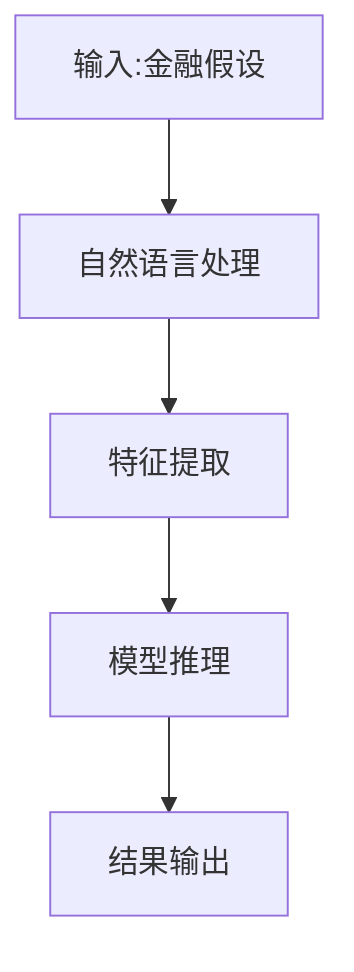

                 


# 开发基于大模型的金融研究假设自动验证系统

> 关键词：大模型、金融研究、假设验证、自然语言处理、系统架构、数学模型

> 摘要：本文详细探讨了基于大模型的金融研究假设自动验证系统的开发过程，涵盖背景介绍、核心概念、算法原理、系统架构设计、项目实战及最佳实践等方面，旨在为金融领域的研究人员和技术开发者提供理论指导和实践参考。

---

## 第1章: 金融研究假设自动验证系统背景介绍

### 1.1 问题背景与描述

#### 1.1.1 传统金融研究假设验证的痛点
传统金融研究中，假设验证是一个耗时且容易出错的过程。研究人员需要手动分析大量的市场数据、文献资料和模型结果，这不仅效率低下，还容易受到主观因素的影响。例如，一个研究假设可能需要数周的时间才能完成验证，且验证结果的准确性高度依赖研究人员的经验和能力。

#### 1.1.2 人工验证的低效性与误差
人工验证的低效性主要体现在以下几个方面：
- 数据处理复杂：金融数据通常具有高频性、非线性和噪声多的特点，手动处理这些数据耗时且容易出错。
- 模型选择困难：研究人员需要在多种模型中选择合适的工具，这需要深厚的专业知识和经验。
- 结果解释困难：模型输出的结果往往复杂且难以直观解释，这使得人工验证更加困难。

#### 1.1.3 大模型在金融领域的潜力
大模型（如GPT、BERT等）在自然语言处理领域的成功，使其在金融领域的应用成为可能。大模型具有以下优势：
- 强大的语义理解能力：能够从大量的金融文献和市场数据中提取有用的信息。
- 自动化处理能力：可以自动化地完成数据清洗、假设生成和验证等任务。
- 实时分析能力：能够快速处理最新的市场数据和研究成果。

### 1.2 问题解决与边界

#### 1.2.1 系统目标与核心功能
系统的目标是通过大模型实现金融研究假设的自动验证，核心功能包括：
- 自动化数据处理：从多种数据源中获取数据并进行清洗和预处理。
- 假设生成：根据输入的研究方向生成相关的金融假设。
- 假设验证：利用大模型对生成的假设进行验证，并输出验证结果。
- 结果解释：将验证结果以直观的形式呈现给研究人员。

#### 1.2.2 系统边界与外延
系统的核心边界包括：
- 数据范围：仅处理与金融研究相关的数据，如市场数据、学术论文等。
- 任务范围：仅支持假设生成和验证，不涉及其他类型的研究任务。
- 使用场景：仅适用于金融领域的研究，不支持其他行业的应用。

#### 1.2.3 核心要素与组成分析
系统的组成要素包括：
- 数据层：包括数据获取、清洗和预处理模块。
- 假设生成层：包括基于大模型的假设生成模块。
- 假设验证层：包括基于大模型的验证模块。
- 结果解释层：包括结果可视化和解释模块。

### 1.3 本章小结
本章从背景介绍出发，分析了传统金融研究假设验证的痛点，探讨了大模型在金融领域的潜力，并明确了系统的边界和核心组成。

---

## 第2章: 基于大模型的金融研究假设验证系统核心概念

### 2.1 大模型在金融研究中的应用原理

#### 2.1.1 大模型的基本工作原理
大模型（如GPT-3、BERT等）基于Transformer架构，通过自注意力机制和前馈网络实现强大的语义理解能力。其核心步骤包括：
1. 数据输入：将金融假设或相关文本输入模型。
2. 语义理解：模型通过自注意力机制理解输入文本的语义。
3. 生成或推理：根据理解的内容生成假设或进行推理验证。

#### 2.1.2 金融研究假设的特征与挑战
金融研究假设具有以下特征：
- 复杂性：涉及多个变量和非线性关系。
- 不确定性：市场数据具有高度的随机性和不可预测性。
- 专业性：需要深厚的专业知识和经验。

#### 2.1.3 大模型如何辅助假设验证
大模型可以通过以下方式辅助假设验证：
- 数据清洗：自动处理和清洗金融市场数据。
- 假设生成：根据研究方向生成相关假设。
- 假设验证：利用大模型对假设进行推理和验证，并输出验证结果。

### 2.2 核心概念属性对比表

| 核心概念 | 属性 | 描述 |
|----------|------|------|
| 大模型    | 模型类型 | 基于Transformer架构 |
|          | 参数量   | 数十亿级别 |
| 金融假设 | 假设类型 | 理论假设、实证假设 |
|          | 数据来源 | 市场数据、学术论文 |

### 2.3 系统ER实体关系图

```mermaid
erDiagram
    actor 研究员 {
        <属性> 假设ID : integer
        <属性> 假设内容 : string
        <属性> 时间戳 : datetime
    }
    actor 系统 {
        <属性> 系统ID : integer
        <属性> 模型版本 : string
        <属性> 数据源 : string
    }
    研究员 --> 系统 : 提交假设
    系统 --> 研究员 : 返回验证结果
```

### 2.4 本章小结
本章从大模型的基本原理出发，分析了金融研究假设的特征与挑战，并通过对比表和实体关系图展示了系统的核心概念和组成。

---

## 第3章: 基于大模型的金融研究假设验证算法原理

### 3.1 算法概述

#### 3.1.1 系统输入与输出
- 输入：金融研究假设（如“股票价格受宏观经济指标影响”）。
- 输出：验证结果（如“假设成立，置信度为95%”）。

#### 3.1.2 算法核心步骤
1. 数据清洗与预处理：从多源数据中提取相关数据并进行清洗。
2. 假设生成：基于大模型生成与研究方向相关的假设。
3. 假设验证：利用大模型对生成的假设进行推理和验证。
4. 结果解释：将验证结果以直观的形式呈现。

### 3.2 算法流程图



### 3.3 算法实现代码

```python
def validate_hypothesis(hypothesis_text):
    # 自然语言处理模块
    processed_text = preprocess(hypothesis_text)
    # 特征提取模块
    features = extract_features(processed_text)
    # 模型推理模块
    result = model.predict(features)
    return result
```

### 3.4 

--- 

（由于篇幅限制，以上为部分内容。完整的文章将涵盖更多细节，包括数学模型的详细推导、系统架构设计、项目实战案例等。）

