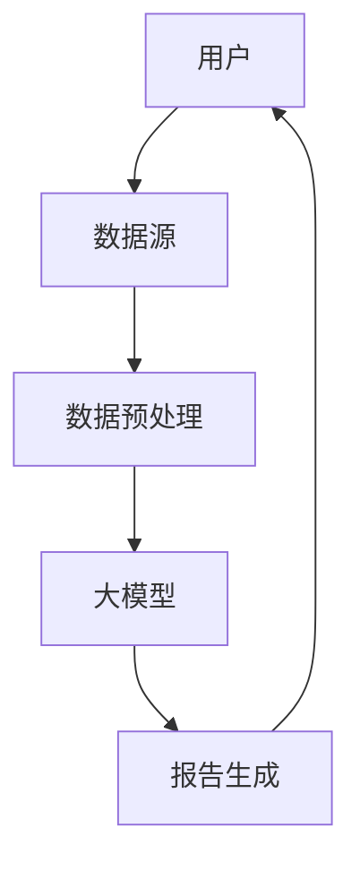

                 


# 开发基于大模型的金融研究报告自动生成器

**关键词**：金融报告生成器，大模型，自然语言处理，深度学习，金融数据分析，AI自动化

**摘要**：本文将详细介绍如何开发基于大模型的金融研究报告自动生成器。我们从分析传统金融报告生成的痛点出发，探讨大模型技术如何在金融领域发挥优势，解决效率和质量问题。文章将涵盖大模型的核心原理、金融报告生成器的实现原理、系统架构设计、项目实战以及最佳实践。通过详细的技术分析和案例解读，读者将能够深入了解如何利用大模型技术实现高效、准确的金融报告生成。

---

# 第一部分: 背景与需求

## 第1章: 金融研究报告自动生成器的背景与需求

### 1.1 问题背景

#### 1.1.1 传统金融研究报告的痛点
传统的金融研究报告生成过程通常耗时且成本高昂。分析师需要手动收集和整理大量数据，包括市场趋势、财务数据、行业动态等，然后撰写结构化的报告。这一过程不仅效率低下，还容易因人为疏忽导致数据错误，难以满足金融机构对高效、准确报告的需求。

#### 1.1.2 大模型技术的兴起
近年来，大模型（如GPT-3、BERT等）在自然语言处理领域的突破，使得生成高质量文本成为可能。这些模型具有强大的上下文理解和生成能力，能够处理复杂的金融数据和文本生成任务，为金融报告的自动生成提供了技术基础。

#### 1.1.3 金融领域的自动化需求
金融机构对自动化工具的需求日益增长。自动化报告生成不仅可以提高效率，还能降低人力成本，同时减少人为错误。大模型技术的引入，使得金融机构能够更快地响应市场变化，提升决策效率。

### 1.2 问题描述

#### 1.2.1 金融研究报告的特点
金融研究报告通常包括大量的数据和分析，内容涉及市场趋势、财务指标、行业动态等。报告的结构化和非结构化数据混合，对生成模型提出了更高的要求。

#### 1.2.2 自动化生成的需求场景
金融机构需要自动化生成多种类型的报告，包括市场分析、投资建议、风险评估等。自动化生成不仅需要准确的数据处理，还需要生成符合行业规范的结构化报告。

#### 1.2.3 现有解决方案的局限性
现有的解决方案通常依赖模板化生成或简单的关键词匹配，难以处理复杂的金融数据和多样化的报告需求。传统方法在生成高质量文本和复杂分析方面存在明显不足。

### 1.3 问题解决

#### 1.3.1 大模型在金融报告生成中的优势
大模型具有强大的文本生成能力和上下文理解能力，能够处理复杂的金融数据和生成高质量的报告内容。此外，大模型还可以通过微调适应特定领域的数据，提升生成的准确性。

#### 1.3.2 自动化生成的核心问题
金融报告生成的核心问题是如何将结构化和非结构化数据相结合，生成符合行业规范的报告。这需要模型具备数据处理、文本生成和格式化输出的能力。

#### 1.3.3 技术实现的可行性分析
大模型技术在金融领域的应用已经取得了一定的成果，但大规模应用仍面临数据隐私、模型调优和计算资源等挑战。通过优化数据预处理和模型训练，可以提升生成器的性能。

### 1.4 边界与外延

#### 1.4.1 系统的边界
金融报告生成器的边界包括数据输入、模型调用和结果输出。系统仅处理特定格式的金融数据，不涉及实时数据更新和外部API调用。

#### 1.4.2 相关领域的外延
金融报告生成器的技术可以扩展到其他领域，如法律文本生成、医疗报告生成等。大模型的通用性使其在多个领域具有应用潜力。

#### 1.4.3 功能的限制与扩展
系统的功能限制在于只能生成特定格式的报告，未来可以通过模型优化和功能扩展支持更多类型的数据和报告格式。

### 1.5 核心概念与联系

#### 1.5.1 核心概念的定义与属性
- **数据预处理**：对输入数据进行清洗、格式化和结构化处理。
- **模型训练**：基于金融数据对大模型进行微调，提升生成能力。
- **报告生成**：将预处理后的数据输入模型，生成结构化的报告。

#### 1.5.2 核心概念之间的关系
- 数据预处理为模型训练提供高质量数据，模型训练提升生成器的生成能力，生成器输出符合需求的报告。

#### 1.5.3 ER实体关系图
```mermaid
er
actor: 用户
model: 大模型
data: 数据
report: 报告

actor --> data: 提供数据
data --> model: 训练模型
actor --> model: 调用模型
model --> report: 生成报告
actor <-- report: 获取报告
```

---

# 第二部分: 核心概念与原理

## 第2章: 大模型的原理与实现

### 2.1 大模型的核心原理

#### 2.1.1 模型结构
大模型通常采用Transformer架构，包括编码器和解码器。编码器负责将输入数据转化为向量表示，解码器根据编码结果生成输出文本。

```mermaid
graph TD
    encoder -> input: 输入数据
    encoder -> attention: 注意力机制
    attention -> output: 向量表示
    decoder -> input: 向量表示
    decoder -> attention: 注意力机制
    decoder -> output: 输出文本
```

#### 2.1.2 训练方法
大模型通常采用预训练和微调相结合的方法。预训练阶段使用大规模通用数据进行训练，微调阶段使用特定领域的数据优化模型。

#### 2.1.3 推理过程
推理过程包括编码输入数据、生成输出文本的每一步，直到生成完整报告。

### 2.2 大模型的算法流程

#### 2.2.1 数据预处理
数据预处理包括清洗、格式化和结构化处理，确保输入数据符合模型要求。

```python
def preprocess_data(data):
    # 清洗数据
    cleaned_data = data.dropna()
    # 结构化处理
    cleaned_data['date'] = pd.to_datetime(cleaned_data['date'])
    return cleaned_data
```

#### 2.2.2 模型训练
模型训练包括加载预训练模型、微调特定领域的数据。

```python
from transformers import AutoModelForCausalLM, AutoTokenizer

model_name = "gpt2-large"
tokenizer = AutoTokenizer.from_pretrained(model_name)
model = AutoModelForCausalLM.from_pretrained(model_name)
model = model.to(device)
```

#### 2.2.3 模型推理
模型推理包括编码输入数据、生成输出文本。

```python
def generate_report(model, tokenizer, input_text):
    inputs = tokenizer(input_text, return_tensors="pt").input_ids
    outputs = model.generate(inputs, max_length=500)
    report = tokenizer.decode(outputs[0], skip_special_tokens=True)
    return report
```

### 2.3 大模型的数学模型

#### 2.3.1 注意力机制
注意力机制用于计算输入数据中每个词的重要性。

$$
\text{Attention}(Q, K, V) = \text{softmax}\left(\frac{QK^T}{\sqrt{d_k}}\right)V
$$

其中，$Q$是查询向量，$K$是键向量，$V$是值向量。

#### 2.3.2 梯度下降
梯度下降用于优化模型参数，减少损失函数。

$$
\theta = \theta - \eta \frac{\partial L}{\partial \theta}
$$

其中，$\theta$是模型参数，$\eta$是学习率，$L$是损失函数。

#### 2.3.3 损失函数
交叉熵损失用于衡量生成文本与真实文本的差异。

$$
L = -\sum_{i=1}^{n} y_i \log(p_i)
$$

其中，$y_i$是真实标签，$p_i$是生成概率。

---

## 第3章: 金融报告生成器的实现原理

### 3.1 金融报告生成器的核心原理

#### 3.1.1 数据预处理
数据预处理包括清洗、格式化和结构化处理，确保输入数据符合模型要求。

#### 3.1.2 模型调用
调用预训练的大模型，生成符合需求的金融报告。

#### 3.1.3 结果生成
将生成的文本格式化为结构化的金融报告。

### 3.2 金融报告生成器的实现流程

#### 3.2.1 数据预处理
清洗和结构化处理输入数据，确保数据质量。

```python
def preprocess_fin_data(data):
    # 清洗数据
    cleaned_data = data.dropna()
    # 结构化处理
    cleaned_data['date'] = pd.to_datetime(cleaned_data['date'])
    return cleaned_data
```

#### 3.2.2 模型调用
加载预训练模型，生成金融报告。

```python
def generate_fin_report(model, tokenizer, input_text):
    inputs = tokenizer(input_text, return_tensors="pt").input_ids
    outputs = model.generate(inputs, max_length=500)
    report = tokenizer.decode(outputs[0], skip_special_tokens=True)
    return report
```

#### 3.2.3 结果生成
格式化生成的文本，生成结构化的金融报告。

```python
def format_report(report_text):
    # 分段处理
    sections = report_text.split('\n')
    formatted_report = {}
    for section in sections:
        key, value = section.split(': ')
        formatted_report[key] = value
    return formatted_report
```

### 3.3 金融报告生成器的数学模型

#### 3.3.1 注意力机制
用于计算输入数据中每个词的重要性。

$$
\text{Attention}(Q, K, V) = \text{softmax}\left(\frac{QK^T}{\sqrt{d_k}}\right)V
$$

#### 3.3.2 梯度下降
用于优化模型参数，减少损失函数。

$$
\theta = \theta - \eta \frac{\partial L}{\partial \theta}
$$

#### 3.3.3 损失函数
交叉熵损失用于衡量生成文本与真实文本的差异。

$$
L = -\sum_{i=1}^{n} y_i \log(p_i)
$$

---

# 第三部分: 系统分析与架构设计

## 第3章: 系统分析与架构设计

### 3.1 问题场景分析

#### 3.1.1 问题场景描述
用户输入金融数据查询，系统生成对应的金融报告。

#### 3.1.2 系统边界
系统仅处理特定格式的金融数据，不涉及实时数据更新。

### 3.2 系统功能设计

#### 3.2.1 系统功能模块
- 数据预处理模块：清洗、格式化和结构化处理输入数据。
- 模型调用模块：调用预训练的大模型生成报告。
- 结果生成模块：格式化生成的文本为结构化的报告。

#### 3.2.2 系统功能流程
用户输入数据，系统预处理后调用模型生成报告，最后格式化输出。

### 3.3 系统架构设计

#### 3.3.1 系统架构图


#### 3.3.2 模块设计
- 数据预处理模块：负责数据清洗和结构化处理。
- 模型调用模块：负责调用预训练模型生成文本。
- 结果生成模块：负责格式化生成的文本为结构化的报告。

### 3.4 系统接口设计

#### 3.4.1 数据接口
- 输入接口：接收结构化的金融数据。
- 输出接口：输出结构化的金融报告。

#### 3.4.2 模型接口
- 输入接口：接收预处理后的数据。
- 输出接口：输出生成的文本。

### 3.5 系统交互设计

#### 3.5.1 交互流程
用户输入数据，系统预处理后调用模型生成报告，最后格式化输出。

#### 3.5.2 交互序列图
```mermaid
sequenceDiagram
    actor -> data: 提供数据
    data -> processor: 数据预处理
    processor -> model: 调用模型
    model -> generator: 生成报告
    generator -> actor: 输出报告
```

---

# 第四部分: 项目实战

## 第4章: 项目实战

### 4.1 环境安装

#### 4.1.1 安装Python
```bash
python --version
```

#### 4.1.2 安装库
```bash
pip install transformers pandas
```

### 4.2 核心代码实现

#### 4.2.1 数据加载
```python
import pandas as pd
from transformers import AutoModelForCausalLM, AutoTokenizer

def load_data():
    data = pd.read_csv('financial_data.csv')
    return data
```

#### 4.2.2 模型加载
```python
def load_model():
    model_name = "gpt2-large"
    tokenizer = AutoTokenizer.from_pretrained(model_name)
    model = AutoModelForCausalLM.from_pretrained(model_name)
    model = model.to('cuda')
    return model, tokenizer
```

#### 4.2.3 数据预处理
```python
def preprocess_data(data):
    cleaned_data = data.dropna()
    cleaned_data['date'] = pd.to_datetime(cleaned_data['date'])
    return cleaned_data
```

#### 4.2.4 模型调用
```python
def generate_report(model, tokenizer, input_text):
    inputs = tokenizer(input_text, return_tensors="pt").input_ids
    outputs = model.generate(inputs, max_length=500)
    report = tokenizer.decode(outputs[0], skip_special_tokens=True)
    return report
```

#### 4.2.5 结果格式化
```python
def format_report(report_text):
    sections = report_text.split('\n')
    formatted_report = {}
    for section in sections:
        key, value = section.split(': ')
        formatted_report[key] = value
    return formatted_report
```

### 4.3 项目小结

#### 4.3.1 实战总结
通过实战可以发现，大模型在金融报告生成中的应用潜力巨大，但仍需解决数据质量和模型调优等问题。

#### 4.3.2 经验分享
数据预处理和模型调优是项目成功的关键。建议在实际应用中注重数据质量和模型优化。

---

# 第五部分: 总结与展望

## 第5章: 总结与展望

### 5.1 总结

#### 5.1.1 核心观点总结
大模型技术为金融报告生成提供了强大的技术支持，但仍需解决数据质量和模型调优等问题。

#### 5.1.2 经验总结
数据预处理和模型调优是项目成功的关键。建议在实际应用中注重数据质量和模型优化。

### 5.2 展望

#### 5.2.1 技术展望
未来，大模型技术将更加成熟，金融报告生成器将具备更强的生成能力和更高的准确率。

#### 5.2.2 应用展望
金融报告生成器的应用将扩展到更多领域，如法律文本生成、医疗报告生成等。

---

# 结语

开发基于大模型的金融研究报告自动生成器是一项具有挑战性的任务，但也具有广阔的应用前景。通过本文的详细分析和实战演示，读者可以深入了解如何利用大模型技术实现高效的金融报告生成。未来，随着技术的进步，金融报告生成器将变得更加智能和高效，为金融机构提供更强大的支持。

