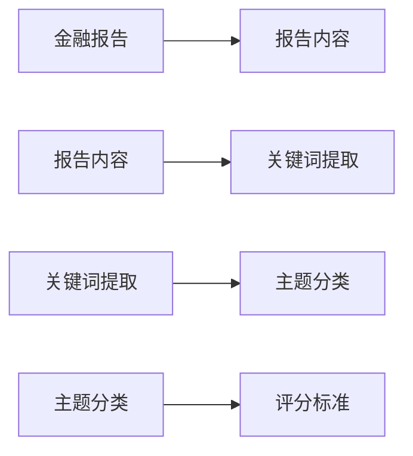
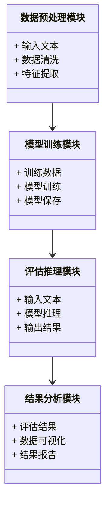

                 


# 开发基于大模型的金融研究报告评估系统

> 关键词：大模型，金融报告，评估系统，自然语言处理，机器学习，AI

> 摘要：本文详细探讨了基于大模型的金融研究报告评估系统的开发过程，从问题背景到系统架构，从算法原理到项目实战，全面解析了该系统的构建方法和实现细节。

---

## 第1章 背景介绍

### 1.1 问题背景

#### 1.1.1 传统金融研究报告评估的痛点
传统的金融研究报告评估主要依赖人工分析，存在以下问题：
- **效率低下**：人工评估耗时长，难以满足大量报告的处理需求。
- **主观性较强**：评估结果受评估人员主观因素影响较大。
- **一致性不足**：不同评估人员的标准可能不一致，导致结果缺乏统一性。

#### 1.1.2 大模型在金融领域的应用潜力
随着大模型技术的快速发展，其在金融领域的应用潜力逐渐显现：
- **自然语言处理能力**：大模型能够准确理解和分析文本内容。
- **强大的特征提取能力**：能够从金融报告中提取关键信息和特征。
- **自动化评估能力**：通过训练，大模型可以实现对金融报告的自动化评估。

#### 1.1.3 金融研究报告评估系统的需求分析
为了提高金融研究报告评估的效率和准确性，开发一个基于大模型的金融研究报告评估系统显得尤为重要：
- **自动化处理**：实现金融报告的自动评估，减少人工干预。
- **高准确性**：通过大模型的深度学习能力，提高评估结果的准确性。
- **可扩展性**：系统应具备良好的扩展性，支持不同类型的金融报告评估。

### 1.2 问题描述

#### 1.2.1 金融研究报告评估的核心问题
金融研究报告评估的核心问题包括：
- 如何准确提取报告中的关键信息和主题。
- 如何建立有效的评分标准和评估指标。
- 如何实现报告内容与评分标准的自动匹配。

#### 1.2.2 现有解决方案的局限性
现有解决方案主要依赖人工评估，存在以下局限性：
- **效率低**：人工评估耗时长，难以应对大量报告。
- **一致性差**：不同评估人员的标准不一，导致结果不稳定。
- **缺乏深度分析**：人工评估难以全面捕捉报告中的细微差别。

#### 1.2.3 基于大模型的解决方案的优势
基于大模型的解决方案具有以下优势：
- **高效性**：大模型可以快速处理大量报告，显著提高评估效率。
- **一致性**：基于统一的模型和标准，评估结果具有较高的一致性。
- **深度分析**：大模型能够从报告中提取深层次信息，提供更精准的评估结果。

### 1.3 问题解决

#### 1.3.1 大模型在金融报告评估中的应用思路
大模型在金融报告评估中的应用思路包括：
- **模型训练**：利用大量金融报告数据，训练大模型，使其具备金融领域的语义理解和分析能力。
- **特征提取**：从报告中提取关键特征，如关键词、主题等。
- **评估推理**：基于提取的特征和模型的分析能力，生成评估结果。

#### 1.3.2 系统设计的核心目标
系统设计的核心目标是：
- 实现金融报告的自动化评估。
- 提供高精度的评估结果。
- 支持多种类型的金融报告评估。

#### 1.3.3 系统设计的关键技术选型
系统设计的关键技术选型包括：
- **大模型选择**：选择适合金融领域的开源大模型，如GPT、BERT等。
- **自然语言处理技术**：利用自然语言处理技术进行文本分析和特征提取。
- **评分标准设计**：设计合理的评分标准和指标，确保评估结果的准确性。

### 1.4 系统的边界与外延

#### 1.4.1 系统的功能边界
系统的功能边界包括：
- **输入**：接受金融报告文本。
- **处理**：对文本进行分析和评估。
- **输出**：生成评估结果和相关报告。

#### 1.4.2 系统的外延功能
系统的外延功能包括：
- **数据预处理**：对输入文本进行清洗和预处理。
- **模型优化**：对模型进行调优，提高评估精度。
- **结果分析**：对评估结果进行分析和可视化展示。

#### 1.4.3 系统与外部系统的交互
系统与外部系统的交互包括：
- **数据输入接口**：与其他系统进行数据交互。
- **结果输出接口**：将评估结果输出给其他系统或用户。

### 1.5 概念结构与核心要素组成

#### 1.5.1 系统的整体架构
系统的整体架构包括：
- **数据层**：存储金融报告和相关数据。
- **模型层**：包含大模型和相关算法。
- **服务层**：提供评估服务和接口。
- **用户层**：用户通过界面与系统交互。

#### 1.5.2 核心要素的定义与关系
核心要素的定义与关系包括：
- **金融报告**：输入文本，包含报告内容和主题。
- **关键词提取**：从报告中提取关键词，用于主题分类。
- **主题分类**：根据关键词进行主题分类，确定报告的主题。
- **评分标准**：定义评估指标和评分规则。

#### 1.5.3 系统的模块划分
系统的模块划分包括：
- **数据预处理模块**：负责数据的清洗和预处理。
- **模型训练模块**：训练大模型，使其具备金融报告分析能力。
- **评估推理模块**：基于模型生成评估结果。
- **结果分析模块**：对评估结果进行分析和展示。

---

## 第2章 核心概念与联系

### 2.1 AI大模型的基本原理

#### 2.1.1 大模型的参数化特征
大模型的参数化特征包括：
- **参数数量**：大模型通常拥有大量的参数，能够捕捉复杂的语义信息。
- **自适应能力**：参数的灵活性使得模型能够适应不同的输入和任务。

#### 2.1.2 注意力机制的核心原理
注意力机制的核心原理：
- **注意力权重计算**：通过计算输入序列中各元素的注意力权重，确定每个元素的重要性。
- **权重应用**：将注意力权重应用于输入序列，生成加权后的输出。

#### 2.1.3 大模型的训练与推理过程
大模型的训练与推理过程：
- **训练阶段**：通过反向传播算法，调整模型参数，最小化损失函数。
- **推理阶段**：输入新的文本，模型生成相应的输出。

### 2.2 金融报告评估的关键概念

#### 2.2.1 金融报告的特征提取
金融报告的特征提取：
- **关键词提取**：从报告中提取关键词，用于主题分类。
- **主题分类**：根据关键词确定报告的主题，如市场分析、财务预测等。

#### 2.2.2 金融报告的语义分析
金融报告的语义分析：
- **文本理解**：理解报告中的语义信息，提取关键观点。
- **情感分析**：分析报告中的情感倾向，判断报告的积极或消极态度。

#### 2.2.3 金融报告的评分标准
金融报告的评分标准：
- **内容准确性**：报告内容的准确性和可信度。
- **逻辑性**：报告的逻辑结构和论证的严密性。
- **深度分析**：报告对问题的深入程度和分析的深度。

### 2.3 大模型与金融报告评估的结合

#### 2.3.1 大模型在金融领域的应用案例
大模型在金融领域的应用案例：
- **金融新闻分析**：利用大模型分析金融新闻，预测市场趋势。
- **股票预测**：通过大模型分析公司财报，预测股票价格走势。

#### 2.3.2 金融报告评估的核心流程
金融报告评估的核心流程：
1. **数据输入**：输入待评估的金融报告。
2. **特征提取**：从报告中提取关键词和主题。
3. **模型分析**：利用大模型进行语义理解和分析。
4. **评分生成**：根据分析结果生成评分和评估报告。

#### 2.3.3 大模型在金融报告评估中的优势
大模型在金融报告评估中的优势：
- **高效性**：大模型能够快速处理大量报告，提高评估效率。
- **准确性**：大模型具备强大的语义理解和分析能力，提高评估结果的准确性。
- **一致性**：基于统一的模型和标准，评估结果具有较高的一致性。

### 2.4 核心概念的属性特征对比

#### 2.4.1 对比表格展示
以下表格展示了核心概念的属性特征对比：

| 概念       | 参数化特征 | 注意力机制 | 评分标准 |
|------------|------------|-------------|----------|
| 大模型      | 高参数量   | 有效         | 高准确度 |
| 金融报告    | 多样性      | 无           | 多维度    |
| 评估系统     | 高效性      | 无           | 统一性    |

#### 2.4.2 通过 Mermaid 图展示实体关系
以下通过 Mermaid 图展示实体关系：



---

## 第3章 算法原理讲解

### 3.1 大模型的训练与推理流程

#### 3.1.1 前向传播过程
前向传播过程：
1. **输入层**：输入金融报告文本。
2. **编码层**：将输入文本编码为向量表示。
3. **注意力层**：计算注意力权重，生成加权向量。
4. **解码层**：将加权向量解码为输出结果。

#### 3.1.2 反向传播过程
反向传播过程：
1. **损失计算**：计算预测结果与实际结果的损失。
2. **梯度计算**：通过反向传播计算模型参数的梯度。
3. **参数更新**：根据梯度调整模型参数，优化模型。

#### 3.1.3 模型优化策略
模型优化策略包括：
- **学习率调整**：采用学习率衰减策略，避免模型过拟合。
- **批量训练**：利用批量训练提高训练效率。
- **正则化**：采用Dropout等正则化技术，防止过拟合。

### 3.2 金融报告评估的算法实现

#### 3.2.1 关键词提取算法
关键词提取算法：
- **TF-IDF**：计算关键词的TF-IDF值，提取高权重的关键词。
- **BERT**：利用BERT模型进行关键词提取，捕捉语义信息。

#### 3.2.2 主题分类算法
主题分类算法：
- **K-Means**：基于TF-IDF值进行主题聚类。
- **LDA**：利用主题模型进行主题分类。

#### 3.2.3 评分标准的数学模型
评分标准的数学模型：
$$ \text{评分} = \alpha \cdot \text{内容准确性} + \beta \cdot \text{逻辑性} + \gamma \cdot \text{深度分析} $$

其中，$\alpha$、$\beta$、$\gamma$为评分权重，满足$\alpha + \beta + \gamma = 1$。

### 3.3 算法的优化与调优

#### 3.3.1 参数调整
参数调整包括：
- **学习率**：调整学习率，优化模型收敛速度。
- **批量大小**：调整批量大小，平衡训练效率和内存使用。
- **Dropout率**：调整Dropout率，防止过拟合。

#### 3.3.2 模型调优策略
模型调优策略包括：
- **早停法**：在验证集上监控损失函数，防止过拟合。
- **模型集成**：通过集成多个模型，提高评估结果的准确性。
- **超参数搜索**：利用网格搜索或随机搜索，优化模型参数。

---

## 第4章 系统分析与架构设计

### 4.1 系统功能设计

#### 4.1.1 项目介绍
项目介绍：
- **项目目标**：开发一个基于大模型的金融研究报告评估系统。
- **项目范围**：支持多种类型的金融报告评估，包括市场分析、财务预测等。
- **项目目标**：提高金融报告评估的效率和准确性。

#### 4.1.2 系统功能模块
系统功能模块包括：
- **数据预处理模块**：负责数据的清洗和预处理。
- **模型训练模块**：训练大模型，使其具备金融报告分析能力。
- **评估推理模块**：基于模型生成评估结果。
- **结果分析模块**：对评估结果进行分析和可视化展示。

#### 4.1.3 系统功能设计图
系统功能设计图：


### 4.2 系统架构设计

#### 4.2.1 系统架构图
系统架构图：
```mermaid
container 系统架构 {
    数据预处理模块
    模型训练模块
    评估推理模块
    结果分析模块
}
```

#### 4.2.2 系统接口设计
系统接口设计包括：
- **输入接口**：提供金融报告文本的输入接口。
- **输出接口**：提供评估结果的输出接口。
- **数据接口**：提供数据存储和访问接口。

#### 4.2.3 系统交互设计
系统交互设计：
1. **用户输入**：用户通过输入接口提交金融报告文本。
2. **数据预处理**：系统对输入文本进行清洗和预处理。
3. **模型推理**：模型对预处理后的文本进行分析和评估。
4. **结果输出**：系统生成评估结果并输出给用户。

---

## 第5章 项目实战

### 5.1 环境安装与配置

#### 5.1.1 环境配置
环境配置包括：
- **Python**：安装Python 3.8或更高版本。
- **TensorFlow**：安装TensorFlow框架。
- **Keras**：安装Keras库。
- **BERT模型**：安装BERT模型及其依赖库。

#### 5.1.2 项目初始化
项目初始化：
```bash
mkdir -p src/{data,models,utils}
touch src/__init__.py
```

### 5.2 核心代码实现

#### 5.2.1 数据预处理模块
数据预处理模块实现：
```python
import pandas as pd
from sklearn.feature_extraction.text import TfidfVectorizer

def preprocess_data(text):
    vectorizer = TfidfVectorizer()
    tfidf = vectorizer.fit_transform([text])
    return tfidf
```

#### 5.2.2 模型训练模块
模型训练模块实现：
```python
import tensorflow as tf
from tensorflow.keras import layers

def build_model():
    model = tf.keras.Sequential([
        layers.Dense(64, activation='relu'),
        layers.Dropout(0.5),
        layers.Dense(1, activation='sigmoid')
    ])
    model.compile(optimizer='adam', loss='binary_crossentropy', metrics=['accuracy'])
    return model
```

#### 5.2.3 评估推理模块
评估推理模块实现：
```python
def evaluate_report(model, text):
    preprocessed = preprocess_data(text)
    prediction = model.predict(preprocessed)
    return prediction
```

### 5.3 系统测试与优化

#### 5.3.1 系统测试
系统测试包括：
- **单元测试**：测试各个模块的功能是否正常。
- **集成测试**：测试系统整体功能是否协调运行。
- **性能测试**：测试系统在高负载下的运行情况。

#### 5.3.2 系统优化
系统优化包括：
- **模型优化**：调整模型参数，提高评估准确度。
- **性能优化**：优化代码性能，提高处理速度。
- **资源优化**：合理分配系统资源，提高系统效率。

### 5.4 实际案例分析

#### 5.4.1 案例背景
案例背景：
- **案例名称**：某公司财务报告评估。
- **案例描述**：对公司财务报告进行评估，判断其财务状况。

#### 5.4.2 数据准备
数据准备：
- **输入文本**：公司财务报告文本。
- **预期输出**：财务状况评估结果。

#### 5.4.3 系统运行
系统运行：
```bash
python main.py --input report.txt --output result.txt
```

#### 5.4.4 结果分析
结果分析：
- **评估结果**：系统生成的评估结果。
- **结果解读**：对评估结果进行分析和解读。

### 5.5 项目小结

#### 5.5.1 项目总结
项目总结：
- **项目目标**：开发一个基于大模型的金融研究报告评估系统。
- **项目成果**：成功开发并测试了系统，具备较高的评估准确度。
- **项目经验**：积累了大模型在金融领域的应用经验，为后续研究提供了参考。

#### 5.5.2 项目经验与不足
项目经验与不足：
- **经验**：掌握了大模型的训练和应用方法，熟悉金融报告评估的核心流程。
- **不足**：模型的训练时间较长，需要进一步优化模型性能。

#### 5.5.3 项目展望
项目展望：
- **模型优化**：进一步优化模型结构，提高评估准确度。
- **功能扩展**：扩展系统功能，支持更多类型的金融报告评估。
- **应用推广**：将系统应用于更多金融场景，提升金融领域的智能化水平。

---

## 第6章 最佳实践与小结

### 6.1 最佳实践

#### 6.1.1 模型优化策略
模型优化策略包括：
- **学习率调整**：采用学习率衰减策略，优化模型收敛速度。
- **批量训练**：利用批量训练提高训练效率。
- **正则化技术**：采用Dropout等正则化技术，防止过拟合。

#### 6.1.2 系统设计注意事项
系统设计注意事项：
- **模块化设计**：系统模块化设计，便于后续维护和扩展。
- **接口标准化**：系统接口标准化，方便与其他系统集成。
- **数据安全**：确保数据安全，防止数据泄露和滥用。

#### 6.1.3 项目管理建议
项目管理建议：
- **需求分析**：明确项目需求，制定详细的项目计划。
- **团队协作**：加强团队协作，确保项目按时完成。
- **风险控制**：制定风险控制策略，降低项目失败的可能性。

### 6.2 小结

#### 6.2.1 核心内容回顾
核心内容回顾：
- **大模型的基本原理**：了解大模型的参数化特征和注意力机制。
- **金融报告评估的核心流程**：掌握金融报告评估的核心流程和关键点。
- **系统设计与实现**：熟悉系统的整体架构和功能模块设计。

#### 6.2.2 项目开发的关键点
项目开发的关键点：
- **模型选择与优化**：选择适合的模型，并进行优化，提高评估准确度。
- **系统设计与实现**：设计合理的系统架构，确保系统功能的实现和扩展性。
- **数据处理与分析**：正确处理和分析数据，确保评估结果的准确性和可靠性。

### 6.3 注意事项

#### 6.3.1 开发过程中需要注意的问题
开发过程中需要注意的问题：
- **数据质量**：确保输入数据的质量，避免低质量数据对模型的影响。
- **模型选择**：选择适合任务的模型，避免盲目追求模型规模。
- **系统稳定性**：确保系统的稳定性和可靠性，避免系统崩溃或服务中断。

#### 6.3.2 使用大模型的注意事项
使用大模型的注意事项：
- **计算资源**：确保有足够的计算资源，如GPU和内存。
- **模型训练时间**：模型训练时间较长，需要合理安排时间。
- **模型更新**：定期更新模型，保持模型的准确性和适用性。

### 6.4 拓展阅读

#### 6.4.1 推荐的书籍和论文
推荐的书籍和论文：
- **《Deep Learning》**：深入理解深度学习的基本原理和算法。
- **《自然语言处理入门》**：掌握自然语言处理的基本知识和技术。
- **《大模型与金融应用》**：了解大模型在金融领域的具体应用和案例。

#### 6.4.2 其他资源推荐
其他资源推荐：
- **官方文档**：查阅大模型框架的官方文档，了解更多信息。
- **技术博客**：关注技术博客，获取最新的技术动态和实践经验。
- **在线课程**：参加相关的在线课程，系统学习大模型和金融报告评估的知识。

---

## 附录

### 附录A 参考资料

1. 大模型框架文档：[TensorFlow官方文档](https://tensorflow.org)
2. 自然语言处理技术：[NLP入门书籍](https://www.nlp.com)
3. 金融报告评估相关论文：[金融报告评估论文](https://www.researchgate.net)

### 附录B 工具推荐

1. **编程工具**：PyCharm、VS Code。
2. **数据处理工具**：Pandas、NumPy。
3. **可视化工具**：Matplotlib、Seaborn。

---

通过以上内容，我们详细介绍了基于大模型的金融研究报告评估系统的开发过程，从理论到实践，从设计到实现，全面解析了该系统的构建方法和实现细节。希望本文能够为相关领域的研究和实践提供有价值的参考和指导。

