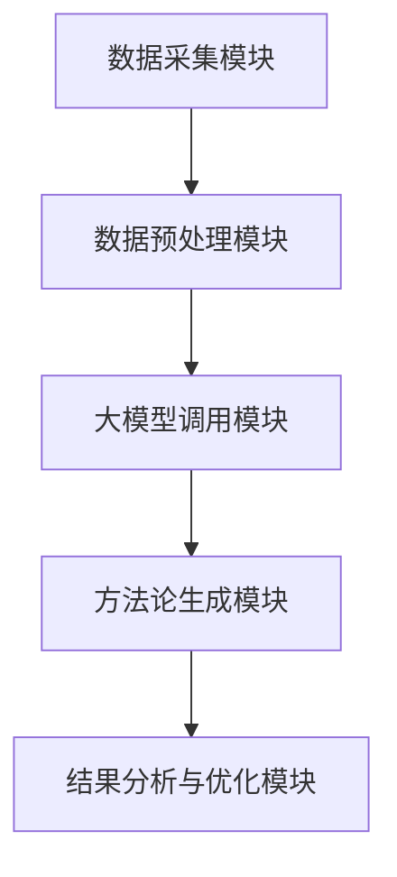
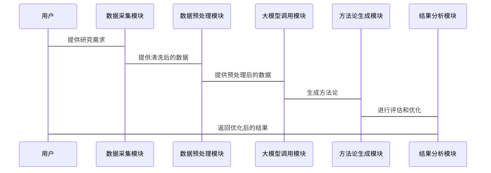

                 


# 开发基于大模型的金融研究方法论创新生成系统

> 关键词：大模型、金融研究、方法论创新、生成系统、系统架构、技术实现

> 摘要：本文探讨了基于大模型的金融研究方法论创新生成系统的开发与应用，通过分析大模型技术在金融研究中的潜力，提出了创新的方法论生成机制，并详细介绍了系统的架构设计、算法原理和实现方案，最后通过实际案例展示了系统的应用价值。

---

## 第一部分: 开发基于大模型的金融研究方法论创新生成系统概述

### 第1章: 问题背景与目标

#### 1.1 问题背景
- **传统金融研究方法的局限性**：传统金融研究依赖于统计分析、回归模型等方法，但这些方法在面对复杂、动态的金融市场时显得力不从心，难以捕捉非线性关系和新兴趋势。
- **大模型技术的快速发展**：近年来，大模型（如GPT、BERT等）在自然语言处理领域取得了突破性进展，其强大的生成能力和理解能力为金融研究带来了新的可能性。
- **金融研究与大模型技术的结合需求**：金融市场的复杂性要求研究方法不断革新，而大模型技术的引入为金融研究提供了新的工具和思路。

#### 1.2 问题描述
- **金融研究中的数据与知识复杂性**：金融市场涉及海量数据，包括文本、数值、时间序列等多种类型，传统的数据分析方法难以有效整合这些信息。
- **方法论创新的必要性**：金融市场的变化速度快，传统方法论难以适应动态环境，需要通过创新来提高研究的效率和准确性。
- **现有方法论的不足与改进方向**：现有方法论多依赖于假设和简化模型，而大模型技术可以通过数据驱动的方式发现新的模式和关系。

#### 1.3 问题解决思路
- **基于大模型的生成式方法论**：利用大模型的生成能力，自动化地构建金融研究的方法论框架。
- **数据驱动与知识图谱的结合**：通过整合金融市场数据和领域知识，构建知识图谱，辅助大模型生成更精准的方法论。
- **人机协同的创新模式**：结合人类专家的知识和大模型的生成能力，形成人机协同的创新模式。

#### 1.4 系统边界与外延
- **系统功能边界**：系统主要负责基于大模型生成金融研究方法论，不涉及具体的投资决策或交易操作。
- **与外部系统的交互**：系统需要与数据源（如金融数据库）、知识库（如行业知识图谱）以及用户界面进行交互。
- **系统的可扩展性与适应性**：系统设计需考虑未来可能的扩展，如支持多语言、多市场环境等。

#### 1.5 核心概念与组成
- **大模型的金融应用**：大模型在金融领域的具体应用，包括文本生成、数据分析、模式识别等。
- **方法论创新的实现机制**：通过大模型生成方法论的步骤和逻辑。
- **系统架构的核心要素**：数据采集、模型调用、结果分析等模块的组成与功能。

---

## 第2章: 核心概念与联系

### 2.1 大模型的基本原理
- **大模型的定义与特点**：大模型是指基于深度学习的大型神经网络模型，具有参数量大、训练数据多、任务通用性强等特点。
- **大模型的训练与推理机制**：通过监督学习或无监督学习进行预训练，然后通过微调适应具体任务。
- **大模型在金融领域的应用潜力**：包括金融文本生成、市场预测、风险评估等。

### 2.2 金融研究方法论的创新
- **传统金融研究方法的分析**：传统方法依赖于假设和简化模型，难以捕捉复杂市场动态。
- **方法论创新的必要性**：金融市场变化快，传统方法难以适应。
- **基于大模型的创新方向**：通过大模型生成新的研究框架、假设和分析方法。

### 2.3 核心概念的联系
- **大模型与金融研究的结合点**：利用大模型生成金融研究的文本、假设和方法论。
- **方法论创新的实现路径**：通过数据驱动和知识图谱辅助，结合大模型的生成能力，实现方法论的创新。
- **系统架构中的关键联系**：数据采集、模型调用、结果分析等模块的协同工作。

---

## 第3章: 系统架构与设计

### 3.1 系统总体架构
- **系统模块划分**：数据采集模块、数据预处理模块、大模型调用模块、方法论生成模块、结果分析与优化模块。
- **系统功能框架**：从数据采集到方法论生成，再到结果优化的完整流程。
- **系统架构图（Mermaid）**



### 3.2 核心模块设计
- **数据采集模块**：负责收集金融市场相关的文本、数值数据等。
- **数据预处理模块**：对数据进行清洗、格式化处理，使其适合大模型输入。
- **大模型调用模块**：将预处理后的数据输入大模型，获取生成的结果。
- **方法论生成模块**：基于大模型的输出，生成具体的金融研究方法论。
- **结果分析与优化模块**：对生成的方法论进行评估和优化，确保其合理性和有效性。

### 3.3 系统功能设计
- **数据采集与处理**：从多种数据源获取数据，并进行清洗和预处理。
- **模型调用与生成**：调用大模型生成金融研究方法论。
- **方法论优化与输出**：对生成的方法论进行评估和优化，输出最终结果。

### 3.4 系统接口设计
- **数据接口**：与金融数据库、知识库等外部系统交互。
- **模型接口**：与大模型服务进行交互。
- **用户接口**：提供友好的用户界面，方便用户输入需求和查看结果。

### 3.5 系统交互流程图（Mermaid）



---

## 第4章: 算法原理与实现

### 4.1 算法原理
- **大模型的训练过程**：
  - 数据预处理：清洗、分词、格式化。
  - 模型结构：基于Transformer架构。
  - 训练方法：使用大规模数据进行预训练，然后通过微调适应金融领域任务。
- **生成过程**：
  - 输入金融研究需求。
  - 通过大模型生成方法论的文本。
  - 结果分析与优化。

### 4.2 算法实现
- **代码实现**

```python
def preprocess_data(data):
    # 数据清洗和预处理
    pass

def train_model(train_data):
    # 模型训练
    pass

def generate_methodology(query, model):
    # 生成方法论
    return model.generate(query)
```

- **数学模型与公式**
  - 损失函数：$$L = -\sum_{i=1}^{n} y_i \log(p(y_i))$$
  - 优化器：$$\theta = \theta - \eta \frac{\partial L}{\partial \theta}$$
  - 注意力机制：$$\text{Attention}(Q, K, V) = \text{softmax}(\frac{QK^T}{\sqrt{d}})V$$

---

## 第5章: 项目实战

### 5.1 环境搭建
- **安装依赖**：安装Python、TensorFlow、Keras等库。
- **配置大模型服务**：使用开源大模型或调用云服务。

### 5.2 核心代码实现
```python
import tensorflow as tf
from tensorflow.keras.layers import Dense, InputLayer, Dropout

# 定义模型结构
model = tf.keras.Sequential([
    InputLayer(input_shape=(max_length,)),
    Dropout(0.5),
    Dense(units=512, activation='relu'),
    Dropout(0.5),
    Dense(units=1, activation='sigmoid')
])

# 编译模型
model.compile(optimizer='adam', loss='binary_crossentropy', metrics=['accuracy'])
```

### 5.3 案例分析
- **案例背景**：假设我们想要生成一种新的股票价格预测方法论。
- **数据准备**：收集相关股票的历史价格、市场新闻等数据。
- **模型调用**：调用大模型生成预测方法。
- **结果分析**：评估生成方法的有效性，并进行优化。

---

## 第6章: 总结与展望

### 6.1 小结
- **系统开发的成果**：成功开发了一种基于大模型的金融研究方法论生成系统。
- **关键经验**：数据预处理的重要性、模型调优的必要性、人机协同的有效性。

### 6.2 注意事项
- 数据隐私与安全：确保数据处理符合相关法律法规。
- 模型的可解释性：生成的方法论需具备可解释性，便于用户理解和应用。
- 系统的稳定性：确保系统在高负载下仍能稳定运行。

### 6.3 拓展阅读
- 推荐阅读《大模型在金融领域的应用》、《生成式AI的前沿研究》等书籍和论文。

---

通过以上思考，我们可以逐步构建出一个完整的基于大模型的金融研究方法论创新生成系统，结合理论与实践，为金融研究提供新的思路和工具。

