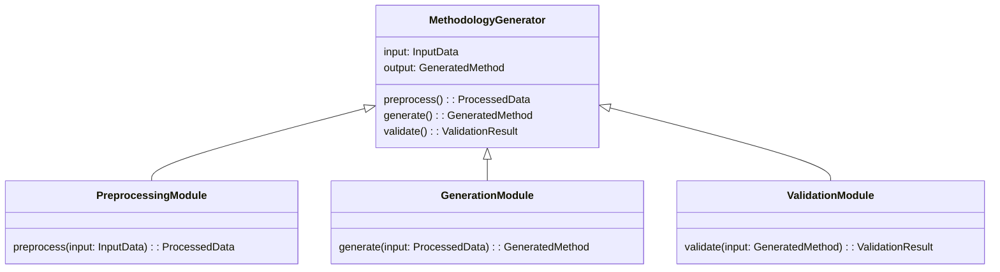
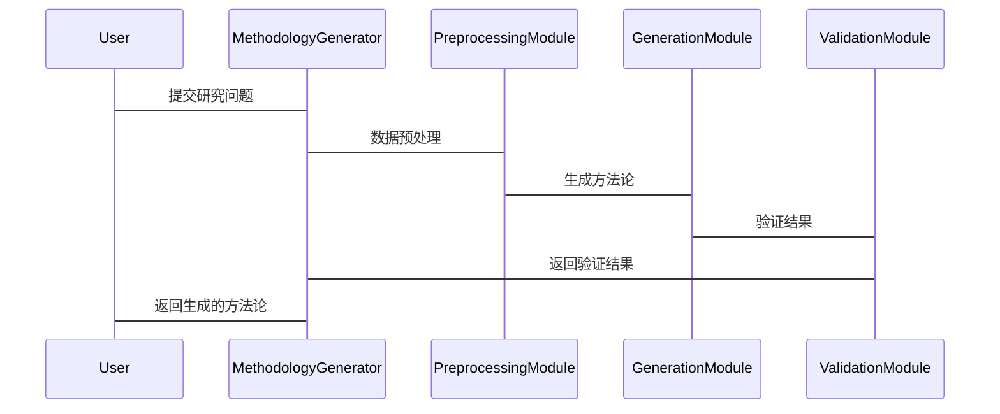

                 


# 开发基于大模型的金融研究方法论生成器

> 关键词：生成式AI，金融研究，方法论生成器，大模型，金融分析

> 摘要：本文详细探讨了开发基于大模型的金融研究方法论生成器的方法，从背景介绍、核心概念、算法原理到系统架构和项目实战，全面分析了其在金融领域的应用潜力和实现细节。

---

# 第1章 背景介绍

## 1.1 问题背景

### 1.1.1 传统金融研究方法的局限性

传统金融研究方法依赖于繁琐的手工分析，包括数据收集、建模和验证。这种方法耗时且效率低下，难以应对金融市场快速变化的挑战。

### 1.1.2 大模型在金融领域的应用潜力

大模型在自然语言处理、生成和推理方面的优势，使其成为金融研究中的潜在工具，能够自动化生成研究方法论，提高效率。

### 1.1.3 生成式AI在金融研究中的创新点

生成式AI能够自动生成高质量的金融研究方法，帮助分析师快速构建研究框架，拓展研究深度。

## 1.2 问题描述

### 1.2.1 金融研究方法的复杂性

金融研究涉及多学科知识，方法多样且复杂，传统方式难以高效处理。

### 1.2.2 现有方法的不足与改进方向

现有方法耗时且难以创新，生成式AI提供了自动化和个性化的解决方案。

### 1.2.3 生成式AI如何解决金融研究中的痛点

生成式AI通过自动化生成方法论，显著提高了研究效率和创新能力。

## 1.3 问题解决

### 1.3.1 大模型生成金融研究方法的可行性

大模型具备生成复杂文本的能力，适用于金融研究方法的生成。

### 1.3.2 生成式AI在金融研究中的具体应用

生成式AI可以辅助数据清洗、建模和结果解释，提升研究效率。

### 1.3.3 方法论生成器的目标与价值

目标是自动化生成高质量的金融研究方法，价值在于提高效率和创新能力。

## 1.4 边界与外延

### 1.4.1 方法论生成器的适用范围

适用于金融数据分析、建模和报告生成等领域，但不涉及实时交易决策。

### 1.4.2 与传统金融研究工具的区分

生成器提供自动化方法论，传统工具则依赖人工操作。

### 1.4.3 外部依赖与限制条件

依赖高质量数据和模型训练，同时受制于计算资源和模型泛化能力。

## 1.5 概念结构与核心要素

### 1.5.1 方法论生成器的核心模块

包括数据输入模块、生成模块和验证模块。

### 1.5.2 各模块之间的关系

数据输入提供基础，生成模块自动生成方法，验证模块确保准确性。

### 1.5.3 核心要素的定义与属性

数据、模型、生成规则和验证机制是核心要素，各自具备特定属性和功能。

---

# 第2章 核心概念与联系

## 2.1 生成式AI的原理

### 2.1.1 大模型的基本原理

大模型通过深度学习训练，能够生成与训练数据相似的文本。

### 2.1.2 生成式AI的工作机制

基于概率分布生成文本，优化目标函数以最小化损失。

### 2.1.3 大模型的训练与推理过程

包括数据预处理、模型训练和推理生成三个阶段。

## 2.2 金融研究方法论的构成

### 2.2.1 金融研究的基本方法

包括定量分析、定性分析和案例分析等方法。

### 2.2.2 方法论的核心要素

涉及数据收集、模型构建和结果验证等关键步骤。

### 2.2.3 不同研究方法的特点与适用场景

每种方法都有其独特优势和适用范围。

## 2.3 生成式AI与金融研究方法论的关系

### 2.3.1 生成式AI如何辅助金融研究

通过自动化生成研究步骤和建议，提升研究效率。

### 2.3.2 方法论生成器的创新点

实现了方法论的自动化生成，降低了研究门槛。

### 2.3.3 生成式AI与传统方法的对比

生成式AI在效率和创新能力上具有明显优势。

## 2.4 核心概念原理

### 2.4.1 大模型的注意力机制

通过自注意力机制捕捉输入数据中的关键信息。

### 2.4.2 生成式AI的损失函数

交叉熵损失函数用于优化模型生成能力。

### 2.4.3 方法论生成器的优化策略

通过强化学习和反馈机制提升生成质量。

---

## 2.5 核心概念的属性对比

| 概念       | 属性               |
|------------|--------------------|
| 生成式AI   | 基于概率生成文本     |
| 方法论生成器 | 自动化生成研究方法   |

---

## 2.6 实体关系图


---

# 第3章 算法原理讲解

## 3.1 大模型的训练过程

### 3.1.1 数据预处理

清洗数据，转化为模型所需格式，如文本分词。

### 3.1.2 模型训练

使用目标函数优化模型参数，采用反向传播算法更新权重。

### 3.1.3 模型调优

通过调整超参数和优化策略提升模型性能。

## 3.2 生成式AI的数学模型

### 3.2.1 变量定义与关系

定义输入序列 \( X = x_1, x_2, ..., x_n \)，目标生成序列 \( Y = y_1, y_2, ..., y_m \)。

### 3.2.2 模型的损失函数

交叉熵损失函数 \( \mathcal{L} = -\sum_{t=1}^{T} \log P(y_t | y_{<t}, x) \)。

### 3.2.3 模型的优化算法

采用Adam优化器，学习率 \( \alpha \)，动量 \( \beta_1 \)，自适应学习率 \( \beta_2 \)。

## 3.3 生成过程

### 3.3.1 输入处理

将输入数据转换为模型可处理的格式。

### 3.3.2 模型推理

生成序列 \( Y \) 通过贪心搜索或采样方法生成。

### 3.3.3 输出结果

生成的研究方法论输出并返回给用户。

---

## 3.4 生成过程的Mermaid图


---

## 3.5 代码示例

```python
def generate_methodology(model, input_data):
    processed_input = preprocess(input_data)
    output = model.generate(processed_input)
    return output
```

---

## 3.6 案例分析

使用模型生成股票价格预测方法论，输入股票数据后，模型生成包括数据清洗、特征提取和模型构建的步骤。

---

# 第4章 系统分析与架构设计

## 4.1 项目背景

开发一个基于大模型的金融研究方法论生成器，旨在提高金融研究的效率和创新能力。

## 4.2 系统功能设计

### 4.2.1 领域模型



---

## 4.3 系统架构设计

### 4.3.1 架构图

```mermaid
docker
    service MethodologyGenerator {
        depends_on Preprocessing, Generation, Validation
    }
    service Preprocessing {
        ports 5000
    }
    service Generation {
        ports 5001
    }
    service Validation {
        ports 5002
    }
```

---

## 4.4 系统接口设计

### 4.4.1 接口描述

- 输入接口：接收金融研究问题描述。
- 输出接口：返回生成的研究方法论。

### 4.4.2 接口规范

采用JSON格式传递数据，使用RESTful API进行通信。

---

## 4.5 系统交互流程

### 4.5.1 交互流程图



---

# 第5章 项目实战

## 5.1 环境搭建

### 5.1.1 安装Python环境

使用Anaconda安装Python 3.8及以上版本。

### 5.1.2 安装依赖库

安装TensorFlow、Keras、PyTorch等深度学习库。

## 5.2 系统核心实现

### 5.2.1 数据预处理模块

```python
def preprocess(input_data):
    # 数据清洗和转换逻辑
    return processed_data
```

### 5.2.2 生成模块

```python
def generate(processed_data):
    # 使用大模型生成方法论
    return generated_method
```

### 5.2.3 验证模块

```python
def validate(generated_method):
    # 验证生成的方法论是否合理
    return validation_result
```

## 5.3 代码实现与解读

### 5.3.1 核心代码

```python
class MethodologyGenerator:
    def __init__(self):
        self.preprocessor = PreprocessingModule()
        self.generator = GenerationModule()
        self.validator = ValidationModule()

    def generate_methodology(self, input_data):
        processed_data = self.preprocessor.preprocess(input_data)
        generated_method = self.generator.generate(processed_data)
        validated_method = self.validator.validate(generated_method)
        return validated_method
```

### 5.3.2 代码解读

- `MethodologyGenerator` 类负责协调各个模块，实现方法论的生成和验证。
- `preprocess` 方法处理输入数据，`generate` 方法生成方法论，`validate` 方法验证结果。

## 5.4 案例分析

### 5.4.1 实际案例

输入股票数据，生成包括数据清洗、特征提取和模型构建的步骤。

### 5.4.2 测试结果

验证生成的方法论是否合理，调整模型参数以优化生成效果。

## 5.5 项目小结

通过实战案例，展示了方法论生成器的实际应用和效果，验证了其在金融研究中的价值。

---

# 第6章 总结与展望

## 6.1 总结

本文详细探讨了开发基于大模型的金融研究方法论生成器的方法，从背景、核心概念到算法实现和系统架构，全面分析了其应用潜力。

## 6.2 展望

未来，生成式AI在金融领域的应用将更加广泛，方法论生成器将具备更强的自动化和智能化能力。

## 6.3 最佳实践 Tips

- 确保数据质量，优化模型训练。
- 定期更新模型，适应市场变化。
- 结合领域知识，提升生成结果的准确性。

---

# 附录

## 附录A 参考文献

1. 生成式AI相关文献。
2. 金融研究方法相关文献。
3. 大模型在金融应用中的研究。

## 附录B 工具与资源

- 开源大模型框架：TensorFlow、PyTorch。
- 数据来源：金融数据库、学术论文。

---

通过以上结构和内容，我们可以系统地开发和理解基于大模型的金融研究方法论生成器，为金融研究提供高效、创新的解决方案。

