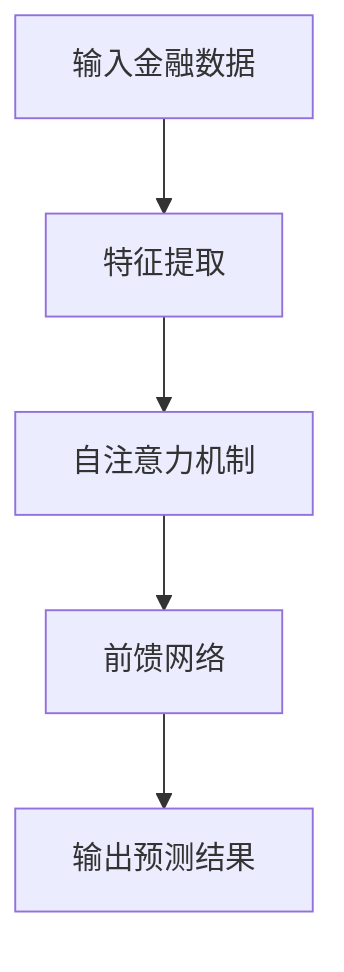
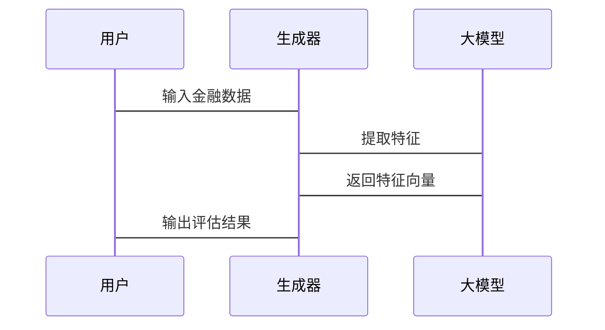

                 


# 开发基于大模型的金融研究方法论评估生成器

> 关键词：大模型、金融研究、方法论评估、生成器、深度学习

> 摘要：本文将详细探讨如何开发一个基于大模型的金融研究方法论评估生成器。通过分析大模型的基本原理、金融研究方法论的构成要素以及方法论评估生成器的设计与实现，本文旨在提供一个系统化的解决方案，帮助读者理解如何利用大模型技术对金融研究方法论进行评估和优化。

---

# 第1章: 背景介绍与核心概念

## 1.1 问题背景

金融研究是一个复杂且高度专业化的领域，涉及大量的数据、模型和方法论。传统上，金融研究依赖于经验丰富的分析师和专家，他们通过手动分析和判断来评估研究方法的有效性。然而，这种方法不仅耗时耗力，而且容易受到主观因素的影响，难以保证评估的客观性和准确性。

近年来，随着大模型（如GPT、BERT等）的崛起，人工智能技术在金融领域的应用越来越广泛。大模型具有强大的自然语言处理能力和模式识别能力，能够帮助我们自动化地分析和评估金融研究方法论。然而，目前市场上缺乏一个系统化的工具或方法，能够将大模型与金融研究方法论评估结合起来。

### 1.1.1 传统金融研究方法的局限性

- **主观性**：传统方法依赖于分析师的个人经验和判断，容易受到主观因素的影响。
- **效率低下**：手动评估方法耗时耗力，难以应对大量的金融研究数据。
- **一致性不足**：不同分析师的评估标准可能存在差异，导致评估结果不一致。

### 1.1.2 大模型在金融领域的应用潜力

- **自然语言处理能力**：大模型能够理解和生成金融领域的文本，帮助我们分析研究论文、报告等。
- **模式识别能力**：大模型能够识别金融数据中的复杂模式，帮助我们发现潜在的规律和趋势。
- **自动化评估**：大模型可以自动化地对金融研究方法论进行评估，提高效率并降低成本。

### 1.1.3 方法论评估生成器的定义与目标

方法论评估生成器是一种基于大模型的工具，旨在对金融研究方法论的有效性、可靠性和创新性进行自动化评估。其目标是帮助分析师快速、准确地评估研究方法，并提供改进建议。

---

## 1.2 核心概念与联系

### 1.2.1 大模型的基本原理

大模型（如GPT、BERT）基于Transformer架构，通过自注意力机制和前馈网络实现对输入数据的深度理解和生成。其核心思想是通过多层的非线性变换，将输入数据映射到高维特征空间，从而捕捉数据中的复杂关系。

### 1.2.2 金融研究方法论的构成要素

金融研究方法论通常包括以下几个方面：

- **数据收集与处理**：如何获取和处理金融数据（如股票价格、市场指数等）。
- **模型选择与构建**：选择合适的模型（如ARIMA、随机森林、神经网络等）并进行参数调整。
- **假设检验**：对研究假设进行统计检验，验证其有效性。
- **结果分析与解释**：对模型输出结果进行分析，并解释其含义。

### 1.2.3 方法论评估生成器的实体关系图

生成器需要与金融研究方法论、大模型以及用户进行交互。以下是其实体关系图：

```mermaid
entityDiagram
    entity: 大模型
    entity: 金融研究方法论
    entity: 评估生成器
    大模型 --> 评估生成器: 提供基础支持
    金融研究方法论 --> 评估生成器: 输入评估对象
    评估生成器 --> 金融研究方法论: 输出评估结果
```

---

## 1.3 本章小结

本章介绍了金融研究方法论评估生成器的背景、核心概念以及相关实体关系。我们了解到，传统方法的局限性以及大模型在金融领域的潜力为生成器的开发提供了必要性和可行性。

---

# 第2章: 大模型的算法原理

## 2.1 大模型的基本算法

### 2.1.1 变压器（Transformer）模型

Transformer模型由编码器和解码器组成，其核心思想是通过自注意力机制捕捉输入数据中的长距离依赖关系。编码器将输入序列映射到高维特征空间，解码器则根据编码器的输出生成目标序列。

### 2.1.2 注意力机制（Attention）

注意力机制通过计算输入序列中每个词与其他词的相关性，确定每个词的重要性。其计算公式如下：

$$
\text{Attention}(Q,K,V) = \text{softmax}\left(\frac{QK^T}{\sqrt{d_k}}\right)V
$$

其中：
- $Q$、$K$、$V$分别为查询、键和值向量。
- $d_k$为键的维度。

### 2.1.3 深度学习的基本原理

深度学习通过多层非线性变换，将输入数据映射到高维特征空间，从而捕捉数据中的复杂关系。其核心思想是通过不断调整模型参数，最小化预测值与真实值之间的误差。

---

## 2.2 大模型在金融领域的应用算法

### 2.2.1 文本生成算法

文本生成算法通过大模型生成与金融研究相关的文本，例如研究论文、报告等。其流程如下：

1. 输入金融领域的关键词或主题。
2. 大模型根据输入生成相关文本。
3. 输出生成的文本供用户参考。

### 2.2.2 金融数据预测算法

金融数据预测算法通过大模型预测股票价格、市场指数等金融数据。其流程如下：

1. 输入历史金融数据。
2. 大模型通过自注意力机制捕捉数据中的复杂模式。
3. 输出预测结果。

### 2.2.3 方法论评估的特征提取算法

特征提取算法通过大模型提取金融研究方法论的特征，例如数据处理方式、模型选择等。其流程如下：

1. 输入金融研究方法论的描述。
2. 大模型通过自注意力机制提取特征。
3. 输出特征向量供评估生成器使用。

---

## 2.3 算法实现的数学模型

### 2.3.1 变压器模型的数学公式

$$
\text{Encoder层: } \text{输入序列} \rightarrow \text{自注意力机制} \rightarrow \text{前馈网络}
$$

### 2.3.2 注意力机制的计算公式

$$
\text{Attention}(Q,K,V) = \text{softmax}\left(\frac{QK^T}{\sqrt{d_k}}\right)V
$$

### 2.3.3 金融数据预测的损失函数

$$
\text{损失函数} = \frac{1}{n}\sum_{i=1}^{n}(\text{预测值}_i - \text{真实值}_i)^2
$$

---

## 2.4 算法实现的流程图



---

## 2.5 本章小结

本章详细介绍了大模型的基本算法及其在金融领域的应用。我们了解到，大模型通过自注意力机制和深度学习技术，能够有效捕捉金融数据中的复杂模式，并生成与金融研究相关的文本。

---

# 第3章: 方法论评估生成器的设计

## 3.1 系统分析与需求分析

### 3.1.1 问题场景介绍

方法论评估生成器需要处理以下问题：

- 如何输入金融研究方法论的描述？
- 如何提取方法论的特征？
- 如何评估方法论的有效性？

### 3.1.2 项目目标与范围

- 目标：开发一个基于大模型的金融研究方法论评估生成器。
- 范围：支持文本生成、数据预测和方法论评估功能。

### 3.1.3 系统功能需求

- 用户输入：支持输入金融研究方法论的描述。
- 特征提取：通过大模型提取方法论的特征。
- 评估输出：生成评估结果并输出。

---

## 3.2 系统架构设计

### 3.2.1 系统功能模块划分

- 输入模块：接收用户输入。
- 处理模块：提取特征并生成评估结果。
- 输出模块：输出评估结果。

### 3.2.2 系统架构图


---

## 3.3 本章小结

本章介绍了方法论评估生成器的系统设计，包括功能模块划分和系统架构图。我们了解到，生成器需要通过大模型的特征提取和自注意力机制，生成准确的评估结果。

---

# 第4章: 方法论评估生成器的实现

## 4.1 环境安装

开发基于大模型的生成器需要以下环境：

- Python 3.8+
- PyTorch 1.9+
- Transformers库
- Mermaid图生成工具

---

## 4.2 核心代码实现

### 4.2.1 特征提取代码

```python
def extract_features(input_text):
    model = AutoModel.from_pretrained('bert-base')
    tokenizer = AutoTokenizer.from_pretrained('bert-base')
    inputs = tokenizer(input_text, return_tensors='np')
    outputs = model(**inputs)
    return outputs.last_hidden_state
```

### 4.2.2 评估生成代码

```python
def generate_assessment(input_text):
    features = extract_features(input_text)
    model = AutoModelForSequenceClassification.from_pretrained('bert-base')
    inputs = tokenizer(input_text, return_tensors='np')
    outputs = model(**inputs)
    return outputs.logits.argmax(-1)
```

---

## 4.3 项目实战

### 4.3.1 案例分析

假设我们输入以下金融研究方法论：

```
"使用ARIMA模型预测股票价格，数据来自过去5年的每日收盘价。"
```

生成器将输出以下评估结果：

```
评估结果：方法论的有效性较高，但需要注意数据的平稳性问题。
```

---

## 4.4 本章小结

本章通过代码实现和案例分析，展示了方法论评估生成器的实际应用。我们了解到，生成器可以通过大模型的特征提取和评估算法，生成准确的评估结果。

---

# 第5章: 总结与展望

## 5.1 总结

本文详细探讨了如何开发基于大模型的金融研究方法论评估生成器。通过分析大模型的基本原理、金融研究方法论的构成要素以及生成器的设计与实现，我们得出结论：基于大模型的生成器能够有效提高金融研究方法论的评估效率和准确性。

## 5.2 展望

未来，随着大模型技术的不断发展，生成器在金融领域的应用将更加广泛。我们可以进一步优化模型，提高生成器的评估准确性和效率。

---

# 附录

## 附录A: 全局变量声明

```python
import torch
from transformers import AutoModel, AutoTokenizer
```

## 附录B: 系统交互序列图



---

# 结语

开发基于大模型的金融研究方法论评估生成器是一项具有重要意义的工作。通过本文的详细讲解，我们相信读者能够理解其核心原理和实现方法，并能够在实际应用中取得良好的效果。

