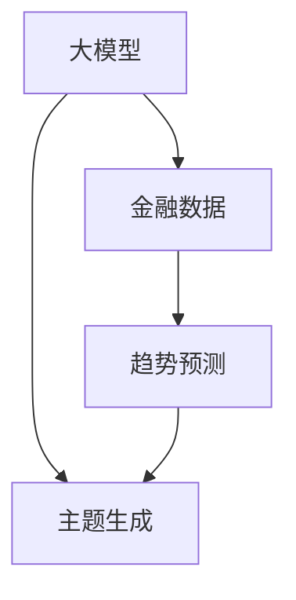
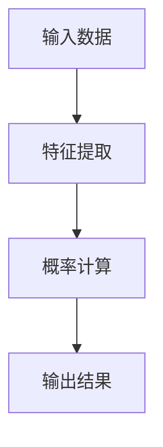

                 


# 开发基于大模型的金融研究趋势预测与主题生成器

> 关键词：金融，大模型，趋势预测，主题生成，机器学习

> 摘要：本文详细探讨了如何开发基于大模型的金融研究趋势预测与主题生成器。首先介绍了问题背景与核心概念，分析了大模型在金融研究中的应用潜力。接着从算法原理、系统设计、项目实战等多方面展开，深入讲解了趋势预测与主题生成的数学模型、系统架构及实现细节。最后通过实际案例分析，展示了该系统在金融研究中的应用价值，并提出了改进建议与未来发展方向。

---

## 第一部分：背景与核心概念

### 第1章：问题背景与描述

#### 1.1 问题背景
- 金融市场的复杂性与不确定性使得传统的金融研究方法面临诸多挑战。
- 金融市场数据的多样性和实时性要求研究工具具备更强的分析与生成能力。
- 大模型技术的引入为金融研究提供了新的可能性，尤其是在趋势预测与主题生成方面。

#### 1.2 问题描述
- 金融趋势预测需要考虑多维度数据，包括市场数据、新闻、社交媒体等。
- 主题生成需要从大量金融数据中提取关键信息，并生成有意义的主题。
- 综合预测与生成的目标，构建一个高效、准确的金融研究工具。

#### 1.3 问题解决与边界
- 引入大模型技术，利用其强大的特征提取与生成能力。
- 明确系统的边界，例如数据范围、预测时间窗口等。
- 对比分析现有技术，突出大模型的优势。

### 第2章：核心概念与联系

#### 2.1 大模型的基本原理
- 大模型的定义与核心特征：基于Transformer架构，具备强大的序列建模能力。
- 注意力机制的原理：通过自注意力机制捕捉数据中的长距离依赖关系。
- 大模型在金融领域的适用性：适用于金融文本分析、时间序列预测等任务。

#### 2.2 金融研究的核心要素
- 金融数据的多样性与特征：包括价格、成交量、新闻文本等。
- 金融趋势的形成机制：市场情绪、宏观经济指标等对趋势的影响。
- 主题生成的关键要素：主题的可解释性与相关性。

#### 2.3 核心概念的关系图


---

## 第二部分：大模型与金融研究的算法原理

### 第3章：大模型的算法原理

#### 3.1 大模型的基本架构
- Transformer架构：由编码器和解码器组成，支持并行计算。
- 注意力机制：通过自注意力计算序列中各位置的重要性。
- 梯度下降与优化算法：常用的Adam优化器。

#### 3.2 大模型的训练过程
- 预训练阶段：利用通用数据集（如维基百科）进行预训练。
- 微调阶段：在金融领域数据上进行微调，提升模型的领域适应性。
- 优化策略：采用学习率衰减、早停等技术。

#### 3.3 大模型的金融应用算法
- 金融文本的特征提取：通过编码器提取文本特征。
- 趋势预测的条件概率公式：
  $$P(y_t | y_{t-1}, x)$$
- 主题生成的解码过程：利用解码器生成有意义的主题。

### 第4章：趋势预测与主题生成的数学模型

#### 4.1 趋势预测的数学模型
- 时间序列模型的数学表示：
  $$y_t = \beta_0 + \beta_1 y_{t-1} + \epsilon_t$$
- 大模型预测的条件概率公式：
  $$P(y_t | y_{t-1}, x)$$

#### 4.2 主题生成的数学模型
- 变量分解与主题表示：
  $$z = \mu + \sigma \epsilon$$
- 主题生成的条件概率：
  $$P(z | y)$$

#### 4.3 算法流程图


---

## 第三部分：系统分析与架构设计

### 第5章：系统分析与功能设计

#### 5.1 项目介绍
- 项目目标：开发一个基于大模型的金融研究工具。
- 项目范围：涵盖趋势预测与主题生成两大功能。
- 项目核心功能：数据采集、模型训练、预测生成。

#### 5.2 功能设计
- 数据采集模块：从多种数据源获取金融数据。
- 模型训练模块：包括预训练和微调过程。
- 预测与生成模块：输出趋势预测结果和相关主题。

---

## 第四部分：项目实战与案例分析

### 第6章：项目实战

#### 6.1 环境安装
- 安装必要的库：如TensorFlow、Keras、Python等。
- 配置GPU环境（如NVIDIA GPU）。

#### 6.2 系统核心实现源代码
```python
import tensorflow as tf
from tensorflow.keras import layers

# 定义大模型结构
def build_model(vocab_size, embedding_dim, seq_length):
    model = tf.keras.Sequential()
    model.add(layers.Embedding(vocab_size, embedding_dim, input_length=seq_length))
    model.add(layers.LSTM(64, return_sequences=True))
    model.add(layers.Dense(1, activation='linear'))
    return model

# 编译模型
model = build_model(vocab_size=10000, embedding_dim=64, seq_length=10)
model.compile(loss='mean_squared_error', optimizer='adam')
```

#### 6.3 代码应用解读与分析
- 数据预处理：将金融数据转化为模型可接受的格式。
- 模型训练：利用历史数据训练模型。
- 模型评估：通过回测等方式评估模型的预测能力。

#### 6.4 案例分析
- 案例1：股票价格预测。
- 案例2：市场情绪分析与主题生成。

---

## 第五部分：最佳实践与总结

### 第7章：最佳实践

#### 7.1 小结
- 本文详细介绍了基于大模型的金融研究趋势预测与主题生成器的开发过程。
- 系统地讲解了算法原理、系统设计和项目实现。

#### 7.2 注意事项
- 数据质量对模型性能的影响至关重要。
- 模型调参需要结合实际业务需求。
- 需要关注模型的可解释性与实际应用的结合。

#### 7.3 拓展阅读
- 关于大模型在金融领域的其他应用，如风险评估、量化交易等。
- 了解最新的研究成果，如多模态模型在金融分析中的应用。

---

通过本文的系统讲解，读者可以全面掌握基于大模型的金融研究工具的开发方法，并能够在实际工作中灵活应用这些技术。

