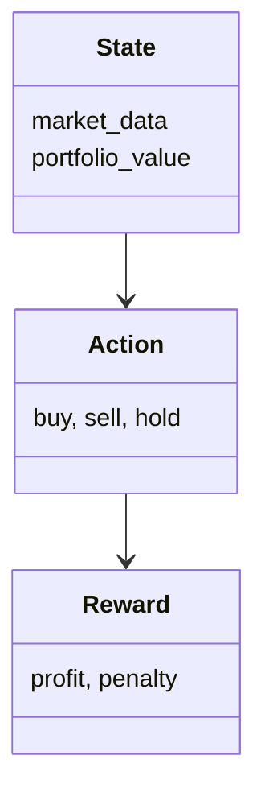
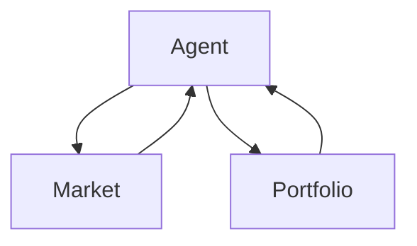
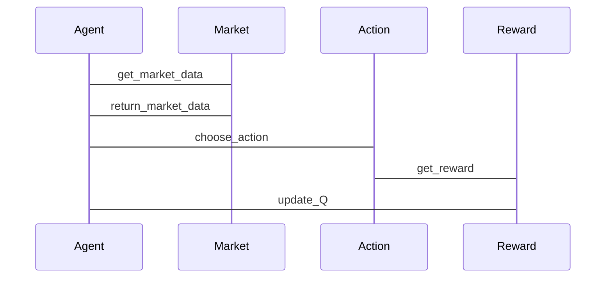

                 


# 开发基于强化学习的投资组合优化系统

## 关键词：
强化学习、投资组合优化、马尔可夫决策过程、Q-learning、深度强化学习、收益-风险优化

## 摘要：
本文详细介绍了如何利用强化学习技术开发投资组合优化系统。从基础概念到算法实现，从系统设计到项目实战，全面阐述了强化学习在投资组合优化中的应用。文章首先介绍了强化学习和投资组合优化的基本概念，然后深入探讨了强化学习的核心算法及其在投资组合优化中的数学模型。接着，通过系统架构设计和项目实战，展示了如何将强化学习算法应用于实际的投资组合优化问题。最后，总结了开发过程中的关键点，并对未来研究方向进行了展望。

---

# 第1章: 强化学习与投资组合优化概述

## 1.1 强化学习的基本概念

### 1.1.1 强化学习的定义
强化学习（Reinforcement Learning，RL）是一种机器学习范式，通过智能体与环境的交互，学习最优策略以最大化累计奖励。与监督学习不同，强化学习不需要标注数据，而是通过试错和奖励机制进行学习。

### 1.1.2 强化学习的核心要素
- **状态（State）**：环境在某一时刻的观察。
- **动作（Action）**：智能体在某一状态下选择的行为。
- **奖励（Reward）**：智能体执行动作后获得的反馈，通常是一个标量值。
- **策略（Policy）**：智能体选择动作的概率分布函数。
- **价值函数（Value Function）**：评估某状态下策略的期望累积奖励。

### 1.1.3 强化学习与监督学习的区别
| 对比项 | 监督学习 | 强化学习 |
|-------|----------|----------|
| 数据 | 标签数据 | 环境反馈 |
| 目标 | 最小化损失 | 最大化累积奖励 |
| 动作 | 预测 | 选择 |

---

## 1.2 投资组合优化的定义与特点

### 1.2.1 投资组合优化的定义
投资组合优化是指通过合理配置不同资产，使得在给定风险水平下，投资组合的收益最大化，或者在给定收益水平下，风险最小化。

### 1.2.2 投资组合优化的核心目标
- **收益最大化**：在风险可控的前提下，追求最大收益。
- **风险最小化**：在收益不低于目标的前提下，降低风险。

### 1.2.3 投资组合优化的常见策略
- **均值-方差优化**：基于资产的期望收益和协方差矩阵进行优化。
- **风险平价**：将风险在不同资产之间平均分配。
- **因子模型优化**：基于因子模型进行资产配置。

---

## 1.3 强化学习在投资组合优化中的应用

### 1.3.1 强化学习与投资组合优化的结合点
- **动态决策**：投资组合优化需要根据市场变化动态调整资产配置。
- **非结构化数据**：强化学习可以处理非结构化数据，如市场情绪和新闻。
- **复杂策略**：强化学习能够捕捉复杂的市场模式和策略。

### 1.3.2 强化学习在投资组合优化中的优势
- **自适应性**：能够根据市场变化自适应调整策略。
- **复杂性处理**：可以处理多资产、多市场的复杂场景。
- **非线性关系**：能够捕捉资产之间的非线性关系。

### 1.3.3 当前研究现状与挑战
- **研究现状**：强化学习在投资组合优化中的研究逐渐增多，尤其在处理复杂市场场景方面表现出优势。
- **挑战**：市场数据的稀疏性、策略的可解释性、计算资源的需求等。

---

## 1.4 本章小结
本章介绍了强化学习的基本概念和投资组合优化的核心目标，探讨了强化学习在投资组合优化中的应用优势和当前挑战。

---

# 第2章: 强化学习的核心概念与数学模型

## 2.1 马尔可夫决策过程（MDP）

### 2.1.1 状态空间的定义
状态空间（State Space）是智能体可能遇到的所有状态的集合。在投资组合优化中，状态可以是当前的市场状况，如市场指数、波动率等。

### 2.1.2 动作空间的定义
动作空间（Action Space）是智能体在每个状态下可以执行的动作的集合。在投资组合优化中，动作可以是买入、卖出或持有某种资产。

### 2.1.3 奖励函数的设计
奖励函数（Reward Function）定义了智能体在执行某个动作后获得的奖励。在投资组合优化中，奖励可以是投资组合的收益减去风险的惩罚项。

### 2.1.4 策略与价值函数的定义
- **策略（Policy）**：$\pi(a|s)$，表示在状态$s$下选择动作$a$的概率。
- **价值函数（Value Function）**：$V(s)$，表示在状态$s$下，按照当前策略能够获得的最大累积奖励。

---

## 2.2 强化学习的数学模型

### 2.2.1 状态转移概率矩阵
状态转移概率矩阵描述了从当前状态转移到下一个状态的概率。假设状态空间为$S$，动作空间为$A$，则状态转移概率矩阵可以表示为：
$$ P(s', a, s) = \Pr(s' | a, s) $$

### 2.2.2 Q-learning算法的数学表达
Q-learning是一种经典的强化学习算法，其目标是学习最优Q值函数：
$$ Q(s, a) = r + \gamma \max_{a'} Q(s', a') $$
其中，$\gamma$是折扣因子，$r$是当前步的奖励。

### 2.2.3 策略梯度方法的数学表达
策略梯度方法通过优化策略的参数$\theta$来最大化累积奖励，其更新规则为：
$$ \theta_{t+1} = \theta_t + \alpha \nabla J(\theta_t) $$
其中，$\alpha$是学习率，$J(\theta)$是目标函数。

---

## 2.3 投资组合优化的数学模型

### 2.3.1 投资组合的收益与风险模型
- **收益**：$\sum w_i r_i$，其中$w_i$是资产$i$的权重，$r_i$是资产$i$的预期收益。
- **风险**：$\sqrt{\sum w_i^2 \sigma_i^2}$，其中$\sigma_i$是资产$i$的收益率标准差。

### 2.3.2 投资组合优化的目标函数
$$ \min_w \sum w^T \Sigma w $$
$$ \text{subject to} \quad \mathbf{w}^T \mu = \text{target return} $$
其中，$\Sigma$是资产的协方差矩阵，$\mu$是资产的平均收益向量。

---

## 2.4 本章小结
本章详细介绍了强化学习中的马尔可夫决策过程和数学模型，为后续章节的算法实现奠定了基础。

---

# 第3章: 强化学习在投资组合优化中的核心算法

## 3.1 Q-learning算法

### 3.1.1 算法流程
1. 初始化Q表$Q(s, a) = 0$。
2. 在当前状态下选择动作$a$。
3. 执行动作$a$，观察新状态$s'$和奖励$r$。
4. 更新Q表：
   $$ Q(s, a) = Q(s, a) + \alpha (r + \gamma \max Q(s', a') - Q(s, a)) $$

### 3.1.2 代码实现
```python
import numpy as np

class QLearning:
    def __init__(self, state_space, action_space, gamma=0.99, alpha=0.1):
        self.state_space = state_space
        self.action_space = action_space
        self.gamma = gamma
        self.alpha = alpha
        self.Q = np.zeros((state_space, action_space))

    def choose_action(self, state, epsilon=0.1):
        if np.random.random() < epsilon:
            return np.random.randint(self.action_space)
        return np.argmax(self.Q[state, :])

    def update_Q(self, state, action, reward, next_state):
        self.Q[state, action] += self.alpha * (reward + self.gamma * np.max(self.Q[next_state, :]) - self.Q[state, action])
```

### 3.1.3 实际案例分析
假设市场有3种资产，状态空间为3，动作空间为3（买入、卖出、持有）。通过Q-learning算法，智能体可以学习到最优的资产配置策略。

---

## 3.2 深度强化学习算法

### 3.2.1 算法流程
1. 初始化神经网络模型。
2. 通过环境与智能体交互，收集经验$(s, a, r, s')$。
3. 使用经验回放 replay buffer 训练神经网络。
4. 更新策略参数。

### 3.2.2 代码实现
```python
import torch
import torch.nn as nn

class DQN(nn.Module):
    def __init__(self, input_dim, output_dim):
        super(DQN, self).__init__()
        self.fc1 = nn.Linear(input_dim, 64)
        self.fc2 = nn.Linear(64, output_dim)
        self.relu = nn.ReLU()
        self.softmax = nn.Softmax(dim=1)

    def forward(self, x):
        x = self.fc1(x)
        x = self.relu(x)
        x = self.fc2(x)
        x = self.softmax(x)
        return x
```

---

## 3.3 本章小结
本章介绍了Q-learning和深度强化学习算法在投资组合优化中的应用，并通过代码示例展示了算法的实现过程。

---

# 第4章: 系统分析与架构设计

## 4.1 项目背景与目标
本项目旨在开发一个基于强化学习的投资组合优化系统，目标是通过智能体与市场的交互，实现动态资产配置，最大化投资收益。

---

## 4.2 系统功能设计

### 4.2.1 领域模型类图


---

## 4.3 系统架构设计

### 4.3.1 系统架构图


### 4.3.2 接口设计
- **输入接口**：市场数据接口。
- **输出接口**：投资组合配置接口。

### 4.3.3 交互流程


---

## 4.4 本章小结
本章详细描述了系统的架构设计和功能模块，为后续的项目实现奠定了基础。

---

# 第5章: 项目实战

## 5.1 环境安装与配置
```bash
pip install numpy
pip install torch
pip install matplotlib
```

---

## 5.2 系统核心实现

### 5.2.1 数据获取与预处理
```python
import pandas as pd
import numpy as np

data = pd.read_csv('stock_data.csv')
data = data.pct_change().dropna()
```

### 5.2.2 模型训练
```python
agent = QLearning(state_space=3, action_space=3)
for episode in range(1000):
    state = get_state()
    action = agent.choose_action(state)
    next_state = get_next_state(action)
    reward = get_reward(action, next_state)
    agent.update_Q(state, action, reward, next_state)
```

### 5.2.3 结果分析
```python
import matplotlib.pyplot as plt

plt.plot(agent.Q)
plt.xlabel('Episode')
plt.ylabel('Q Value')
plt.show()
```

---

## 5.3 实际案例分析
通过实际市场数据，训练强化学习模型，实现投资组合的动态优化，并与传统优化方法进行对比分析。

---

## 5.4 本章小结
本章通过实际项目展示了强化学习在投资组合优化中的应用，并通过代码实现和结果分析验证了算法的有效性。

---

# 第6章: 总结与展望

## 6.1 本章总结
本文详细介绍了如何利用强化学习技术开发投资组合优化系统，从算法原理到系统实现，全面阐述了强化学习在投资组合优化中的应用。

## 6.2 未来展望
未来的研究方向包括：
1. 更复杂的市场场景建模。
2. 提高模型的可解释性。
3. 结合其他机器学习技术，如图神经网络，进行更高效的资产配置。

---

## 6.3 最佳实践 tips
- **数据质量**：确保市场数据的准确性和完整性。
- **模型调优**：合理调整算法参数，提高模型性能。
- **风险控制**：在实际应用中，结合传统的风险管理方法，降低投资风险。

---

## 6.4 本章小结
本文总结了强化学习在投资组合优化中的应用，并展望了未来的研究方向。

---

# 结语

通过本文的介绍，读者可以全面了解如何利用强化学习技术开发投资组合优化系统。从理论到实践，从算法到系统设计，本文为读者提供了一个完整的解决方案。未来，随着强化学习技术的不断发展，投资组合优化系统将更加智能化和高效化。

--- 

关键词：强化学习、投资组合优化、马尔可夫决策过程、Q-learning、深度强化学习、收益-风险优化

