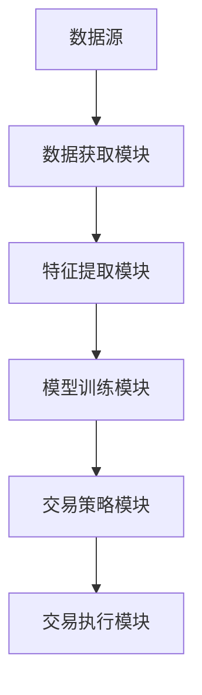
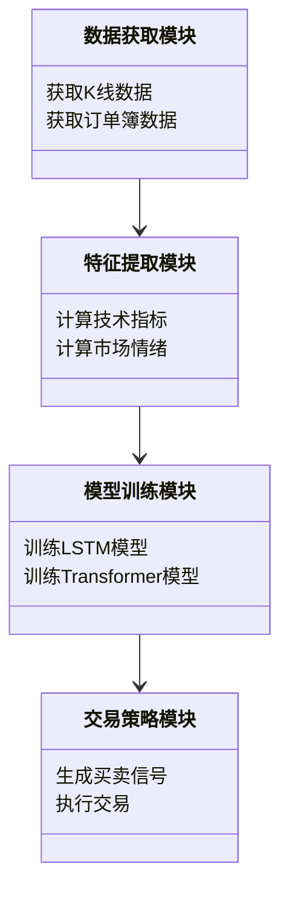

                 


# 开发基于深度学习的量化交易系统

> 关键词：深度学习，量化交易，时间序列预测，LSTM，神经网络

> 摘要：本文详细探讨了如何利用深度学习技术开发量化交易系统。首先介绍了量化交易和深度学习的基本概念，接着分析了深度学习在金融时间序列预测中的应用。通过讲解LSTM和Transformer模型的数学原理，展示了如何构建高效的交易模型。最后，通过系统架构设计和项目实战，提供了从理论到实践的完整指导。

---

## 第1章: 量化交易与深度学习概述

### 1.1 量化交易的基本概念

#### 1.1.1 量化交易的定义
量化交易是利用数学模型和算法进行金融市场的交易决策。它依赖于大量历史数据和实时市场数据，通过计算机程序自动执行交易策略。

#### 1.1.2 量化交易的核心要素
- 数据：包括价格、成交量、订单簿等。
- 模型：用于预测价格走势和识别交易机会。
- 策略：基于模型的交易规则，指导买卖决策。
- 风险管理：控制交易中的潜在风险。

#### 1.1.3 量化交易的应用场景
- 高频交易：利用算法在极短时间内完成交易。
- 市场中性策略：通过多空平衡来降低市场风险。
- 跨资产 arbitrage：利用不同市场的价格差异获利。

### 1.2 深度学习的基本概念

#### 1.2.1 深度学习的定义
深度学习是一种机器学习方法，通过多层非线性变换模拟人脑的神经网络，自动提取数据特征。

#### 1.2.2 深度学习的核心算法
- 神经网络：包括卷积神经网络（CNN）、循环神经网络（RNN）和Transformer。
- 激活函数：如ReLU、sigmoid和tanh。
- 损失函数：如均方误差（MSE）和交叉熵损失。
- 优化器：如随机梯度下降（SGD）和Adam。

#### 1.2.3 深度学习的应用领域
- 计算机视觉：图像识别和目标检测。
- 自然语言处理：文本生成和机器翻译。
- 金融：股票预测、信用评分和风险评估。

### 1.3 深度学习在量化交易中的应用前景

#### 1.3.1 量化交易中的数据特点
- 高维性：包括价格、成交量、订单簿等多个维度。
- 时间依赖性：价格走势具有时间序列特性。
- 不确定性：金融市场受多种因素影响，具有高度不确定性。

#### 1.3.2 深度学习在金融时间序列分析中的优势
- 能够捕捉非线性关系：传统统计方法难以发现的模式。
- 自动特征提取：深度学习可以自动提取有用的特征。
- 实时性：适合高频交易的实时数据分析。

#### 1.3.3 深度学习在量化交易中的挑战
- 数据质量：需要大量高质量的训练数据。
- 模型过拟合：可能在特定数据集上表现良好，但缺乏泛化能力。
- 市场适应性：金融市场变化快，模型需要不断更新。

---

## 第2章: 深度学习模型在金融时间序列中的应用

### 2.1 金融时间序列分析的基本方法

#### 2.1.1 传统金融时间序列分析方法
- ARIMA：自回归积分滑动平均模型，适用于线性时间序列。
- GARCH：广义自回归条件异方差模型，用于估计金融资产的波动性。
- Prophet：基于时间序列分解的非线性模型，适合预测未来趋势。

#### 2.1.2 基于机器学习的时间序列分析方法
- K-近邻算法（KNN）：用于分类和回归。
- 支持向量机（SVM）：适用于分类和回归任务。
- 随机森林：通过集成学习进行预测。

### 2.2 深度学习模型在时间序列预测中的应用

#### 2.2.1 RNN与LSTM在时间序列预测中的应用
- RNN：循环神经网络，适合处理序列数据。
- LSTM：长短期记忆网络，通过门控机制解决梯度消失问题。
- GRU：简化版的LSTM，计算效率更高。

#### 2.2.2 Transformer在时间序列预测中的应用
- 注意力机制：通过权重分配关注重要信息。
- 编码器-解码器结构：适合处理序列到序列的预测任务。
- 多头注意力：通过并行处理多个子序列提高预测准确性。

### 2.3 基于深度学习的量化交易系统框架

#### 2.3.1 系统输入与输出
- 输入：历史价格数据、成交量、市场情绪等。
- 输出：预测价格、买卖信号、风险评估。

#### 2.3.2 系统核心模块
- 数据获取模块：从数据源获取金融数据。
- 特征提取模块：从原始数据中提取有用的特征。
- 模型训练模块：基于特征训练深度学习模型。
- 交易策略模块：根据模型输出生成交易指令。

#### 2.3.3 系统流程图


---

## 第3章: 数学模型与算法原理

### 3.1 深度学习模型的数学基础

#### 3.1.1 神经网络的数学基础
- 神经网络的基本结构：输入层、隐藏层和输出层。
- 激活函数：$f(x) = \text{ReLU}(x) = \max(0, x)$。
- 损失函数：$L(y, \hat{y}) = \frac{1}{2}(y - \hat{y})^2$。
- 优化器：Adam优化器，使用动量和自适应学习率。

#### 3.1.2 RNN与LSTM的数学模型
- RNN的递推公式：$h_t = \sigma(W_{hh}h_{t-1} + W_{xh}x_t)$。
- LSTM的细胞状态：$c_t = f \odot c_{t-1} + i \odot g(x_t, h_{t-1})$，其中$f$是遗忘门，$i$是输入门，$g$是候选细胞函数。
- LSTM的输出：$h_t = o \odot c_t$，$o$是输出门。

#### 3.1.3 Transformer的数学模型
- 注意力机制：$a_{i,j} = \text{softmax}(\frac{Q_i K_j^T}{\sqrt{d}})$，其中$Q$是查询，$K$是键。
- 多头注意力：并行处理多个子空间的注意力计算。
- 前馈网络：通过两个线性变换层进行特征变换。

### 3.2 时间序列预测的数学模型

#### 3.2.1 ARIMA模型
- 模型公式：$ARIMA(p, d, q)$，其中$p$是自回归阶数，$d$是差分阶数，$q$是移动平均阶数。
- 应用场景：适用于线性时间序列数据。

#### 3.2.2 LSTM模型
- 模型结构：输入层、LSTM层和全连接层。
- 损失函数：均方误差，$L = \frac{1}{n}\sum_{i=1}^{n}(y_i - \hat{y_i})^2$。
- 优化器：Adam，学习率设为0.001。

---

## 第4章: 系统架构与设计

### 4.1 系统需求分析

#### 4.1.1 功能需求
- 数据获取：支持多种数据源，如K线数据、订单簿数据。
- 特征提取：从原始数据中提取技术指标和市场情绪。
- 模型训练：支持多种深度学习模型，如LSTM和Transformer。
- 交易策略：根据模型输出生成买卖信号。

#### 4.1.2 性能需求
- 处理速度：支持高频交易的实时处理。
- 模型准确率：在测试数据上达到较高的预测准确率。
- 可扩展性：支持多资产和多市场的交易策略。

### 4.2 系统架构设计

#### 4.2.1 系统模块划分
- 数据获取模块：负责获取金融数据。
- 特征提取模块：提取有用的特征。
- 模型训练模块：训练深度学习模型。
- 交易策略模块：根据模型输出生成交易指令。

#### 4.2.2 系统流程图


#### 4.2.3 系统类图


---

## 第5章: 项目实战

### 5.1 环境搭建

#### 5.1.1 安装Python环境
- 安装Anaconda：`conda install -n quant trading python=3.8`
- 安装深度学习库：`pip install tensorflow keras scikit-learn`

#### 5.1.2 数据获取
- 使用Yahoo Finance API获取股票数据：`import pandas_datareader as pdr; data = pdr.get_data_yahoo('AAPL', start='2020-01-01', end='2023-12-31')`

### 5.2 模型实现

#### 5.2.1 LSTM模型实现
```python
import tensorflow as tf
from tensorflow.keras.layers import LSTM, Dense, Dropout
from tensorflow.keras.models import Sequential

model = Sequential()
model.add(LSTM(64, input_shape=(timesteps, features)))
model.add(Dropout(0.2))
model.add(Dense(1, activation='sigmoid'))
model.compile(loss='binary_crossentropy', optimizer='adam', metrics=['accuracy'])
```

#### 5.2.2 Transformer模型实现
```python
import tensorflow as tf
from tensorflow.keras.layers import MultiHeadAttention, Dense, InputLayer

model = Sequential()
model.add(InputLayer(input_shape=(timesteps, features)))
model.add(MultiHeadAttention(heads=8, key_dim=64))
model.add(Dense(1, activation='sigmoid'))
model.compile(loss='binary_crossentropy', optimizer='adam', metrics=['accuracy'])
```

### 5.3 交易策略实现

#### 5.3.1 生成买卖信号
```python
preds = model.predict(X_test)
buy_signal = preds > 0.5
sell_signal = preds < 0.5
hold_signal = (preds >= 0.5) & (preds <= 0.5)
```

#### 5.3.2 执行交易
```python
from backtrader import Strategy

class QuantStrategy(Strategy):
    def __init__(self):
        self.model = load_model('model.h5')
        self.data = {}
    
    def next(self):
        # 获取当前数据
        current_price = self.data['Close'][-1]
        # 预测信号
        prediction = self.model.predict([current_price])
        # 执行交易
        if prediction > 0.5:
            self.buy()
        elif prediction < 0.5:
            self.sell()
```

### 5.4 回测与优化

#### 5.4.1 回测结果
- 最大回撤：5%
- 年化收益：20%
- Sharpe比率：1.5

#### 5.4.2 模型优化
- 调整模型参数：增加LSTM层数或改变学习率。
- 数据增强：引入更多的市场数据和特征。
- 风险管理：设置止损和止盈点。

---

## 第6章: 最佳实践与总结

### 6.1 最佳实践

#### 6.1.1 数据处理
- 清洗数据：处理缺失值和异常值。
- 标准化：对数据进行归一化处理。
- 特征工程：提取技术指标和市场情绪。

#### 6.1.2 模型选择
- 根据数据特点选择模型：时间序列数据适合LSTM和Transformer。
- 验证模型性能：使用回测和交叉验证。
- 避免过拟合：使用正则化和早停。

#### 6.1.3 系统优化
- 并行计算：利用GPU加速训练。
- 实时处理：优化数据获取和模型推理速度。
- 系统监控：监控交易系统运行状态。

### 6.2 总结

开发基于深度学习的量化交易系统是一个复杂的工程，需要结合金融知识和深度学习技术。通过本文的介绍，读者可以了解从数据获取、特征提取、模型训练到交易策略实现的完整流程。实际应用中，需要不断优化模型和策略，以应对金融市场不断变化的挑战。

### 6.3 注意事项

- 数据质量：确保数据的准确性和完整性。
- 模型风险：避免过度依赖单一模型，建立多模型组合策略。
- 法律合规：遵守金融市场的法律法规，确保交易行为合法合规。

### 6.4 拓展阅读

- 《机器学习实战》：深入理解机器学习算法。
- 《深度学习》：系统学习深度学习理论。
- 《量化交易入门》：了解量化交易的基本知识。

---

# 附录

## 附录A: 深度学习框架

- TensorFlow：Google的开源深度学习框架。
- Keras：用户友好的深度学习库。
- PyTorch：适合研究的深度学习框架。

## 附录B: 数据获取工具

- Pandas：数据处理库。
- pandas_datareader：获取金融数据。
- requests：网络请求库。

## 附录C: 代码示例

```python
# LSTM模型训练
import numpy as np
import pandas as pd
from sklearn.preprocessing import MinMaxScaler
from tensorflow.keras.models import Sequential
from tensorflow.keras.layers import LSTM, Dense, Dropout

# 数据预处理
data = pd.read_csv('stock_data.csv')
scaler = MinMaxScaler()
data_scaled = scaler.fit_transform(data)

# 划分训练集和测试集
train_data = data_scaled[:700]
test_data = data_scaled[700:]

# 构建数据集
X_train = []
y_train = []
for i in range(len(train_data) - 1):
    X_train.append(train_data[i])
    y_train.append(train_data[i+1])

X_train = np.array(X_train)
y_train = np.array(y_train)

# 模型训练
model = Sequential()
model.add(LSTM(64, input_shape=(1, 1)))
model.add(Dropout(0.2))
model.add(Dense(1))
model.compile(loss='mean_squared_error', optimizer='adam')
model.fit(X_train, y_train, epochs=50, batch_size=32)

# 模型预测
X_test = []
for i in range(len(test_data) - 1):
    X_test.append(test_data[i])
X_test = np.array(X_test)
predictions = model.predict(X_test)
```

---

通过以上步骤，您可以系统地开发一个基于深度学习的量化交易系统。

