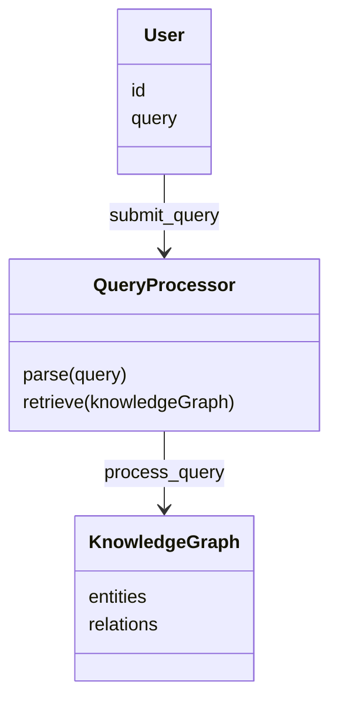
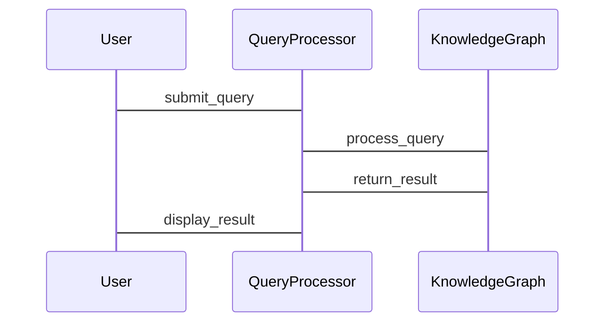

                 


# 开发基于知识图谱的金融咨询系统

## 关键词：知识图谱、金融咨询系统、实体关系、分布式表示学习、图嵌入

## 摘要：  
随着金融行业的快速发展，传统的金融咨询系统逐渐暴露出信息孤岛、数据利用率低、语义理解能力不足等问题。知识图谱作为一种强大的知识管理与推理技术，能够有效整合分散的金融数据，提供语义化的信息检索与推理服务。本文详细探讨了如何基于知识图谱构建智能金融咨询系统，涵盖了从知识图谱构建到系统架构设计的全过程，结合实际案例分析，为开发者提供一套完整的解决方案。

---

# 第1章 知识图谱与金融咨询系统背景介绍

## 1.1 知识图谱的定义与特点  
知识图谱是一种以图结构形式表示知识的语义网络，由节点（实体）和边（关系）组成。其特点包括：  
1. **语义性**：通过语义关系连接实体，提供深层次的知识关联。  
2. **可扩展性**：支持大规模数据的整合与扩展。  
3. **动态性**：能够实时更新和维护，确保知识的时效性。  

## 1.2 金融咨询系统的定义与需求  
金融咨询系统是为用户提供金融产品推荐、投资建议、风险评估等服务的系统。其核心需求包括：  
1. **高效性**：快速响应用户查询。  
2. **准确性**：提供精准的金融信息和建议。  
3. **智能性**：具备语义理解和推理能力。  

## 1.3 知识图谱在金融咨询中的应用背景  
传统的金融咨询系统依赖于关键词匹配，难以理解语义和上下文关系。知识图谱通过构建金融领域的知识网络，能够实现语义理解、实体识别和关系推理，显著提升了金融咨询系统的智能化水平。  

## 1.4 本章小结  
本章介绍了知识图谱的定义与特点，分析了金融咨询系统的需求，并探讨了知识图谱在金融咨询中的应用背景，为后续章节奠定了基础。

---

# 第2章 知识图谱的核心概念与联系

## 2.1 知识图谱的核心概念  
知识图谱的核心概念包括实体、属性和关系。实体是知识图谱的基本单元，属性描述实体的特征，关系表示实体之间的关联。  

## 2.2 知识图谱的属性特征对比  
以下是实体与关系的属性特征对比：  

| 属性 | 实体 | 关系 |
|------|------|------|
| 类型 | 金融产品、客户、交易 | 购买、投资、关联 |
| 描述 | 名称、ID、类别 | 起始节点、终止节点、关系类型 |

## 2.3 知识图谱的ER实体关系图  
以下是金融咨询系统的ER实体关系图：  

```mermaid
er
actor:
    name
    id
    role
financial_product:
    name
    type
    risk_level
relationship:
    knows
    belongs_to
```

## 2.4 本章小结  
本章详细阐述了知识图谱的核心概念，并通过ER图展示了金融咨询系统中的实体关系，为后续的知识图谱构建奠定了基础。

---

# 第3章 知识图谱的构建与算法原理

## 3.1 知识图谱构建的流程  
知识图谱的构建流程包括数据采集、实体识别、关系抽取和知识融合。  

## 3.2 知识图谱构建的算法  
### 3.2.1 实体识别算法  
使用命名实体识别（NER）算法，如CRF和LSTM，从文本中提取实体。  

### 3.2.2 关系抽取算法  
使用基于规则和深度学习的方法，如注意力机制，进行关系抽取。  

### 3.2.3 知识图谱的优化算法  
通过分布式表示学习（如Word2Vec）和图嵌入方法（如Node2Vec），优化知识图谱的表示。  

## 3.3 算法原理的数学模型与公式  
### 3.3.1 实体识别的数学模型  
$$ P(w|c) = \frac{P(c|w)P(w)}{P(c)} $$  

### 3.3.2 关系抽取的数学模型  
$$ P(r|e1, e2) = \frac{P(e1|r)P(e2|r)P(r)}{P(e1)P(e2)} $$  

## 3.4 本章小结  
本章详细介绍了知识图谱的构建流程和算法原理，并通过数学公式阐述了分布式表示学习的原理。

---

# 第4章 基于知识图谱的金融咨询系统架构设计

## 4.1 金融咨询系统的需求分析  
### 4.1.1 系统功能需求  
包括语义理解、知识检索、推理分析等功能。  

## 4.2 系统功能设计  
### 4.2.1 领域模型设计  
以下是金融咨询系统的领域模型图：  



## 4.3 系统架构设计  
金融咨询系统的架构包括数据层、知识层、服务层和用户层。  

## 4.4 系统接口设计  
系统接口包括自然语言查询接口、知识图谱查询接口和结果返回接口。  

## 4.5 系统交互流程  
以下是系统交互的序列图：  



## 4.6 本章小结  
本章详细设计了基于知识图谱的金融咨询系统的架构，包括功能设计、接口设计和交互流程，为系统的实现提供了指导。

---

# 第5章 项目实战：基于知识图谱的金融咨询系统实现

## 5.1 环境搭建  
安装Python、TensorFlow、Neo4j等工具。  

## 5.2 核心代码实现  
### 5.2.1 实体识别代码  
```python
import spacy
nlp = spacy.load("en_core_web_sm")
doc = nlp("Apple invests in Google.")
for token in doc:
    if token.ent_type_:
        print(token.text)
```

### 5.2.2 关系抽取代码  
```python
from spacy.pipeline import add_pipe
nlp.add_pipe(" DependencyParser")
doc = nlp("Apple invests in Google.")
for relation in doc.noun_chunks:
    print(relation)
```

### 5.2.3 知识图谱构建代码  
```python
from neo4j import GraphDatabase
driver = GraphDatabase.driver("bolt://localhost:7687", auth=("user", "password"))
session = driver.session()
session.run("CREATE (:Company {name: 'Apple'})")
session.run("CREATE (:Company {name: 'Google'})")
session.run("CREATE (:Invest {amount: 100})")
session.run("MATCH (a:Company {name: 'Apple'}), (b:Company {name: 'Google'}) CREATE (a)-[:invests]->(b)")
```

## 5.3 案例分析  
以“Apple投资Google”为例，展示知识图谱的构建与查询过程。  

## 5.4 项目总结  
通过本项目，我们实现了基于知识图谱的金融咨询系统，验证了知识图谱在金融咨询中的应用价值。

---

# 第6章 总结与展望

## 6.1 总结  
本文详细探讨了基于知识图谱的金融咨询系统的开发过程，涵盖了知识图谱构建、系统架构设计和项目实现。  

## 6.2 未来展望  
未来，随着深度学习和图神经网络的发展，知识图谱在金融咨询中的应用将更加智能化和个性化。  

## 6.3 最佳实践Tips  
- 数据来源要多样化，确保知识图谱的全面性。  
- 定期更新知识图谱，保证数据的时效性。  
- 在实际应用中，结合业务需求优化系统功能。  

---

# 附录

## 附录A 工具与库  
- Python  
- TensorFlow  
- Neo4j  

## 附录B 数据集  
- 金融新闻数据集  
- 金融产品数据集  

---

通过以上目录结构，我们可以系统地开发和实现基于知识图谱的金融咨询系统，为金融行业提供智能化的解决方案。

