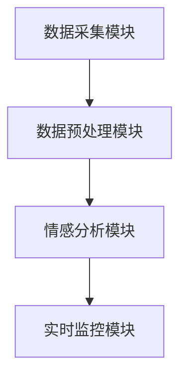
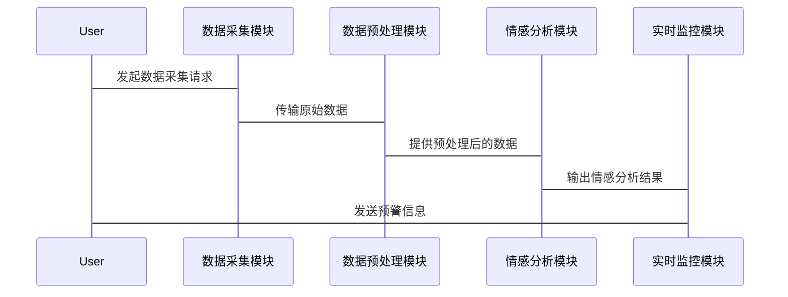

                 


# 开发实时金融市场情绪分析与监控系统

## 关键词：实时情绪分析，金融数据挖掘，自然语言处理，机器学习，系统架构设计

## 摘要：  
开发一个实时金融市场情绪分析与监控系统，旨在通过自然语言处理和机器学习技术，实时分析金融市场中的文本数据，提取其中的情感倾向，帮助投资者和机构做出更明智的决策。本文将详细介绍系统的开发背景、核心算法、系统架构设计以及实现步骤，帮助读者掌握从数据采集到系统部署的完整流程。

---

# 第一部分: 金融市场情绪分析与监控系统概述

## 第1章: 金融市场情绪分析的背景与意义

### 1.1 金融市场的发展与挑战
#### 1.1.1 金融市场的现状与趋势
金融市场的复杂性和不确定性使得投资者需要依赖实时信息和分析工具来做出决策。传统的金融分析方法依赖于历史数据和统计模型，但近年来，自然语言处理（NLP）和机器学习技术的快速发展为金融市场的情绪分析提供了新的可能性。

#### 1.1.2 情绪分析在金融领域的应用价值
情绪分析可以帮助投资者理解市场参与者的心理状态，预测市场的波动和趋势。例如，通过对新闻、社交媒体和公司公告的实时分析，投资者可以捕捉市场情绪的变化，从而提前做出买卖决策。

#### 1.1.3 实时监控系统的重要性
实时监控系统能够快速响应市场情绪的变化，为投资者提供及时的预警和建议。在高频交易和算法交易日益普及的今天，实时情绪分析系统已成为金融机构的重要工具。

### 1.2 情绪分析的核心概念
#### 1.2.1 情绪分析的定义与分类
情绪分析是通过计算机技术对文本数据进行处理，提取其中的情感倾向。在金融领域，情绪分析通常分为两类：**情感分类**（判断文本是正面、负面还是中性）和**情感强度分析**（量化情感的强度）。

#### 1.2.2 实时监控系统的定义与特点
实时监控系统是指能够对金融市场中的文本数据进行实时处理，并输出情感分析结果的系统。其特点包括高实时性、高准确性以及高可扩展性。

#### 1.2.3 情绪分析与金融决策的关系
情绪分析可以帮助投资者预测市场的短期波动，辅助制定交易策略。例如，当市场情绪从正面转向负面时，投资者可以考虑卖出资产以规避风险。

### 1.3 本章小结
本章介绍了金融市场情绪分析的背景、意义以及核心概念，为后续的系统开发奠定了理论基础。

---

# 第二部分: 情绪分析的核心技术与实现

## 第2章: 数据预处理与文本挖掘

### 2.1 数据来源与采集
#### 2.1.1 金融市场数据的来源
情绪分析的数据来源主要包括新闻网站、社交媒体（如Twitter、Reddit）、公司公告、财经博客等。

#### 2.1.2 文本数据的采集方法
可以使用API（如Twitter API）或网络爬虫技术来采集文本数据。例如，使用Python的`requests`库或`BeautifulSoup`库来抓取新闻网站的内容。

#### 2.1.3 数据清洗与预处理
数据清洗包括去除噪声（如停用词、标点符号）和分词处理。常用的工具包括NLTK、spaCy和jieba（中文分词工具）。

### 2.2 文本挖掘与特征提取
#### 2.2.1 文本分词与词干提取
分词是将文本分割成单词或短语的过程。词干提取则是去除单词的派生形式（如复数形式），保留其核心部分。

#### 2.2.2 词袋模型与词嵌入
词袋模型是一种文本表示方法，将文本表示为单词的集合。词嵌入（如Word2Vec、GloVe）则是将单词映射到低维向量空间的技术。

#### 2.2.3 主题模型与情感词典
主题模型（如LDA）可以帮助识别文本的主题分布。情感词典是预先定义的包含情感倾向的词汇表，常用于情感分类任务。

---

## 第3章: 自然语言处理技术在情绪分析中的应用

### 3.1 基于规则的文本分析
#### 3.1.1 情感词典的构建与应用
情感词典是基于规则的文本分析的基础。例如，可以使用SentiWordNet或自定义词典来标记每个单词的情感倾向。

#### 3.1.2 基于规则的情感分类方法
基于规则的方法通常通过匹配特定的关键词或短语来判断文本的情感倾向。例如，如果文本中包含“利好”、“上涨”等词汇，可以判断为正面情绪。

### 3.2 基于机器学习的文本分类
#### 3.2.1 常见的文本分类算法
常用的文本分类算法包括朴素贝叶斯、支持向量机（SVM）、随机森林和神经网络等。

#### 3.2.2 特征选择与模型训练
特征选择是文本分类的关键步骤。常用的特征包括TF-IDF值、词嵌入和语义特征。模型训练可以通过交叉验证来优化参数。

#### 3.2.3 情感分类的评估指标
常用的评估指标包括准确率、召回率、F1分数和AUC曲线。

---

## 第4章: 情绪分析的算法实现

### 4.1 基于传统机器学习的算法
#### 4.1.1 支持向量机（SVM）的实现
SVM是一种常用的分类算法，特别适合小规模数据集。其核心思想是将数据映射到高维空间，并找到一个最优的超平面来分割数据。

#### 4.1.2 随机森林（Random Forest）的应用
随机森林是一种基于决策树的集成学习算法，具有较强的鲁棒性和抗过拟合能力。

#### 4.1.3 线性回归模型的优化
线性回归模型通常用于情感强度的预测，可以通过最小二乘法优化模型参数。

### 4.2 基于深度学习的算法
#### 4.2.1 循环神经网络（RNN）的原理
RNN是一种适合处理序列数据的神经网络模型，可以捕捉文本的情感倾向和上下文信息。

#### 4.2.2 Transformer模型的应用
Transformer模型基于自注意力机制，能够捕捉文本中的长距离依赖关系，特别适合处理长文本。

#### 4.2.3 预训练语言模型（如BERT）的调优
预训练语言模型可以通过微调任务-specific的数据来实现情感分类任务。

---

# 第三部分: 系统架构设计与实现

## 第5章: 情绪分析系统的架构设计

### 5.1 系统模块划分
情绪分析系统通常包括以下几个模块：
- 数据采集模块：负责从各种数据源采集文本数据。
- 数据预处理模块：对文本数据进行清洗、分词和特征提取。
- 情感分析模块：使用机器学习或深度学习算法对文本进行情感分类。
- 实时监控模块：对市场情绪进行实时监控和预警。

### 5.2 系统架构图
使用mermaid绘制系统架构图：



### 5.3 系统接口设计
系统接口通常包括：
- 数据采集接口：接收外部数据源的文本数据。
- 情感分析接口：提供情感分类结果。
- 监控预警接口：输出实时市场情绪的预警信息。

### 5.4 系统交互流程图
使用mermaid绘制系统交互流程图：



---

## 第6章: 系统实现与优化

### 6.1 环境配置
开发实时情绪分析系统需要以下环境：
- Python 3.8+
- 机器学习库（如scikit-learn、TensorFlow、PyTorch）
- NLP处理库（如NLTK、spaCy）
- 数据采集库（如requests、BeautifulSoup）

### 6.2 核心代码实现
#### 6.2.1 数据预处理代码
```python
import pandas as pd
from sklearn.feature_extraction.text import TfidfVectorizer

def preprocess_text(text):
    # 分词处理
    words = word_tokenize(text.lower())
    # 去除停用词
    filtered_words = [word for word in words if word not in stopwords]
    return ' '.join(filtered_words)

# 示例数据
texts = ["Market is bullish", "Earnings beat expectations", "Stocks may drop"]
vectorizer = TfidfVectorizer()
tfidf_matrix = vectorizer.fit_transform([preprocess_text(text) for text in texts])
```

#### 6.2.2 情感分类代码
```python
from sklearn.svm import SVC
from sklearn.metrics import accuracy_score

# 训练模型
model = SVC()
model.fit(X_train, y_train)

# 预测与评估
y_pred = model.predict(X_test)
print("Accuracy:", accuracy_score(y_test, y_pred))
```

#### 6.2.3 实时监控代码
```python
import time
from kafka import KafkaConsumer

# 实时数据消费
consumer = KafkaConsumer('market_feed')
for message in consumer:
    text = message.value.decode('utf-8')
    # 进行情感分析
    emotion = predict_emotion(text)
    # 输出预警信息
    print(f"Emotion: {emotion}")
```

---

## 第7章: 项目实战与案例分析

### 7.1 项目背景与目标
本项目旨在开发一个实时金融市场情绪分析系统，帮助投资者和机构做出更明智的决策。

### 7.2 项目实现步骤
1. 数据采集与预处理
2. 特征提取与模型训练
3. 系统架构设计与实现
4. 测试与优化

### 7.3 案例分析
以某次市场波动为例，分析系统如何实时捕捉市场情绪变化，并为投资者提供预警信息。

---

## 第8章: 总结与扩展

### 8.1 开发经验总结
在开发过程中，需要注意以下几点：
- 数据质量对模型性能的影响至关重要。
- 实时系统需要考虑性能优化和高可用性。
- 情感分析模型需要不断更新和优化。

### 8.2 小结
通过本文的介绍，读者可以掌握开发实时金融市场情绪分析系统的完整流程。

### 8.3 注意事项
- 数据隐私和合规性问题需要特别注意。
- 模型的可解释性是实际应用中的重要考量。

### 8.4 拓展阅读
建议读者进一步学习以下内容：
- 最新的预训练语言模型（如GPT-3、PaLM）
- 实时流处理技术（如Kafka、Flink）
- 高可用性系统设计（如微服务架构）

---

# 结语
开发实时金融市场情绪分析与监控系统是一项复杂的工程，需要结合自然语言处理、机器学习和系统架构设计等多方面的知识。通过本文的详细讲解，读者可以逐步掌握系统开发的关键技术和实现方法，为实际应用打下坚实的基础。

