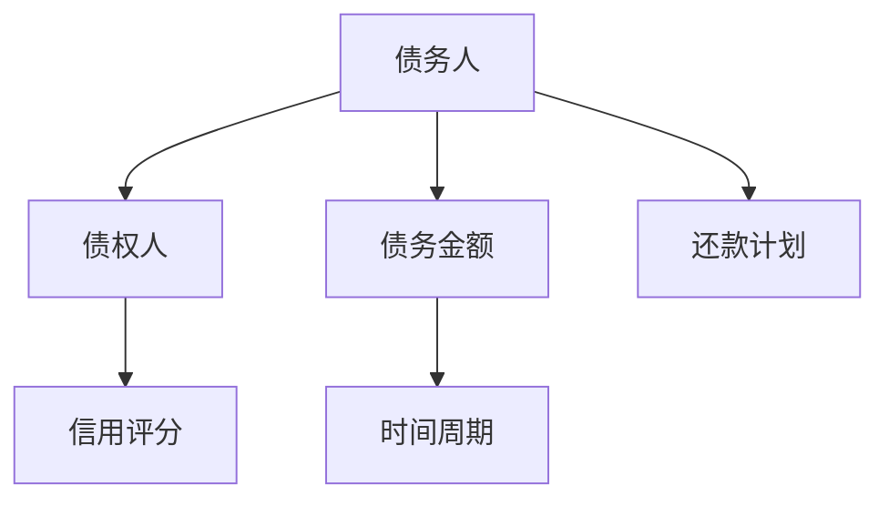
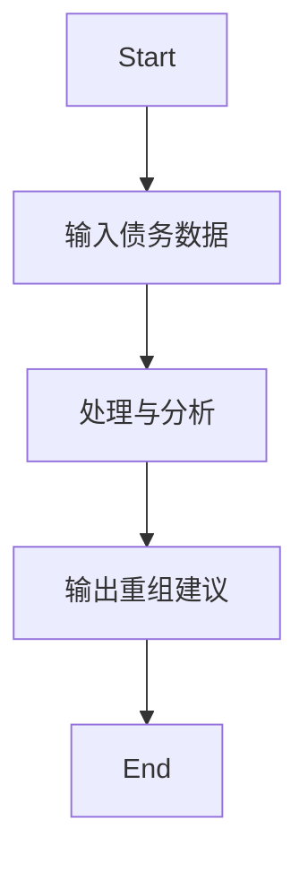
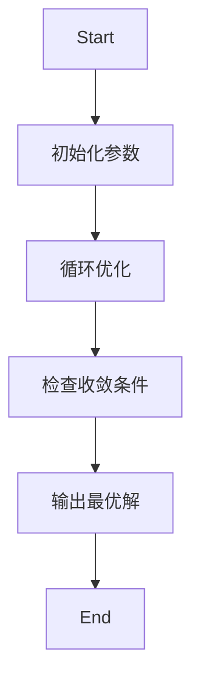
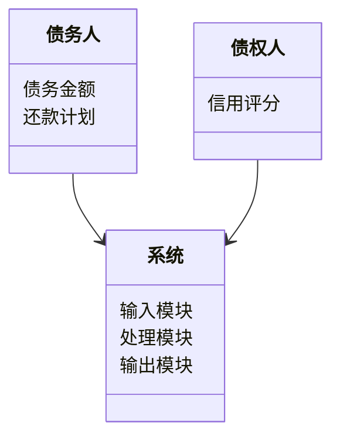
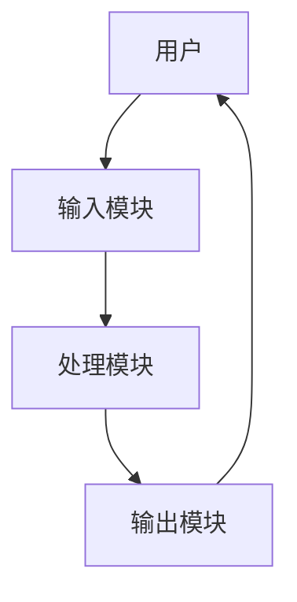

                 


# 开发智能化的个人债务重组建议工具

## 关键词：智能化工具、个人债务重组、AI算法、优化模型、系统架构、用户交互

## 摘要：本文详细探讨了开发智能化个人债务重组建议工具的方法，结合优化算法和系统架构设计，提供了一套完整的解决方案。通过分析债务重组的核心问题，设计了基于遗传算法的优化模型，并构建了系统的功能模块和架构，最终实现了智能化的债务重组工具。

---

# 第一部分: 智能化个人债务重组工具的背景与核心概念

## 第1章: 个人债务重组的背景与问题分析

### 1.1 个人债务重组的背景

#### 1.1.1 经济下行与个人债务问题的凸显

随着全球经济下行，个人债务问题日益突出。高利率贷款、信用卡欠款等问题使得个人面临财务困境，传统的债务重组方式效率低、成本高，难以满足现代人需求。

#### 1.1.2 传统债务重组方式的局限性

传统债务重组依赖人工计算和法律咨询，效率低下且费用高昂。普通用户难以获得及时有效的帮助，亟需智能化工具解决这一难题。

#### 1.1.3 智能化工具的必要性与优势

智能化工具通过AI算法优化重组方案，大幅降低了成本和时间，使更多人能够轻松管理债务。同时，实时数据分析和交互式界面提升了用户体验。

### 1.2 问题背景与目标

#### 1.2.1 债务重组的核心问题

如何在有限时间内，找到最优的债务偿还方案，最大化资金利用效率，同时满足各方利益。

#### 1.2.2 工具的目标与边界

目标是通过AI和优化算法，帮助用户制定最优债务计划。边界包括仅处理个人债务，不涉及企业债务，且不考虑特殊法律条款。

#### 1.2.3 核心概念与属性对比

通过对比分析，我们明确了智能化工具的核心概念，包括债务人、债权人、债务金额、还款计划等关键要素。

### 1.3 核心概念与联系

#### 1.3.1 债务重组模型的实体关系图



#### 1.3.2 算法原理与流程图



---

## 第2章: 债务重组工具的核心算法与数学模型

### 2.1 基于优化算法的债务重组模型

#### 2.1.1 遗传算法在债务重组中的应用

通过模拟生物进化，遗传算法不断优化债务偿还方案，适用于复杂问题的全局最优解。

#### 2.1.2 模拟退火算法的实现

模拟退火算法能够跳出局部最优，找到更优解，特别适合处理多变量优化问题。

#### 2.1.3 算法流程图



### 2.2 数学模型与公式

#### 2.2.1 债务优化目标函数

$$ \text{最小化} \sum_{i=1}^{n} w_i x_i $$

其中，$w_i$ 是权重，$x_i$ 是债务变量。

#### 2.2.2 约束条件

$$ \sum_{i=1}^{n} x_i \leq C $$

其中，$C$ 是总债务上限。

### 2.3 算法实现与案例分析

#### 2.3.1 Python实现代码

```python
def debt_optimization(weights, constraints):
    # 初始化参数
    # 循环优化
    # 输出结果
    pass
```

---

## 第3章: 系统架构与功能设计

### 3.1 系统功能模块划分

#### 3.1.1 用户输入模块

负责接收用户输入的债务数据，如债务金额、还款期限等。

#### 3.1.2 数据处理模块

对输入数据进行清洗、转换和预处理，为后续优化算法提供准备。

#### 3.1.3 优化计算模块

应用遗传算法或模拟退火算法，计算出最优的债务重组方案。

#### 3.1.4 结果展示模块

将优化结果以图表或文本形式展示给用户，便于理解和操作。

### 3.2 系统架构设计

#### 3.2.1 领域模型类图



#### 3.2.2 系统架构图



---

## 第4章: 项目实战

### 4.1 环境安装

安装必要的开发工具和库，如Python、NumPy、Matplotlib等。

### 4.2 核心代码实现

实现债务优化算法的核心代码，并进行测试和验证。

### 4.3 案例分析

通过具体案例分析，展示工具的实际应用效果和优化能力。

---

## 第5章: 总结与展望

### 5.1 总结

总结本文的主要内容和成果，强调智能化工具的优势和应用价值。

### 5.2 展望

展望未来的发展方向，如算法优化、功能扩展等，为读者提供进一步思考的空间。

---

通过以上步骤，我们详细阐述了开发智能化个人债务重组建议工具的全过程，从背景分析到算法实现，再到系统设计和项目实战，为读者提供了一套完整的解决方案。希望这篇文章能够为有需求的用户提供有价值的参考和指导。

