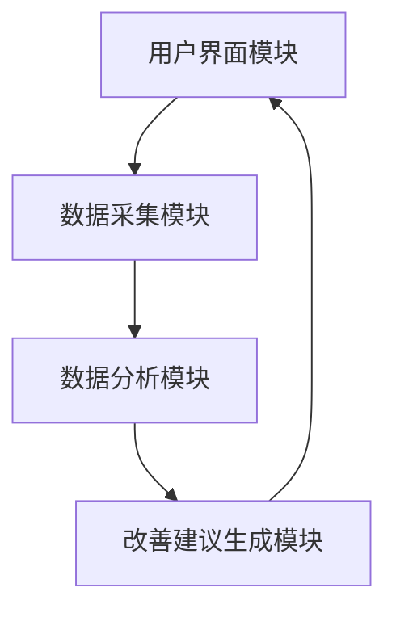

                 


# 开发智能化的个人消费习惯改善建议工具

## 关键词  
智能化、个人消费习惯、改善建议、人工智能、机器学习、系统架构

## 摘要  
随着人工智能和大数据技术的快速发展，智能化工具在个人消费习惯改善方面发挥着越来越重要的作用。本文将详细探讨如何开发一款智能化的个人消费习惯改善建议工具，涵盖从背景分析到系统架构设计，再到项目实战的各个方面。通过本文，读者将了解如何利用机器学习算法和系统架构设计，构建一个能够帮助用户优化消费习惯的智能工具。

---

# 第一部分: 开发智能化的个人消费习惯改善建议工具的背景与目标

## 第1章: 问题背景与目标

### 1.1 问题背景

#### 1.1.1 当前个人消费习惯的主要问题  
随着生活节奏的加快，人们的消费习惯逐渐变得多样化和复杂化。许多人缺乏对自身消费行为的清晰认知，导致过度消费、储蓄不足或资金分配不合理等问题。这些问题不仅影响个人的财务健康，还可能导致长期的经济压力和生活不稳定。

#### 1.1.2 消费习惯对个人财务健康的影响  
消费习惯直接关系到个人的财务状况。不良的消费习惯可能导致债务积累、 savings不足或在不必要的开支上浪费资金。通过改善消费习惯，个人可以更好地管理资金，实现财务目标。

#### 1.1.3 智能化工具在消费管理中的必要性  
传统的消费管理方法依赖于手动记录和分析，效率低下且容易出错。随着技术的进步，智能化工具可以通过数据分析和机器学习算法，提供个性化的消费建议，帮助用户更科学地管理消费。

### 1.2 工具的目标与意义

#### 1.2.1 工具的核心目标  
- 提供个性化的消费建议，帮助用户优化消费结构。  
- 监控和分析用户的消费行为，识别潜在问题。  
- 提供预算管理功能，帮助用户合理分配资金。  

#### 1.2.2 工具对个人消费习惯改善的作用  
- 通过数据分析，识别用户的消费模式，提供针对性建议。  
- 帮助用户建立长期的财务目标，并制定实现计划。  
- 提供实时监控功能，提醒用户避免冲动消费。  

#### 1.2.3 工具的市场价值与用户需求  
- 满足用户对智能化消费管理工具的需求。  
- 帮助用户提高财务管理效率，实现财务自由。  
- 在市场中提供差异化服务，吸引注重个人财务健康的用户群体。

## 第2章: 核心概念与联系

### 2.1 核心概念原理

#### 2.1.1 数据采集与分析  
用户消费数据的采集是工具运行的基础。数据来源包括用户的消费记录（如银行交易记录、购物记录）、消费习惯（如消费时间、消费地点）和消费目标（如储蓄目标、投资目标）。通过对这些数据的分析，工具可以识别用户的消费模式和潜在问题。

#### 2.1.2 消费行为分析模型  
消费行为分析模型用于理解和预测用户的消费行为。模型可以通过聚类分析、分类算法和回归分析等方法，识别用户的消费偏好和风险行为。例如，聚类分析可以帮助识别用户的消费高峰期，分类算法可以预测用户是否存在过度消费的风险。

#### 2.1.3 改善建议生成算法  
改善建议生成算法基于消费行为分析模型的结果，为用户提供个性化的消费建议。算法可以基于规则、协同过滤或深度学习模型生成建议。例如，协同过滤算法可以根据用户的消费历史推荐相似用户的消费习惯，从而提供优化建议。

### 2.2 概念属性特征对比

#### 表2-1: 核心概念属性对比表

| 概念         | 数据类型   | 特征描述               |
|--------------|------------|-----------------------|
| 消费记录     | 结构化数据 | 包括时间、金额、地点等  |
| 消费习惯     | 行为模式   | 包括频率、偏好等       |
| 改善建议     | 规则输出   | 包括预算调整、消费提醒等|

#### 表2-2: 数据类型与处理方式对比

| 数据类型       | 处理方式         |
|----------------|-----------------|
| 结构化数据     | 数据清洗、特征提取 |
| 非结构化数据   | 文本挖掘、情感分析 |
| 时间序列数据   | 时间序列分析、预测 |

### 2.3 ER实体关系图

```mermaid
er
  actor: 用户
  tool: 智能化工具
  transaction: 消费记录
  rule: 改善规则
  recommendation: 改善建议
  actor -|拥有| tool
  tool -|记录| transaction
  tool -|应用| rule
  rule -|生成| recommendation
  recommendation -|反馈给| actor
```

---

# 第二部分: 算法原理与数学模型

## 第3章: 算法原理讲解

### 3.1 数据预处理与特征提取

#### 3.1.1 数据清洗与标准化
数据清洗是处理脏数据（如缺失值、异常值）的过程。标准化是将数据转换为统一的格式，以便后续分析。例如，将日期格式统一为ISO格式。

#### 3.1.2 特征选择与降维
特征选择是通过统计方法或机器学习算法选择对消费行为分析最有影响力的特征。降维可以通过主成分分析（PCA）减少特征数量，同时保留大部分信息。

#### 3.1.3 时间序列数据处理
时间序列数据的处理包括数据平滑、趋势分解和异常检测。例如，使用移动平均法平滑消费记录中的波动。

### 3.2 基于机器学习的消费行为分析

#### 3.2.1 聚类分析
聚类分析用于将用户的消费行为分成不同的类别。例如，K-means算法可以将用户的消费记录分成不同的群组，识别用户的消费高峰期。

#### 3.2.2 分类算法
分类算法用于预测用户的消费行为是否属于某种类别。例如，随机森林算法可以预测用户是否存在过度消费的风险。

#### 3.2.3 回归分析
回归分析用于预测消费金额。例如，线性回归可以预测用户在特定时间的消费金额。

### 3.3 改善建议生成算法

#### 3.3.1 基于规则的建议生成
基于规则的建议生成算法通过预定义的规则生成建议。例如，如果用户的消费金额超过预算，则触发预算调整的建议。

#### 3.3.2 基于协同过滤的推荐算法
协同过滤算法通过分析用户的消费记录，找到与用户消费习惯相似的其他用户，推荐他们的消费行为作为优化建议。例如，基于用户协同过滤的推荐算法可以生成以下流程：

1. 收集用户的消费记录。
2. 计算用户之间的相似度。
3. 根据相似用户的消费行为生成建议。

#### 3.3.3 基于深度学习的混合推荐模型
深度学习模型可以学习用户的消费行为模式，并生成个性化的消费建议。例如，使用长短期记忆网络（LSTM）进行时间序列预测，生成消费趋势分析和预算调整建议。

---

## 第4章: 算法数学模型与公式

### 4.1 协同过滤算法

协同过滤算法的数学模型如下：

$$ \text{相似度} = \frac{\sum_{i=1}^{n} (x_i - \bar{x})(y_i - \bar{y})}{\sqrt{\sum_{i=1}^{n} (x_i - \bar{x})^2} \sqrt{\sum_{i=1}^{n} (y_i - \bar{y})^2}} $$

其中：
- \(x_i\) 和 \(y_i\) 分别是两个用户的第 \(i\) 项消费记录。
- \(\bar{x}\) 和 \(\bar{y}\) 分别是两个用户的消费记录的平均值。

### 4.2 混合推荐模型

混合推荐模型结合了基于内容的推荐和协同过滤推荐。其数学模型如下：

$$ \text{推荐概率} = \alpha \cdot \text{内容相似度} + \beta \cdot \text{协同过滤相似度} $$

其中：
- \(\alpha + \beta = 1\)，用于权衡内容相似度和协同过滤相似度的重要性。

---

# 第三部分: 系统分析与架构设计方案

## 第5章: 系统架构设计

### 5.1 功能模块设计

#### 5.1.1 数据采集模块
数据采集模块负责采集用户的消费记录，包括银行交易记录、购物记录等。数据来源可以是API接口或用户手动输入。

#### 5.1.2 数据分析模块
数据分析模块负责对用户的消费数据进行清洗、特征提取和建模分析。模块输出消费行为分析结果和改善建议。

#### 5.1.3 用户界面模块
用户界面模块提供友好的交互界面，展示消费数据、分析结果和改善建议。用户可以通过界面查看实时消费数据、设置预算和接收消费提醒。

### 5.2 系统架构设计

#### 5.2.1 系统架构图


#### 5.2.2 接口设计
- 数据采集模块提供API接口，接收用户的消费记录。
- 数据分析模块提供API接口，接收消费数据并返回分析结果。
- 用户界面模块提供API接口，接收改善建议并展示给用户。

#### 5.2.3 交互流程
用户通过用户界面模块输入消费记录，数据采集模块接收数据并传递给数据分析模块。数据分析模块分析数据后，生成改善建议并传递给用户界面模块，用户查看建议并进行操作。

---

## 第6章: 项目实战

### 6.1 环境搭建

#### 6.1.1 Python环境搭建
安装Python 3.8及以上版本，安装必要的库，如NumPy、Pandas、Scikit-learn、Flask。

#### 6.1.2 数据集准备
准备消费记录数据集，包括时间、金额、地点等字段。

### 6.2 核心代码实现

#### 6.2.1 数据预处理代码
```python
import pandas as pd
import numpy as np

# 读取数据
data = pd.read_csv('transactions.csv')

# 数据清洗
data.dropna(inplace=True)
data['date'] = pd.to_datetime(data['date'])
```

#### 6.2.2 模型训练代码
```python
from sklearn.cluster import KMeans

# 特征提取
X = data[['amount', 'category']]

# 聚类分析
model = KMeans(n_clusters=3, random_state=42)
model.fit(X)
```

#### 6.2.3 改善建议生成代码
```python
def generate_recommendations(user_id):
    # 获取用户数据
    user_data = data[data['user_id'] == user_id]
    
    # 计算平均消费金额
    avg_amount = user_data['amount'].mean()
    
    # 生成改善建议
    if avg_amount > budget:
        return "建议减少非必要开支"
    else:
        return "消费在预算内，继续保持"
```

### 6.3 功能实现

#### 6.3.1 数据采集与展示
用户可以通过网页或移动应用输入消费记录，数据采集模块实时采集并存储数据。

#### 6.3.2 分析与建议生成
数据分析模块对数据进行处理后，生成改善建议并通过用户界面模块展示给用户。

### 6.4 案例分析

#### 6.4.1 数据分析案例
假设用户过去三个月的消费记录显示，每月平均消费为5000元，其中30%用于餐饮，25%用于娱乐，20%用于购物，15%用于交通。数据分析模块分析后发现，用户的娱乐消费高于预算，建议用户减少娱乐开支，增加储蓄。

#### 6.4.2 改善建议案例
根据数据分析结果，改善建议生成模块生成以下建议：
1. 每月娱乐开支限制在1500元以内。
2. 提高储蓄比例，每月储蓄目标为1000元。

---

## 第7章: 总结与展望

### 7.1 最佳实践 tips

- 定期备份数据，确保数据安全。
- 根据用户的反馈不断优化算法和功能。
- 提供多种数据可视化方式，帮助用户更好地理解消费行为。

### 7.2 小结
本文详细探讨了开发智能化的个人消费习惯改善建议工具的各个方面，从背景分析到系统架构设计，再到项目实战，为读者提供了全面的指导。

### 7.3 注意事项

- 数据隐私保护是开发过程中需要重点关注的问题。
- 在实际应用中，需要考虑不同用户的个性化需求，提供定制化的服务。
- 系统的性能优化是确保用户体验的关键，特别是在数据量较大的情况下。

### 7.4 拓展阅读

- 《数据挖掘导论》
- 《机器学习实战》
- 《系统架构设计实践》

---

通过本文的介绍，读者可以深入了解如何开发一款智能化的个人消费习惯改善建议工具，利用机器学习算法和系统架构设计，帮助用户优化消费行为，实现财务目标。

