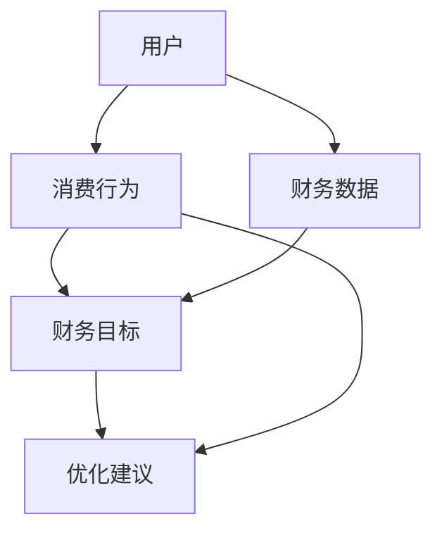
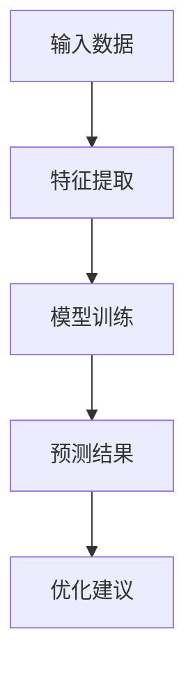
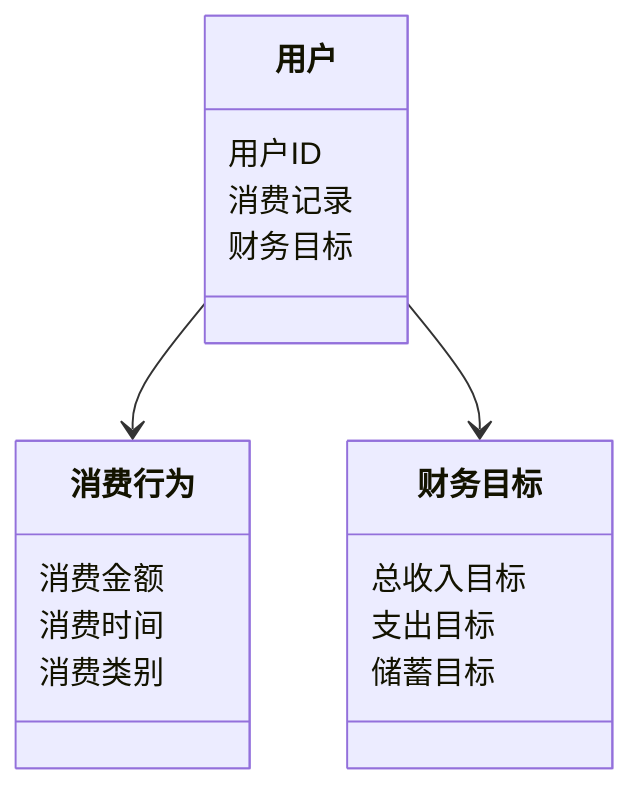
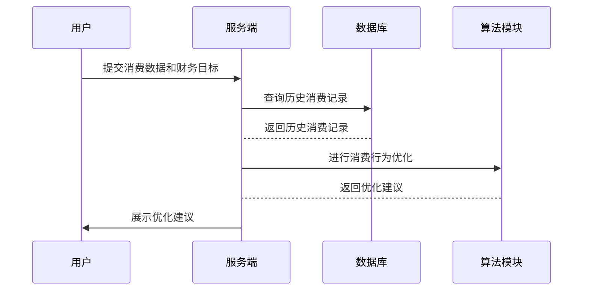

                 


# 开发智能化的个人消费行为优化与财务目标对齐工具

> 关键词：个人消费行为优化，财务目标对齐，人工智能，强化学习，机器学习，系统架构设计

> 摘要：  
本文详细探讨了开发智能化的个人消费行为优化与财务目标对齐工具的背景、核心概念、算法原理、系统架构设计及项目实现过程。通过结合强化学习和机器学习技术，本文提出了一个创新的解决方案，帮助用户优化消费行为并实现财务目标的对齐。文章内容涵盖从问题背景到系统实现的完整流程，旨在为技术开发者和用户提供有价值的参考。

---

## 第一部分：智能化个人消费行为优化与财务目标对齐工具的背景与核心概念

### 第1章：问题背景与目标设定

#### 1.1 问题背景介绍
- 1.1.1 当前个人财务管理的痛点  
  - 手动记录和分析财务数据的低效性  
  - 消费行为缺乏科学性，容易超支或浪费  
  - 财务目标与实际消费行为之间的脱节  

- 1.1.2 消费行为对财务目标的影响  
  - 高额消费可能导致财务目标延迟或无法实现  
  - 低效消费可能导致资源浪费和生活质量下降  

- 1.1.3 技术如何解决这些痛点  
  - 引入人工智能技术实现自动化分析和优化  
  - 通过数据驱动的方法提供个性化建议  

#### 1.2 问题描述与目标设定
- 1.2.1 消费行为优化的具体问题  
  - 理解用户的消费习惯和偏好  
  - 找出非理性消费行为并提供改进建议  

- 1.2.2 财务目标对齐的核心目标  
  - 确保消费行为与长期财务目标一致  
  - 通过优化消费行为实现财务目标的提前达成  

- 1.2.3 工具开发的总体目标  
  - 开发一个智能化工具，帮助用户优化消费行为并实现财务目标对齐  
  - 提供个性化建议，提升用户体验  

#### 1.3 问题解决思路
- 1.3.1 技术手段的选择  
  - 使用强化学习优化消费行为  
  - 使用机器学习预测和对齐财务目标  

- 1.3.2 数据驱动的优化方法  
  - 收集和分析用户的消费数据  
  - 基于数据提供优化建议  

- 1.3.3 用户行为分析与反馈机制  
  - 通过用户行为分析改进工具的建议算法  
  - 建立反馈机制，持续优化工具性能  

#### 1.4 边界与外延
- 1.4.1 工具的功能边界  
  - 专注于消费行为优化和财务目标对齐  
  - 不涉及投资和理财规划  

- 1.4.2 与现有财务工具的区别  
  - 强调智能化和个性化  
  - 更注重消费行为与财务目标的动态对齐  

- 1.4.3 可扩展的功能外延  
  - 支持多种数据源（如银行账单、消费记录）  
  - 提供多维度的财务目标设定  

#### 1.5 概念结构与核心要素
- 1.5.1 核心概念的组成  
  - 用户数据：消费记录、财务目标、偏好等  
  - 智能算法：强化学习、机器学习模型  
  - 优化建议：消费调整方案、财务目标对齐策略  

- 1.5.2 各要素之间的关系  
  - 用户数据输入 -> 算法分析 -> 优化建议输出  

- 1.5.3 系统的整体架构  
  - 数据采集 -> 数据处理 -> 算法计算 -> 优化建议生成  

---

## 第二部分：核心概念与系统联系

### 第2章：核心概念与系统联系

#### 2.1 核心概念的原理
- 2.1.1 消费行为优化的算法原理  
  - 使用强化学习算法模拟用户的消费决策过程  
  - 通过奖励机制优化消费行为  

- 2.1.2 财务目标对齐的数学模型  
  - 基于线性规划的财务目标对齐模型  
  - 使用机器学习预测消费行为对财务目标的影响  

- 2.1.3 两者结合的逻辑关系  
  - 消费行为优化是手段，财务目标对齐是目标  
  - 通过动态调整消费行为实现财务目标的逐步对齐  

#### 2.2 核心概念的属性对比
- 2.2.1 消费行为优化的属性特征  
  - 输入：消费记录、偏好  
  - 输出：消费调整建议  
  - 算法：强化学习  

- 2.2.2 财务目标对齐的属性特征  
  - 输入：财务目标、消费数据  
  - 输出：对齐策略  
  - 算法：机器学习  

- 2.2.3 属性对比的总结表格  
| 特性            | 消费行为优化         | 财务目标对齐       |
|-----------------|---------------------|------------------|
| 输入数据        | 消费记录、偏好       | 财务目标、消费数据 |
| 输出结果        | 消费调整建议         | 对齐策略          |
| 核心算法        | 强化学习             | 机器学习          |

#### 2.3 实体关系图


---

## 第三部分：算法原理与数学模型

### 第3章：算法原理与数学模型

#### 3.1 算法原理
- 3.1.1 基于强化学习的消费行为优化  
  - 状态空间：用户当前的消费数据  
  - 动作空间：消费行为的选择（如增加或减少消费）  
  - 奖励函数：优化后的财务目标对齐程度  

- 3.1.2 基于机器学习的财务目标对齐  
  - 使用回归模型预测消费行为对财务目标的影响  
  - 通过分类模型识别消费行为与财务目标的偏差  

- 3.1.3 算法流程图  


#### 3.2 数学模型与公式
- 3.2.1 强化学习模型  
$$ V(s) = \max_{a} [ r(s,a) + V(s') ] $$  
其中，$s$ 是状态，$a$ 是动作，$r(s,a)$ 是奖励，$s'$ 是下一个状态。  

- 3.2.2 财务目标对齐模型  
$$ \text{预测值} = \beta \cdot \text{消费数据} + \gamma \cdot \text{财务目标} $$  
其中，$\beta$ 和 $\gamma$ 是模型参数。  

---

## 第四部分：系统分析与架构设计

### 第4章：系统分析与架构设计

#### 4.1 问题场景介绍
- 4.1.1 用户使用场景  
  - 用户输入消费数据和财务目标  
  - 工具提供消费优化建议  

- 4.1.2 工具的功能场景  
  - 数据采集与处理  
  - 算法计算与优化  
  - 结果展示与反馈  

#### 4.2 系统功能设计
- 4.2.1 领域模型（Mermaid 类图）  


- 4.2.2 系统架构设计（Mermaid 架构图）  


- 4.2.3 系统接口设计  
  - 输入接口：用户输入消费数据和财务目标  
  - 输出接口：工具输出优化建议  

- 4.2.4 系统交互流程（Mermaid 序列图）  


---

## 第五部分：项目实战

### 第5章：项目实战

#### 5.1 环境安装
- 安装 Python 和相关库（如 numpy、pandas、scikit-learn、强化学习框架）  
- 安装工具所需的数据接口（如数据库连接）  

#### 5.2 系统核心实现源代码
- 代码示例：消费行为优化算法实现  
```python
import numpy as np
from sklearn import linear_model

# 示例数据
X = np.array([[1000, 200], [1500, 300], [2000, 400]])
y = np.array([500, 600, 700])

# 训练模型
model = linear_model.LinearRegression()
model.fit(X, y)

# 预测结果
new_X = np.array([[1200, 250]])
predicted_y = model.predict(new_X)
print(predicted_y)
```

#### 5.3 代码应用解读与分析
- 代码功能：  
  - 使用线性回归模型预测消费行为对财务目标的影响  
  - 输入新的消费数据，输出对齐的财务目标  

- 代码实现：  
  - 数据预处理：清洗和特征工程  
  - 模型训练：选择合适的算法并进行调参  
  - 模型预测：基于输入数据生成优化建议  

#### 5.4 实际案例分析
- 案例背景：用户设定的财务目标与实际消费行为之间的偏差  
- 数据分析：用户过去一个月的消费记录  
- 工具输出：消费调整建议和对齐后的财务目标  

#### 5.5 项目小结
- 项目实现的关键点  
  - 数据的准确性和完整性  
  - 算法的选择和优化  
  - 用户反馈的及时性和准确性  

---

## 第六部分：总结与展望

### 第6章：总结与展望

#### 6.1 最佳实践 tips
- 数据的准确性和及时性对工具性能影响重大  
- 算法的选择需要根据具体场景进行调整  

#### 6.2 小结
- 本文详细介绍了开发智能化个人消费行为优化与财务目标对齐工具的背景、核心概念、算法原理和系统架构设计  
- 通过实际案例展示了工具的实现过程和应用效果  

#### 6.3 注意事项
- 保护用户数据隐私  
- 定期更新算法模型以适应用户需求的变化  

#### 6.4 拓展阅读
- 推荐阅读相关领域的技术文献  
- 关注人工智能在个人财务管理中的最新应用  

---

## 附录

### 附录 A：代码实现细节
- 提供完整的代码实现和注释  
- 解释每部分代码的功能和作用  

### 附录 B：数据格式与接口规范
- 定义数据输入和输出的格式  
- 描述系统接口的详细规范  

### 附录 C：算法优化建议
- 提供算法优化的具体方法和技巧  
- 分析不同算法的优缺点  

---

通过以上目录和内容的设计，您可以逐步展开每一部分的详细写作，确保文章逻辑清晰、结构紧凑、内容详实。

