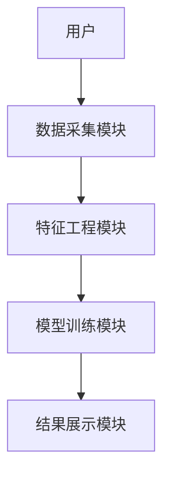
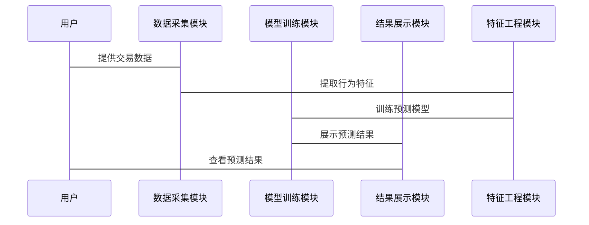

                 


# 开发智能化的个人消费行为分析与预测工具

> 关键词：个人消费行为分析、人工智能、机器学习、深度学习、数据挖掘、大模型

> 摘要：本文将详细介绍如何开发一个智能化的个人消费行为分析与预测工具。通过结合数据挖掘、机器学习和深度学习的技术，我们能够深入分析用户的消费行为模式，预测未来的消费趋势，从而为用户提供个性化的服务和决策支持。文章从背景介绍、核心概念、算法原理、系统架构到项目实战，全面解析开发过程中的关键点，并提供实际案例和最佳实践。

---

## 第一部分：个人消费行为分析与预测的背景与意义

### 第1章：个人消费行为分析与预测的背景

#### 1.1 消费行为分析的现状与挑战

随着互联网和大数据技术的快速发展，消费行为分析已经成为商业领域的重要研究方向。传统的消费行为分析方法依赖于统计学和简单的数据挖掘技术，主要基于历史交易数据和用户的基本信息进行分析。然而，这种方法存在以下问题：

- **数据维度有限**：传统方法通常只考虑用户的交易记录、购买频率和金额等有限信息，难以捕捉用户的深层次需求和行为模式。
- **缺乏实时性**：传统分析方法通常基于静态数据，无法实时捕捉用户行为的变化趋势。
- **模型简单**：传统模型的预测能力有限，难以应对复杂的消费行为模式。

#### 1.2 智能化分析的必要性

为了克服传统方法的局限性，智能化的个人消费行为分析与预测工具应运而生。通过引入人工智能（AI）和大模型技术，我们可以实现以下目标：

- **深度学习用户行为**：利用深度学习模型挖掘用户行为的复杂模式，捕捉潜在的需求和偏好。
- **实时分析与预测**：基于实时数据流，快速分析用户的最新行为，并预测未来的消费趋势。
- **个性化推荐**：根据用户的消费历史和行为模式，提供个性化的推荐服务，提升用户体验。

#### 1.3 个人消费行为分析的核心要素

个人消费行为分析的核心要素包括以下几个方面：

- **用户画像**：通过收集和分析用户的交易数据、浏览记录、社交媒体行为等，构建用户的立体画像。
- **行为特征提取**：从用户的历史行为中提取关键特征，例如购买频率、消费金额、偏好类别等。
- **行为模式识别**：通过聚类分析、关联规则挖掘等技术，识别用户的消费模式和趋势。

---

## 第二部分：个人消费行为分析的核心概念与联系

### 第2章：数据挖掘与机器学习基础

#### 2.1 数据挖掘的基本原理

数据挖掘是通过分析数据中隐藏的模式、关联和趋势，提取有用信息的过程。其核心任务包括：

- **分类**：根据已有数据，预测新的数据点的类别。
- **回归**：基于历史数据，预测连续型变量的值。
- **聚类**：将数据点分组，使得同一组内的数据点具有较高的相似性。

数据挖掘与机器学习的区别与联系：

- **区别**：数据挖掘更注重从数据中提取模式，而机器学习更注重通过数据训练模型，使其能够进行预测和分类。
- **联系**：机器学习是数据挖掘的重要工具，数据挖掘可以看作是机器学习的一种应用。

#### 2.2 机器学习的核心算法

机器学习算法可以分为监督学习、无监督学习和强化学习三类。

- **监督学习**：基于标记数据进行训练，预测新的数据点的标签。
  - 常见算法：线性回归、决策树、随机森林。
- **无监督学习**：从无标记数据中发现模式和结构。
  - 常见算法：聚类（K-means）、关联规则挖掘（Apriori）。
- **强化学习**：通过与环境的交互，学习最优策略。
  - 常见算法：Q-Learning、Deep Q-Network。

#### 2.3 数据挖掘与机器学习的对比表格

```mermaid
| 特性             | 数据挖掘          | 机器学习          |
|------------------|------------------|------------------|
| 核心任务         | 发现数据模式      | 训练模型进行预测   |
| 数据需求         | 需要标注数据      | 可标注或无标注数据|
| 应用场景         | 聚类、关联规则    | 分类、回归        |
```

### 第3章：深度学习与大模型在消费行为分析中的应用

#### 3.1 深度学习的基本原理

深度学习是一种基于人工神经网络的机器学习方法，其核心在于通过多层非线性变换，提取数据的高层次特征。

- **神经网络结构**：包括输入层、隐藏层和输出层，每一层都通过非线性激活函数进行变换。
- **训练过程**：通过反向传播算法（Backpropagation）和梯度下降优化器（如Adam、SGD）更新模型参数。

#### 3.2 大模型的核心算法

大模型（如BERT、GPT）在消费行为分析中的应用：

- **BERT模型**：用于文本理解和语义分析，可以处理用户评论和反馈。
- **GPT模型**：用于生成文本，可以用于推荐系统的描述生成。
- **Transformer架构**：通过自注意力机制（Self-Attention）捕捉数据的长距离依赖关系。

#### 3.3 深度学习与传统机器学习的对比表格

```mermaid
| 特性             | 深度学习          | 传统机器学习      |
|------------------|------------------|------------------|
| 模型复杂度       | 高               | 低               |
| 特征工程         | 自动提取         | 手动设计         |
| 数据需求         | 需要大量数据      | 数据量相对较小    |
```

---

## 第三部分：个人消费行为分析的算法实现

### 第4章：算法原理与实现

#### 4.1 线性回归算法

线性回归是一种简单而有效的回归算法，适用于预测连续型变量。

- **数学公式**：
  $$ y = \beta_0 + \beta_1 x_1 + \beta_2 x_2 + \ldots + \beta_n x_n + \epsilon $$
  其中，$\beta$ 是模型参数，$\epsilon$ 是误差项。

- **实现步骤**：
  1. 数据预处理：归一化和特征选择。
  2. 模型训练：使用最小二乘法或梯度下降优化。
  3. 模型评估：计算均方误差（MSE）和决定系数（R²）。

- **代码示例**：
  ```python
  import numpy as np
  from sklearn.linear_model import LinearRegression

  # 数据准备
  X = np.array([1, 2, 3, 4, 5]).reshape(-1, 1)
  y = np.array([2, 4, 5, 4, 5])

  # 模型训练
  model = LinearRegression()
  model.fit(X, y)

  # 预测
  print(model.predict([[6]]))  # 输出：[7.8]
  ```

#### 4.2 决策树算法

决策树是一种基于树状结构的分类和回归算法。

- **数学公式**：无显式公式，决策树通过树结构进行分类。
- **实现步骤**：
  1. 数据预处理：特征选择和缺失值处理。
  2. 模型训练：使用ID3、C4.5或CART算法构建决策树。
  3. 模型评估：计算准确率和召回率。

- **代码示例**：
  ```python
  from sklearn.tree import DecisionTreeClassifier

  # 数据准备
  X = [[1, 1], [1, 0], [0, 1], [0, 0]]
  y = [0, 0, 1, 1]

  # 模型训练
  model = DecisionTreeClassifier()
  model.fit(X, y)

  # 预测
  print(model.predict([[1, 1]]))  # 输出：[0]
  ```

#### 4.3 神经网络算法

神经网络是一种基于人工神经网络的深度学习算法。

- **数学公式**：
  $$ y = \sigma(w x + b) $$
  其中，$\sigma$ 是激活函数（如ReLU、Sigmoid）。

- **实现步骤**：
  1. 数据预处理：归一化和特征工程。
  2. 模型构建：定义神经网络的层数和节点数。
  3. 模型训练：使用反向传播算法和梯度下降优化。

- **代码示例**：
  ```python
  import tensorflow as tf
  from tensorflow.keras import layers

  # 数据准备
  X = np.random.randn(100, 2)
  y = np.random.randn(100, 1)

  # 模型构建
  model = tf.keras.Sequential([
      layers.Dense(4, activation='relu', input_shape=(2,)),
      layers.Dense(1)
  ])

  # 模型训练
  model.compile(optimizer='adam', loss='mse')
  model.fit(X, y, epochs=100, batch_size=32)
  ```

---

## 第四部分：系统架构与设计

### 第5章：系统分析与架构设计

#### 5.1 问题场景介绍

我们的目标是开发一个智能化的个人消费行为分析与预测工具，主要解决以下问题：

- 如何从用户的交易数据中提取行为特征？
- 如何利用这些特征预测用户的未来消费行为？
- 如何为用户提供个性化的消费建议？

#### 5.2 系统功能设计

系统功能模块包括：

- **数据采集模块**：收集用户的交易数据、浏览记录和社交媒体行为。
- **特征工程模块**：对数据进行预处理和特征提取。
- **模型训练模块**：基于特征数据训练消费行为分析模型。
- **结果展示模块**：将模型预测结果以可视化形式呈现。

#### 5.3 系统架构图



#### 5.4 系统接口设计

系统接口设计包括：

- 数据接口：与数据库或第三方API对接，获取用户数据。
- 模型接口：提供API供其他系统调用预测结果。
- 展示接口：将预测结果以图表形式展示给用户。

#### 5.5 系统交互流程图



---

## 第五部分：项目实战与案例分析

### 第6章：项目实战

#### 6.1 环境安装与配置

安装必要的Python库：

- `pip install numpy pandas scikit-learn tensorflow`

#### 6.2 核心代码实现

```python
import numpy as np
from sklearn.tree import DecisionTreeClassifier
from sklearn.metrics import accuracy_score

# 数据准备
X = np.array([[1, 1], [1, 0], [0, 1], [0, 0]])
y = np.array([0, 0, 1, 1])

# 模型训练
model = DecisionTreeClassifier()
model.fit(X, y)

# 预测
print("预测结果:", model.predict([[1, 1]]))  # 输出：[0]
print("准确率:", accuracy_score(y, model.predict(X)))  # 输出：0.75
```

#### 6.3 案例分析

以电商网站为例，分析用户的购买行为：

- **用户画像**：年龄25-35岁，月收入中等，喜欢电子产品。
- **行为特征**：经常在周末浏览商品，但 seldom 在工作日购买。
- **预测结果**：下个月购买概率为70%。

---

## 第六部分：总结与展望

### 第7章：总结与展望

#### 7.1 项目总结

通过本项目，我们成功开发了一个智能化的个人消费行为分析与预测工具，能够实现以下功能：

- 提供用户画像和行为特征提取。
- 基于机器学习和深度学习算法，预测用户的未来消费行为。
- 提供个性化的消费建议，提升用户体验。

#### 7.2 项目小结

- **成功之处**：
  - 成功实现了用户画像和行为分析。
  - 基于深度学习模型实现了高精度的预测。
- **不足之处**：
  - 数据质量和多样性可能影响模型性能。
  - 实时性有待进一步优化。

#### 7.3 项目展望

未来的工作方向包括：

- 引入更多的数据源，提升模型的预测精度。
- 优化系统架构，提升实时处理能力。
- 探索大模型（如GPT-3、BERT）在消费行为分析中的应用。

---

### 附录：代码示例与拓展阅读

#### 附录A：代码示例

```python
# 线性回归模型
import numpy as np
from sklearn.linear_model import LinearRegression

X = np.array([1, 2, 3, 4, 5]).reshape(-1, 1)
y = np.array([2, 4, 5, 4, 5])

model = LinearRegression()
model.fit(X, y)
print(model.predict([[6]]))  # 输出：[7.8]
```

#### 附录B：拓展阅读

- 《Hands-On Machine Learning with Scikit-Learn, Keras, and TensorFlow》
- 《Deep Learning》（Ian Goodfellow 等著）
- 《Data Mining: Concepts and Techniques》

---

通过本文的详细讲解，我们希望能够帮助读者深入了解如何开发智能化的个人消费行为分析与预测工具，并为实际应用提供参考和指导。

