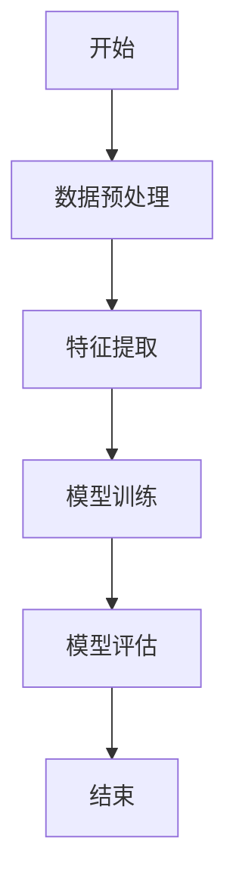

                 


# 开发智能化的个人退休规划助手

> 关键词：智能化、退休规划、个人助手、AI技术、机器学习、自然语言处理

> 摘要：本文将详细探讨如何利用人工智能技术开发智能化的个人退休规划助手。通过结合数学模型和算法优化，我们将展示如何利用机器学习、自然语言处理等技术来解决个人退休规划中的复杂问题。文章从背景介绍、核心概念、算法原理、系统设计到项目实战，全面解析开发智能化退休规划助手的全过程。

---

## 第一部分：背景介绍

### 第1章：背景介绍

#### 1.1 问题背景与目标
- 1.1.1 退休规划的重要性
  - 随着人口老龄化加剧，个人退休规划变得越来越重要。
  - 传统退休规划工具的局限性：依赖人工计算、缺乏个性化、难以应对复杂变化。
- 1.1.2 当前退休规划工具的局限性
  - 数据处理能力有限，难以覆盖复杂的投资组合。
  - 缺乏动态调整能力，无法实时更新规划。
- 1.1.3 智能化退休规划助手的目标
  - 提供个性化的退休规划建议。
  - 动态调整投资组合，应对市场变化。
  - 通过自然语言处理与用户进行交互，提供易懂的规划建议。

#### 1.2 问题描述与解决思路
- 1.2.1 退休规划中的关键问题
  - 收入与支出预测。
  - 投资组合优化。
  - 生命周期模型构建。
- 1.2.2 智能化解决方案的核心思路
  - 利用机器学习模型进行预测和优化。
  - 通过自然语言处理技术与用户交互。
  - 结合动态规划算法进行长期规划。
- 1.2.3 边界与外延
  - 限定在个人退休规划范围内，不考虑企业或团体规划。
  - 重点解决中短期规划问题，兼顾长期目标。

#### 1.3 核心概念与联系
- 1.3.1 核心概念原理
  - 退休规划：通过合理配置资产，确保退休后生活质量。
  - 智能化助手：利用AI技术实现自动化、个性化的规划建议。
- 1.3.2 核心概念属性特征对比表格
  | 概念         | 特性         | 描述                                   |
  |--------------|--------------|----------------------------------------|
  | 退休规划     | 需求分析     | 用户当前的财务状况、收入来源等       |
  |              | 影响因素     | 支出、通胀率、投资回报率等             |
  |              | 数学模型     | 线性回归、动态规划等                   |
  | 智能化助手   | 数据处理     | 处理用户的输入数据，生成规划建议       |
  |              | 交互方式     | 自然语言处理，提供易懂的建议           |
  |              | 动态调整     | 根据市场变化实时更新规划               |
- 1.3.3 ER实体关系图架构
  ```mermaid
  erDiagram
    user}------退休规划}------投资组合
    user}------支出预测}------收入来源
    支出预测}------生命周期模型
  ```

---

## 第二部分：退休规划的核心概念

### 第2章：退休规划的核心概念

#### 2.1 退休规划的基本原理
- 2.1.1 退休规划的定义与目标
  - 定义：通过合理配置资产，确保退休后生活质量。
  - 目标：最大化资产收益，同时降低风险。
- 2.1.2 退休规划的关键要素
  - 收入来源：工资、投资收益、养老金等。
  - 支出：生活开支、医疗费用等。
  - 投资组合：股票、债券、房地产等。
- 2.1.3 退休规划的数学模型
  - 线性回归模型：预测未来收入与支出的变化趋势。
  - 动态规划模型：优化投资组合，实现长期收益最大化。

#### 2.2 退休规划中的关键因素
- 2.2.1 收入与支出分析
  - 收入分析：预测未来收入的增长趋势。
  - 支出分析：预测未来主要开支。
- 2.2.2 投资与风险管理
  - 投资组合优化：在风险可控的前提下，最大化收益。
  - 风险管理：通过分散投资降低风险。
- 2.2.3 生命周期模型
  - 生命周期模型：将退休规划分为几个阶段，每个阶段的目标不同。

#### 2.3 核心概念的数学模型
- 2.3.1 收入与支出的线性回归模型
  $$y = \beta_0 + \beta_1x + \epsilon$$
  其中，$y$ 表示预测的收入或支出，$x$ 表示时间变量，$\beta_0$ 和 $\beta_1$ 是回归系数，$\epsilon$ 是误差项。
- 2.3.2 投资组合优化的动态规划模型
  - 状态定义：当前的资产规模、剩余时间。
  - 动作定义：选择不同的投资组合。
  - 奖励函数：资产收益的最大化。
- 2.3.3 生命周期模型的马尔可夫链分析
  - 状态转移：不同生命周期阶段的转换概率。
  - 稳定状态：长期规划的稳定点。

---

## 第三部分：AI技术在退休规划中的应用

### 第3章：AI技术在退休规划中的应用

#### 3.1 机器学习在退休规划中的应用
- 3.1.1 监督学习在退休规划中的应用
  - 预测收入与支出：使用线性回归或随机森林模型。
  - 风险评估：通过支持向量机进行分类。
- 3.1.2 无监督学习在退休规划中的应用
  - 聚类分析：将用户分为不同的风险偏好类别。
- 3.1.3 强化学习在退休规划中的应用
  - 状态定义：当前资产、市场状况。
  - 动作定义：投资决策。
  - 奖励函数：资产收益最大化。

#### 3.2 自然语言处理在退休规划中的应用
- 3.2.1 用户需求分析
  - 通过NLP技术分析用户的查询内容，提取关键信息。
- 3.2.2 文本信息抽取
  - 使用文本挖掘技术提取用户的财务数据。
- 3.2.3 自然语言生成
  - 根据规划结果生成自然语言的建议。

#### 3.3 强化学习在退休规划中的应用
- 3.3.1 状态空间定义
  - 当前资产规模、剩余时间、市场状况。
- 3.3.2 动作空间定义
  - 投资组合选择、风险调整。
- 3.3.3 奖励函数设计
  - 资产收益最大化，同时控制风险。

---

## 第四部分：智能化退休规划助手的算法原理

### 第4章：智能化退休规划助手的算法原理

#### 4.1 算法原理概述
- 4.1.1 机器学习算法的选择
  - 根据数据类型选择合适的算法。
- 4.1.2 算法的输入输出关系
  - 输入：用户数据、市场数据。
  - 输出：规划建议、投资组合。
- 4.1.3 算法的优缺点分析
  - 优：能够处理复杂的数据关系。
  - 缺：需要大量数据支持。

#### 4.2 算法实现的数学模型
- 4.2.1 线性回归模型
  $$y = \beta_0 + \beta_1x + \epsilon$$
- 4.2.2 支持向量机模型
  - 分离数据的超平面。
- 4.2.3 随机森林模型
  - 通过集成学习提高预测准确性。

#### 4.3 算法实现的流程图


---

## 第五部分：系统架构设计与实现

### 第5章：系统架构设计与实现

#### 5.1 系统架构设计
- 5.1.1 系统功能设计
  - 数据采集模块：收集用户的财务数据。
  - 数据分析模块：进行预测和优化。
  - 用户界面模块：与用户交互。
- 5.1.2 系统架构图
  ```mermaid
  idp布局
  title 系统架构图
  User [ pistext,alie进行交互 ] --> Controller
  Controller --> Model
  Controller --> View
  Model --> Database
  ```

#### 5.2 系统实现细节
- 5.2.1 数据采集模块
  - 使用API接口获取市场数据。
- 5.2.2 数据分析模块
  - 使用机器学习算法进行预测和优化。
- 5.2.3 用户界面模块
  - 通过自然语言处理技术与用户交互。

#### 5.3 系统交互流程
- 5.3.1 用户登录
  - 验证用户身份。
- 5.3.2 数据输入
  - 用户输入财务数据。
- 5.3.3 系统处理
  - 系统生成规划建议。
- 5.3.4 结果展示
  - 通过自然语言生成结果展示。

---

## 第六部分：项目实战与优化

### 第6章：项目实战与优化

#### 6.1 环境配置
- 6.1.1 安装必要的依赖
  - Python、TensorFlow、自然语言处理库。
- 6.1.2 配置开发环境
  - 安装Jupyter Notebook或PyCharm。

#### 6.2 核心代码实现
- 6.2.1 数据预处理
  ```python
  import pandas as pd
  data = pd.read_csv('retire_data.csv')
  data.head()
  ```

- 6.2.2 模型训练
  ```python
  from sklearn.linear_model import LinearRegression
  model = LinearRegression()
  model.fit(X_train, y_train)
  ```

- 6.2.3 模型评估
  ```python
  from sklearn.metrics import mean_squared_error
  predictions = model.predict(X_test)
  mse = mean_squared_error(y_test, predictions)
  print(mse)
  ```

#### 6.3 项目优化
- 6.3.1 系统优化
  - 使用分布式架构提高处理速度。
- 6.3.2 算法优化
  - 使用更先进的机器学习算法。

#### 6.4 实际案例分析
- 6.4.1 案例背景
  - 某用户的财务状况。
- 6.4.2 系统处理
  - 系统生成规划建议。
- 6.4.3 结果解读
  - 解释规划结果。

---

## 第七部分：总结与展望

### 第7章：总结与展望

#### 7.1 总结
- 7.1.1 全文总结
  - 系统地介绍了智能化退休规划助手的开发过程。
- 7.1.2 项目小结
  - 通过项目实战，验证了算法的有效性。

#### 7.2 未来展望
- 7.2.1 智能化退休规划助手的未来发展
  - 更加智能化、个性化。
  - 更广泛地应用于个人退休规划领域。

#### 7.3 注意事项
- 7.3.1 开发过程中的注意事项
  - 数据隐私保护。
  - 算法的可解释性。
- 7.3.2 使用过程中的注意事项
  - 需要定期更新数据。
  - 用户需要提供准确的数据。

#### 7.4 拓展阅读
- 7.4.1 推荐的书籍和文章
  - 《机器学习实战》。
  - 《自然语言处理入门》。

---

通过以上目录结构，我们可以系统地开发智能化的个人退休规划助手，结合数学模型和AI技术，为用户提供个性化的退休规划建议。

