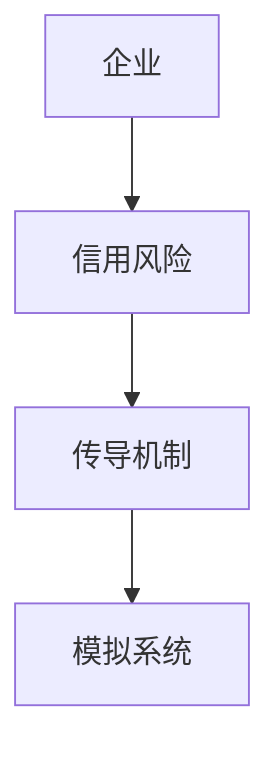
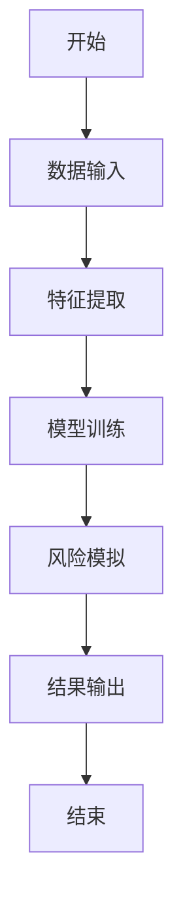

                 


# 开发智能化的企业信用风险传导模拟系统

## 关键词：企业信用风险，风险传导，模拟系统，人工智能，算法设计，系统架构

## 摘要：  
本文将详细探讨开发智能化的企业信用风险传导模拟系统的各个方面，从背景分析到系统实现，旨在为企业信用风险管理提供一种高效、智能化的解决方案。通过结合企业信用风险的核心概念、算法原理、系统架构设计以及实际案例分析，本文将为读者提供一个全面的技术视角，帮助其理解如何利用现代技术手段来应对复杂的信用风险传导问题。

---

# 第一部分: 企业信用风险传导模拟系统背景

## 第1章: 企业信用风险传导模拟系统背景

### 1.1 问题背景

#### 1.1.1 信用风险的定义与重要性  
信用风险是指企业在信用交易中，由于交易对手或债务人无法履行其债务义务而可能遭受的损失。在现代金融体系中，信用风险是企业面临的主要风险之一。随着全球经济的复杂化和不确定性增加，信用风险的管理和模拟变得尤为重要。  

#### 1.1.2 信用风险传导机制的复杂性  
信用风险的传导机制涉及多个因素，包括经济周期、市场波动、企业经营状况等。这些因素之间的相互作用使得信用风险的模拟变得复杂。传统的基于经验的信用风险管理方法已难以应对日益复杂的信用风险环境。  

#### 1.1.3 传统信用风险管理的局限性  
传统的信用风险管理方法主要依赖于历史数据和经验判断，缺乏对复杂风险传导机制的系统化模拟能力。此外，传统方法往往忽略了企业内部和外部因素的动态交互，难以捕捉信用风险的实时变化。  

---

### 1.2 问题描述

#### 1.2.1 信用风险传导的定义  
信用风险传导是指信用风险从一个主体（如银行、企业）向另一个主体（如投资者、供应链上下游企业）传播的过程。这种传导可能通过直接的债务关系或间接的市场影响实现。  

#### 1.2.2 企业信用风险传导的关键因素  
企业信用风险传导的关键因素包括：  
1. **企业间的金融关联**：如银行贷款、债券投资等。  
2. **市场波动**：如经济衰退、行业不景气等。  
3. **企业经营状况**：如财务状况、管理能力等。  

#### 1.2.3 系统化模拟的必要性  
为了准确评估和管理信用风险，需要对信用风险的传导过程进行系统化模拟。这不仅可以帮助企业在风险发生前做好准备，还能通过模拟不同情景下的风险敞口，优化企业的风险管理策略。  

---

### 1.3 问题解决

#### 1.3.1 智能化模拟系统的解决方案  
智能化信用风险传导模拟系统通过整合人工智能、大数据分析和系统建模技术，能够实时捕捉和分析信用风险的动态变化，为企业提供精准的风险评估和预测。  

#### 1.3.2 系统设计的核心目标  
1. 实时监控信用风险的变化。  
2. 模拟不同情景下的信用风险传导路径。  
3. 提供风险预警和应对策略建议。  

#### 1.3.3 系统实现的技术路线  
1. 数据采集与处理：收集企业财务数据、市场数据等。  
2. 模型构建：基于机器学习和统计建模技术构建信用风险传导模型。  
3. 系统实现：开发智能化模拟系统，实现信用风险的实时模拟和分析。  

---

### 1.4 边界与外延

#### 1.4.1 系统的边界条件  
智能化信用风险传导模拟系统的边界包括：  
1. 输入数据的范围（如企业财务数据、市场数据）。  
2. 输出结果的范围（如风险评估报告、风险预警信号）。  
3. 系统的运行环境（如服务器端、用户端）。  

#### 1.4.2 相关领域的外延  
信用风险传导模拟系统与多个领域相关，包括：  
1. 金融风险管理。  
2. 大数据分析与挖掘。  
3. 人工智能与机器学习。  

#### 1.4.3 系统与其他模块的接口关系  
系统需要与以下模块进行接口交互：  
1. 数据采集模块：提供实时数据输入。  
2. 用户界面模块：提供用户交互界面。  
3. 报告生成模块：生成风险评估报告。  

---

### 1.5 核心概念与组成

#### 1.5.1 核心概念的定义  
1. **信用风险**：指债务人或交易对手无法履行其债务义务的可能性。  
2. **风险传导**：信用风险从一个主体向另一个主体传播的过程。  
3. **系统模拟**：通过建模和算法模拟信用风险的动态变化。  

#### 1.5.2 核心概念之间的关系  
信用风险的传导过程涉及多个因素，包括企业的财务状况、市场环境、企业间的关联等。这些因素通过复杂的交互作用，共同影响信用风险的传播路径和强度。  

#### 1.5.3 系统组成模块的介绍  
1. 数据采集模块：负责采集企业信用相关数据。  
2. 模型构建模块：基于机器学习算法构建信用风险传导模型。  
3. 系统模拟模块：实现信用风险的动态模拟和分析。  
4. 用户界面模块：提供用户友好的交互界面。  

---

## 第2章: 核心概念与联系

### 2.1 核心概念原理

#### 2.1.1 信用风险的数学模型  
信用风险的数学模型通常包括概率模型和统计模型。例如，马尔可夫链模型可以用于描述信用等级的转移过程。  

#### 2.1.2 风险传导的机制分析  
信用风险的传导机制可以通过网络模型进行分析。例如，企业间的金融关联可以看作是一个复杂网络，其中每个节点代表一个企业，边的权重代表企业间的关联强度。  

#### 2.1.3 系统模拟的基本原理  
系统模拟的基本原理是通过建模和算法，模拟信用风险在不同情景下的传播路径和影响范围。  

---

### 2.2 概念属性特征对比

| 概念       | 特性1 | 特性2 | 特性3 |
|------------|-------|-------|-------|
| 信用风险   | 随机性 | 可测量性 | 时间依赖性 |
| 风险传导   | 传播性 | 网络效应 | 复杂性 |
| 系统模拟   | 可控性 | 可视化 | 可预测性 |

---

### 2.3 ER实体关系图



---

## 第3章: 算法原理讲解

### 3.1 算法流程



### 3.2 算法实现

#### 3.2.1 Python代码实现

```python
import numpy as np
import pandas as pd

# 数据预处理
data = pd.read_csv('credit_data.csv')
X = data.drop('target', axis=1)
y = data['target']

# 模型训练
from sklearn.ensemble import RandomForestClassifier
model = RandomForestClassifier()
model.fit(X, y)

# 风险模拟
def simulate_credit_risk(model, data):
    predictions = model.predict(data)
    return predictions

# 结果分析
simulated_risk = simulate_credit_risk(model, new_data)
print(simulated_risk)
```

---

通过以上步骤，我们可以看到，开发智能化的企业信用风险传导模拟系统需要从背景分析、核心概念、算法设计、系统架构等多个方面进行全面考虑。后续章节将详细探讨系统分析与架构设计、项目实战等内容，帮助读者更好地理解和实现智能化的信用风险模拟系统。

