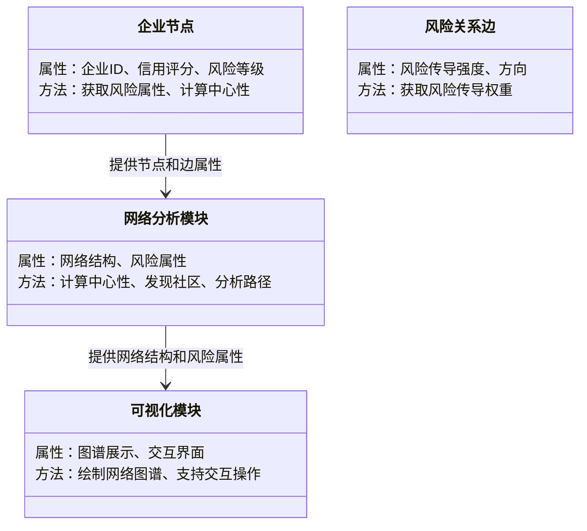
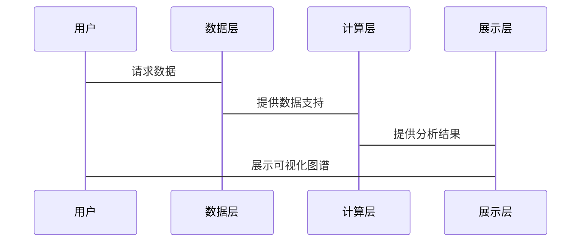
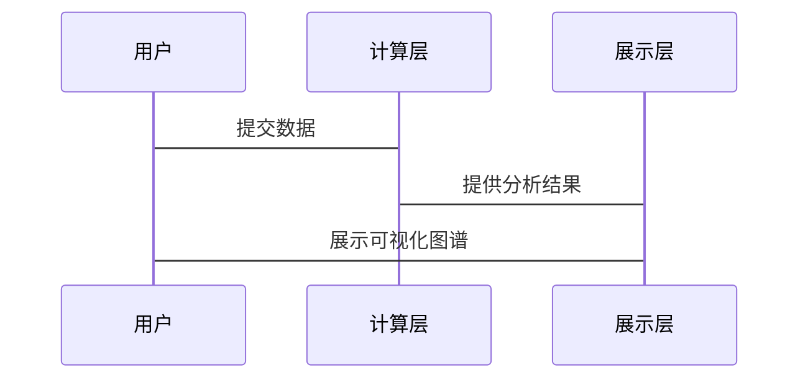

                 


# 开发智能化的企业信用风险传导网络可视化系统

---

## 关键词
企业信用风险、网络可视化、风险传导、系统架构、算法原理、项目实战

---

## 摘要
本文详细介绍了开发智能化的企业信用风险传导网络可视化系统的全过程，从背景分析到系统设计，再到算法实现和项目实战，全面剖析了系统的构建方法。文章首先阐述了企业信用风险的基本概念和网络可视化的技术原理，随后深入分析了系统的核心算法和网络分析方法，结合实际案例展示了系统的功能设计和实现过程。通过本文，读者可以掌握如何利用网络可视化技术来构建智能化的信用风险评估和传导系统。

---

# 第1章: 企业信用风险传导网络概述

## 1.1 企业信用风险的定义与特征
### 1.1.1 信用风险的基本概念
信用风险是指企业在经营过程中由于自身或外部环境的变化，导致无法按时履行债务义务，从而给相关利益方带来损失的可能性。企业信用风险的核心在于企业偿债能力的变化，这可能由企业内部管理问题、外部经济波动或行业风险等多种因素引发。

### 1.1.2 信用风险的传导机制
信用风险的传导机制是指风险从一个企业向另一个企业或整个产业链扩散的过程。这种传导通常通过企业之间的供应链、资金链或市场关联实现。例如，如果一家核心企业的信用状况恶化，可能会导致其供应商和客户的信用风险增加。

### 1.1.3 信用风险在网络中的表现形式
在企业网络中，信用风险的表现形式包括：
1. **直接风险**：企业自身信用状况的变化直接导致的风险。
2. **间接风险**：通过企业之间的关联（如供应链、资金链）传导的风险。
3. **系统性风险**：由于整个网络的关联性增强，导致局部风险迅速扩散至整个网络。

---

## 1.2 网络可视化技术在信用风险中的应用
### 1.2.1 网络可视化的定义与特点
网络可视化是将复杂的关系数据（如企业之间的关联）通过图形化的方式呈现，帮助用户更直观地理解和分析数据。其特点包括：
1. **直观性**：通过图表展示数据之间的关系，便于快速理解。
2. **交互性**：用户可以通过交互操作（如缩放、过滤）来深入分析数据。
3. **动态性**：支持实时更新和动态展示数据变化。

### 1.2.2 网络可视化在信用风险分析中的优势
网络可视化技术可以帮助企业信用风险分析人员：
1. **识别风险源**：通过图谱分析找到信用风险的主要来源。
2. **发现风险传导路径**：通过网络结构分析风险的扩散路径。
3. **评估风险影响**：通过可视化展示风险对企业网络的影响范围和程度。

### 1.2.3 可视化技术在网络风险传导中的作用
可视化技术在网络风险传导中的作用主要体现在以下几个方面：
1. **风险识别**：通过图谱分析快速发现高风险节点。
2. **风险传播路径分析**：通过网络结构分析风险的扩散路径。
3. **风险评估与预警**：通过可视化展示风险的变化趋势，提前预警潜在风险。

---

## 1.3 企业信用风险传导网络的构建目标
### 1.3.1 系统开发的背景与需求
随着经济全球化和企业间关联性增强，信用风险的传导变得越来越复杂。传统的基于单一企业的信用风险评估方法已难以应对复杂的网络风险。因此，开发智能化的企业信用风险传导网络可视化系统成为迫切需求。

### 1.3.2 系统的核心功能与价值
系统的核心功能包括：
1. **风险网络构建**：基于企业之间的关联数据，构建信用风险传导网络。
2. **风险可视化**：通过图谱展示风险在网络中的分布和传导路径。
3. **风险评估与预警**：基于网络分析方法，评估风险的影响程度，并提供预警功能。

系统的价值在于帮助企业更好地理解和管理信用风险，尤其是在复杂的企业网络中，能够快速识别高风险区域并制定应对策略。

### 1.3.3 系统的边界与外延
系统的边界包括：
1. **数据输入**：企业之间的关联数据、企业信用数据等。
2. **数据处理**：网络构建、风险评估算法。
3. **结果输出**：风险网络图谱、风险评估报告。

系统的外延包括：
1. **扩展功能**：支持动态数据更新、多维度分析。
2. **应用场景**：企业风险管理、供应链管理、金融监管等。

---

## 1.4 系统的核心概念与组成要素
### 1.4.1 系统组成要素的定义
系统的主要组成要素包括：
1. **企业节点**：代表具体的企业实体。
2. **风险关系边**：代表企业之间的信用风险传导关系。
3. **风险属性**：包括企业信用评分、风险等级等。

### 1.4.2 核心概念的属性特征对比
| 概念 | 属性 | 特征 |
|------|------|------|
| 企业节点 | 信用评分 | 数值型，范围在0到1之间 |
| 风险关系边 | 风险传导强度 | 数值型，范围在0到1之间 |
| 风险属性 | 风险等级 | 分类型，如高、中、低 |

### 1.4.3 系统的ER实体关系图架构
```mermaid
er
  actor: 企业
  node: 风险节点
  edge: 风险传导关系
  actor --> node: 风险暴露
  node --> edge: 风险传导
  edge --> node: 风险影响
```

---

# 第2章: 核心概念与联系

## 2.1 网络可视化与信用风险传导的关系
### 2.1.1 网络可视化的原理
网络可视化的基本原理是将复杂的关系数据转化为图形化表示，通过图谱展示数据之间的关联关系。其核心步骤包括数据采集、数据处理、图谱构建和图谱展示。

### 2.1.2 信用风险传导的网络模型
信用风险传导的网络模型通常采用图论中的网络模型，包括节点（企业）和边（风险关系）两个核心要素。通过构建网络模型，可以分析风险在企业网络中的传导路径和影响范围。

### 2.1.3 两者之间的联系与区别
网络可视化与信用风险传导的联系在于，前者为后者提供了直观的分析工具，而区别在于，前者注重数据的图形化展示，后者注重风险的动态传导和评估。

---

## 2.2 网络分析与信用风险评估的关联
### 2.2.1 网络分析的基本原理
网络分析是通过对网络中节点和边的属性进行分析，挖掘网络的结构特征和动态行为。其核心方法包括中心性分析、社区发现、路径分析等。

### 2.2.2 信用风险评估的核心方法
信用风险评估的核心方法包括：
1. **信用评分模型**：基于企业财务数据进行信用评分。
2. **网络风险评估模型**：基于网络结构进行风险评估。

### 2.2.3 网络分析在信用风险评估中的应用
网络分析在信用风险评估中的应用主要体现在以下几个方面：
1. **识别高风险节点**：通过中心性分析识别网络中的高风险节点。
2. **发现风险传导路径**：通过路径分析确定风险的传导路径。
3. **评估风险影响范围**：通过社区发现分析风险在网络中的扩散范围。

---

## 2.3 可视化技术在网络风险传导中的具体应用
### 2.3.1 可视化技术在网络风险中的表现形式
可视化技术在网络风险中的表现形式包括：
1. **节点链接图**：通过节点和边展示企业之间的风险传导关系。
2. **热力图**：通过颜色变化展示风险的分布情况。
3. **树状图**：通过层次结构展示风险的传导路径。

### 2.3.2 网络风险传导的可视化模型
网络风险传导的可视化模型通常包括：
1. **节点属性**：如企业信用评分、风险等级等。
2. **边属性**：如风险传导强度、方向等。
3. **网络结构**：如网络密度、社区结构等。

### 2.3.3 可视化技术在网络风险分析中的优势
可视化技术的优势在于：
1. **直观性**：通过图谱展示复杂的网络关系。
2. **交互性**：支持用户通过交互操作深入分析数据。
3. **动态性**：支持实时更新和动态展示数据变化。

---

## 2.4 核心概念的数学模型与公式
### 2.4.1 网络可视化的数学模型
$$ G = (V, E) $$
其中，$V$ 表示节点集合，$E$ 表示边集合。

### 2.4.2 信用风险传导的数学公式
$$ R_i = \sum_{j=1}^{n} w_{ij} R_j $$
其中，$R_i$ 表示节点 $i$ 的风险值，$w_{ij}$ 表示节点 $i$ 和节点 $j$ 之间的风险传导权重。

---

## 2.5 核心概念的ER实体关系图
```mermaid
er
  actor: 企业
  node: 风险节点
  edge: 风险传导关系
  actor --> node: 风险暴露
  node --> edge: 风险传导
  edge --> node: 风险影响
```

---

# 第3章: 网络分析与信用风险评估算法原理

## 3.1 网络分析算法概述
### 3.1.1 网络分析的基本原理
网络分析是通过对网络中节点和边的属性进行分析，挖掘网络的结构特征和动态行为。其核心方法包括中心性分析、社区发现、路径分析等。

### 3.1.2 常见的网络分析算法
常见的网络分析算法包括：
1. **中心性分析**：计算节点的中心性，如度中心性、介中心性等。
2. **社区发现**：通过聚类算法发现网络中的社区结构。
3. **路径分析**：分析网络中的路径长度和路径权重。

### 3.1.3 网络分析在信用风险评估中的应用
网络分析在信用风险评估中的应用主要体现在以下几个方面：
1. **识别高风险节点**：通过中心性分析识别网络中的高风险节点。
2. **发现风险传导路径**：通过路径分析确定风险的传导路径。
3. **评估风险影响范围**：通过社区发现分析风险在网络中的扩散范围。

---

## 3.2 网络分析算法的实现步骤
### 3.2.1 数据采集与预处理
1. **数据采集**：采集企业之间的关联数据，如供应链数据、资金链数据等。
2. **数据清洗**：去除重复数据、缺失数据和异常数据。

### 3.2.2 网络构建与可视化
1. **网络构建**：基于采集的数据，构建企业信用风险传导网络。
2. **网络可视化**：通过可视化工具将网络图谱展示出来。

### 3.2.3 网络分析与风险评估
1. **中心性分析**：计算节点的中心性，识别高风险节点。
2. **社区发现**：通过聚类算法发现网络中的社区结构。
3. **路径分析**：分析网络中的路径长度和路径权重，确定风险的传导路径。

---

## 3.3 网络分析算法的实现代码
以下是一个简单的网络分析算法实现代码示例：
```python
import networkx as nx
import matplotlib.pyplot as plt

# 创建网络
G = nx.Graph()

# 添加节点
G.add_nodes_from(["A", "B", "C", "D", "E"])

# 添加边
G.add_edges_from([("A", "B"), ("B", "C"), ("C", "D"), ("D", "E")])

# 绘制网络图谱
nx.draw(G, with_labels=True, node_color="red", edge_color="blue", node_size=500, font_size=12)
plt.show()
```

---

## 3.4 网络分析算法的数学模型与公式
### 3.4.1 中心性分析的数学公式
度中心性公式：
$$ C_d(i) = \frac{1}{\sum_{j=1}^{n} a_{ij}} $$
其中，$a_{ij}$ 表示节点 $i$ 和节点 $j$ 之间的边数。

介中心性公式：
$$ C_b(i) = \frac{1}{\sum_{j=1}^{n} (d_j + d_k)} $$
其中，$d_j$ 表示节点 $j$ 的度数，$d_k$ 表示节点 $k$ 的度数。

### 3.4.2 社区发现的数学模型
Louvain算法是一种常用的社区发现算法，其核心思想是通过优化模块度来发现社区结构。模块度公式为：
$$ Q = \sum_{i} [p_{ii} - \sum_{j} p_{ij}] $$
其中，$p_{ii}$ 表示节点 $i$ 属于社区 $i$ 的概率，$p_{ij}$ 表示节点 $i$ 属于社区 $j$ 的概率。

---

## 3.5 网络分析算法的实现流程
### 3.5.1 数据采集与预处理
1. **数据采集**：通过爬虫、数据库等方式采集企业之间的关联数据。
2. **数据清洗**：去除重复数据、缺失数据和异常数据。

### 3.5.2 网络构建与可视化
1. **网络构建**：基于采集的数据，使用图论算法构建网络。
2. **网络可视化**：通过可视化工具将网络图谱展示出来。

### 3.5.3 网络分析与风险评估
1. **中心性分析**：计算节点的中心性，识别高风险节点。
2. **社区发现**：通过聚类算法发现网络中的社区结构。
3. **路径分析**：分析网络中的路径长度和路径权重，确定风险的传导路径。

---

## 3.6 网络分析算法的代码实现
以下是一个简单的网络分析算法实现代码示例：
```python
import networkx as nx
import matplotlib.pyplot as plt

# 创建网络
G = nx.Graph()

# 添加节点
G.add_nodes_from(["A", "B", "C", "D", "E"])

# 添加边
G.add_edges_from([("A", "B"), ("B", "C"), ("C", "D"), ("D", "E")])

# 绘制网络图谱
nx.draw(G, with_labels=True, node_color="red", edge_color="blue", node_size=500, font_size=12)
plt.show()
```

---

## 3.7 网络分析算法的数学模型与公式
### 3.7.1 网络分析的数学模型
网络分析的数学模型通常包括节点和边的属性。节点属性可以是企业的信用评分、风险等级等，边属性可以是风险传导强度、方向等。

### 3.7.2 网络分析的公式
1. **度中心性公式**：
$$ C_d(i) = \frac{1}{\sum_{j=1}^{n} a_{ij}} $$
2. **介中心性公式**：
$$ C_b(i) = \frac{1}{\sum_{j=1}^{n} (d_j + d_k)} $$

---

## 3.8 网络分析算法的实现流程总结
1. **数据采集与预处理**：采集企业之间的关联数据，清洗数据。
2. **网络构建与可视化**：基于数据构建网络，使用可视化工具展示网络图谱。
3. **网络分析与风险评估**：通过中心性分析、社区发现和路径分析等方法，评估信用风险的传导路径和影响范围。

---

# 第4章: 系统分析与架构设计

## 4.1 问题场景介绍
### 4.1.1 系统开发背景
随着企业之间的关联性增强，信用风险的传导变得更加复杂。传统的基于单一企业的信用风险评估方法已难以应对复杂的网络风险。因此，开发智能化的企业信用风险传导网络可视化系统成为迫切需求。

### 4.1.2 系统开发目标
系统的核心目标是通过网络可视化技术，帮助企业识别高风险节点，发现风险传导路径，并评估风险的影响范围。

---

## 4.2 系统功能设计
### 4.2.1 系统功能模块划分
系统主要包括以下几个功能模块：
1. **数据采集与处理**：采集企业之间的关联数据，清洗数据。
2. **网络构建与可视化**：基于数据构建网络，使用可视化工具展示网络图谱。
3. **网络分析与风险评估**：通过中心性分析、社区发现和路径分析等方法，评估信用风险的传导路径和影响范围。

### 4.2.2 系统功能的领域模型


---

## 4.3 系统架构设计
### 4.3.1 系统架构概述
系统架构主要包括以下几个部分：
1. **数据层**：存储企业之间的关联数据。
2. **计算层**：进行网络分析和风险评估。
3. **展示层**：通过可视化工具展示网络图谱和风险评估结果。

### 4.3.2 系统架构的 mermaid 图


---

## 4.4 系统接口设计
### 4.4.1 系统接口的定义
系统接口主要包括以下几个部分：
1. **数据接口**：提供企业之间的关联数据。
2. **分析接口**：提供网络分析算法的调用接口。
3. **展示接口**：提供可视化图谱的展示接口。

### 4.4.2 系统接口的交互流程


---

## 4.5 系统交互设计
### 4.5.1 系统交互流程
1. 用户通过可视化界面输入企业之间的关联数据。
2. 系统将数据传输到计算层，进行网络分析和风险评估。
3. 计算层将分析结果返回展示层，展示网络图谱和风险评估结果。

### 4.5.2 系统交互的 mermaid 序列图


---

## 4.6 系统架构设计总结
系统架构设计的核心在于通过分层设计，实现数据的采集、分析和展示。数据层负责存储和提供数据，计算层负责进行网络分析和风险评估，展示层负责通过可视化工具展示分析结果。这种分层设计能够提高系统的可扩展性和可维护性。

---

# 第5章: 项目实战

## 5.1 项目环境安装
### 5.1.1 系统运行环境要求
系统运行环境要求包括：
1. **Python版本**：Python 3.6 或以上。
2. **依赖库**：networkx、matplotlib、pandas 等。

### 5.1.2 项目依赖库的安装
安装依赖库：
```bash
pip install networkx matplotlib pandas
```

---

## 5.2 系统核心代码实现
### 5.2.1 数据采集与预处理
```python
import pandas as pd
import networkx as nx
import matplotlib.pyplot as plt

# 读取数据
data = pd.read_csv("enterprise_data.csv")

# 创建网络
G = nx.Graph()

# 添加节点
G.add_nodes_from(data["企业ID"].unique())

# 添加边
for index, row in data.iterrows():
    G.add_edge(row["企业ID"], row["关联企业ID"], weight=row["风险传导强度"])
```

### 5.2.2 网络分析与风险评估
```python
# 计算中心性
degree_centrality = nx.degree_centrality(G)
betweenness_centrality = nx.betweenness_centrality(G)

# 发现社区
communities = nx.community.greedy_modularity_communities(G)
```

### 5.2.3 可视化展示
```python
# 绘制网络图谱
nx.draw(G, with_labels=True, node_color="red", edge_color="blue", node_size=500, font_size=12)
plt.show()
```

---

## 5.3 项目实现案例分析
### 5.3.1 数据来源与处理
假设我们有一个企业数据集，其中包含企业ID、关联企业ID和风险传导强度等字段。我们首先需要对数据进行清洗和预处理，确保数据的完整性和准确性。

### 5.3.2 网络构建与分析
通过网络分析算法，我们能够识别出网络中的高风险节点和风险传导路径。例如，通过计算节点的度中心性和介中心性，我们可以找到风险传导的关键节点。

### 5.3.3 可视化展示与解读
通过可视化工具，我们将网络图谱展示出来，并通过颜色和大小的变化来表示节点的风险等级和中心性。这可以帮助我们更好地理解和分析信用风险的传导过程。

---

## 5.4 项目小结
通过项目实战，我们能够验证系统的可行性和有效性。系统的实现过程包括数据采集与预处理、网络构建与分析、可视化展示等几个主要步骤。通过实际案例分析，我们能够发现系统的实际应用价值，并为进一步优化提供方向。

---

# 第6章: 总结与展望

## 6.1 总结
本文详细介绍了开发智能化的企业信用风险传导网络可视化系统的全过程，从背景分析到系统设计，再到算法实现和项目实战，全面剖析了系统的构建方法。通过本文，读者可以掌握如何利用网络可视化技术来构建智能化的信用风险评估和传导系统。

---

## 6.2 展望
未来，随着企业之间关联性的进一步增强，信用风险的传导将变得更加复杂。为了应对这一挑战，我们可以从以下几个方面进一步优化系统：
1. **数据源扩展**：引入更多维度的数据，如企业舆情数据、市场数据等。
2. **算法优化**：研究更高效的网络分析算法，提高系统的计算效率。
3. **功能扩展**：增加动态风险预警、风险缓解策略等功能。

通过不断优化和扩展，系统将能够更好地满足企业信用风险评估和管理的需求。

---

## 总结
本文从企业信用风险的背景出发，详细介绍了网络可视化技术在网络风险传导中的应用，分析了系统的构建目标和核心概念，讲解了网络分析算法的实现原理，并通过项目实战展示了系统的具体实现过程。通过本文，读者可以全面了解如何开发智能化的企业信用风险传导网络可视化系统，并为进一步研究和实践提供参考。

