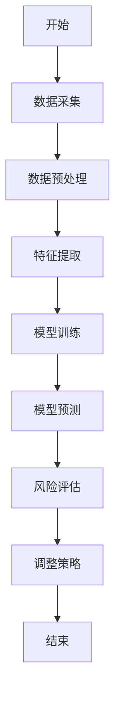
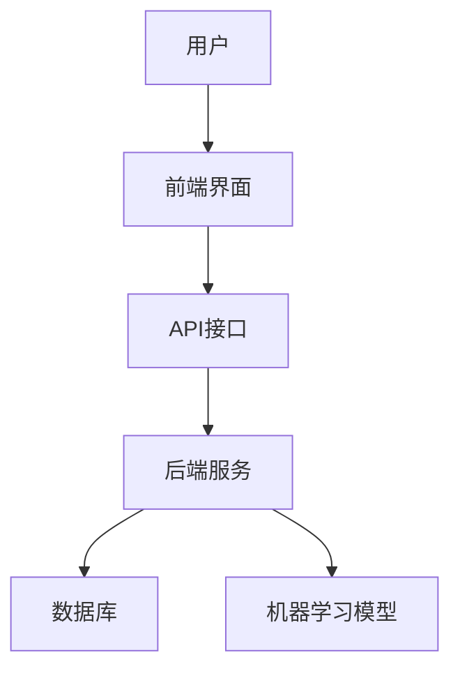

                 


# 开发智能化的企业信用风险敞口动态管理系统

## 关键词：
- 企业信用风险
- 风险敞口管理
- 智能化系统
- 动态管理
- 大数据
- 人工智能

## 摘要：
本文详细探讨了开发智能化的企业信用风险敞口动态管理系统的背景、核心概念、算法原理、系统架构设计、项目实战以及最佳实践。通过结合大数据和人工智能技术，本文提出了一种创新的解决方案，能够实时监控和管理企业的信用风险，帮助企业在复杂的经济环境中做出更明智的决策。

---

## 第一部分：背景与概念

### 第1章：信用风险敞口的背景与定义

#### 1.1 信用风险敞口的背景
- **1.1.1 信用风险的基本概念**
  信用风险是指企业在赊销、贷款等信用交易中，由于交易对手无法履行其债务而带来的损失风险。随着全球经济的复杂化，企业面临的信用风险日益增加。

- **1.1.2 信用风险敞口的定义与重要性**
  信用风险敞口是指企业在特定时间点上，由于信用交易而可能面临的最大潜在损失。动态管理信用风险敞口对于企业财务健康和稳健经营至关重要。

- **1.1.3 企业信用风险管理的现状与挑战**
  当前，企业信用风险管理主要依赖于传统的静态评估方法，难以应对市场波动和交易对手信用状况的实时变化。智能化管理成为解决这一问题的关键。

#### 1.2 动态管理的必要性
- **1.2.1 信用风险敞口的动态变化**
  由于市场环境、企业信用状况等因素的变化，信用风险敞口会实时波动，静态管理方法难以捕捉这些变化。

- **1.2.2 市场波动对企业信用风险的影响**
  经济波动、行业趋势和政策变化都会影响企业的信用风险敞口，动态管理能够及时反映这些变化。

- **1.2.3 动态管理在企业风险管理中的作用**
  动态管理能够帮助企业在风险敞口扩大的早期阶段采取措施，降低潜在损失。

#### 1.3 智能化管理的核心要素
- **1.3.1 智能化管理的定义**
  智能化管理是指利用人工智能、大数据分析等技术，实时监控和调整信用风险敞口，实现精准的风险评估和管理。

- **1.3.2 数据驱动与AI技术在信用风险管理中的应用**
  数据驱动的方法能够收集和分析大量信用相关信息，AI技术则能够通过机器学习模型预测信用风险，提供智能化的管理支持。

- **1.3.3 智能化管理的实现路径与目标**
  实现路径包括数据采集、模型构建、实时监控和决策支持；目标是提高信用风险管理的效率和准确性，降低企业财务风险。

---

## 第二部分：核心概念与联系

### 第2章：核心概念解析

#### 2.1 信用风险敞口动态管理的核心概念
- **2.1.1 信用风险敞口的构成要素**
  包括企业信用评级、交易对手信用状况、市场环境等多个因素。

- **2.1.2 动态管理的核心机制**
  通过实时数据采集和分析，动态调整信用风险敞口的评估和管理策略。

- **2.1.3 智能化管理的关键技术**
  包括大数据分析、机器学习算法、自然语言处理等技术。

#### 2.2 核心概念的属性对比
- **2.2.1 信用风险敞口与市场风险的对比**
  信用风险敞口主要关注交易对手的信用状况，而市场风险关注市场波动对企业整体的影响。

- **2.2.2 动态管理与静态管理的对比**
  动态管理能够实时调整，而静态管理缺乏灵活性。

- **2.2.3 智能化管理与传统管理的对比**
  智能化管理更具精准性和效率，而传统管理依赖人工分析，效率较低。

#### 2.3 核心概念的实体关系图
```mermaid
er
actor: 信用风险敞口动态管理系统的用户
goal: 实时监控和管理信用风险敞口
risk_factors: 信用风险因素
model: 信用风险评估模型
data: 信用相关数据
action: 风险管理措施
```

---

## 第三部分：算法原理

### 第3章：算法原理与实现

#### 3.1 算法原理
- **3.1.1 信用风险评估模型**
  使用逻辑回归（Logistic Regression）或随机森林（Random Forest）等机器学习算法，基于企业的财务数据、市场数据和交易数据，预测信用风险。

- **3.1.2 模型训练与优化**
  通过历史数据训练模型，使用交叉验证和网格搜索优化模型参数，提高预测准确性。

- **3.1.3 实时预测与调整**
  模型实时更新，根据最新数据调整信用风险评估结果，动态管理信用风险敞口。

#### 3.2 算法流程图


#### 3.3 代码实现
```python
import pandas as pd
from sklearn.model_selection import train_test_split
from sklearn.ensemble import RandomForestClassifier
from sklearn.metrics import accuracy_score

# 数据加载与预处理
data = pd.read_csv('credit_risk.csv')
X = data.drop('risk', axis=1)
y = data['risk']

# 数据分割
X_train, X_test, y_train, y_test = train_test_split(X, y, test_size=0.2)

# 模型训练
model = RandomForestClassifier()
model.fit(X_train, y_train)

# 模型预测
y_pred = model.predict(X_test)

# 模型评估
print("准确率:", accuracy_score(y_test, y_pred))
```

---

## 第四部分：系统分析与架构设计

### 第4章：系统架构设计

#### 4.1 系统功能设计
- **4.1.1 数据采集模块**
  从企业财务系统、市场数据源等获取信用相关数据。

- **4.1.2 风险评估模块**
  使用机器学习模型评估信用风险，生成风险评分。

- **4.1.3 监控与预警模块**
  实时监控信用风险敞口变化，设置预警阈值，及时通知相关人员。

- **4.1.4 决策支持模块**
  提供风险敞口管理建议，辅助企业制定风险管理策略。

#### 4.2 系统架构设计


#### 4.3 接口设计与交互流程
- **4.3.1 API接口设计**
  提供RESTful API，支持数据查询、模型调用等操作。

- **4.3.2 系统交互流程**
  用户通过前端界面提交请求，系统通过API调用后端服务，后端服务处理数据并返回结果。

---

## 第五部分：项目实战

### 第5章：项目实战与应用

#### 5.1 环境安装与配置
- 安装Python、Jupyter Notebook、Pandas、Scikit-learn等工具。
- 配置数据库和相关开发环境。

#### 5.2 核心代码实现
- 数据清洗与特征工程
- 模型训练与优化
- 系统集成与部署

#### 5.3 案例分析与解读
- 使用实际企业数据，展示系统如何实时监控信用风险敞口。
- 分析系统在实际应用中的效果和优势。

#### 5.4 系统实现与优化
- 提供系统实现的详细步骤和代码示例。
- 分析系统性能，提出优化建议。

---

## 第六部分：最佳实践与总结

### 第6章：总结与展望

#### 6.1 最佳实践
- 数据质量管理：确保数据的准确性和完整性。
- 模型选择与优化：根据实际需求选择合适的算法，并持续优化模型。
- 系统维护与更新：定期更新模型和系统，适应市场变化。

#### 6.2 项目小结
- 本文提出了一种基于大数据和人工智能的智能化信用风险敞口动态管理系统。
- 该系统能够实时监控信用风险，提供精准的管理支持，帮助企业降低财务风险。

#### 6.3 注意事项
- 数据隐私和安全问题需要高度重视。
- 系统的可扩展性和灵活性需要在设计阶段充分考虑。
- 模型的解释性和可 interpretability 是实际应用中的重要考量。

#### 6.4 拓展阅读
- 推荐阅读相关领域的书籍和论文，深入了解信用风险管理的理论与实践。

---

## 结语

通过本文的详细讲解，读者可以全面了解开发智能化的企业信用风险敞口动态管理系统的背景、核心概念、算法原理、系统架构设计、项目实战以及最佳实践。希望本文能够为相关领域的从业者和研究者提供有价值的参考和启发，推动信用风险管理领域的智能化发展。

